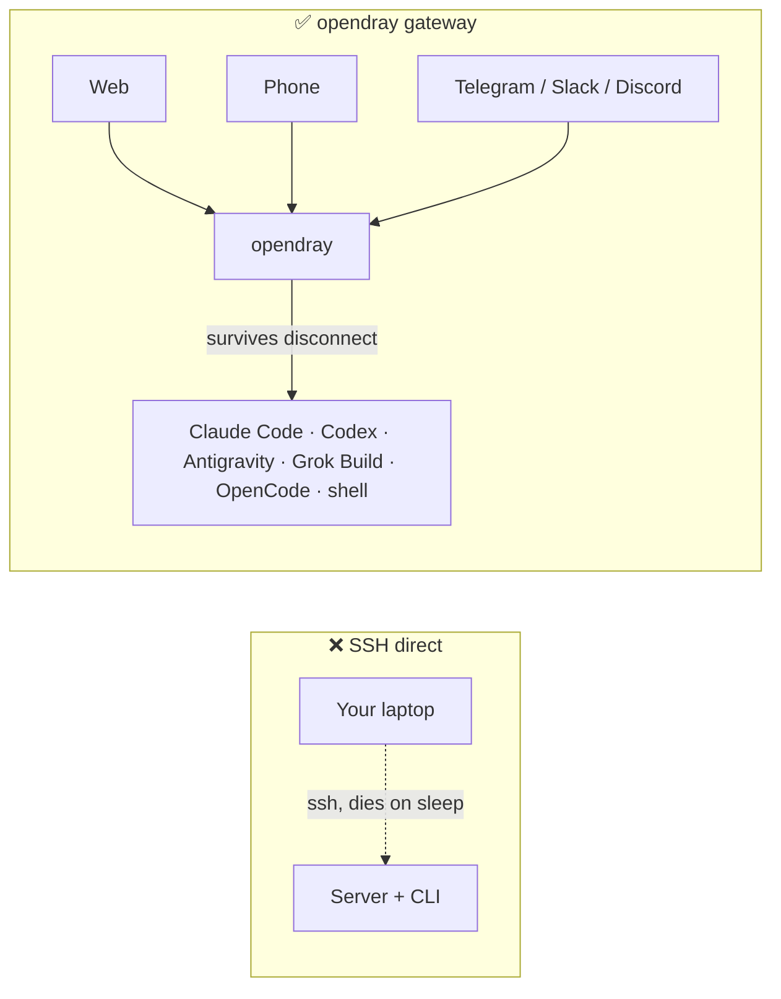
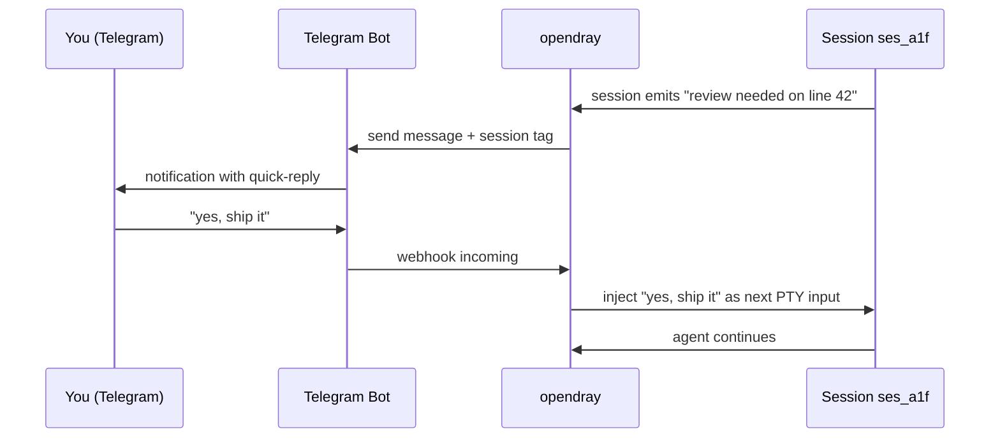
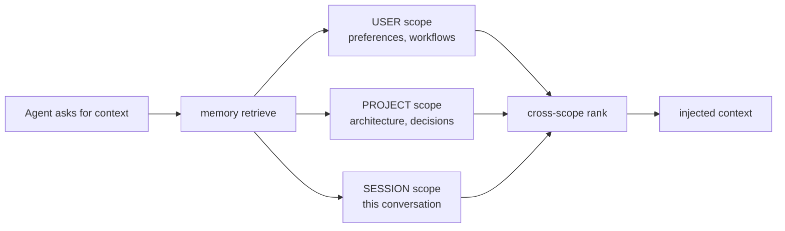
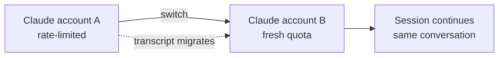
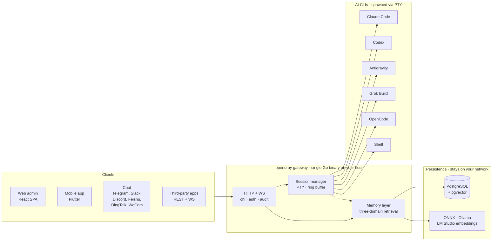

<p align="center">
  <a href="https://opendray.dev"></a>
</p>

<h1 align="center">opendray</h1>

<p align="center">
  <strong>Self-hosted Gateway für Claude Code, Codex, Antigravity, Grok Build und OpenCode. Führen Sie Agent-Sessions auf Ihrer eigenen Infrastruktur aus. Steuern Sie sie aus Web, Mobile oder Chat.</strong>
</p>

<p align="center">
  <strong><a href="https://opendray.dev">opendray.dev</a></strong>
</p>

<p align="center">
  <a href="https://opendray.dev"></a>
  <a href="https://github.com/Opendray/opendray/releases/latest"></a>
  <a href="LICENSE"></a>
  <a href="https://github.com/Opendray/opendray/actions/workflows/ci.yml"></a>
  <a href="https://github.com/Opendray/opendray/discussions"></a>
  <br/>
  
  
  
  
</p>

<p align="center">
  🌐 <a href="README.md">English</a> · <a href="README.zh.md">简体中文</a> · <a href="README.fa.md">فارسی</a> · <a href="README.es.md">Español</a> · <a href="README.pt-BR.md">Português</a> · <a href="README.ja.md">日本語</a> · <a href="README.ko.md">한국어</a> · <a href="README.fr.md">Français</a> · <strong>Deutsch</strong> · <a href="README.ru.md">Русский</a>
</p>

<p align="center">
  <a href="docs/getting-started.md"></a>
  <a href="#how-it-looks"></a>
  <a href="https://opendray.dev"></a>
</p>



Wer Claude Code oder Codex über SSH betreibt, verliert den Agenten in dem Moment, in dem der Laptop zuklappt. opendray lässt ihn auf einem Host laufen, der wach bleibt (ein Mac mini unter Ihrem Schreibtisch, ein NAS, ein VPS), und Sie klinken sich aus einem Web-Admin, einer Mobile-App oder per Chat-Nachricht wieder ein. Sessions laufen weiter, egal ob jemand verbunden ist oder nicht. Mehrere Accounts werden gepoolt, mit Tier-basiertem Balancing und Live-Account-Wechsel. Eine Local-First-Memory-Schicht behält jedes Embedding in Ihrem Netzwerk.

---

## Was ist opendray?

**opendray** umschließt die AI-Coding-CLIs, die Sie bereits verwenden (Claude Code, Codex, Antigravity, Grok Build, OpenCode und jede beliebige Shell), und macht daraus etwas, das Sie von überall aus steuern können. Führen Sie Sessions auf Ihrem Heimserver, NAS oder VPS aus. Lassen Sie sich per Telegram benachrichtigen, wenn eine Session in den Idle-Zustand geht. Antworten Sie vom Handy aus, um den nächsten Prompt einzufüttern. Alles über ein Self-hosted Gateway, das Sie Ende zu Ende kontrollieren.

- 🛰 **Ein Backend, drei Oberflächen.** Ein einziges Go-Binary, das ein React-Web-Admin und eine Flutter-Mobile-App ausliefert, wobei jede Aktion zusätzlich über eine REST- + WebSocket-API für Drittanbieter-Integrationen verfügbar ist.
- 💬 **Sechs bidirektionale Channels, keine Walled Gardens.** Telegram, Slack, Discord, Feishu (飞书), DingTalk (钉钉), WeCom (企业微信), plus ein Bridge-Adapter für alles Eigene. Antworten auf jedem Channel werden zurück in die passende Session geroutet.
- 🧠 **Local-First Memory.** ONNX- / Ollama- / LM-Studio-Embeddings mit Retrieval in drei Scopes (User, Projekt, Session), smartes Ranking und Konflikterkennung über die Layer hinweg. Keine Vektordaten verlassen Ihr Netzwerk.
- 🔌 **API auf Integrations-Niveau.** Gescopte API-Keys, Audit-Log pro Call, Reverse-Proxy-Mounts. Nutzen Sie opendray als Gateway hinter Ihrem eigenen Produkt oder einfach als persönliche Kommandozentrale.
- 🔑 **Multi-Account-Flotte für Claude, Codex, Antigravity.** Legen Sie mehrere eingeloggte Credential-Verzeichnisse auf dem Host ab; opendray erkennt sie automatisch über einen Filesystem-Watcher, balanciert neue Sessions über die aktivierten Accounts und lässt Sie eine laufende Session zwischen Accounts umschalten, **ohne die Konversation zu verlieren** (das Transcript wird unter der Haube migriert). Jede Account-Zeile zeigt die aktuelle Kapazität (Subscription-Tier, Rate-Limit-Tier, aktive Sessions, zuletzt verwendet, aktuelle Login-E-Mail).
- 🔒 **Self-hosted, klare Lizenz.** Apache 2.0, ein statisches Binary, cosign-signierte Releases mit SPDX-SBOM. Keine Telemetrie, kein Cloud-Account, kein Abo.

<a id="how-it-looks"></a>

## So sieht es aus

opendray ist ein Go-Binary, das ein Web-Admin unter `/admin/` und eine REST- + WebSocket-API unter `/api/v1/*` bereitstellt. Hier ist, was es tut, in den Formen, die Sie tatsächlich zu sehen bekämen.

### Laufende Sessions auflisten

```
$ opendray sessions ls
ID        PROVIDER      PROJECT              STATE     STARTED
ses_a1f   claude-code   app/web              running   2h ago
ses_b2c   codex         internal/session     idle      5m ago
ses_c9d   grok-build    docs/                running   14m ago
ses_d34   shell         misc/deploy-logs     idle      1h ago
```

### Installierte Provider und ihre Versionen auflisten

```
$ opendray providers list
PROVIDER      VERSION     ACCOUNTS   ACTIVE   NOTES
claude-code   1.4.11      3          1        auto-discovered via CLAUDE_CONFIG_DIR
codex         0.29.0      2          1        openai login
antigravity   0.7.2       1          0        agy, HOME-isolated
grok-build    2.5.1       1          1        xai
opencode      0.6.3       -          0        local endpoint required
shell         -           -          1        arbitrary
```

### Aus dem Browser in eine Session einklinken und weitermachen, nachdem der Laptop geschlafen hat

Das Web-Admin bettet xterm.js ein. Sie sehen dasselbe PTY, in das die CLI geschrieben hat. Schließen Sie den Browser-Tab und die Session läuft weiter auf dem Host. Öffnen Sie ihn Stunden später erneut und das Transcript ist genau dort, wo Sie aufgehört haben.

```
[claude-code ses_a1f · app/web · 2h 14m]

> refactor the router to lazy-load the mobile view

I'll look at the current router and figure out the cleanest split.

● Read(app/web/src/router.tsx)
  ⎿ 342 lines
● Grep(pattern: "loadable", path: "app/web/src")
  ⎿ found 3 uses
...
```

### Eine Telegram-Antwort zurück in dieselbe Session routen



Dieselbe Form gilt für Slack, Discord, Feishu, DingTalk, WeCom und jeden Bridge-Adapter-Transport.

### Eine Memory-Abfrage über drei Scopes gleichzeitig ausfächern



Jeder Scope speichert Embeddings von Ihrem eigenen Provider (ONNX gebündelt, Ollama oder LM Studio). Nichts verlässt Ihr Netzwerk.

### Accounts mitten in der Konversation wechseln, ohne das Transcript zu verlieren



Dasselbe gilt für Codex-Accounts und Antigravity-Accounts. `Carry-context` ist standardmäßig aktiviert; deaktivieren Sie es, um mit der neuen Identität sauber neu zu starten.

## Features

|  |  |
| --- | --- |
| **Sessions** | Klinken Sie sich aus Web, Mobile oder Chat in eine laufende Claude-Code-, Codex-, Antigravity-, Grok-Build-, OpenCode- oder Shell-Session ein. Sessions überleben Client-Disconnect und Host-Reboot. Live-Transcript-Overlay für TUIs, die Wheel-Input überspringen. |
| **Providers** | 5 erstklassige AI-Coding-CLIs plus beliebige Shell. Eine neue CLI hinzuzufügen ist ein JSON-Deskriptor-Drop-in unter `internal/catalog/builtin/`. MCP-Server-Injection pro Provider (Vault, Memory, Integrationen). |
| **Memory** | Retrieval in drei Scopes (User, Projekt, Session). Local-First-Embeddings via ONNX, Ollama oder LM Studio. Konflikterkennung über die Layer hinweg. Globale Knowledge-Pages werden beim Spawn injiziert. Compiler-Flywheel destilliert Episoden zu wiederverwendbaren Playbooks. |
| **Channels** | Telegram, Slack, Discord, Feishu, DingTalk, WeCom. Bridge-Adapter für eigene Transports. Bidirektional: Sessions benachrichtigen, Antworten laufen zurück. |
| **Integrations** | REST- + WebSocket-API mit gescopten API-Keys, Audit-Log pro Call, Reverse-Proxy-Mounts. HashiCorp-Vault-MCP für Secret-Zugriff. Öffentliche [`docs/integration-guide.md`](docs/integration-guide.md). |
| **Ops** | Ein einziges Go-Binary. Einzeiliger Installer (Linux, macOS, WSL2). Selbstverwaltend (`opendray update / start / stop / providers update`). Verschlüsselte PostgreSQL-Backups + Daten-Exporte. Goreleaser-Pipeline mit cosign-signierten Releases + SPDX-SBOM. |
| **Security** | Apache 2.0. Keine Telemetrie, kein Cloud-Account. Keyless-Signing mit Cosign (Sigstore). `ProtectSystem=strict` systemd-Hardening. Multi-tenant-sichere Scoped-Tokens. |

## Architektur auf einen Blick

Ein einziges Go-Binary auf Ihrem Host läuft als Drehscheibe. Clients steuern Sessions über HTTP/WebSocket, der Session-Manager startet jede AI CLI in einem eigenen PTY, und die Memory-Schicht hält gemeinsamen State in Postgres mit Vector-Embeddings von Ihrem eigenen Provider.



Alles im Diagramm läuft in Ihrem Netzwerk. Keine Cloud-Abhängigkeiten, keine Inference außerhalb Ihrer Kontrolle.

## Vergleich

### opendray im Vergleich zu bekannten AI-Clients

|  | opendray | Claude Desktop | Cursor | CLI über SSH | ChatGPT Desktop |
| --- | --- | --- | --- | --- | --- |
| Session überlebt Client-Disconnect | ✅ | ❌ | ❌ | ⚠️ (tmux / screen) | ❌ |
| Multi-Account-Pool mit Live-Switch | ✅ | ❌ | ❌ | ❌ | ❌ |
| Session-übergreifende Memory-Schicht | ✅ | ❌ | Teilweise | ❌ | Teilweise |
| Host-Filesystem + Tool-Use | ✅ | Begrenzt | ✅ | ✅ | Begrenzt |
| Mobile-Client mit Feature-Parität | ✅ | ❌ | ❌ | ⚠️ (SSH-Client) | Teilweise |
| Chat-Channel-Adapter | ✅ (6) | ❌ | ❌ | ❌ | ❌ |
| Self-hosted | ✅ | ❌ | ❌ | ✅ | ❌ |
| Lizenz | Apache 2.0 | Proprietär | Proprietär | (variiert) | Proprietär |

### opendray im Vergleich zu Self-hosted Chat-Frontends

|  | opendray | Open WebUI | LibreChat | Dify |
| --- | --- | --- | --- | --- |
| Führt echte Agent-CLI aus (nicht nur Chat) | ✅ | ❌ | ❌ | Teilweise |
| Tool-Use + File-Writes auf Host | ✅ | ❌ | ❌ | Sandboxed |
| Mehrere AI-Coding-CLIs in einem Gateway | ✅ (5) | ❌ | ❌ | ❌ |
| Session-übergreifendes Memory | ✅ | Basic | Basic | ✅ |
| PTY-Session mit Terminal-Reattach | ✅ | ❌ | ❌ | ❌ |
| Chat-Channel-Adapter | ✅ (6) | Teilweise | Teilweise | ✅ |
| Lizenz | Apache 2.0 | MIT | MIT | Apache 2.0 |

## Für wen ist das gemacht?

**Solo-Entwickler mit Homelab.** Sie haben bereits einen Mac mini, ein NAS oder eine Proxmox-Box, die 24/7 läuft. Sie haben Claude Code über SSH betrieben, aber die Session stirbt jedes Mal, wenn Ihr Laptop schläft. Sie möchten, dass die CLI weiterläuft, und Sie möchten aus dem Zug vom Handy aus wieder einklinken können. opendray ist das Gateway, das Ihren Host zwischen Sie und die CLI stellt.

**Team-Lead in einem kleinen Team, der gemeinsame AI-Infrastruktur aufbaut.** Ihr Team hat 3 bis 5 Anthropic-Accounts, verteilt auf Arbeits- und Privatpläne. Sie möchten sie poolen, die Nutzung pro Account beobachten und jedem im Team ermöglichen, eine Session aus dem Browser zu steuern. opendray liefert Multi-Account-Pooling, Observability pro Account, gescopte API-Keys pro Teammitglied und eine Mobile-App, die man ohne App-Store-Einreichung installieren kann.

**Integrator, der auf einem Session-Runner aufbaut.** Sie bauen ein Produkt, das Claude-Code-, Codex- oder Grok-Build-Sessions mit Tool-Use spawnen muss, und Sie möchten Session-Lifecycle, PTY-Handling, Memory und Channel-Routing nicht neu implementieren. opendray stellt jede Aktion über REST + WebSocket mit gescopten Keys, Audit-Logs pro Call und Reverse-Proxy-Mounts bereit. Nutzen Sie es als Ihre Agent-Runtime.

## Installation

### Einzeiliger Installer

**Linux / macOS / WSL2**

```sh
curl -fsSL https://raw.githubusercontent.com/Opendray/opendray/main/scripts/install.sh | bash
```

**Windows** richtet zuerst WSL2 ein und führt darin dann den Linux-Installer aus. [Details →](scripts/README.md#windows)

```powershell
irm https://raw.githubusercontent.com/Opendray/opendray/main/scripts/install-windows.ps1 | iex
```

Führt Sie durch Postgres-Setup, AI-CLI-Installation, Admin-Credentials und Service-Registrierung, am Ende läuft ein Gateway in ~5 bis 10 Minuten. Siehe [**`scripts/README.md`**](scripts/README.md) dafür, was der Wizard macht, welches File-Layout er anlegt, welche Optionen es gibt und für Troubleshooting.

> **Lieber den manuellen Walkthrough?** Lesen Sie [**docs/getting-started.md**](docs/getting-started.md), eine 15-minütige End-to-End-Anleitung, die dasselbe wie der Wizard macht, sodass Sie jeden Schritt selbst nachvollziehen können.

### npm / npx (Node ≥ 18)

Global installieren und `opendray` in den `PATH` legen:

```sh
npm install -g opendray
```

Oder on-demand ausführen, ohne zu installieren:

```sh
npx opendray
```

Damit wird **nur das Binary** installiert. Kein Wizard, kein Service, kein Postgres. Das Paket zieht das passende `opendray-{linux,darwin}-{x64,arm64}`-Plattform-Binary via `optionalDependencies` (das esbuild / Biome-Pattern, also kein `postinstall`, kein Netzwerk-Call beim Install). Gut für geskriptete Umgebungen, ephemere Runner oder wenn Sie schon Ihr eigenes Postgres und Ihren eigenen Process-Supervisor betreiben.

Sie bringen nach wie vor selbst eine Datenbank mit und starten das Gateway selbst:

```sh
# 1. PostgreSQL 15+ with pgvector. Point a DSN at it, set an admin password.
export OPENDRAY_DATABASE_URL="postgres://opendray:pw@127.0.0.1:5432/opendray?sslmode=disable"
export OPENDRAY_ADMIN_PASSWORD="$(openssl rand -base64 24)"
# 2. Apply the schema, then run (foreground).
opendray migrate
opendray serve        # → http://127.0.0.1:8770/admin/
```

Vollständiger Walkthrough (pgvector-Setup, `config.toml`, Betrieb als systemd- / launchd-Service und Aktualisieren) in [**docs/install-binary.de.md**](docs/install-binary.de.md).

### Uninstall (Linux / macOS)

**Standard.** Stoppt das Gateway und entfernt das Binary, **behält** aber Ihre `config.toml`, das Data-Verzeichnis (bcrypt-Keyfile, Sessions, Notes, Vault), die Logs und die PostgreSQL-Datenbank, sodass eine Neuinstallation dort weitermacht, wo Sie aufgehört haben:

```sh
curl -fsSL https://raw.githubusercontent.com/Opendray/opendray/main/scripts/uninstall.sh | bash
```

**Full Purge.** Entfernt zusätzlich PG-Datenbank + Role, löscht Config / Data / Logs und entfernt den Service-User. Inklusive Verifikationsschritt nach dem Löschen, der lautstark Alarm schlägt, falls etwas überlebt hat:

```sh
curl -fsSL https://raw.githubusercontent.com/Opendray/opendray/main/scripts/uninstall.sh | OPENDRAY_PURGE=1 bash
```

### Day-to-Day-Befehle

Nach der Installation kümmert sich das `opendray`-Binary selbst um seinen Lifecycle, keine `systemctl`- / `launchctl`-Beschwörungsformeln mehr nötig:

```sh
sudo opendray update --restart   # download latest release, verify SHA, atomic replace + restart
```

```sh
sudo opendray providers update   # bump installed AI CLIs (claude / codex / antigravity) to npm-latest
```

```sh
opendray providers list          # see which AI CLIs are installed + their versions
```

```sh
sudo opendray start              # start | stop | restart | status, wraps systemd / launchd
```

`opendray --help` listet das komplette Subcommand-Set.

### Deploy-Path-Picker

Jeder unterstützte Pfad enthält Session-Spawn, AI-CLI-Zugriff, verschlüsselte Backups und die vollständige Integrations-API. opendray ist ein host-resident Gateway, es spawnt AI-CLIs über PTYs und teilt Prozess-State (`~/.claude`, ssh-agent, Projektdateien) mit ihnen. Dieses Modell ist inkompatibel mit der Container-Isolierung, die ein produktives Docker erzwingen würde, daher ist Docker in v2.x kein unterstützter Deployment-Pfad.

| Pfad | Am besten für | Springe zu |
|---|---|---|
| 📦 **Vorgefertigtes Binary** | "Einfach laufen lassen", Linux / macOS, beliebiger Supervisor | [Releases-Seite](https://github.com/Opendray/opendray/releases) → siehe [Produktions-Deployment](#production-deploy) |
| 🐧 **systemd-Unit** | Bare-Metal- / VM- / LXC-Linux-Box | [Produktions-Deployment §A](#option-a-systemd-bare-metal--vm--lxc) |
| 🍎 **macOS LaunchDaemon** | Mac mini / Mac Studio als Heimserver | [Produktions-Deployment §C](#option-c-macos-launchd-mac-mini--studio-as-home-server) |
| 🛠 **Build from Source** | Dev / Contributing / Custom Builds | [Quickstart](#quickstart-5-minute-dev-path) weiter unten |

<a id="quickstart-5-minute-dev-path"></a>

## Quickstart (5-Minuten-Dev-Path)

Den vollständigen Walkthrough mit Voraussetzungen und Troubleshooting finden Sie in [`docs/quickstart.md`](docs/quickstart.md). Der verdichtete Dev-Path:

```bash
# 1. Have a Postgres 15+ running on 127.0.0.1:5432 with pgvector enabled
#    (apt install postgresql-16 postgresql-16-pgvector / brew install postgresql@16 pgvector).
#    Point [database].url at any other DSN if you'd rather use a remote PG.

# 2. Local config, already gitignored.
cp config.example.toml config.toml
$EDITOR config.toml          # set [database].url, [admin].password

# 3. Build the web bundle into the embed tree.
cd app/web && pnpm install && pnpm build && cd ../..

# 4. Apply schema.
go run ./cmd/opendray migrate -config config.toml

# 5. Run.
go run ./cmd/opendray serve -config config.toml
# → REST + WS:  http://127.0.0.1:8770/api/v1/...
# → Web admin:  http://127.0.0.1:8770/admin/
```

Damit läuft OpenDray im Vordergrund, Ctrl-C beendet es. Für einen langlaufenden
Daemon siehe **Produktions-Deployment** unten.

<a id="production-deploy"></a>

## Produktions-Deployment

Vier unterstützte Deploy-Pfade, suchen Sie sich den passenden für Ihre Umgebung aus.
Jeder davon liefert Ihnen Auto-Restart bei Crash, persistenten State und
Trennung von Secrets und Config.

<a id="option-a-systemd-bare-metal--vm--lxc"></a>

### Option A: systemd (Bare-Metal / VM / LXC)

Der empfohlene Linux-Deploy-Pfad. Liefert eine gehärtete Unit unter
[`deploy/systemd/opendray.service`](deploy/systemd/opendray.service)
mit Sandboxing (`ProtectSystem=strict`, `NoNewPrivileges`,
`MemoryDenyWriteExecute`, Capability-Scrub), `migrate`-dann-`serve`-
Boot und einem 20 s Graceful-Stop-Fenster.

**Holen Sie sich zuerst ein Binary.** Schnappen Sie sich entweder ein vorgefertigtes Archiv von der
[Releases-Seite](https://github.com/Opendray/opendray/releases)
(`opendray_*_linux_<arch>.tar.gz`, entpackt sich zu einem einzigen `opendray`-
Binary) oder bauen Sie es aus dem Source via [Quickstart](#quickstart-5-minute-dev-path)
oben (`go build ./cmd/opendray`).

```bash
# 1. Install the binary you just grabbed (or built).
sudo install -m 0755 /path/to/opendray /usr/local/bin/opendray

# 2. Create the service user + state dir.
sudo useradd -r -s /usr/sbin/nologin -d /var/lib/opendray opendray
sudo install -d -o opendray -g opendray -m 0700 /var/lib/opendray

# 3. Drop config + secrets (root-owned; mode 0640).
sudo install -D -m 0640 config.example.toml /etc/opendray/config.toml
sudo $EDITOR /etc/opendray/config.toml             # set [database].url etc.
sudo install -D -m 0640 -o root -g opendray /dev/null /etc/opendray/env.d/secrets
sudo $EDITOR /etc/opendray/env.d/secrets           # OPENDRAY_ADMIN_PASSWORD=…

# 4. Install + enable the unit.
sudo cp deploy/systemd/opendray.service /etc/systemd/system/
sudo systemctl daemon-reload
sudo systemctl enable --now opendray

# 5. Verify.
sudo systemctl status opendray
sudo journalctl -u opendray -f --no-pager
```

Die Unit führt `opendray migrate` als `ExecStartPre` aus, sodass der erste Boot
alle Migrations anwendet, bevor `serve` überhaupt startet. Restarts laufen
`on-failure` mit 5 s Back-off und einem Limit von 5 Bursts pro Minute.

### Option B: Direktes Binary + Ihr eigener Process-Supervisor

Für LXC ohne systemd, FreeBSD `rc.d`, OpenRC oder sonst irgendetwas.
Einmal bauen, mit dem Supervisor laufen lassen, den Sie ohnehin einsetzen:

```bash
# Cross-compile a release archive locally:
goreleaser release --clean --snapshot
ls dist/                  # opendray_*_linux_amd64.tar.gz etc.

# Or grab a published release artefact:
# https://github.com/Opendray/opendray/releases
```

Dann zeigt Ihr Supervisor (s6, runit, supervisord, runwhen) auf:

```
/usr/local/bin/opendray serve -config /etc/opendray/config.toml
```

Pre-Flight: führen Sie `opendray migrate -config /etc/opendray/config.toml`
einmal vor dem ersten `serve` aus, oder als Pre-Start-Hook im
Supervisor Ihrer Wahl.

<a id="option-c-macos-launchd-mac-mini--studio-as-home-server"></a>

### Option C: macOS launchd (Mac mini / Studio als Heimserver)

Für Apple-Silicon-Mac-mini / Mac Studio im 24/7-Betrieb. Liefert einen
LaunchDaemon unter
[`deploy/launchd/com.opendray.opendray.plist`](deploy/launchd/com.opendray.opendray.plist),
der beim Boot vor jedem User-Login startet, bei Crashes mit 5 s Throttle
neu startet und nach `/usr/local/var/log/opendray/` loggt.

```bash
# 1. Install the darwin binary + config + state dirs.
sudo install -m 0755 ./opendray /usr/local/bin/opendray
sudo install -d -m 0755 \
  /usr/local/etc/opendray \
  /usr/local/var/lib/opendray \
  /usr/local/var/log/opendray
sudo install -m 0640 config.example.toml /usr/local/etc/opendray/config.toml
sudo $EDITOR /usr/local/etc/opendray/config.toml    # set [database].url etc.

# 2. Apply migrations once.
sudo /usr/local/bin/opendray migrate \
  -config /usr/local/etc/opendray/config.toml

# 3. Install + load the LaunchDaemon.
sudo cp deploy/launchd/com.opendray.opendray.plist /Library/LaunchDaemons/
sudo chown root:wheel /Library/LaunchDaemons/com.opendray.opendray.plist
sudo chmod 0644 /Library/LaunchDaemons/com.opendray.opendray.plist
sudo launchctl bootstrap system /Library/LaunchDaemons/com.opendray.opendray.plist

# 4. Verify.
sudo launchctl print system/com.opendray.opendray
tail -f /usr/local/var/log/opendray/opendray.log
```

Restart mit `sudo launchctl kickstart -k system/com.opendray.opendray`;
komplett entladen mit `sudo launchctl bootout system/com.opendray.opendray`.

Postgres auf macOS: installieren Sie via Homebrew (`brew install postgresql@17 && brew services start postgresql@17`) und zeigen Sie mit `[database].url` auf
`postgres://$USER@127.0.0.1:5432/opendray`. `pgvector` ergänzen Sie mit
`brew install pgvector` und `CREATE EXTENSION vector` innerhalb der
opendray-Datenbank.

---

Proxmox-spezifische LXC-Notes (PTY in Unprivileged Containers,
Networking, cgroup-Tweaks) finden Sie in [`deploy/lxc/proxmox-pty-notes.md`](deploy/lxc/proxmox-pty-notes.md).

Für Reverse-Proxy / TLS-Termination (nginx, Caddy, Traefik, Cloudflare
Tunnel) siehe [`docs/operator-guide.md`](docs/operator-guide.md) §Topology.

### Optional: verschlüsselte DB-Backups + Daten-Exporte aktivieren

```bash
# Master passphrase (env-only, never write into config.toml).
export OPENDRAY_BACKUP_KEY="$(openssl rand -base64 32)"
export OPENDRAY_BACKUP_ENABLED=1

# pg_dump / pg_restore must match the server's major version. On
# Apple Silicon dev machines pointing at a PG17 server:
export OPENDRAY_BACKUP_PG_DUMP_PATH=/opt/homebrew/opt/postgresql@17/bin/pg_dump
export OPENDRAY_BACKUP_PG_RESTORE_PATH=/opt/homebrew/opt/postgresql@17/bin/pg_restore
```

Starten Sie opendray neu; in der Sidebar erscheint dann eine Backups-Seite (`/backups`)
für verschlüsselte PostgreSQL-Dumps + Restore und `/export` für
Daten-Exporte als Zip-Bundle + Import. Den vollständigen Lifecycle beschreibt [`docs/operator-guide.md`](docs/operator-guide.md) §Backup.

Ein einziges Go-Binary trägt das komplette Web-Bundle in sich, sodass zur Laufzeit
keine Node-Runtime nötig ist, kein separater Static-File-Server, kein Caddy/nginx
erforderlich. Cloudflare Tunnel terminiert TLS vor `:8770`.

## Layout

```
cmd/opendray/   binary entry point
internal/       Go backend (gateway, sessions, memory, channels,
                integrations, git, search, one package per domain)
app/web/        React + Vite admin SPA (embedded in the binary)
app/mobile/     Flutter app (iOS + Android)
app/shared*/    cross-surface shared UI + i18n strings
docs/           guides: install, getting-started, integration, ops
deploy/         systemd / launchd / LXC units + install scripts
```

## Web-Frontend

`app/web/` baut eine einzelne SPA nach `internal/web/dist/`, die das Go-
Binary einbettet und unter `/admin/*` ausliefert. Der Vite-Dev-Server auf `:5173`
proxied `/api` nach `:8770` für HMR-getriebene Entwicklung.

```bash
# dev (hot reload on the React side, separate Go server for the API)
cd app/web && pnpm dev               # http://localhost:5173
go run ./cmd/opendray serve -config ../../config.toml   # other terminal

# prod (one binary delivers everything)
cd app/web && pnpm build              # writes ../../internal/web/dist
cd ../..
go build ./cmd/opendray               # bakes dist into the binary
./opendray serve -config config.toml
```

Den Frontend-Stack (React + Vite + Tailwind v4 + shadcn/ui + TanStack
Router/Query + Zustand + xterm.js) und Notes pro W-Milestone finden Sie in
[`app/web/README.md`](app/web/README.md).

## Mobile-App

`app/mobile/` ist eine Flutter-App für **iOS und Android** mit Feature-Parität zum Web-Admin. Sie klinkt sich über HTTPS in ein laufendes Gateway ein. Geben Sie beim ersten Start die **Gateway URL** + die Admin-Anmeldedaten ein und Sie bekommen dieselben Sessions- / Channels- / Integrations- / Memory- / Git-Oberflächen. Einen App-Store- / Play-Store-Build gibt es bewusst nicht (Self-hosted, Single-Tenant): Sie bauen sie selbst und signieren sie mit Ihrer eigenen Identität.

**[→ Bau- & Installationsanleitung](docs/mobile-app.de.md).** Machen Sie das Gateway vom Smartphone aus erreichbar, dann ein Android-APK sideloaden oder per Xcode aufs iPhone bringen. ([alle 10 Sprachen](docs/mobile-app.md); Sprache oben in der Anleitung wechseln.)

## FAQ

### Was ist opendray?

opendray ist ein Self-hosted Gateway, das die AI-Coding-CLIs, die Sie bereits verwenden (Claude Code, Codex, Antigravity, Grok Build, OpenCode und Shell), umschließt und in Sessions verwandelt, die Sie aus einem Web-Admin, einer Flutter-Mobile-App oder aus sechs Chat-Channels (Telegram, Slack, Discord, Feishu, DingTalk, WeCom) steuern können. Ein Go-Binary. Apache 2.0. Ihre Infrastruktur, Ihre Daten, Ihre Tokens.

### Welche AI-CLIs unterstützt opendray?

Fünf erstklassige Provider ab v2.10.x: **Claude Code** (Anthropic), **Codex** (OpenAI), **Antigravity** (Google `agy`), **Grok Build** (xAI) und **OpenCode**. Dazu beliebige Shell für alles andere. Eine neue CLI hinzuzufügen ist ein JSON-Deskriptor unter `internal/catalog/builtin/`; für gängige Fälle ist kein Adapter-Code nötig.

### Wie unterscheidet sich opendray von Claude Desktop oder ChatGPT Desktop?

Claude Desktop und ChatGPT Desktop sind Chat-Clients, die auf Ihrem Laptop laufen und sterben, wenn der Laptop schließt. opendray führt die eigentliche agentische CLI auf einem Host aus, der wach bleibt, und lässt Sie sich von überall wieder einklinken. Sessions überleben Client-Disconnect, Laptop-Schlaf und Netzwerkausfälle. Mehrere Accounts werden gepoolt, mit Live-Wechsel zwischen ihnen.

### Wie unterscheidet sich opendray davon, Claude Code über SSH auszuführen?

Vier Dinge, die SSH Ihnen nicht bietet: (1) die Session überlebt, wenn Sie sich trennen (keine `tmux`-Turnübungen nötig, obwohl Sie tmux weiterhin darin verwenden können), (2) einklinken aus einem Smartphone oder einem Chat-Channel, nicht nur einem Terminal, (3) eine gemeinsame Memory-Schicht über alle Sessions auf dem Host hinweg, (4) ein Multi-Account-Pool mit Tier-basiertem Balancing und Live-Account-Wechsel mitten in der Konversation.

### Wie unterscheidet sich opendray von Open WebUI, LibreChat oder Dify?

Das sind Chat-Frontends gegen eine Model-API. Sie schicken Prompts an `api.openai.com` (oder Ähnliches) und rendern die Antwort. opendray führt den eigentlichen Agent-CLI-Prozess auf Ihrem Host aus, komplett mit Tool-Use, File-Writes, Memory und MCP-Servern. Wenn eine Aufgabe `Read` / `Edit` / `Bash` auf Ihrem Host-Filesystem braucht, erledigt opendray das; Chat-Frontends nicht.

### Kann ich mehrere Claude-, Codex- oder Antigravity-Accounts verwenden?

Ja. Legen Sie die eingeloggten Credential-Verzeichnisse auf dem Host ab (Claude verwendet `CLAUDE_CONFIG_DIR`, Antigravity verwendet `$HOME`-Isolierung), und opendray erkennt sie automatisch über einen Filesystem-Watcher. Neue Sessions werden über die aktivierten Accounts nach Tier + Kapazität verteilt. Sie können eine laufende Session zwischen Accounts umschalten, ohne die Konversation zu verlieren (das Transcript wandert unter der Haube mit). Rate-Limit-Auto-Failover trägt Kontext standardmäßig mit.

### Wo werden meine Daten gespeichert?

PostgreSQL auf Ihrem Host (bringen Sie Ihre eigene Instanz mit, oder verwenden Sie die, die der Installer bootstrappt). Embeddings kommen von Ihrem eigenen Provider (ONNX gebündelt, Ollama oder LM Studio). Keine Vektordaten, Transcripts oder Memory-Einträge verlassen Ihr Netzwerk. Keine Telemetrie. Kein Cloud-Account. `opendray` telefoniert niemals nach Hause.

### Kann ich das in Docker ausführen?

Aktuell nicht (v2.x). opendray spawnt AI-CLIs über PTYs und teilt Host-Prozess-State (Credential-Verzeichnisse, ssh-agent, Projektdateien) mit ihnen. Das ist inkompatibel mit der Container-Isolierung, die ein produktives Docker erzwingt. Verwenden Sie das vorgefertigte Binary und systemd oder launchd (Linux und macOS haben beide Einzeiler-Installer). Siehe [Produktions-Deployment](#production-deploy).

### Läuft opendray auf einem NAS, Mac mini oder Raspberry Pi?

NAS: ja auf Synology / QNAP / TrueNAS-Scale (alles mit Linux + Postgres). Mac mini: ja, das ist ein häufiges Deployment (LaunchDaemon wird mitgeliefert). Raspberry Pi: funktioniert auf Pi 4 / Pi 5, ist aber für gleichzeitige Sessions unterdimensioniert; nur Single-User-Hobby-Betrieb.

### Ist opendray kostenlos? Wie lautet die Lizenz?

Apache 2.0. Für immer kostenlos. Kein Bezahltier, keine Telemetrie, kein Phone-Home. Sponsoren sind willkommen (siehe [`.github/FUNDING.yml`](.github/FUNDING.yml)).

### Wie kann ich beitragen?

Lesen Sie [`CONTRIBUTING.md`](CONTRIBUTING.md) und [`CODE_OF_CONDUCT.md`](CODE_OF_CONDUCT.md). Konkrete Einstiegsmöglichkeiten: (1) ein README oder eine Doku-Seite in eine der bereits ausgelieferten Sprachen übersetzen, (2) einen Provider-Deskriptor für eine neue AI-Coding-CLI unter `internal/catalog/builtin/` hinzufügen, (3) einen Channel-Adapter für eine Chat-Plattform schreiben, die wir nicht abdecken, (4) Screenshots für die Doku beitragen, (5) einen Bug oder Feature-Request melden. PRs benötigen ein grünes CI; Übersetzungen sind nur beratend; kein CLA.

## Dokumentation

- [`docs/getting-started.md`](docs/getting-started.md): **fangen Sie hier an**, wenn Sie neu sind. Von null bis zur ersten Session in 15 Minuten, inklusive Installation der gewrappten CLIs und Postgres-Bootstrap.
- [`docs/install-binary.de.md`](docs/install-binary.de.md): Installation aus dem npm-Paket oder einem Release-Binary (eigenes Postgres mitbringen) und Betrieb als systemd- / launchd-Service.
- [`docs/quickstart.md`](docs/quickstart.md): 5-Minuten-Dev-Umgebung (setzt voraus, dass Sie die beweglichen Teile schon kennen).
- [`docs/mobile-app.de.md`](docs/mobile-app.de.md): die Flutter-Mobile-App bauen & installieren; ein Android-APK sideloaden oder per Xcode aufs iPhone bringen und dann auf Ihr Gateway zeigen lassen.
- [`docs/operator-guide.md`](docs/operator-guide.md): Deploy- und Ops-Referenz für produktionsnahe Setups.
- [`docs/integration-guide.md`](docs/integration-guide.md): wie Sie eine externe Integration in beliebiger Sprache schreiben.
- [`VERSIONING.md`](VERSIONING.md): Versioning-Strategie (Major-als-Generation).
- [`CHANGELOG.md`](CHANGELOG.md): Release-Historie.

## Status

Aktuelle Generation: **v2.10.x**. Siehe [`CHANGELOG.md`](CHANGELOG.md) für die Release-Historie und [`VERSIONING.md`](VERSIONING.md) für die Major-als-Generation-Policy (Major = Produktgeneration, kein strikter SemVer-"Breaking Change").

Diese Generation liefert:

- **Einzeilige Installer- und Uninstaller-Wizards** (Linux + macOS; Windows läuft über WSL2). Führen den Operator durch Postgres-Bootstrap, AI-CLI-Installation, Admin-Credentials, Listen-Adresse, Binary-Installation, Schema-Migration und Service-Registrierung.
- **Selbstverwaltendes Binary.** `opendray update / start / stop / restart / status / providers list / providers update`, damit Operatoren für Routine-Ops nicht an `systemctl` / `launchctl` heran müssen.
- **Goreleaser-Release-Pipeline.** Cross-kompilierte Binaries (linux/darwin × amd64/arm64), keyless Cosign-Signing (Sigstore), SPDX-SBOM, atomar verifiziertes Self-Update.

## Tests

```bash
go test -race ./...        # backend
cd app/web && pnpm build   # web (TS strict + vite production build)
```

End-to-End-Smoke-Flows werden pro Milestone in den Commit-Messages getrackt.
Ein Playwright-Harness ist als Follow-up geplant.

## Verhältnis zu v1

v1 (`Opendray/opendray`) ist die Legacy-Codebase, inzwischen archiviert. v2 ist
die aktuelle und aktive Generation, feature-complete und der einzige
Branch, der noch Entwicklung sieht. Von den 16 v1-Builtins sind vier ins
v2-Backend gewandert; der Rest wurde zu Client-seitigen Features, Channel-
Adaptern oder Konsumenten der Integrations-API.

## Lizenz

Apache 2.0. Siehe [`LICENSE`](LICENSE). (v1 war MIT; v2 wird unabhängig davon lizenziert.)
