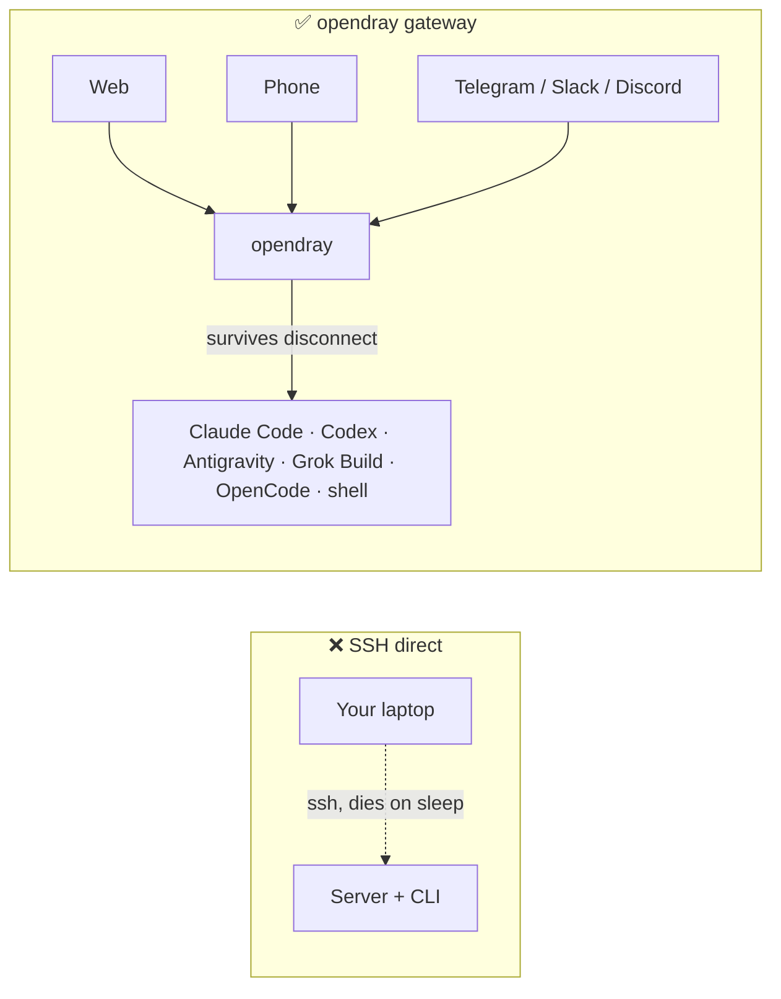
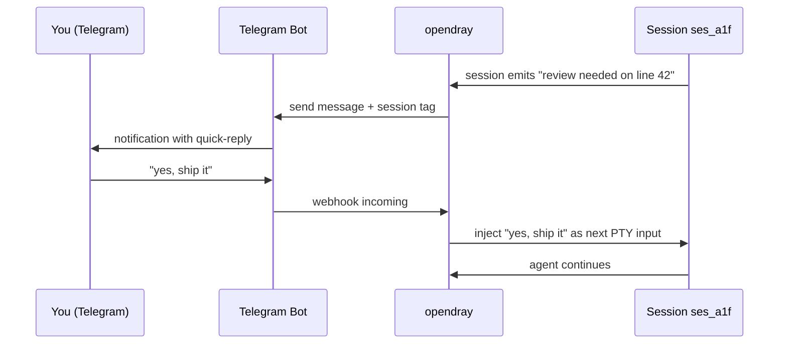
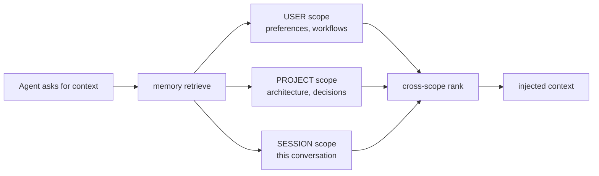
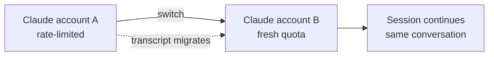
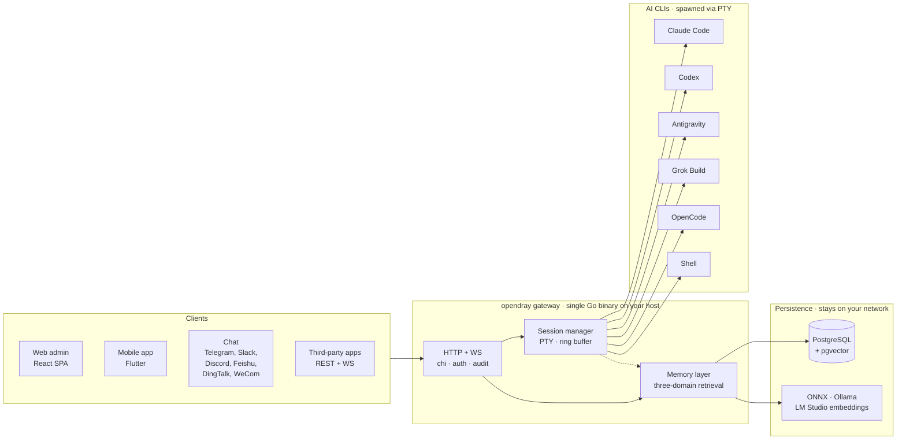

<p align="center">
  <a href="https://opendray.dev"></a>
</p>

<h1 align="center">opendray</h1>

<p align="center">
  <strong>Gateway autohospedado para Claude Code, Codex, Antigravity, Grok Build y OpenCode. Ejecuta sesiones de agente en tu propia infraestructura. Contrólalo desde la web, el móvil o el chat.</strong>
</p>

<p align="center">
  <strong><a href="https://opendray.dev">opendray.dev</a></strong>
</p>

<p align="center">
  <a href="https://opendray.dev"></a>
  <a href="https://github.com/Opendray/opendray/releases/latest"></a>
  <a href="LICENSE"></a>
  <a href="https://github.com/Opendray/opendray/actions/workflows/ci.yml"></a>
  <a href="https://github.com/Opendray/opendray/discussions"></a>
  <br/>
  
  
  
  
</p>

<p align="center">
  🌐 <a href="README.md">English</a> · <a href="README.zh.md">简体中文</a> · <a href="README.fa.md">فارسی</a> · <strong>Español</strong> · <a href="README.pt-BR.md">Português</a> · <a href="README.ja.md">日本語</a> · <a href="README.ko.md">한국어</a> · <a href="README.fr.md">Français</a> · <a href="README.de.md">Deutsch</a> · <a href="README.ru.md">Русский</a>
</p>

<p align="center">
  <a href="docs/getting-started.md"></a>
  <a href="#how-it-looks"></a>
  <a href="https://opendray.dev"></a>
</p>



Ejecutar Claude Code o Codex por SSH significa que el agente muere en el momento en que cierras el portátil. opendray lo ejecuta en un host que no se suspende (un Mac mini debajo de tu escritorio, un NAS, un VPS) y te permite reconectarte desde un panel web, una app móvil o un mensaje de chat. Las sesiones siguen ejecutándose esté quien esté conectado o no. Varias cuentas se agrupan en un pool con balanceo por tier y cambio de cuenta en vivo. Una capa de memoria local-first mantiene cada embedding en tu red.

---

## ¿Qué es opendray?

**opendray** envuelve las CLIs de coding con IA que ya usas (Claude Code, Codex, Antigravity, Grok Build, OpenCode, más cualquier shell) y las convierte en algo que puedes controlar desde cualquier lugar. Ejecuta sesiones en tu servidor doméstico, NAS o VPS. Recibe una notificación en Telegram cuando una sesión queda inactiva. Responde desde tu teléfono para alimentar el siguiente prompt. Todo a través de un gateway autohospedado que controlas de extremo a extremo.

- 🛰 **Un backend, tres superficies.** Un único binario Go que sirve un panel web React y una app móvil Flutter, con cada acción también expuesta sobre una API REST + WebSocket para integraciones de terceros.
- 💬 **Seis canales bidireccionales, sin jardines amurallados.** Telegram, Slack, Discord, Feishu (飞书), DingTalk (钉钉), WeCom (企业微信), más un adaptador Bridge para cualquier cosa personalizada. Las respuestas en cualquier canal se enrutan de vuelta a la sesión correcta.
- 🧠 **Memoria local-first.** Embeddings con ONNX / Ollama / LM Studio con recuperación en tres ámbitos (usuario, proyecto, sesión), ranking inteligente y detección de conflictos entre capas. Los datos vectoriales no salen de tu red.
- 🔌 **API de nivel integración.** Claves de API con scope, audit log por cada llamada, montajes de reverse-proxy. Trata a opendray como el gateway detrás de tu propio producto, o simplemente como un centro de mando personal.
- 🔑 **Flota multi-cuenta para Claude, Codex y Antigravity.** Añade varios directorios de credenciales ya autenticadas al host; opendray los detecta automáticamente vía un filesystem watcher, balancea las sesiones nuevas entre las cuentas habilitadas, y te permite cambiar una sesión en vivo entre cuentas **sin perder la conversación** (la transcripción se migra por debajo). Cada fila de cuenta muestra capacidad en vivo (subscription tier, rate-limit tier, sesiones activas, último uso, email de login actual).
- 🔒 **Autohospedado, licencia clara.** Apache 2.0, un binario estático, releases firmados con cosign más SBOM SPDX. Sin telemetría, sin cuenta en la nube, sin suscripción.

<a id="how-it-looks"></a>

## Cómo se ve

opendray es un binario Go que sirve un panel web en `/admin/` y una API REST + WebSocket en `/api/v1/*`. Esto es lo que hace, en las formas que realmente verías.

### Listar sesiones en ejecución

```
$ opendray sessions ls
ID        PROVIDER      PROJECT              STATE     STARTED
ses_a1f   claude-code   app/web              running   2h ago
ses_b2c   codex         internal/session     idle      5m ago
ses_c9d   grok-build    docs/                running   14m ago
ses_d34   shell         misc/deploy-logs     idle      1h ago
```

### Listar proveedores instalados y sus versiones

```
$ opendray providers list
PROVIDER      VERSION     ACCOUNTS   ACTIVE   NOTES
claude-code   1.4.11      3          1        auto-discovered via CLAUDE_CONFIG_DIR
codex         0.29.0      2          1        openai login
antigravity   0.7.2       1          0        agy, HOME-isolated
grok-build    2.5.1       1          1        xai
opencode      0.6.3       -          0        local endpoint required
shell         -           -          1        arbitrary
```

### Conectarte a una sesión desde el navegador y continuar después de que tu portátil se suspenda

El panel web embebe xterm.js. Ves el mismo PTY en el que la CLI escribió. Cierra la pestaña del navegador y la sesión sigue ejecutándose en el host. Reábrela horas después y la transcripción está donde la dejaste.

```
[claude-code ses_a1f · app/web · 2h 14m]

> refactor the router to lazy-load the mobile view

I'll look at the current router and figure out the cleanest split.

● Read(app/web/src/router.tsx)
  ⎿ 342 lines
● Grep(pattern: "loadable", path: "app/web/src")
  ⎿ found 3 uses
...
```

### Enrutar una respuesta de Telegram de vuelta a la misma sesión



Misma forma para Slack, Discord, Feishu, DingTalk, WeCom, y cualquier transporte con un adaptador Bridge.

### Abanicar una consulta de memoria en tres ámbitos a la vez



Cada ámbito guarda embeddings desde tu propio proveedor (ONNX empaquetado, Ollama o LM Studio). Nada sale de tu red.

### Cambiar de cuenta a mitad de conversación sin perder la transcripción



Igual para las cuentas de Codex y las cuentas de Antigravity. `Carry-context` está activado por defecto; desmárcalo para empezar limpio en la nueva identidad.

## Características

|  |  |
| --- | --- |
| **Sesiones** | Conéctate a una sesión en ejecución de Claude Code, Codex, Antigravity, Grok Build, OpenCode o shell desde la web, el móvil o el chat. Las sesiones sobreviven a la desconexión del cliente y al reinicio del host. Overlay de transcripción en vivo para TUIs que ignoran la entrada de la rueda. |
| **Proveedores** | 5 CLIs de coding con IA de primera clase más cualquier shell. Añadir una CLI nueva es un descriptor JSON drop-in bajo `internal/catalog/builtin/`. Inyección de servidores MCP por proveedor (Vault, memoria, integraciones). |
| **Memoria** | Recuperación en tres ámbitos (usuario, proyecto, sesión). Embeddings local-first vía ONNX, Ollama o LM Studio. Detección de conflictos entre capas. Páginas de conocimiento globales inyectadas al spawn. Compilador flywheel destila episodios en playbooks reutilizables. |
| **Canales** | Telegram, Slack, Discord, Feishu, DingTalk, WeCom. Adaptador Bridge para transportes personalizados. Bidireccional: las sesiones notifican, las respuestas se retroalimentan. |
| **Integraciones** | API REST + WebSocket con claves de API con scope, audit log por cada llamada, montajes de reverse-proxy. MCP de HashiCorp Vault para acceso a secretos. [`docs/integration-guide.md`](docs/integration-guide.md) público. |
| **Operaciones** | Un único binario Go. Instalador de una sola línea (Linux, macOS, WSL2). Autogestionado (`opendray update / start / stop / providers update`). Backups cifrados de PostgreSQL + exportaciones de datos. Pipeline con Goreleaser con releases firmados con cosign + SBOM SPDX. |
| **Seguridad** | Apache 2.0. Sin telemetría, sin cuenta en la nube. Firma keyless con cosign (Sigstore). Endurecimiento systemd con `ProtectSystem=strict`. Tokens con scope seguros para multi-tenant. |

## Arquitectura de un vistazo

Un único binario Go en tu host hace todo el trabajo. Los clientes manejan las sesiones por HTTP/WebSocket, el session manager lanza cada AI CLI en su propio PTY, y la capa de memoria guarda el estado compartido en Postgres con vector embeddings desde tu propio proveedor.



Todo lo del diagrama corre en tu red. Sin dependencias en la nube, sin inferencia fuera de tu control.

## Comparación

### opendray vs clientes de IA conocidos

|  | opendray | Claude Desktop | Cursor | CLI sobre SSH | ChatGPT Desktop |
| --- | --- | --- | --- | --- | --- |
| La sesión sobrevive a la desconexión del cliente | ✅ | ❌ | ❌ | ⚠️ (tmux / screen) | ❌ |
| Pool multi-cuenta con cambio en vivo | ✅ | ❌ | ❌ | ❌ | ❌ |
| Capa de memoria entre sesiones | ✅ | ❌ | Parcial | ❌ | Parcial |
| Sistema de archivos del host + uso de herramientas | ✅ | Limitado | ✅ | ✅ | Limitado |
| Cliente móvil con paridad de funciones | ✅ | ❌ | ❌ | ⚠️ (cliente SSH) | Parcial |
| Adaptadores de canales de chat | ✅ (6) | ❌ | ❌ | ❌ | ❌ |
| Autohospedado | ✅ | ❌ | ❌ | ✅ | ❌ |
| Licencia | Apache 2.0 | Propietaria | Propietaria | (varía) | Propietaria |

### opendray vs frontends de chat autohospedados

|  | opendray | Open WebUI | LibreChat | Dify |
| --- | --- | --- | --- | --- |
| Ejecuta una CLI de agente real (no solo chat) | ✅ | ❌ | ❌ | Parcial |
| Uso de herramientas + escritura de archivos en el host | ✅ | ❌ | ❌ | En sandbox |
| Múltiples CLIs de coding con IA en un solo gateway | ✅ (5) | ❌ | ❌ | ❌ |
| Memoria entre sesiones | ✅ | Básica | Básica | ✅ |
| Sesión PTY con reconexión al terminal | ✅ | ❌ | ❌ | ❌ |
| Adaptadores de canales de chat | ✅ (6) | Parcial | Parcial | ✅ |
| Licencia | Apache 2.0 | MIT | MIT | Apache 2.0 |

## ¿Para quién es esto?

**Dev en solitario con un homelab.** Ya tienes un Mac mini, un NAS o una Proxmox box funcionando 24/7. Has estado ejecutando Claude Code por SSH, pero la sesión muere cada vez que tu portátil se suspende. Quieres que la CLI siga adelante, y quieres reconectarte desde el móvil en el tren. opendray es el gateway que pone a tu host entre tú y la CLI.

**Líder de equipo pequeño montando infraestructura de IA compartida.** Tu equipo tiene 3 a 5 cuentas de Anthropic repartidas entre planes de trabajo y personales. Quieres agruparlas, observar el uso por cuenta, y dejar que cualquiera del equipo maneje una sesión desde el navegador. opendray te da pooling multi-cuenta, observabilidad por cuenta, claves de API con scope por compañero, y una app móvil que pueden instalar sin pasar por una App Store.

**Integrador construyendo sobre un session-runner.** Estás construyendo un producto que necesita lanzar sesiones de Claude Code, Codex o Grok Build con uso de herramientas, y no quieres reimplementar el ciclo de vida de la sesión, el manejo de PTY, la memoria o el enrutado de canales. opendray expone cada acción sobre REST + WebSocket con claves con scope, audit logs por cada llamada, y montajes de reverse-proxy. Trátalo como tu runtime de agente.

## Instalación

### Instalador de una sola línea

**Linux / macOS / WSL2**

```sh
curl -fsSL https://raw.githubusercontent.com/Opendray/opendray/main/scripts/install.sh | bash
```

**Windows** configura primero WSL2 y luego ejecuta el instalador de Linux dentro. [detalles →](scripts/README.md#windows)

```powershell
irm https://raw.githubusercontent.com/Opendray/opendray/main/scripts/install-windows.ps1 | iex
```

Recorre la configuración de Postgres, la instalación de AI-CLIs, las credenciales de admin y el registro del servicio, dejando un gateway en marcha en unos 5 a 10 minutos. Consulta [**`scripts/README.md`**](scripts/README.md) para saber qué hace el asistente, qué layout de archivos crea, sus opciones y troubleshooting.

> **¿Prefieres la guía manual?** Lee [**docs/getting-started.md**](docs/getting-started.md), una guía de 15 minutos de extremo a extremo que replica lo que hace el asistente para que verifiques cada paso tú mismo.

### npm / npx (Node ≥ 18)

Instala globalmente y añade `opendray` al `PATH`:

```sh
npm install -g opendray
```

O ejecútalo bajo demanda sin instalar:

```sh
npx opendray
```

Esto instala **solo el binario**: sin asistente, sin servicio, sin Postgres. El paquete trae el binario de plataforma correspondiente (`opendray-{linux,darwin}-{x64,arm64}`) vía `optionalDependencies` (el patrón de esbuild / Biome, sin `postinstall`, sin llamadas de red durante la instalación). Ideal para entornos con scripts, runners efímeros, o cuando ya ejecutas tu propio Postgres y supervisor de procesos.

Tú aportas la base de datos e inicias el gateway por tu cuenta:

```sh
# 1. PostgreSQL 15+ with pgvector. Point a DSN at it, set an admin password.
export OPENDRAY_DATABASE_URL="postgres://opendray:pw@127.0.0.1:5432/opendray?sslmode=disable"
export OPENDRAY_ADMIN_PASSWORD="$(openssl rand -base64 24)"
# 2. Apply the schema, then run (foreground).
opendray migrate
opendray serve        # → http://127.0.0.1:8770/admin/
```

Guía completa (configuración de pgvector, `config.toml`, ejecución como servicio systemd / launchd y actualización) en [**docs/install-binary.md**](docs/install-binary.md).

### Desinstalación (Linux / macOS)

**Por defecto.** Detiene el gateway y elimina el binario, pero **conserva** tu `config.toml`, el directorio de datos (keyfile bcrypt, sesiones, notas, vault), los logs y la base de datos PostgreSQL para que una reinstalación retome donde lo dejaste:

```sh
curl -fsSL https://raw.githubusercontent.com/Opendray/opendray/main/scripts/uninstall.sh | bash
```

**Purga completa.** También elimina la base de datos + el role de PG, borra config / data / logs, y quita el service user. Incluye un paso de verificación post-borrado que falla ruidosamente si algo sobrevive:

```sh
curl -fsSL https://raw.githubusercontent.com/Opendray/opendray/main/scripts/uninstall.sh | OPENDRAY_PURGE=1 bash
```

### Comandos del día a día

Tras la instalación, el binario `opendray` gestiona su propio ciclo de vida, así que no necesitas recordar los rituales de `systemctl` / `launchctl`:

```sh
sudo opendray update --restart   # download latest release, verify SHA, atomic replace + restart
```

```sh
sudo opendray providers update   # bump installed AI CLIs (claude / codex / antigravity) to npm-latest
```

```sh
opendray providers list          # see which AI CLIs are installed + their versions
```

```sh
sudo opendray start              # start | stop | restart | status, wraps systemd / launchd
```

`opendray --help` muestra el set completo de subcomandos.

### Selector de ruta de despliegue

Cada ruta soportada incluye spawn de sesiones, acceso a AI-CLI, backups cifrados y la API de integración completa. opendray es un gateway host-resident: lanza las AI CLIs vía PTYs y comparte estado de proceso (`~/.claude`, ssh-agent, archivos del proyecto) con ellas. Ese modelo es incompatible con el aislamiento de contenedores que Docker de producción impondría, por lo que Docker no es una ruta de despliegue soportada en v2.x.

| Ruta | Recomendada para | Ir a |
|---|---|---|
| 📦 **Binario pre-construido** | "Solo ejecútalo", Linux / macOS, cualquier supervisor | [Página de releases](https://github.com/Opendray/opendray/releases) → ver [Despliegue de producción](#production-deploy) |
| 🐧 **Unidad systemd** | Linux bare-metal / VM / LXC | [Despliegue de producción §A](#option-a-systemd-bare-metal--vm--lxc) |
| 🍎 **LaunchDaemon de macOS** | Mac mini / Mac Studio como servidor doméstico | [Despliegue de producción §C](#option-c-macos-launchd-mac-mini--studio-as-home-server) |
| 🛠 **Build desde el código fuente** | Desarrollo / contribución / builds personalizados | [Quickstart](#quickstart-5-minute-dev-path) abajo |

<a id="quickstart-5-minute-dev-path"></a>

## Quickstart (ruta dev de 5 minutos)

Para una guía completa con prerrequisitos y troubleshooting, consulta [`docs/quickstart.md`](docs/quickstart.md). La ruta de desarrollo condensada:

```bash
# 1. Have a Postgres 15+ running on 127.0.0.1:5432 with pgvector enabled
#    (apt install postgresql-16 postgresql-16-pgvector / brew install postgresql@16 pgvector).
#    Point [database].url at any other DSN if you'd rather use a remote PG.

# 2. Local config, already gitignored.
cp config.example.toml config.toml
$EDITOR config.toml          # set [database].url, [admin].password

# 3. Build the web bundle into the embed tree.
cd app/web && pnpm install && pnpm build && cd ../..

# 4. Apply schema.
go run ./cmd/opendray migrate -config config.toml

# 5. Run.
go run ./cmd/opendray serve -config config.toml
# → REST + WS:  http://127.0.0.1:8770/api/v1/...
# → Web admin:  http://127.0.0.1:8770/admin/
```

Esto ejecuta OpenDray en primer plano; Ctrl-C lo detiene. Para un demonio de larga duración, consulta **Despliegue de producción** abajo.

<a id="production-deploy"></a>

## Despliegue de producción

Cuatro rutas de despliegue soportadas; elige la que encaje con tu entorno.
Cada una te da auto-restart en caso de crash, estado persistente y
separación de secretos respecto al config.

<a id="option-a-systemd-bare-metal--vm--lxc"></a>

### Opción A: systemd (bare-metal / VM / LXC)

La ruta de despliegue recomendada en Linux. Incluye una unit endurecida en
[`deploy/systemd/opendray.service`](deploy/systemd/opendray.service)
con sandboxing (`ProtectSystem=strict`, `NoNewPrivileges`,
`MemoryDenyWriteExecute`, capability scrub), arranque `migrate`-luego-`serve`,
y una ventana de parada elegante de 20 s.

**Consigue primero un binario.** O bien descarga un archivo pre-construido de la
[página de releases](https://github.com/Opendray/opendray/releases)
(`opendray_*_linux_<arch>.tar.gz`, que se descomprime en un único binario `opendray`),
o constrúyelo desde el código fuente vía el [Quickstart](#quickstart-5-minute-dev-path)
de arriba (`go build ./cmd/opendray`).

```bash
# 1. Install the binary you just grabbed (or built).
sudo install -m 0755 /path/to/opendray /usr/local/bin/opendray

# 2. Create the service user + state dir.
sudo useradd -r -s /usr/sbin/nologin -d /var/lib/opendray opendray
sudo install -d -o opendray -g opendray -m 0700 /var/lib/opendray

# 3. Drop config + secrets (root-owned; mode 0640).
sudo install -D -m 0640 config.example.toml /etc/opendray/config.toml
sudo $EDITOR /etc/opendray/config.toml             # set [database].url etc.
sudo install -D -m 0640 -o root -g opendray /dev/null /etc/opendray/env.d/secrets
sudo $EDITOR /etc/opendray/env.d/secrets           # OPENDRAY_ADMIN_PASSWORD=…

# 4. Install + enable the unit.
sudo cp deploy/systemd/opendray.service /etc/systemd/system/
sudo systemctl daemon-reload
sudo systemctl enable --now opendray

# 5. Verify.
sudo systemctl status opendray
sudo journalctl -u opendray -f --no-pager
```

La unit ejecuta `opendray migrate` como `ExecStartPre`, así que el primer arranque
aplica todas las migraciones antes de que `serve` comience. Los reinicios son
`on-failure` con back-off de 5 s y un límite de 5 ráfagas por minuto.

### Opción B: Binario directo + tu propio supervisor de procesos

Para LXC sin systemd, FreeBSD `rc.d`, OpenRC, o cualquier otra cosa.
Construye una vez, ejecuta con el supervisor que ya uses:

```bash
# Cross-compile a release archive locally:
goreleaser release --clean --snapshot
ls dist/                  # opendray_*_linux_amd64.tar.gz etc.

# Or grab a published release artefact:
# https://github.com/Opendray/opendray/releases
```

Luego apunta tu supervisor (s6, runit, supervisord, runwhen) a:

```
/usr/local/bin/opendray serve -config /etc/opendray/config.toml
```

Pre-flight: ejecuta `opendray migrate -config /etc/opendray/config.toml`
una vez antes del primer `serve`, o como hook pre-start en el supervisor
que prefieras.

<a id="option-c-macos-launchd-mac-mini--studio-as-home-server"></a>

### Opción C: launchd de macOS (Mac mini / Studio como servidor doméstico)

Para Mac mini / Mac Studio con Apple Silicon funcionando 24/7. Incluye un
LaunchDaemon en
[`deploy/launchd/com.opendray.opendray.plist`](deploy/launchd/com.opendray.opendray.plist)
que arranca al boot antes de cualquier login de usuario, reinicia ante un crash con
throttle de 5 s, y loguea a `/usr/local/var/log/opendray/`.

```bash
# 1. Install the darwin binary + config + state dirs.
sudo install -m 0755 ./opendray /usr/local/bin/opendray
sudo install -d -m 0755 \
  /usr/local/etc/opendray \
  /usr/local/var/lib/opendray \
  /usr/local/var/log/opendray
sudo install -m 0640 config.example.toml /usr/local/etc/opendray/config.toml
sudo $EDITOR /usr/local/etc/opendray/config.toml    # set [database].url etc.

# 2. Apply migrations once.
sudo /usr/local/bin/opendray migrate \
  -config /usr/local/etc/opendray/config.toml

# 3. Install + load the LaunchDaemon.
sudo cp deploy/launchd/com.opendray.opendray.plist /Library/LaunchDaemons/
sudo chown root:wheel /Library/LaunchDaemons/com.opendray.opendray.plist
sudo chmod 0644 /Library/LaunchDaemons/com.opendray.opendray.plist
sudo launchctl bootstrap system /Library/LaunchDaemons/com.opendray.opendray.plist

# 4. Verify.
sudo launchctl print system/com.opendray.opendray
tail -f /usr/local/var/log/opendray/opendray.log
```

Reinicia con `sudo launchctl kickstart -k system/com.opendray.opendray`;
descárgalo por completo con `sudo launchctl bootout system/com.opendray.opendray`.

Postgres en macOS: instálalo vía Homebrew (`brew install postgresql@17 && brew services start postgresql@17`) y apunta `[database].url` a
`postgres://$USER@127.0.0.1:5432/opendray`. Añade `pgvector` con
`brew install pgvector` y ejecuta `CREATE EXTENSION vector` dentro de la
base de datos opendray.

---

Para notas específicas de LXC en Proxmox (PTY en contenedores unprivileged,
networking, ajustes de cgroup), consulta [`deploy/lxc/proxmox-pty-notes.md`](deploy/lxc/proxmox-pty-notes.md).

Para reverse-proxy / terminación TLS (nginx, Caddy, Traefik, Cloudflare
Tunnel), consulta [`docs/operator-guide.md`](docs/operator-guide.md) §Topology.

### Opcional: habilitar backups cifrados de DB + exportaciones de datos

```bash
# Master passphrase (env-only, never write into config.toml).
export OPENDRAY_BACKUP_KEY="$(openssl rand -base64 32)"
export OPENDRAY_BACKUP_ENABLED=1

# pg_dump / pg_restore must match the server's major version. On
# Apple Silicon dev machines pointing at a PG17 server:
export OPENDRAY_BACKUP_PG_DUMP_PATH=/opt/homebrew/opt/postgresql@17/bin/pg_dump
export OPENDRAY_BACKUP_PG_RESTORE_PATH=/opt/homebrew/opt/postgresql@17/bin/pg_restore
```

Reinicia opendray; el sidebar muestra una página de Backups (`/backups`)
para volcados PostgreSQL cifrados + restore, y `/export` para
exportaciones de datos en bundle zip + import. Consulta [`docs/operator-guide.md`](docs/operator-guide.md) §Backup para el ciclo completo.

Un solo binario Go contiene todo el bundle web, así que no se requiere un runtime
de Node en runtime, ni un servidor de archivos estáticos separado, ni Caddy/nginx.
Cloudflare Tunnel termina TLS delante de `:8770`.

## Layout

```
cmd/opendray/   binary entry point
internal/       Go backend (gateway, sessions, memory, channels,
                integrations, git, search, one package per domain)
app/web/        React + Vite admin SPA (embedded in the binary)
app/mobile/     Flutter app (iOS + Android)
app/shared*/    cross-surface shared UI + i18n strings
docs/           guides: install, getting-started, integration, ops
deploy/         systemd / launchd / LXC units + install scripts
```

## Frontend web

`app/web/` construye una SPA única en `internal/web/dist/`, que el binario Go
empotra y sirve en `/admin/*`. El dev server de Vite en `:5173` hace proxy de
`/api` hacia `:8770` para desarrollo con HMR.

```bash
# dev (hot reload on the React side, separate Go server for the API)
cd app/web && pnpm dev               # http://localhost:5173
go run ./cmd/opendray serve -config ../../config.toml   # other terminal

# prod (one binary delivers everything)
cd app/web && pnpm build              # writes ../../internal/web/dist
cd ../..
go build ./cmd/opendray               # bakes dist into the binary
./opendray serve -config config.toml
```

Consulta [`app/web/README.md`](app/web/README.md) para el stack de frontend
(React + Vite + Tailwind v4 + shadcn/ui + TanStack Router/Query +
Zustand + xterm.js) y notas por milestone W.

## App móvil

`app/mobile/` es una app Flutter para **iOS y Android** con paridad de funciones
con el panel web. Se conecta a un gateway en marcha sobre HTTPS.
Introduce la **Gateway URL** + el login de admin en el primer arranque y obtienes
las mismas superficies de Sesiones / Canales / Integraciones / Memoria / Git. No hay
build para App Store / Play Store por diseño (autohospedado, single-tenant):
la compilas tú mismo y la firmas con tu propia identidad.

**[→ Guía de compilación e instalación](docs/mobile-app.md).** Haz que el gateway
sea alcanzable desde el teléfono y luego sideloadea un APK de Android o instálala
en el iPhone vía Xcode. ([los 10 idiomas](docs/mobile-app.md); cambia el idioma en
la parte superior de la guía.)

## FAQ

### ¿Qué es opendray?

opendray es un gateway autohospedado que envuelve las CLIs de coding con IA que ya usas (Claude Code, Codex, Antigravity, Grok Build, OpenCode y shell) y las convierte en sesiones que puedes controlar desde un panel web, una app móvil Flutter, o seis canales de chat (Telegram, Slack, Discord, Feishu, DingTalk, WeCom). Un binario Go. Apache 2.0. Tu infraestructura, tus datos, tus tokens.

### ¿Qué CLIs de IA soporta opendray?

Cinco proveedores de primera clase a día de v2.10.x: **Claude Code** (Anthropic), **Codex** (OpenAI), **Antigravity** (Google `agy`), **Grok Build** (xAI) y **OpenCode**. Más cualquier shell para cualquier otra cosa. Añadir una CLI nueva es un descriptor JSON bajo `internal/catalog/builtin/`; sin código de adaptador para los casos habituales.

### ¿En qué se diferencia opendray de Claude Desktop o ChatGPT Desktop?

Claude Desktop y ChatGPT Desktop son clientes de chat que corren en tu portátil y mueren cuando el portátil se cierra. opendray ejecuta la CLI agéntica real en un host que no se suspende y te permite reconectarte desde cualquier lugar. Las sesiones sobreviven a la desconexión del cliente, la suspensión del portátil y las caídas de red. Varias cuentas se agrupan en un pool con cambio en vivo entre ellas.

### ¿En qué se diferencia opendray de ejecutar Claude Code por SSH?

Cuatro cosas que SSH no te da: (1) la sesión sobrevive cuando te desconectas (sin gimnasia con `tmux`, aunque puedes seguir usando tmux por dentro), (2) conectarte desde un teléfono o un canal de chat, no solo desde un terminal, (3) una capa de memoria compartida entre cada sesión del host, (4) un pool multi-cuenta con balanceo por tier y cambio de cuenta en vivo a mitad de conversación.

### ¿En qué se diferencia opendray de Open WebUI, LibreChat o Dify?

Esos son frontends de chat contra una API de modelo. Envían prompts a `api.openai.com` (o similar) y renderizan la respuesta. opendray ejecuta el proceso de CLI de agente real en tu host, con uso de herramientas, escritura de archivos, memoria y servidores MCP. Si una tarea necesita `Read` / `Edit` / `Bash` en el sistema de archivos de tu host, opendray lo hace; los frontends de chat no.

### ¿Puedo usar varias cuentas de Claude, Codex o Antigravity?

Sí. Añade los directorios de credenciales ya autenticadas al host (Claude usa `CLAUDE_CONFIG_DIR`, Antigravity usa aislamiento por `$HOME`) y opendray los detecta automáticamente vía un filesystem watcher. Las sesiones nuevas se balancean entre las cuentas habilitadas por tier + capacidad. Puedes cambiar una sesión en vivo entre cuentas sin perder la conversación (la transcripción se migra por debajo). El auto-failover por rate-limit lleva el contexto por defecto.

### ¿Dónde se almacenan mis datos?

PostgreSQL en tu host (usa la instancia que quieras, o la que el instalador te monta). Los embeddings vienen de tu propio proveedor (ONNX empaquetado, Ollama o LM Studio). Ningún dato vectorial, transcripción o entrada de memoria sale de tu red. Sin telemetría. Sin cuenta en la nube. `opendray` nunca llama a casa.

### ¿Puedo ejecutarlo en Docker?

Actualmente no (v2.x). opendray lanza las AI CLIs vía PTYs y comparte el estado del proceso del host (directorios de credenciales, ssh-agent, archivos del proyecto) con ellas. Eso es incompatible con el aislamiento de contenedores que Docker de producción impone. Usa el binario pre-construido y systemd o launchd (tanto Linux como macOS tienen instaladores de una sola línea). Consulta [Despliegue de producción](#production-deploy).

### ¿Funciona opendray en un NAS, Mac mini o Raspberry Pi?

NAS: sí en Synology / QNAP / TrueNAS-Scale (cualquier cosa con Linux + Postgres). Mac mini: sí, es un despliegue habitual (LaunchDaemon incluido). Raspberry Pi: funciona en Pi 4 / Pi 5 pero se queda corto para sesiones concurrentes; solo uso hobbyista de un único usuario.

### ¿Es opendray gratuito? ¿Cuál es la licencia?

Apache 2.0. Gratis para siempre. Sin tier de pago, sin telemetría, sin llamadas a casa. Se aceptan patrocinios (consulta [`.github/FUNDING.yml`](.github/FUNDING.yml)).

### ¿Cómo contribuyo?

Lee [`CONTRIBUTING.md`](CONTRIBUTING.md) y [`CODE_OF_CONDUCT.md`](CODE_OF_CONDUCT.md). Formas concretas de entrar: (1) traduce un README o una página de docs a un idioma que ya soportamos, (2) añade un descriptor de proveedor para una nueva CLI de coding con IA bajo `internal/catalog/builtin/`, (3) escribe un adaptador de canal para una plataforma de chat que no cubramos, (4) contribuye capturas de pantalla para los docs, (5) reporta un bug o pide una feature. Los PRs necesitan CI en verde; las traducciones son advisory-only; sin CLA.

## Documentación

- [`docs/getting-started.md`](docs/getting-started.md): **empieza aquí** si eres nuevo. De cero a tu primera sesión en 15 minutos, incluyendo la instalación de las CLIs envueltas y el bootstrap de Postgres.
- [`docs/install-binary.md`](docs/install-binary.md): instala desde el paquete npm o un binario de release (aporta tu propio Postgres) y ejecútalo como servicio systemd / launchd.
- [`docs/quickstart.md`](docs/quickstart.md): entorno de desarrollo de 5 minutos (asume que ya conoces las piezas en movimiento).
- [`docs/mobile-app.md`](docs/mobile-app.md): compila e instala la app móvil de Flutter; sideload de un APK de Android o instalación en iPhone vía Xcode, y luego apúntala a tu gateway.
- [`docs/operator-guide.md`](docs/operator-guide.md): referencia de despliegue + ops para setups de producción.
- [`docs/integration-guide.md`](docs/integration-guide.md): cómo escribir una integración externa en cualquier lenguaje.
- [`VERSIONING.md`](VERSIONING.md): estrategia de versionado (major-as-generation).
- [`CHANGELOG.md`](CHANGELOG.md): historial de releases.

## Estado

Generación actual: **v2.10.x**. Consulta [`CHANGELOG.md`](CHANGELOG.md) para el historial de releases y [`VERSIONING.md`](VERSIONING.md) para la política major-como-generación (major = generación de producto, no "breaking change" estricto al estilo SemVer).

Esta generación incluye:

- **Asistentes de instalación y desinstalación de una sola línea** (Linux + macOS; Windows se canaliza a través de WSL2). Guían al operador por bootstrap de Postgres, instalación de AI-CLIs, credenciales de admin, dirección de escucha, instalación del binario, migración del esquema y registro del servicio.
- **Binario autogestionado.** `opendray update / start / stop / restart / status / providers list / providers update` para que los operadores no toquen `systemctl` / `launchctl` para tareas rutinarias.
- **Pipeline de release con Goreleaser.** Binarios compilados de forma cruzada (linux/darwin × amd64/arm64), firma keyless con cosign (Sigstore), SBOM SPDX, self-update verificado atómicamente.

## Tests

```bash
go test -race ./...        # backend
cd app/web && pnpm build   # web (TS strict + vite production build)
```

Los smoke flows end-to-end se trackean en los commit messages por milestone.
Un harness Playwright está planificado como follow-up.

## Relación con v1

v1 (`Opendray/opendray`) es el codebase legacy, ahora archivado. v2 es
la generación actual y activa: feature-complete y la única rama que
recibe desarrollo. De los 16 builtins de v1, cuatro migraron al backend
de v2; el resto se convirtió en features del lado del cliente, adaptadores
de canal, o consumidores de la API de integración.

## Licencia

Apache 2.0. Consulta [`LICENSE`](LICENSE). (v1 era MIT; v2 está
licenciada de forma independiente.)
