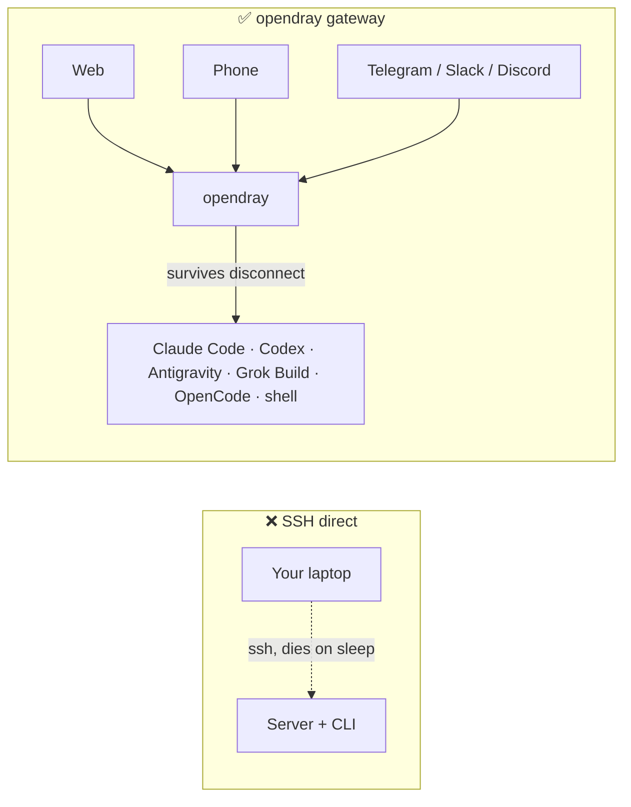
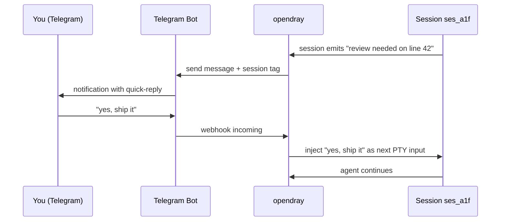
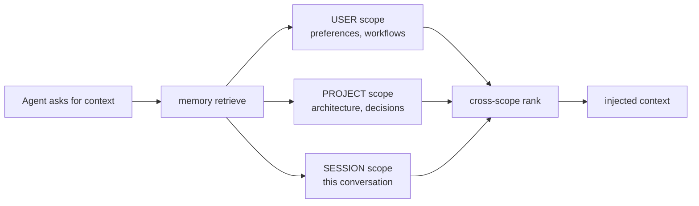
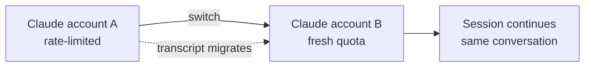
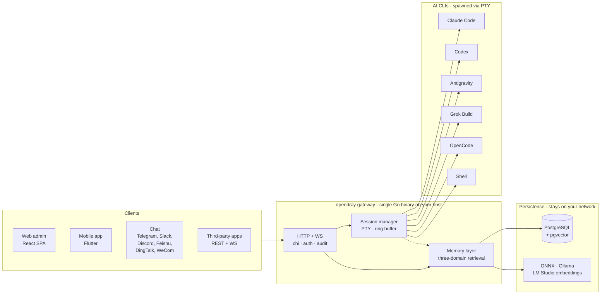

<p align="center">
  <a href="https://opendray.dev"></a>
</p>

<h1 align="center">opendray</h1>

<p align="center">
  <strong>gateway خودمیزبان برای Claude Code، Codex، Antigravity، Grok Build و OpenCode. سشن‌های agent را روی زیرساخت خودتان اجرا کنید. از web، mobile یا chat کنترل کنید.</strong>
</p>

<p align="center">
  <strong><a href="https://opendray.dev">opendray.dev</a></strong>
</p>

<p align="center">
  <a href="https://opendray.dev"></a>
  <a href="https://github.com/Opendray/opendray/releases/latest"></a>
  <a href="LICENSE"></a>
  <a href="https://github.com/Opendray/opendray/actions/workflows/ci.yml"></a>
  <a href="https://github.com/Opendray/opendray/discussions"></a>
  <br/>
  
  
  
  
</p>

<p align="center">
  🌐 <a href="README.md">English</a> · <a href="README.zh.md">简体中文</a> · <strong>فارسی</strong> · <a href="README.es.md">Español</a> · <a href="README.pt-BR.md">Português</a> · <a href="README.ja.md">日本語</a> · <a href="README.ko.md">한국어</a> · <a href="README.fr.md">Français</a> · <a href="README.de.md">Deutsch</a> · <a href="README.ru.md">Русский</a>
</p>

<p align="center">
  <a href="docs/getting-started.fa.md"></a>
  <a href="#how-it-looks"></a>
  <a href="https://opendray.dev"></a>
</p>



اجرای Claude Code یا Codex روی SSH یعنی به‌محض بسته شدن laptop، agent هم می‌میرد. opendray آن را روی hostای اجرا می‌کند که بیدار می‌ماند (یک Mac mini زیر میز، یک NAS، یک VPS) و اجازه می‌دهد از یک web admin، یک mobile app یا یک پیام chat دوباره reattach کنید. sessionها به اجرای خود ادامه می‌دهند، فارغ از این‌که کسی متصل باشد یا نه. چند account با balancing بر اساس tier و switch زنده بین accountها به‌صورت pool مدیریت می‌شوند. یک لایه memory local-first تمام embeddingها را روی network شما نگه می‌دارد.

---

## opendray چیست؟

**opendray** ابزارهای AI coding CLI که قبلاً استفاده می‌کردید (Claude Code، Codex، Antigravity، Grok Build، OpenCode و هر shell دیگری) را در بر می‌گیرد و به چیزی تبدیل می‌کند که از هرجا قابل کنترل باشد. sessionها را روی home server، NAS یا VPS اجرا کنید. وقتی session idle می‌شود در Telegram notification بگیرید. با reply کردن از روی گوشی، prompt بعدی را دوباره داخل session بفرستید. همه این‌ها روی یک self-hosted gateway که سرتاسر آن در اختیار شماست.

- 🛰 **یک backend، سه surface.** یک Go binary واحد که React web admin و Flutter mobile app را سرو می‌کند و هر action از طریق REST + WebSocket API برای third-party integrationها هم در دسترس است.
- 💬 **شش channel دوطرفه، بدون walled garden.** Telegram، Slack، Discord، Feishu (飞书)، DingTalk (钉钉)، WeCom (企业微信)، به‌همراه یک Bridge adapter برای هر transport دلخواه. reply در هر channel به session درست routing می‌شود.
- 🧠 **memory با معماری local-first.** embeddingهای ONNX / Ollama / LM Studio، retrieval سه‌scope‌ای (user، project، session)، ranking هوشمند و تشخیص conflict بین لایه‌ها. هیچ vector data از network شما خارج نمی‌شود.
- 🔌 **API در سطح integration.** API keyهای scoped، audit log برای هر call، mount از طریق reverse-proxy. opendray را به‌عنوان gateway پشت محصول خودتان بگذارید، یا صرفاً به‌چشم یک command centre شخصی به آن نگاه کنید.
- 🔑 **fleet چند-account برای Claude، Codex و Antigravity.** چند credential directoryای که login کرده‌اند را روی host بیندازید. opendray آن‌ها را با یک filesystem watcher به‌صورت خودکار discover می‌کند، sessionهای جدید را بین accountهای فعال balance می‌کند و اجازه می‌دهد یک live session را بین accountها جابه‌جا کنید **بدون این‌که conversation از دست برود** (transcript در پشت‌صحنه migrate می‌شود). هر ردیف account، ظرفیت زنده را نشان می‌دهد (subscription tier، rate-limit tier، active sessions، last-used، ایمیل ورود فعلی).
- 🔒 **self-hosted، license شفاف.** Apache 2.0، یک static binary، releaseهای cosign-signed به‌همراه SPDX SBOM. بدون telemetry، بدون cloud account، بدون subscription.

## How it looks

opendray یک Go binary است که web admin را روی `/admin/` و REST + WebSocket API را روی `/api/v1/*` سرو می‌کند. کاری که انجام می‌دهد، در همان شکلی که واقعاً می‌بینید:

### لیست sessionهای در حال اجرا

```
$ opendray sessions ls
ID        PROVIDER      PROJECT              STATE     STARTED
ses_a1f   claude-code   app/web              running   2h ago
ses_b2c   codex         internal/session     idle      5m ago
ses_c9d   grok-build    docs/                running   14m ago
ses_d34   shell         misc/deploy-logs     idle      1h ago
```

### لیست providerهای نصب‌شده و نسخه‌های آن‌ها

```
$ opendray providers list
PROVIDER      VERSION     ACCOUNTS   ACTIVE   NOTES
claude-code   1.4.11      3          1        auto-discovered via CLAUDE_CONFIG_DIR
codex         0.29.0      2          1        openai login
antigravity   0.7.2       1          0        agy, HOME-isolated
grok-build    2.5.1       1          1        xai
opencode      0.6.3       -          0        local endpoint required
shell         -           -          1        arbitrary
```

### attach به یک session از داخل browser و ادامه کار بعد از sleep laptop

web admin از xterm.js استفاده می‌کند. همان PTYای را می‌بینید که CLI روی آن نوشته است. tab browser را ببندید و session روی host به کارش ادامه می‌دهد. ساعت‌ها بعد آن را باز کنید و transcript همان‌جایی است که رهایش کرده بودید.

```
[claude-code ses_a1f · app/web · 2h 14m]

> refactor the router to lazy-load the mobile view

I'll look at the current router and figure out the cleanest split.

● Read(app/web/src/router.tsx)
  ⎿ 342 lines
● Grep(pattern: "loadable", path: "app/web/src")
  ⎿ found 3 uses
...
```

### route کردن یک reply در Telegram به همان session



همین الگو برای Slack، Discord، Feishu، DingTalk، WeCom و هر transport مبتنی بر Bridge adapter هم صادق است.

### fan-out یک memory query در سه scope هم‌زمان



هر scope، embeddingها را از provider خودتان (ONNX bundled، Ollama یا LM Studio) نگه می‌دارد. چیزی از network شما خارج نمی‌شود.

### جابه‌جایی account در وسط conversation بدون از دست رفتن transcript



همین برای Codex accountها و Antigravity accountها هم برقرار است. `Carry-context` به‌صورت پیش‌فرض روشن است. اگر می‌خواهید با identity جدید از صفر شروع کنید، آن را بردارید.

## قابلیت‌ها

|  |  |
| --- | --- |
| **sessionها** | attach به یک session زنده Claude Code، Codex، Antigravity، Grok Build، OpenCode یا shell از web، mobile یا chat. sessionها در برابر disconnect کلاینت و reboot host مقاوم هستند. برای TUIهایی که wheel input را نادیده می‌گیرند، overlay زنده transcript وجود دارد. |
| **providerها** | ۵ AI coding CLI first-class به‌همراه shell دلخواه. اضافه کردن یک CLI جدید، صرفاً drop-in یک JSON descriptor زیر `internal/catalog/builtin/` است. تزریق MCP-server per-provider (Vault، memory، integrations). |
| **memory** | retrieval در سه scope (user، project، session). embeddingهای local-first از طریق ONNX، Ollama یا LM Studio. تشخیص conflict بین لایه‌ها. تزریق knowledge pageهای global هنگام spawn. compiler flywheel، episodeها را به playbookهای قابل استفاده مجدد تبدیل می‌کند. |
| **channelها** | Telegram، Slack، Discord، Feishu، DingTalk، WeCom. Bridge adapter برای transportهای دلخواه. دوطرفه: sessionها notify می‌کنند، replyها بازمی‌گردند. |
| **integrationها** | REST + WebSocket API با API keyهای scoped، audit log per-call و mount از طریق reverse-proxy. HashiCorp Vault MCP برای دسترسی به secret. مستندات عمومی در [`docs/integration-guide.md`](docs/integration-guide.md). |
| **ops** | یک Go binary. installer یک‌خطی (Linux، macOS، WSL2). self-managing (`opendray update / start / stop / providers update`). backupهای encrypted PostgreSQL به‌همراه data export. pipeline Goreleaser با releaseهای cosign-signed و SPDX SBOM. |
| **security** | Apache 2.0. بدون telemetry، بدون cloud account. cosign keyless (Sigstore) signing. hardening systemd با `ProtectSystem=strict`. tokenهای scoped برای مصرف multi-tenant. |

## معماری در یک نگاه

یک Go binary روی host شما همه چیز را می‌گرداند. clientها sessionها را از طریق HTTP/WebSocket کنترل می‌کنند، session manager هر AI CLI را در PTY مستقل خودش spawn می‌کند و لایه memory، state مشترک را در Postgres با vector embedding از provider خودتان نگه می‌دارد.



هر چه در دیاگرام می‌بینید روی network شما اجرا می‌شود. بدون وابستگی cloud، بدون inference بیرون از کنترل شما.

## مقایسه

### opendray در برابر کلاینت‌های شناخته‌شده AI

|  | opendray | Claude Desktop | Cursor | CLI روی SSH | ChatGPT Desktop |
| --- | --- | --- | --- | --- | --- |
| بقای session در disconnect کلاینت | ✅ | ❌ | ❌ | ⚠️ (tmux / screen) | ❌ |
| pool چند-account با switch زنده | ✅ | ❌ | ❌ | ❌ | ❌ |
| لایه memory بین session | ✅ | ❌ | جزئی | ❌ | جزئی |
| filesystem host و tool use | ✅ | محدود | ✅ | ✅ | محدود |
| کلاینت mobile با featureهای برابر | ✅ | ❌ | ❌ | ⚠️ (کلاینت SSH) | جزئی |
| adaptor برای chat channel | ✅ (۶) | ❌ | ❌ | ❌ | ❌ |
| self-hosted | ✅ | ❌ | ❌ | ✅ | ❌ |
| License | Apache 2.0 | Proprietary | Proprietary | (متغیر) | Proprietary |

### opendray در برابر frontendهای chat خودمیزبان

|  | opendray | Open WebUI | LibreChat | Dify |
| --- | --- | --- | --- | --- |
| اجرای واقعی agent CLI (نه صرفاً chat) | ✅ | ❌ | ❌ | جزئی |
| tool use و نوشتن file روی host | ✅ | ❌ | ❌ | Sandboxed |
| چند AI coding CLI در یک gateway | ✅ (۵) | ❌ | ❌ | ❌ |
| memory بین session | ✅ | پایه‌ای | پایه‌ای | ✅ |
| session PTY با reattach terminal | ✅ | ❌ | ❌ | ❌ |
| adaptor برای chat channel | ✅ (۶) | جزئی | جزئی | ✅ |
| License | Apache 2.0 | MIT | MIT | Apache 2.0 |

## این برای چه کسانی است؟

**dev تک‌نفره‌ای که homelab دارد.** یک Mac mini، NAS یا Proxmox box دارید که ۲۴/۷ روشن است. Claude Code را روی SSH اجرا می‌کردید، اما هر بار laptop به sleep می‌رود session می‌میرد. می‌خواهید CLI به کارش ادامه دهد و می‌خواهید داخل قطار از روی گوشی reattach کنید. opendray همان gatewayای است که host شما را بین شما و CLI قرار می‌دهد.

**lead تیم کوچک که در حال راه‌اندازی زیرساخت AI مشترک است.** تیم شما ۳ تا ۵ Anthropic account روی planهای کاری و شخصی دارد. می‌خواهید آن‌ها را pool کنید، مصرف هر account را رصد کنید و اجازه دهید هر کسی در تیم بتواند یک session را از browser اجرا کند. opendray به شما pool چند-account، observability per-account، API keyهای scoped برای هر همکار و یک mobile app می‌دهد که بدون submission به App Store قابل نصب است.

**integratorای که روی یک session-runner می‌سازد.** در حال ساخت محصولی هستید که به spawn کردن session Claude Code، Codex یا Grok Build با tool use نیاز دارد و نمی‌خواهید session lifecycle، مدیریت PTY، memory یا routing کانال را دوباره پیاده‌سازی کنید. opendray هر action را از طریق REST + WebSocket با keyهای scoped، audit log per-call و mount از طریق reverse-proxy در معرض دسترس می‌گذارد. به‌عنوان agent runtime خودتان از آن استفاده کنید.

## نصب

### installer یک‌خطی

**Linux / macOS / WSL2**

```sh
curl -fsSL https://raw.githubusercontent.com/Opendray/opendray/main/scripts/install.sh | bash
```

**Windows** ابتدا WSL2 را راه‌اندازی می‌کند و سپس installer لینوکس را داخل آن اجرا می‌کند. [جزئیات →](scripts/README.md#windows)

```powershell
irm https://raw.githubusercontent.com/Opendray/opendray/main/scripts/install-windows.ps1 | iex
```

wizard مسیر Postgres setup، نصب AI-CLI، admin credentials و ثبت service را طی می‌کند و در حدود ۵ تا ۱۰ دقیقه یک gateway در حال اجرا تحویل می‌دهد. برای این‌که ببینید wizard دقیقاً چه کاری می‌کند، چه layoutای می‌سازد، optionهایش و مسیر troubleshooting را [**`scripts/README.md`**](scripts/README.md) ببینید.

> **راهنمای دستی و قدم‌به‌قدم می‌خواهید؟** [**docs/getting-started.fa.md**](docs/getting-started.fa.md) را بخوانید، یک راهنمای ۱۵ دقیقه‌ای end-to-end که همان کار wizard را آیینه می‌کند تا هر مرحله را خودتان بررسی کنید.

### npm / npx (Node ≥ 18)

نصب global و قرار گرفتن `opendray` روی `PATH`:

```sh
npm install -g opendray
```

یا اجرای on-demand بدون نصب:

```sh
npx opendray
```

این کار **فقط binary** را نصب می‌کند؛ بدون wizard، بدون service، بدون Postgres. package از طریق `optionalDependencies` بسته پلتفرم متناظر `opendray-{linux,darwin}-{x64,arm64}` را می‌کشد (همان الگوی esbuild / Biome، بدون `postinstall`، بدون network call در زمان نصب). مناسب برای environmentهای scripted، runnerهای ephemeral یا زمانی که Postgres و process supervisor خودتان را دارید.

خودتان یک database می‌آورید و gateway را استارت می‌کنید:

```sh
# 1. PostgreSQL 15+ with pgvector. Point a DSN at it, set an admin password.
export OPENDRAY_DATABASE_URL="postgres://opendray:pw@127.0.0.1:5432/opendray?sslmode=disable"
export OPENDRAY_ADMIN_PASSWORD="$(openssl rand -base64 24)"
# 2. Apply the schema, then run (foreground).
opendray migrate
opendray serve        # → http://127.0.0.1:8770/admin/
```

راهنمای کامل (راه‌اندازی pgvector، تنظیم `config.toml`، اجرا به‌عنوان systemd / launchd service و به‌روزرسانی) در [**docs/install-binary.fa.md**](docs/install-binary.fa.md).

### حذف نصب (Linux / macOS)

**پیش‌فرض.** gateway را stop و binary را حذف می‌کند، اما `config.toml`، مسیر data (bcrypt keyfile، sessions، notes، vault)، logها و PostgreSQL database را **نگه می‌دارد** تا re-install از همان‌جا ادامه یابد:

```sh
curl -fsSL https://raw.githubusercontent.com/Opendray/opendray/main/scripts/uninstall.sh | bash
```

**purge کامل.** علاوه بر موارد بالا، database و role مربوطه در PG را drop می‌کند، config / data / logs را حذف می‌کند و service user را برمی‌دارد. یک verification step پس از حذف اجرا می‌شود که اگر چیزی باقی مانده باشد بلند اعتراض می‌کند:

```sh
curl -fsSL https://raw.githubusercontent.com/Opendray/opendray/main/scripts/uninstall.sh | OPENDRAY_PURGE=1 bash
```

### دستورات روزمره

بعد از نصب، خود binary `opendray` چرخه حیات خودش را مدیریت می‌کند و لازم نیست incantationهای `systemctl` / `launchctl` را حفظ کنید:

```sh
sudo opendray update --restart   # download latest release, verify SHA, atomic replace + restart
```

```sh
sudo opendray providers update   # bump installed AI CLIs (claude / codex / antigravity) to npm-latest
```

```sh
opendray providers list          # see which AI CLIs are installed + their versions
```

```sh
sudo opendray start              # start | stop | restart | status, wraps systemd / launchd
```

`opendray --help` مجموعه کامل subcommandها را نشان می‌دهد.

### انتخاب مسیر deploy

هر مسیر پشتیبانی‌شده شامل spawn session، دسترسی به AI-CLI، backupهای encrypted و integration API کامل است. opendray یک gateway مقیم روی host است؛ AI CLIها را از طریق PTY spawn می‌کند و process state (`~/.claude`، ssh-agent، project files) را با آن‌ها share می‌کند. این مدل با container isolation تولیدی Docker سازگار نیست، بنابراین Docker برای v2.x مسیر deploy پشتیبانی‌شده محسوب نمی‌شود.

| مسیر | مناسب برای | برو به |
|---|---|---|
| 📦 **binary از پیش build‌شده** | «فقط اجرایش کن»، Linux / macOS، هر supervisor | [Releases page](https://github.com/Opendray/opendray/releases) → [Production deploy](#production-deploy) |
| 🐧 **systemd unit** | Linux روی bare-metal / VM / LXC | [Production deploy §A](#option-a-systemd-bare-metal--vm--lxc) |
| 🍎 **macOS LaunchDaemon** | Mac mini / Mac Studio به‌عنوان home server | [Production deploy §C](#option-c-macos-launchd-mac-mini--studio-as-home-server) |
| 🛠 **build از source** | dev / مشارکت / build کاستوم | [Quickstart](#quickstart-5-minute-dev-path) پایین‌تر |

## Quickstart (مسیر ۵ دقیقه‌ای dev)

برای راهنمای کامل با prerequisiteها و troubleshooting، [`docs/quickstart.md`](docs/quickstart.md) را ببینید. مسیر خلاصه dev:

```bash
# 1. Have a Postgres 15+ running on 127.0.0.1:5432 with pgvector enabled
#    (apt install postgresql-16 postgresql-16-pgvector / brew install postgresql@16 pgvector).
#    Point [database].url at any other DSN if you'd rather use a remote PG.

# 2. Local config, already gitignored.
cp config.example.toml config.toml
$EDITOR config.toml          # set [database].url, [admin].password

# 3. Build the web bundle into the embed tree.
cd app/web && pnpm install && pnpm build && cd ../..

# 4. Apply schema.
go run ./cmd/opendray migrate -config config.toml

# 5. Run.
go run ./cmd/opendray serve -config config.toml
# → REST + WS:  http://127.0.0.1:8770/api/v1/...
# → Web admin:  http://127.0.0.1:8770/admin/
```

این OpenDray را در foreground اجرا می‌کند و با Ctrl-C می‌میرد. برای یک daemon طولانی‌مدت، بخش **Production deploy** پایین‌تر را ببینید.

## Production deploy

چهار مسیر deploy پشتیبانی‌شده. هرکدام که به environment شما می‌خورد را انتخاب کنید. همه آن‌ها auto-restart در crash، state پایدار و جداسازی secrets از config را می‌دهند.

### Option A: systemd (bare-metal / VM / LXC)

مسیر پیشنهادی deploy Linux. یک unit hardened در [`deploy/systemd/opendray.service`](deploy/systemd/opendray.service) با sandboxing (`ProtectSystem=strict`، `NoNewPrivileges`، `MemoryDenyWriteExecute`، capability scrub)، boot به سبک `migrate`-سپس-`serve` و پنجره graceful-stop بیست‌ثانیه‌ای ارائه می‌شود.

**اول binary را بگیرید.** یا یک archive آماده را از [Releases page](https://github.com/Opendray/opendray/releases) بردارید (`opendray_*_linux_<arch>.tar.gz` که به یک binary تنها `opendray` unpack می‌شود)، یا از source از طریق [Quickstart](#quickstart-5-minute-dev-path) بالا با `go build ./cmd/opendray` build کنید.

```bash
# 1. Install the binary you just grabbed (or built).
sudo install -m 0755 /path/to/opendray /usr/local/bin/opendray

# 2. Create the service user + state dir.
sudo useradd -r -s /usr/sbin/nologin -d /var/lib/opendray opendray
sudo install -d -o opendray -g opendray -m 0700 /var/lib/opendray

# 3. Drop config + secrets (root-owned; mode 0640).
sudo install -D -m 0640 config.example.toml /etc/opendray/config.toml
sudo $EDITOR /etc/opendray/config.toml             # set [database].url etc.
sudo install -D -m 0640 -o root -g opendray /dev/null /etc/opendray/env.d/secrets
sudo $EDITOR /etc/opendray/env.d/secrets           # OPENDRAY_ADMIN_PASSWORD=…

# 4. Install + enable the unit.
sudo cp deploy/systemd/opendray.service /etc/systemd/system/
sudo systemctl daemon-reload
sudo systemctl enable --now opendray

# 5. Verify.
sudo systemctl status opendray
sudo journalctl -u opendray -f --no-pager
```

این unit، `opendray migrate` را به‌عنوان `ExecStartPre` اجرا می‌کند، پس در اولین boot همه migrationها قبل از شروع `serve` اعمال می‌شوند. restartها `on-failure` هستند، با back-off پنج‌ثانیه‌ای و limit پنج burst در دقیقه.

### Option B: Direct binary + process supervisor دلخواه

برای LXC بدون systemd، `rc.d` در FreeBSD، OpenRC یا هر چیز دیگری. یک بار build کنید و با هر supervisorای که قبلاً استفاده می‌کنید اجرا کنید:

```bash
# Cross-compile a release archive locally:
goreleaser release --clean --snapshot
ls dist/                  # opendray_*_linux_amd64.tar.gz etc.

# Or grab a published release artefact:
# https://github.com/Opendray/opendray/releases
```

سپس supervisor خود (s6، runit، supervisord، runwhen) را به این نقطه اشاره دهید:

```
/usr/local/bin/opendray serve -config /etc/opendray/config.toml
```

Pre-flight: قبل از اولین `serve`، یک بار `opendray migrate -config /etc/opendray/config.toml` را اجرا کنید یا آن را به‌عنوان pre-start hook در supervisor دلخواهتان قرار دهید.

### Option C: macOS launchd (Mac mini / Studio به‌عنوان home server)

برای Mac mini / Mac Studio روی Apple Silicon که ۲۴/۷ روشن است. یک LaunchDaemon در [`deploy/launchd/com.opendray.opendray.plist`](deploy/launchd/com.opendray.opendray.plist) ارائه می‌شود که هنگام boot و قبل از login هر user استارت می‌شود، در crash با throttle پنج‌ثانیه‌ای دوباره اجرا می‌شود و در `/usr/local/var/log/opendray/` log می‌نویسد.

```bash
# 1. Install the darwin binary + config + state dirs.
sudo install -m 0755 ./opendray /usr/local/bin/opendray
sudo install -d -m 0755 \
  /usr/local/etc/opendray \
  /usr/local/var/lib/opendray \
  /usr/local/var/log/opendray
sudo install -m 0640 config.example.toml /usr/local/etc/opendray/config.toml
sudo $EDITOR /usr/local/etc/opendray/config.toml    # set [database].url etc.

# 2. Apply migrations once.
sudo /usr/local/bin/opendray migrate \
  -config /usr/local/etc/opendray/config.toml

# 3. Install + load the LaunchDaemon.
sudo cp deploy/launchd/com.opendray.opendray.plist /Library/LaunchDaemons/
sudo chown root:wheel /Library/LaunchDaemons/com.opendray.opendray.plist
sudo chmod 0644 /Library/LaunchDaemons/com.opendray.opendray.plist
sudo launchctl bootstrap system /Library/LaunchDaemons/com.opendray.opendray.plist

# 4. Verify.
sudo launchctl print system/com.opendray.opendray
tail -f /usr/local/var/log/opendray/opendray.log
```

restart با `sudo launchctl kickstart -k system/com.opendray.opendray`؛ unload کامل با `sudo launchctl bootout system/com.opendray.opendray`.

Postgres روی macOS: از طریق Homebrew نصب کنید (`brew install postgresql@17 && brew services start postgresql@17`) و `[database].url` را به `postgres://$USER@127.0.0.1:5432/opendray` اشاره دهید. `pgvector` را با `brew install pgvector` اضافه کنید و در database opendray `CREATE EXTENSION vector` را اجرا کنید.

---

برای noteهای مخصوص Proxmox LXC (PTY در containerهای unprivileged، شبکه، تنظیمات cgroup)، [`deploy/lxc/proxmox-pty-notes.md`](deploy/lxc/proxmox-pty-notes.md) را ببینید.

برای reverse-proxy / TLS termination (nginx، Caddy، Traefik، Cloudflare Tunnel)، بخش Topology در [`docs/operator-guide.md`](docs/operator-guide.md) را ببینید.

### اختیاری: فعال‌سازی backup encrypted DB و data export

```bash
# Master passphrase (env-only, never write into config.toml).
export OPENDRAY_BACKUP_KEY="$(openssl rand -base64 32)"
export OPENDRAY_BACKUP_ENABLED=1

# pg_dump / pg_restore must match the server's major version. On
# Apple Silicon dev machines pointing at a PG17 server:
export OPENDRAY_BACKUP_PG_DUMP_PATH=/opt/homebrew/opt/postgresql@17/bin/pg_dump
export OPENDRAY_BACKUP_PG_RESTORE_PATH=/opt/homebrew/opt/postgresql@17/bin/pg_restore
```

opendray را restart کنید؛ sidebar یک صفحه Backups در `/backups` برای dump / restore encrypted PostgreSQL و `/export` برای data export / import در قالب zip-bundle اضافه می‌کند. برای چرخه کامل، بخش Backup در [`docs/operator-guide.md`](docs/operator-guide.md) را ببینید.

یک Go binary واحد، کل web bundle را حمل می‌کند، پس در runtime نه Node لازم است، نه static-file server جدا، نه Caddy/nginx. Cloudflare Tunnel می‌تواند TLS را در جلوی `:8770` terminate کند.

## ساختار پروژه

```
cmd/opendray/   binary entry point
internal/       Go backend (gateway, sessions, memory, channels,
                integrations, git, search, one package per domain)
app/web/        React + Vite admin SPA (embedded in the binary)
app/mobile/     Flutter app (iOS + Android)
app/shared*/    cross-surface shared UI + i18n strings
docs/           guides: install, getting-started, integration, ops
deploy/         systemd / launchd / LXC units + install scripts
```

## web frontend

`app/web/` یک SPA واحد را در `internal/web/dist/` build می‌کند که Go binary آن را embed کرده و روی `/admin/*` سرو می‌کند. Vite dev server روی `:5173` مسیر `/api` را به `:8770` proxy می‌کند تا development با HMR انجام شود.

```bash
# dev (hot reload on the React side, separate Go server for the API)
cd app/web && pnpm dev               # http://localhost:5173
go run ./cmd/opendray serve -config ../../config.toml   # other terminal

# prod (one binary delivers everything)
cd app/web && pnpm build              # writes ../../internal/web/dist
cd ../..
go build ./cmd/opendray               # bakes dist into the binary
./opendray serve -config config.toml
```

برای stack frontend (React + Vite + Tailwind v4 + shadcn/ui + TanStack Router/Query + Zustand + xterm.js) و noteهای milestone W، [`app/web/README.md`](app/web/README.md) را ببینید.

## اپ موبایل

`app/mobile/` یک Flutter app برای **iOS و Android** با featureهای برابر با web admin است. از طریق HTTPS به یک gateway در حال اجرا وصل می‌شود. در اولین اجرا **Gateway URL** به‌همراه login admin را وارد می‌کنید و همان surfaceهای Sessions / Channels / Integrations / Memory / Git را در اختیار می‌گیرید. build مربوط به App Store / Play Store به‌صورت طراحی وجود ندارد (self-hosted، single-tenant): خودتان build می‌کنید و با هویت خودتان امضا می‌کنید.

**[→ راهنمای build و نصب](docs/mobile-app.fa.md).** gateway را از گوشی در دسترس کنید، سپس یک Android APK را sideload کنید یا با Xcode روی iPhone نصب کنید. ([هر ۱۰ زبان](docs/mobile-app.md)؛ در بالای راهنما زبان را عوض کنید.)

## سوالات متداول

### opendray چیست؟

opendray یک self-hosted gateway است که ابزارهای AI coding CLI که استفاده می‌کردید (Claude Code، Codex، Antigravity، Grok Build، OpenCode و shell) را می‌پیچد و به sessionهایی تبدیل می‌کند که از web admin، Flutter mobile app یا شش chat channel (Telegram، Slack، Discord، Feishu، DingTalk، WeCom) قابل کنترل باشند. یک Go binary. Apache 2.0. زیرساخت خودتان، data خودتان، tokenهای خودتان.

### opendray چه AI CLIهایی را پشتیبانی می‌کند؟

پنج provider first-class در نسخه v2.10.x: **Claude Code** (Anthropic)، **Codex** (OpenAI)، **Antigravity** (Google `agy`)، **Grok Build** (xAI) و **OpenCode**. به‌همراه shell دلخواه برای هر چیز دیگر. اضافه کردن یک CLI جدید، یک JSON descriptor زیر `internal/catalog/builtin/` است؛ در موارد رایج به کد adapter نیازی نیست.

### opendray در مقابل Claude Desktop یا ChatGPT Desktop چه فرقی دارد؟

Claude Desktop و ChatGPT Desktop، chat clientهایی هستند که روی laptop شما اجرا می‌شوند و به‌محض بسته شدن laptop می‌میرند. opendray پروسه واقعی agentic CLI را روی hostای اجرا می‌کند که بیدار می‌ماند و اجازه می‌دهد از هرجا reattach کنید. sessionها در برابر disconnect، sleep laptop و drop شبکه بقا دارند. چند account با switch زنده بین آن‌ها pool می‌شوند.

### opendray در مقابل اجرای Claude Code روی SSH چه فرقی دارد؟

چهار چیزی که SSH به شما نمی‌دهد: (۱) بقای session در disconnect (بدون نیاز به ژیمناستیک `tmux`، هرچند می‌توانید داخل session از tmux هم استفاده کنید)، (۲) attach از گوشی یا یک chat channel، نه فقط terminal، (۳) لایه memory مشترک بین همه sessionهای host، (۴) pool چند-account با balancing بر اساس tier و switch زنده account در وسط conversation.

### opendray در مقابل Open WebUI، LibreChat یا Dify چه فرقی دارد؟

آن‌ها frontendهای chat در برابر یک model API هستند. promptها را به `api.openai.com` (یا مشابه) می‌فرستند و response را render می‌کنند. opendray پروسه واقعی agent CLI را روی host شما اجرا می‌کند، به‌همراه tool use، نوشتن file، memory و MCP serverها. اگر یک task به `Read` / `Edit` / `Bash` روی filesystem host نیاز دارد، opendray انجامش می‌دهد؛ frontendهای chat نه.

### آیا می‌توانم چند Claude، Codex یا Antigravity account استفاده کنم؟

بله. credential directoryهای loggedin را روی host بگذارید (Claude از `CLAUDE_CONFIG_DIR` استفاده می‌کند، Antigravity از isolation `$HOME` استفاده می‌کند) و opendray آن‌ها را از طریق filesystem watcher به‌صورت خودکار discover می‌کند. sessionهای جدید بر اساس tier + capacity بین accountهای فعال balance می‌شوند. می‌توانید یک session زنده را بین accountها جابه‌جا کنید بدون از دست دادن conversation (transcript در پشت‌صحنه migrate می‌شود). failover خودکار rate-limit به‌صورت پیش‌فرض context را حمل می‌کند.

### data من کجا ذخیره می‌شود؟

PostgreSQL روی host خودتان (instance خودتان را بیاورید یا از instanceای که installer bootstrap می‌کند استفاده کنید). embeddingها از provider خودتان می‌آیند (ONNX bundled، Ollama یا LM Studio). هیچ vector data، transcript یا memory entry از network شما خارج نمی‌شود. بدون telemetry. بدون cloud account. `opendray` هرگز به خانه زنگ نمی‌زند.

### آیا می‌توانم این را در Docker اجرا کنم؟

فعلاً نه (v2.x). opendray از طریق PTY، AI CLIها را spawn می‌کند و process state host (credential directories، ssh-agent، project files) را با آن‌ها share می‌کند. این با container isolationی که production Docker تحمیل می‌کند سازگار نیست. از binary از پیش build‌شده و systemd یا launchd استفاده کنید (Linux و macOS هر دو installer یک‌خطی دارند). [Production deploy](#production-deploy) را ببینید.

### آیا opendray روی NAS، Mac mini یا Raspberry Pi کار می‌کند؟

NAS: بله روی Synology / QNAP / TrueNAS-Scale (هر چیزی با Linux + Postgres). Mac mini: بله، این یکی از deployهای پرکاربرد است (LaunchDaemon همراه است). Raspberry Pi: روی Pi 4 / Pi 5 کار می‌کند اما برای sessionهای همزمان کم‌توان است؛ فقط برای استفاده hobby تک‌کاربره.

### آیا opendray رایگان است؟ license چیست؟

Apache 2.0. برای همیشه رایگان. بدون paid tier، بدون telemetry، بدون phone-home. اسپانسرها خوشامد هستند ([`.github/FUNDING.yml`](.github/FUNDING.yml) را ببینید).

### چطور مشارکت کنم؟

[`CONTRIBUTING.md`](CONTRIBUTING.md) و [`CODE_OF_CONDUCT.md`](CODE_OF_CONDUCT.md) را بخوانید. راه‌های ورود عملی: (۱) ترجمه یک صفحه README یا doc به یکی از زبان‌هایی که پشتیبانی می‌کنیم، (۲) اضافه کردن یک provider descriptor برای یک AI coding CLI جدید زیر `internal/catalog/builtin/`، (۳) نوشتن یک channel adaptor برای یک platform chat که پوشش نمی‌دهیم، (۴) مشارکت در screenshotهای docs، (۵) گزارش bug یا feature request. PRها CI سبز می‌خواهند؛ ترجمه‌ها advisory هستند؛ بدون CLA.

## مستندات

- [`docs/getting-started.fa.md`](docs/getting-started.fa.md): **از اینجا شروع کنید** اگر تازه‌واردید. صفر تا اولین session در ۱۵ دقیقه، شامل نصب CLIهای wrapped و bootstrap کردن Postgres.
- [`docs/install-binary.fa.md`](docs/install-binary.fa.md): نصب از npm package یا release binary (Postgres را خودتان بیاورید) و اجرا به‌عنوان systemd / launchd service.
- [`docs/quickstart.md`](docs/quickstart.md): environment dev پنج‌دقیقه‌ای (فرض بر این‌که با moving partها آشنا هستید).
- [`docs/mobile-app.fa.md`](docs/mobile-app.fa.md): build و نصب اپ Flutter؛ Android APK را sideload کنید یا با Xcode روی iPhone نصب کنید، سپس آن را به gateway خودتان اشاره دهید.
- [`docs/operator-guide.md`](docs/operator-guide.md): مرجع deploy + ops برای setupهای production-ish.
- [`docs/integration-guide.md`](docs/integration-guide.md): چطور یک integration خارجی با هر زبانی بنویسید.
- [`VERSIONING.md`](VERSIONING.md): استراتژی versioning (major-as-generation).
- [`CHANGELOG.md`](CHANGELOG.md): تاریخچه release.

## Status

نسل فعلی: **v2.10.x**. برای تاریخچه release به [`CHANGELOG.md`](CHANGELOG.md) و برای policy مربوط به major-as-generation به [`VERSIONING.md`](VERSIONING.md) نگاه کنید (major به معنای نسل محصول است، نه breaking change به معنای سخت‌گیرانه SemVer).

این نسل شامل موارد زیر است:

- **wizardهای one-line installer و uninstaller** (Linux + macOS؛ Windows از طریق WSL2 عبور می‌کند). operator را مرحله‌به‌مرحله از bootstrap Postgres، نصب AI-CLI، admin credentials، تعیین listen address، نصب binary، schema migration و ثبت service عبور می‌دهد.
- **binary خودمدیریت.** `opendray update / start / stop / restart / status / providers list / providers update` تا operatorها برای ops روزمره به `systemctl` / `launchctl` دست نزنند.
- **release pipeline Goreleaser.** binaryهای cross-compiled (linux/darwin × amd64/arm64)، cosign keyless signing (Sigstore)، SPDX SBOM، self-update اتومیک تأییدشده.

## تست‌ها

```bash
go test -race ./...        # backend
cd app/web && pnpm build   # web (TS strict + vite production build)
```

flowهای smoke end-to-end در commit messageهای هر milestone track می‌شوند. یک harness Playwright به‌عنوان follow-up برنامه‌ریزی شده است.

## نسبت به v1

v1 (`Opendray/opendray`) codebase قدیمی است که حالا archived شده. v2 نسل فعلی و فعال است، feature-complete است و تنها branchای است که development روی آن انجام می‌شود. از ۱۶ builtin نسخه v1، چهار مورد به backend نسخه v2 مهاجرت کرده‌اند؛ بقیه به featureهای سمت client، channel adaptor یا مصرف‌کننده integration API تبدیل شده‌اند.

## License

Apache 2.0. [`LICENSE`](LICENSE) را ببینید. (v1 تحت MIT بود؛ v2 license مستقل خودش را دارد.)
