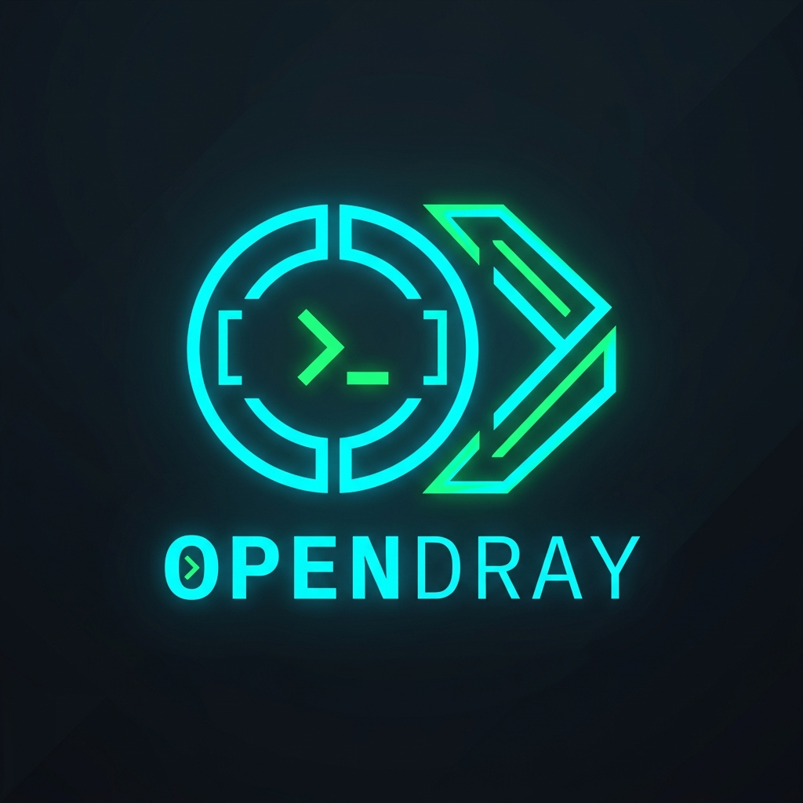
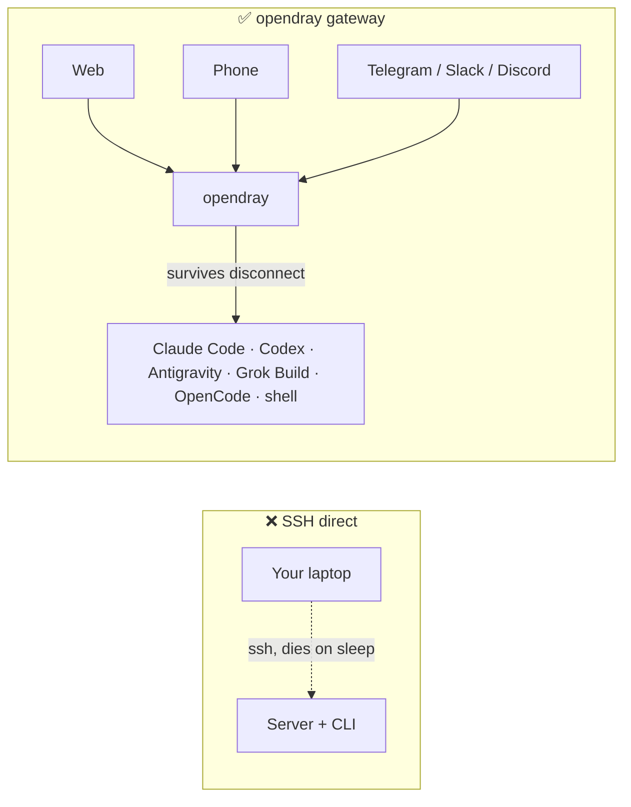
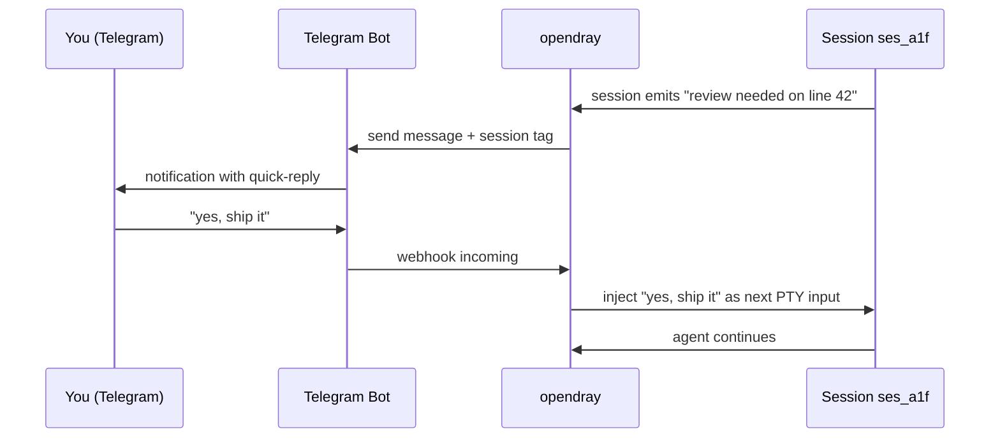
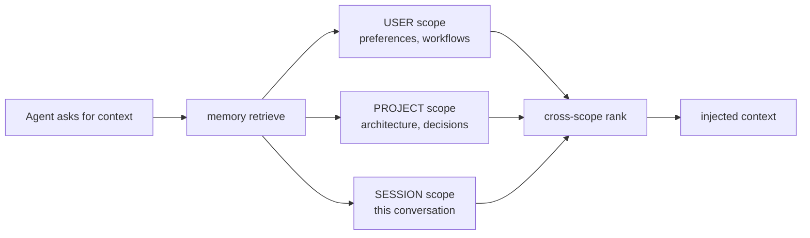
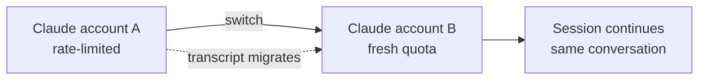
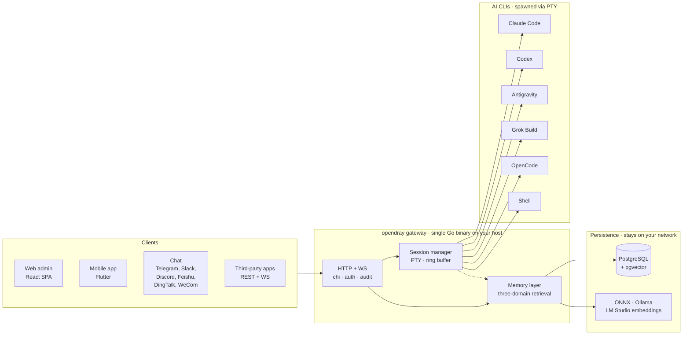

<p align="center">
  <a href="https://opendray.dev"></a>
</p>

<h1 align="center">opendray</h1>

<p align="center">
  <strong>Gateway self-hosted pour Claude Code, Codex, Antigravity, Grok Build et OpenCode. Faites tourner vos sessions d'agents sur votre propre infrastructure. Pilotez depuis le web, le mobile ou le chat.</strong>
</p>

<p align="center">
  <strong><a href="https://opendray.dev">opendray.dev</a></strong>
</p>

<p align="center">
  <a href="https://opendray.dev"></a>
  <a href="https://github.com/Opendray/opendray/releases/latest"></a>
  <a href="LICENSE"></a>
  <a href="https://github.com/Opendray/opendray/actions/workflows/ci.yml"></a>
  <a href="https://github.com/Opendray/opendray/discussions"></a>
  <br/>
  
  
  
  
</p>

<p align="center">
  🌐 <a href="README.md">English</a> · <a href="README.zh.md">简体中文</a> · <a href="README.fa.md">فارسی</a> · <a href="README.es.md">Español</a> · <a href="README.pt-BR.md">Português</a> · <a href="README.ja.md">日本語</a> · <a href="README.ko.md">한국어</a> · <strong>Français</strong> · <a href="README.de.md">Deutsch</a> · <a href="README.ru.md">Русский</a>
</p>

<p align="center">
  <a href="docs/getting-started.md"></a>
  <a href="#à-quoi-ça-ressemble"></a>
  <a href="https://opendray.dev"></a>
</p>



Faire tourner Claude Code ou Codex via SSH signifie que l'agent meurt à l'instant où votre laptop se ferme. opendray l'exécute sur un host qui reste éveillé (un Mac mini sous votre bureau, un NAS, un VPS) et vous laisse vous y rattacher depuis un admin web, une app mobile ou un message de chat. Les sessions continuent de s'exécuter, que quelqu'un soit connecté ou non. Plusieurs comptes sont mis en pool avec équilibrage par tier et bascule à chaud. Une couche mémoire local-first garde chaque embedding sur votre réseau.

---

## C'est quoi opendray ?

**opendray** enveloppe les CLI d'IA pour le code que vous utilisez déjà (Claude Code, Codex, Antigravity, Grok Build, OpenCode, plus n'importe quel shell) et les transforme en quelque chose que vous pouvez piloter depuis n'importe où. Faites tourner vos sessions sur votre home server, NAS ou VPS. Recevez une notification Telegram quand une session devient inactive. Répondez depuis votre téléphone pour renvoyer le prochain prompt. Le tout via un gateway self-hosted que vous contrôlez de bout en bout.

- 🛰 **Un backend, trois surfaces.** Un seul binaire Go qui sert un admin web React et une app mobile Flutter, avec chaque action également exposée via une API REST + WebSocket pour des intégrations tierces.
- 💬 **Six canaux bidirectionnels, pas de walled gardens.** Telegram, Slack, Discord, Feishu (飞书), DingTalk (钉钉), WeCom (企业微信), plus un adaptateur Bridge pour tout ce qui est custom. Les réponses sur n'importe quel canal sont routées vers la bonne session.
- 🧠 **Mémoire local-first.** Embeddings ONNX / Ollama / LM Studio avec recherche sur trois scopes (user, projet, session), ranking intelligent et détection des conflits entre couches. Aucune donnée vectorielle ne quitte votre réseau.
- 🔌 **API de niveau intégration.** Clés d'API scopées, audit log par appel, montages reverse-proxy. Traitez opendray comme le gateway derrière votre propre produit, ou simplement comme un centre de commande personnel.
- 🔑 **Flotte multi-comptes pour Claude, Codex et Antigravity.** Déposez plusieurs répertoires de credentials déjà loggés sur l'host ; opendray les découvre automatiquement via un filesystem watcher, répartit les nouvelles sessions entre les comptes activés, et vous laisse basculer une session en vie d'un compte à l'autre **sans perdre la conversation** (le transcript migre sous le capot). Chaque ligne de compte affiche la capacité en temps réel (subscription tier, rate-limit tier, sessions actives, dernière utilisation, email de login courant).
- 🔒 **Self-hosted, licence claire.** Apache 2.0, un binaire statique, releases signées avec cosign et SBOM SPDX. Pas de télémétrie, pas de compte cloud, pas d'abonnement.

## À quoi ça ressemble

opendray est un binaire Go qui sert un admin web sur `/admin/` et une API REST + WebSocket sur `/api/v1/*`. Voici ce qu'il fait, dans les formes que vous verriez vraiment.

### Lister les sessions en cours

```
$ opendray sessions ls
ID        PROVIDER      PROJECT              STATE     STARTED
ses_a1f   claude-code   app/web              running   2h ago
ses_b2c   codex         internal/session     idle      5m ago
ses_c9d   grok-build    docs/                running   14m ago
ses_d34   shell         misc/deploy-logs     idle      1h ago
```

### Lister les providers installés et leurs versions

```
$ opendray providers list
PROVIDER      VERSION     ACCOUNTS   ACTIVE   NOTES
claude-code   1.4.11      3          1        auto-discovered via CLAUDE_CONFIG_DIR
codex         0.29.0      2          1        openai login
antigravity   0.7.2       1          0        agy, HOME-isolated
grok-build    2.5.1       1          1        xai
opencode      0.6.3       -          0        local endpoint required
shell         -           -          1        arbitrary
```

### Se rattacher à une session depuis le navigateur et continuer après la mise en veille du laptop

L'admin web embarque xterm.js. Vous voyez le même PTY que celui sur lequel la CLI a écrit. Fermez l'onglet du navigateur et la session continue de tourner sur l'host. Rouvrez-le des heures plus tard et le transcript est là où vous l'aviez laissé.

```
[claude-code ses_a1f · app/web · 2h 14m]

> refactor the router to lazy-load the mobile view

I'll look at the current router and figure out the cleanest split.

● Read(app/web/src/router.tsx)
  ⎿ 342 lines
● Grep(pattern: "loadable", path: "app/web/src")
  ⎿ found 3 uses
...
```

### Router une réponse Telegram vers la même session



Même schéma pour Slack, Discord, Feishu, DingTalk, WeCom et n'importe quel transport passant par l'adaptateur Bridge.

### Éclater une requête mémoire sur trois scopes à la fois



Chaque scope stocke des embeddings depuis votre propre provider (ONNX embarqué, Ollama ou LM Studio). Rien ne quitte votre réseau.

### Changer de compte en pleine conversation sans perdre le transcript



Idem pour les comptes Codex et les comptes Antigravity. `Carry-context` est activé par défaut ; décochez pour repartir propre sur la nouvelle identité.

## Fonctionnalités

|  |  |
| --- | --- |
| **Sessions** | Se rattacher à une session Claude Code, Codex, Antigravity, Grok Build, OpenCode ou shell en cours depuis le web, le mobile ou un chat. Les sessions survivent à la déconnexion du client et au reboot de l'host. Overlay de transcript live pour les TUI qui ignorent l'entrée molette. |
| **Providers** | 5 CLI de coding IA de premier ordre plus le shell arbitraire. Ajouter une nouvelle CLI se fait via un descriptor JSON déposé sous `internal/catalog/builtin/`. Injection de serveur MCP par provider (Vault, mémoire, intégrations). |
| **Mémoire** | Recherche sur trois scopes (user, projet, session). Embeddings local-first via ONNX, Ollama ou LM Studio. Détection des conflits entre couches. Pages de connaissance globales injectées au spawn. Compiler flywheel qui distille les épisodes en playbooks réutilisables. |
| **Canaux** | Telegram, Slack, Discord, Feishu, DingTalk, WeCom. Adaptateur Bridge pour les transports custom. Bidirectionnel : les sessions notifient, les réponses reviennent. |
| **Intégrations** | API REST + WebSocket avec clés d'API scopées, audit log par appel, montages reverse-proxy. MCP HashiCorp Vault pour l'accès aux secrets. [`docs/integration-guide.md`](docs/integration-guide.md) publique. |
| **Ops** | Un seul binaire Go. Installeur en une ligne (Linux, macOS, WSL2). Auto-géré (`opendray update / start / stop / providers update`). Backups PostgreSQL chiffrés + exports de données. Pipeline Goreleaser avec releases signées cosign + SBOM SPDX. |
| **Sécurité** | Apache 2.0. Pas de télémétrie, pas de compte cloud. Signature keyless cosign (Sigstore). Hardening systemd `ProtectSystem=strict`. Tokens scopés multi-tenant-safe. |

## Architecture en un coup d'œil

Un seul binaire Go sur votre host orchestre l'ensemble. Les clients pilotent les sessions via HTTP/WebSocket, le session manager lance chaque AI CLI dans son propre PTY, et la couche mémoire conserve l'état partagé dans Postgres avec des vector embeddings issus de votre propre provider.



Tout ce qui apparaît dans le diagramme tourne sur votre réseau. Aucune dépendance cloud, aucune inference hors de votre contrôle.

## Comparaison

### opendray face aux clients IA connus

|  | opendray | Claude Desktop | Cursor | CLI via SSH | ChatGPT Desktop |
| --- | --- | --- | --- | --- | --- |
| La session survit à la déconnexion du client | ✅ | ❌ | ❌ | ⚠️ (tmux / screen) | ❌ |
| Pool multi-comptes avec bascule à chaud | ✅ | ❌ | ❌ | ❌ | ❌ |
| Couche mémoire inter-sessions | ✅ | ❌ | Partielle | ❌ | Partielle |
| Filesystem hôte + tool use | ✅ | Limitée | ✅ | ✅ | Limitée |
| Client mobile à parité de fonctionnalités | ✅ | ❌ | ❌ | ⚠️ (client SSH) | Partielle |
| Adaptateurs de canaux chat | ✅ (6) | ❌ | ❌ | ❌ | ❌ |
| Self-hosted | ✅ | ❌ | ❌ | ✅ | ❌ |
| Licence | Apache 2.0 | Propriétaire | Propriétaire | (variable) | Propriétaire |

### opendray face aux frontends chat self-hosted

|  | opendray | Open WebUI | LibreChat | Dify |
| --- | --- | --- | --- | --- |
| Fait tourner une vraie CLI d'agent (pas juste du chat) | ✅ | ❌ | ❌ | Partiel |
| Tool use + écritures fichiers sur l'host | ✅ | ❌ | ❌ | Sandboxé |
| Plusieurs CLI d'IA pour le code dans un seul gateway | ✅ (5) | ❌ | ❌ | ❌ |
| Mémoire inter-sessions | ✅ | Basique | Basique | ✅ |
| Session PTY avec rattachement au terminal | ✅ | ❌ | ❌ | ❌ |
| Adaptateurs de canaux chat | ✅ (6) | Partiel | Partiel | ✅ |
| Licence | Apache 2.0 | MIT | MIT | Apache 2.0 |

## À qui ça s'adresse ?

**Développeur solo avec un homelab.** Vous avez déjà un Mac mini, un NAS ou une machine Proxmox qui tourne 24/7. Vous faites tourner Claude Code via SSH mais la session meurt à chaque mise en veille du laptop. Vous voulez que la CLI continue, et pouvoir vous y rattacher depuis votre téléphone dans le train. opendray est le gateway qui met votre host entre vous et la CLI.

**Lead d'une petite équipe qui monte une infra IA partagée.** Votre équipe a 3 à 5 comptes Anthropic répartis entre plans pro et perso. Vous voulez les mettre en pool, suivre l'utilisation par compte, et laisser n'importe qui dans l'équipe piloter une session depuis le navigateur. opendray offre le pool multi-comptes, l'observabilité par compte, des clés d'API scopées par coéquipier et une app mobile installable sans passer par l'App Store.

**Intégrateur qui construit au-dessus d'un session-runner.** Vous construisez un produit qui doit spawn des sessions Claude Code, Codex ou Grok Build avec tool use, et vous ne voulez pas ré-implémenter le cycle de vie des sessions, la gestion des PTY, la mémoire ou le routing des canaux. opendray expose chaque action via REST + WebSocket avec des clés scopées, des audit logs par appel et des montages reverse-proxy. Traitez-le comme votre runtime d'agent.

## Installation

### Installeur en une ligne

**Linux / macOS / WSL2**

```sh
curl -fsSL https://raw.githubusercontent.com/Opendray/opendray/main/scripts/install.sh | bash
```

**Windows** met d'abord WSL2 en place, puis lance l'installeur Linux à l'intérieur. [détails →](scripts/README.md#windows)

```powershell
irm https://raw.githubusercontent.com/Opendray/opendray/main/scripts/install-windows.ps1 | iex
```

Déroule la mise en place de Postgres, l'installation des AI-CLI, les credentials admin et l'enregistrement du service, pour un gateway en marche en ~5 à 10 minutes. Voir [**`scripts/README.md`**](scripts/README.md) pour ce que fait l'assistant, le layout de fichiers qu'il crée, les options et le troubleshooting.

> **Vous préférez la procédure manuelle ?** Lisez [**docs/getting-started.md**](docs/getting-started.md), un guide end-to-end de 15 minutes qui reproduit ce que fait l'assistant pour que vous puissiez vérifier chaque étape vous-même.

### npm / npx (Node ≥ 18)

Installez globalement et ajoutez `opendray` au `PATH` :

```sh
npm install -g opendray
```

Ou exécutez-le à la demande sans installer :

```sh
npx opendray
```

Installe **uniquement le binaire** : pas d'assistant, pas d'enregistrement de service, pas de Postgres. Le paquet récupère le binaire de plateforme correspondant (`opendray-{linux,darwin}-{x64,arm64}`) via `optionalDependencies` (le pattern esbuild / Biome, pas de `postinstall`, pas d'appel réseau au moment de l'install). Adapté aux environnements scriptés, aux runners éphémères, ou si vous avez déjà votre propre Postgres et votre propre superviseur de process.

Vous amenez quand même une base de données et vous démarrez le gateway vous-même :

```sh
# 1. PostgreSQL 15+ with pgvector. Point a DSN at it, set an admin password.
export OPENDRAY_DATABASE_URL="postgres://opendray:pw@127.0.0.1:5432/opendray?sslmode=disable"
export OPENDRAY_ADMIN_PASSWORD="$(openssl rand -base64 24)"
# 2. Apply the schema, then run (foreground).
opendray migrate
opendray serve        # → http://127.0.0.1:8770/admin/
```

Procédure complète (setup pgvector, `config.toml`, lancer comme service systemd / launchd et mises à jour) dans [**docs/install-binary.md**](docs/install-binary.md).

### Désinstallation (Linux / macOS)

**Par défaut.** Arrête le gateway et supprime le binaire, mais **conserve** votre `config.toml`, le répertoire de données (keyfile bcrypt, sessions, notes, vault), les logs et la base PostgreSQL pour qu'une réinstallation reprenne là où vous en étiez :

```sh
curl -fsSL https://raw.githubusercontent.com/Opendray/opendray/main/scripts/uninstall.sh | bash
```

**Purge complète.** Supprime aussi la base PG et le rôle, efface config / data / logs, retire le service user. Inclut une étape de vérification post-suppression qui plante bruyamment si quelque chose a survécu :

```sh
curl -fsSL https://raw.githubusercontent.com/Opendray/opendray/main/scripts/uninstall.sh | OPENDRAY_PURGE=1 bash
```

### Commandes du quotidien

Après l'installation, le binaire `opendray` gère son propre cycle de vie, sans avoir à retenir les incantations `systemctl` / `launchctl` :

```sh
sudo opendray update --restart   # download latest release, verify SHA, atomic replace + restart
```

```sh
sudo opendray providers update   # bump installed AI CLIs (claude / codex / antigravity) to npm-latest
```

```sh
opendray providers list          # see which AI CLIs are installed + their versions
```

```sh
sudo opendray start              # start | stop | restart | status, wraps systemd / launchd
```

`opendray --help` liste l'ensemble des sous-commandes.

### Choisir son chemin de déploiement

Chaque chemin supporté inclut le spawn de session, l'accès aux AI-CLI, les backups chiffrés et l'API d'intégration complète. opendray est un gateway host-resident : il spawn les AI CLI via des PTY et partage l'état des process (`~/.claude`, ssh-agent, fichiers projet) avec eux. Ce modèle est incompatible avec l'isolation conteneur qu'imposerait Docker en production, donc Docker n'est pas un chemin de déploiement supporté pour v2.x.

| Chemin | Idéal pour | Aller à |
|---|---|---|
| 📦 **Binaire pré-construit** | « Just run it », Linux / macOS, n'importe quel superviseur | [Page des releases](https://github.com/Opendray/opendray/releases) → voir [Déploiement en production](#déploiement-en-production) |
| 🐧 **Unit systemd** | Linux bare-metal / VM / LXC | [Déploiement en production §A](#option-a--systemd-bare-metal--vm--lxc) |
| 🍎 **LaunchDaemon macOS** | Mac mini / Mac Studio en serveur maison | [Déploiement en production §C](#option-c--launchd-macos-mac-mini--studio-en-serveur-maison) |
| 🛠 **Build depuis les sources** | Dev / contribution / builds custom | [Quickstart](#quickstart-chemin-dev-en-5-minutes) plus bas |

## Quickstart (chemin dev en 5 minutes)

Pour la procédure complète avec prérequis et troubleshooting, voir [`docs/quickstart.md`](docs/quickstart.md). La version condensée pour les devs :

```bash
# 1. Have a Postgres 15+ running on 127.0.0.1:5432 with pgvector enabled
#    (apt install postgresql-16 postgresql-16-pgvector / brew install postgresql@16 pgvector).
#    Point [database].url at any other DSN if you'd rather use a remote PG.

# 2. Local config, already gitignored.
cp config.example.toml config.toml
$EDITOR config.toml          # set [database].url, [admin].password

# 3. Build the web bundle into the embed tree.
cd app/web && pnpm install && pnpm build && cd ../..

# 4. Apply schema.
go run ./cmd/opendray migrate -config config.toml

# 5. Run.
go run ./cmd/opendray serve -config config.toml
# → REST + WS:  http://127.0.0.1:8770/api/v1/...
# → Web admin:  http://127.0.0.1:8770/admin/
```

Ça fait tourner OpenDray en foreground ; Ctrl-C l'arrête. Pour un daemon
long-running, voir **Déploiement en production** plus bas.

## Déploiement en production

Quatre chemins de déploiement supportés, choisissez celui qui colle à votre environnement.
Chacun vous donne l'auto-restart en cas de crash, l'état persistant et
la séparation des secrets et du config.

### Option A : systemd (bare-metal / VM / LXC)

Le chemin de déploiement recommandé sur Linux. Embarque une unit hardenée dans
[`deploy/systemd/opendray.service`](deploy/systemd/opendray.service)
avec sandboxing (`ProtectSystem=strict`, `NoNewPrivileges`,
`MemoryDenyWriteExecute`, capability scrub), boot `migrate`-puis-`serve`,
et une fenêtre de graceful stop de 20 s.

**Récupérez d'abord un binaire.** Soit attrapez une archive pré-construite depuis la
[page des releases](https://github.com/Opendray/opendray/releases)
(`opendray_*_linux_<arch>.tar.gz`, qui se décompresse en un seul binaire `opendray`),
soit buildez depuis les sources via le [Quickstart](#quickstart-chemin-dev-en-5-minutes)
plus haut (`go build ./cmd/opendray`).

```bash
# 1. Install the binary you just grabbed (or built).
sudo install -m 0755 /path/to/opendray /usr/local/bin/opendray

# 2. Create the service user + state dir.
sudo useradd -r -s /usr/sbin/nologin -d /var/lib/opendray opendray
sudo install -d -o opendray -g opendray -m 0700 /var/lib/opendray

# 3. Drop config + secrets (root-owned; mode 0640).
sudo install -D -m 0640 config.example.toml /etc/opendray/config.toml
sudo $EDITOR /etc/opendray/config.toml             # set [database].url etc.
sudo install -D -m 0640 -o root -g opendray /dev/null /etc/opendray/env.d/secrets
sudo $EDITOR /etc/opendray/env.d/secrets           # OPENDRAY_ADMIN_PASSWORD=…

# 4. Install + enable the unit.
sudo cp deploy/systemd/opendray.service /etc/systemd/system/
sudo systemctl daemon-reload
sudo systemctl enable --now opendray

# 5. Verify.
sudo systemctl status opendray
sudo journalctl -u opendray -f --no-pager
```

L'unit lance `opendray migrate` en `ExecStartPre`, donc le premier boot
applique toutes les migrations avant que `serve` ne démarre. Les redémarrages sont
en `on-failure` avec un back-off de 5 s et une limite de 5 rafales par minute.

### Option B : Binaire direct + votre propre superviseur de process

Pour LXC sans systemd, FreeBSD `rc.d`, OpenRC ou autre chose.
Buildez une fois, lancez avec le superviseur que vous utilisez déjà :

```bash
# Cross-compile a release archive locally:
goreleaser release --clean --snapshot
ls dist/                  # opendray_*_linux_amd64.tar.gz etc.

# Or grab a published release artefact:
# https://github.com/Opendray/opendray/releases
```

Pointez ensuite votre superviseur (s6, runit, supervisord, runwhen) sur :

```
/usr/local/bin/opendray serve -config /etc/opendray/config.toml
```

Pre-flight : lancez `opendray migrate -config /etc/opendray/config.toml`
une fois avant le premier `serve`, ou en hook pre-start dans le superviseur
de votre choix.

### Option C : launchd macOS (Mac mini / Studio en serveur maison)

Pour les Mac mini / Mac Studio Apple Silicon qui tournent 24/7. Embarque un
LaunchDaemon dans
[`deploy/launchd/com.opendray.opendray.plist`](deploy/launchd/com.opendray.opendray.plist)
qui démarre au boot avant tout login utilisateur, redémarre sur crash avec
un throttle de 5 s, et log dans `/usr/local/var/log/opendray/`.

```bash
# 1. Install the darwin binary + config + state dirs.
sudo install -m 0755 ./opendray /usr/local/bin/opendray
sudo install -d -m 0755 \
  /usr/local/etc/opendray \
  /usr/local/var/lib/opendray \
  /usr/local/var/log/opendray
sudo install -m 0640 config.example.toml /usr/local/etc/opendray/config.toml
sudo $EDITOR /usr/local/etc/opendray/config.toml    # set [database].url etc.

# 2. Apply migrations once.
sudo /usr/local/bin/opendray migrate \
  -config /usr/local/etc/opendray/config.toml

# 3. Install + load the LaunchDaemon.
sudo cp deploy/launchd/com.opendray.opendray.plist /Library/LaunchDaemons/
sudo chown root:wheel /Library/LaunchDaemons/com.opendray.opendray.plist
sudo chmod 0644 /Library/LaunchDaemons/com.opendray.opendray.plist
sudo launchctl bootstrap system /Library/LaunchDaemons/com.opendray.opendray.plist

# 4. Verify.
sudo launchctl print system/com.opendray.opendray
tail -f /usr/local/var/log/opendray/opendray.log
```

Redémarrage avec `sudo launchctl kickstart -k system/com.opendray.opendray` ;
unload complet avec `sudo launchctl bootout system/com.opendray.opendray`.

Postgres sur macOS : installez via Homebrew (`brew install postgresql@17 && brew services start postgresql@17`) et pointez `[database].url` sur
`postgres://$USER@127.0.0.1:5432/opendray`. Ajoutez `pgvector` avec
`brew install pgvector` puis `CREATE EXTENSION vector` à l'intérieur de la
base opendray.

---

Pour les notes spécifiques à LXC sur Proxmox (PTY dans des conteneurs unprivileged,
networking, tweaks cgroup), voir [`deploy/lxc/proxmox-pty-notes.md`](deploy/lxc/proxmox-pty-notes.md).

Pour la terminaison reverse-proxy / TLS (nginx, Caddy, Traefik, Cloudflare
Tunnel), voir [`docs/operator-guide.md`](docs/operator-guide.md) §Topology.

### Optionnel : activer les backups DB chiffrés + les exports de données

```bash
# Master passphrase (env-only, never write into config.toml).
export OPENDRAY_BACKUP_KEY="$(openssl rand -base64 32)"
export OPENDRAY_BACKUP_ENABLED=1

# pg_dump / pg_restore must match the server's major version. On
# Apple Silicon dev machines pointing at a PG17 server:
export OPENDRAY_BACKUP_PG_DUMP_PATH=/opt/homebrew/opt/postgresql@17/bin/pg_dump
export OPENDRAY_BACKUP_PG_RESTORE_PATH=/opt/homebrew/opt/postgresql@17/bin/pg_restore
```

Redémarrez opendray ; la sidebar fait apparaître une page Backups (`/backups`)
pour les dumps PostgreSQL chiffrés + restore, et `/export` pour les
exports de données en bundle zip + import. Voir [`docs/operator-guide.md`](docs/operator-guide.md) §Backup pour le cycle complet.

Un seul binaire Go embarque tout le bundle web, donc pas de runtime Node
à l'exécution, pas de serveur de fichiers statiques séparé, pas de Caddy/nginx
nécessaire. Cloudflare Tunnel termine TLS devant `:8770`.

## Layout

```
cmd/opendray/   binary entry point
internal/       Go backend (gateway, sessions, memory, channels,
                integrations, git, search, one package per domain)
app/web/        React + Vite admin SPA (embedded in the binary)
app/mobile/     Flutter app (iOS + Android)
app/shared*/    cross-surface shared UI + i18n strings
docs/           guides: install, getting-started, integration, ops
deploy/         systemd / launchd / LXC units + install scripts
```

## Frontend web

`app/web/` construit une SPA unique dans `internal/web/dist/`, que le binaire Go
embarque et sert sur `/admin/*`. Le dev server Vite sur `:5173` proxy `/api`
vers `:8770` pour un développement avec HMR.

```bash
# dev (hot reload on the React side, separate Go server for the API)
cd app/web && pnpm dev               # http://localhost:5173
go run ./cmd/opendray serve -config ../../config.toml   # other terminal

# prod (one binary delivers everything)
cd app/web && pnpm build              # writes ../../internal/web/dist
cd ../..
go build ./cmd/opendray               # bakes dist into the binary
./opendray serve -config config.toml
```

Voir [`app/web/README.md`](app/web/README.md) pour la stack frontend
(React + Vite + Tailwind v4 + shadcn/ui + TanStack Router/Query +
Zustand + xterm.js) et les notes par milestone W.

## Application mobile

`app/mobile/` est une app Flutter pour **iOS et Android**, à parité de fonctionnalités avec l'admin web. Elle se rattache à un gateway en marche via HTTPS. Saisissez l'**URL du gateway** (`Gateway URL`) et le login admin au premier lancement et vous retrouvez les mêmes surfaces Sessions / Channels / Integrations / Memory / Git. Il n'y a pas de build App Store / Play Store, c'est voulu (self-hosted, single-tenant) : vous la compilez vous-même et la signez avec votre propre identité.

**[→ Guide de build & installation](docs/mobile-app.md).** Rendez le gateway accessible depuis le téléphone, puis sideloadez un APK Android ou installez sur iPhone via Xcode. ([les 10 langues](docs/mobile-app.md) ; basculez en haut du guide.)

## FAQ

### C'est quoi opendray ?

opendray est un gateway self-hosted qui enveloppe les CLI de coding IA que vous utilisez déjà (Claude Code, Codex, Antigravity, Grok Build, OpenCode et shell) et les transforme en sessions que vous pouvez piloter depuis un admin web, une app mobile Flutter ou six canaux de chat (Telegram, Slack, Discord, Feishu, DingTalk, WeCom). Un seul binaire Go. Apache 2.0. Votre infra, vos données, vos tokens.

### Quelles CLI d'IA opendray prend-il en charge ?

Cinq providers de premier ordre en v2.10.x : **Claude Code** (Anthropic), **Codex** (OpenAI), **Antigravity** (Google `agy`), **Grok Build** (xAI) et **OpenCode**. Plus le shell arbitraire pour tout le reste. Ajouter une nouvelle CLI se fait via un descriptor JSON sous `internal/catalog/builtin/`, sans code d'adaptateur pour les cas courants.

### En quoi opendray se distingue-t-il de Claude Desktop ou ChatGPT Desktop ?

Claude Desktop et ChatGPT Desktop sont des clients chat qui tournent sur votre laptop et meurent quand celui-ci se ferme. opendray fait tourner la vraie CLI agentique sur un host qui reste éveillé et vous laisse vous rattacher depuis n'importe où. Les sessions survivent à la déconnexion du client, à la mise en veille du laptop et aux coupures réseau. Plusieurs comptes sont mis en pool avec une bascule à chaud entre eux.

### En quoi opendray se distingue-t-il de Claude Code via SSH ?

Quatre choses que SSH ne vous donne pas : (1) la session survit à la déconnexion (pas de gymnastique `tmux` requise, même si vous pouvez toujours utiliser tmux à l'intérieur), (2) le rattachement depuis un téléphone ou un canal de chat, pas juste un terminal, (3) une couche mémoire partagée entre chaque session sur l'host, (4) un pool multi-comptes avec équilibrage par tier et bascule à chaud en pleine conversation.

### En quoi opendray se distingue-t-il d'Open WebUI, LibreChat ou Dify ?

Ce sont des frontends chat pilotant une API modèle. Ils envoient des prompts à `api.openai.com` (ou équivalent) et affichent la réponse. opendray fait tourner le vrai process CLI d'agent sur votre host, avec tool use, écritures fichiers, mémoire et serveurs MCP. Si une tâche a besoin de `Read` / `Edit` / `Bash` sur votre filesystem hôte, opendray le fait ; les frontends chat non.

### Puis-je utiliser plusieurs comptes Claude, Codex ou Antigravity ?

Oui. Déposez les répertoires de credentials déjà loggés sur l'host (Claude utilise `CLAUDE_CONFIG_DIR`, Antigravity utilise l'isolation `$HOME`) et opendray les découvre automatiquement via un filesystem watcher. Les nouvelles sessions sont réparties entre les comptes activés selon tier et capacité. Vous pouvez basculer une session en vie d'un compte à l'autre sans perdre la conversation (le transcript migre sous le capot). L'auto-failover sur rate limit conserve le contexte par défaut.

### Où sont stockées mes données ?

PostgreSQL sur votre host (amenez votre propre instance, ou utilisez celle que l'installeur bootstrappe). Les embeddings viennent de votre propre provider (ONNX embarqué, Ollama ou LM Studio). Aucune donnée vectorielle, aucun transcript, aucune entrée de mémoire ne quitte votre réseau. Pas de télémétrie. Pas de compte cloud. `opendray` n'appelle jamais la maison.

### Puis-je faire tourner ça dans Docker ?

Pas pour l'instant (v2.x). opendray spawn des CLI d'IA via des PTY et partage l'état des process de l'host (répertoires de credentials, ssh-agent, fichiers projet) avec eux. C'est incompatible avec l'isolation conteneur qu'impose Docker en production. Utilisez le binaire pré-construit avec systemd ou launchd (Linux et macOS ont tous deux un installeur en une ligne). Voir [Déploiement en production](#déploiement-en-production).

### opendray fonctionne-t-il sur un NAS, un Mac mini ou un Raspberry Pi ?

NAS : oui sur Synology / QNAP / TrueNAS-Scale (tout ce qui tourne sous Linux + Postgres). Mac mini : oui, c'est un déploiement courant (LaunchDaemon fourni). Raspberry Pi : ça fonctionne sur Pi 4 / Pi 5 mais sous-dimensionné pour des sessions concurrentes, usage hobby mono-utilisateur uniquement.

### opendray est-il gratuit ? Quelle est la licence ?

Apache 2.0. Gratuit pour toujours. Pas de tier payant, pas de télémétrie, pas de phone-home. Les sponsors sont bienvenus (voir [`.github/FUNDING.yml`](.github/FUNDING.yml)).

### Comment contribuer ?

Lisez [`CONTRIBUTING.md`](CONTRIBUTING.md) et [`CODE_OF_CONDUCT.md`](CODE_OF_CONDUCT.md). Voies concrètes : (1) traduire un README ou une page de doc dans une langue qu'on livre déjà, (2) ajouter un descriptor de provider pour une nouvelle CLI de coding IA sous `internal/catalog/builtin/`, (3) écrire un adaptateur de canal pour une plateforme de chat qu'on ne couvre pas, (4) contribuer des captures d'écran pour la doc, (5) ouvrir un bug ou une demande de feature. Les PR ont besoin de la CI verte, les traductions sont uniquement consultatives, pas de CLA.

## Documentation

- [`docs/getting-started.md`](docs/getting-started.md) : **commencez ici** si vous débutez. De zéro à votre première session en 15 minutes, installation des CLI wrappées et bootstrap Postgres compris.
- [`docs/install-binary.md`](docs/install-binary.md) : installer depuis le paquet npm ou un binaire de release (amenez votre propre Postgres) et le lancer comme service systemd / launchd.
- [`docs/quickstart.md`](docs/quickstart.md) : environnement de dev en 5 minutes (suppose que vous connaissez déjà les morceaux).
- [`docs/mobile-app.md`](docs/mobile-app.md) : compiler et installer l'app mobile Flutter ; sideloader un APK Android ou l'installer sur iPhone via Xcode, puis la pointer vers votre gateway.
- [`docs/operator-guide.md`](docs/operator-guide.md) : référence deploy + ops pour les setups quasi-production.
- [`docs/integration-guide.md`](docs/integration-guide.md) : comment écrire une intégration externe dans n'importe quel langage.
- [`VERSIONING.md`](VERSIONING.md) : stratégie de versioning (major-as-generation).
- [`CHANGELOG.md`](CHANGELOG.md) : historique des releases.

## État

Génération actuelle : **v2.10.x**. Voir [`CHANGELOG.md`](CHANGELOG.md) pour l'historique des releases et [`VERSIONING.md`](VERSIONING.md) pour la politique major-comme-génération (major = génération de produit, pas un « breaking change » strict au sens SemVer).

Cette génération embarque :

- **Assistants d'installation et de désinstallation en une ligne** (Linux + macOS ; Windows passe par WSL2). Guide l'opérateur à travers le bootstrap de Postgres, l'installation des AI-CLI, les credentials admin, l'adresse d'écoute, l'installation du binaire, la migration du schéma et l'enregistrement du service.
- **Binaire auto-géré.** `opendray update / start / stop / restart / status / providers list / providers update`, pour que les opérateurs ne touchent plus à `systemctl` / `launchctl` pour les opérations courantes.
- **Pipeline de release Goreleaser.** Binaires cross-compilés (linux/darwin × amd64/arm64), signature keyless cosign (Sigstore), SBOM SPDX, self-update vérifié atomiquement.

## Tests

```bash
go test -race ./...        # backend
cd app/web && pnpm build   # web (TS strict + vite production build)
```

Les smoke flows end-to-end sont trackés dans les messages de commit par milestone.
Un harness Playwright est prévu en follow-up.

## Lien avec la v1

v1 (`Opendray/opendray`) est le codebase legacy, désormais archivé. v2 est
la génération actuelle et active, feature-complete et la seule branche qui
reçoit du développement. Sur les 16 builtins de v1, quatre ont migré dans
le backend v2 ; le reste est devenu des features côté client, des adaptateurs
de canaux ou des consommateurs de l'API d'intégration.

## Licence

Apache 2.0. Voir [`LICENSE`](LICENSE). (v1 était sous MIT ; v2 est licenciée
indépendamment.)
