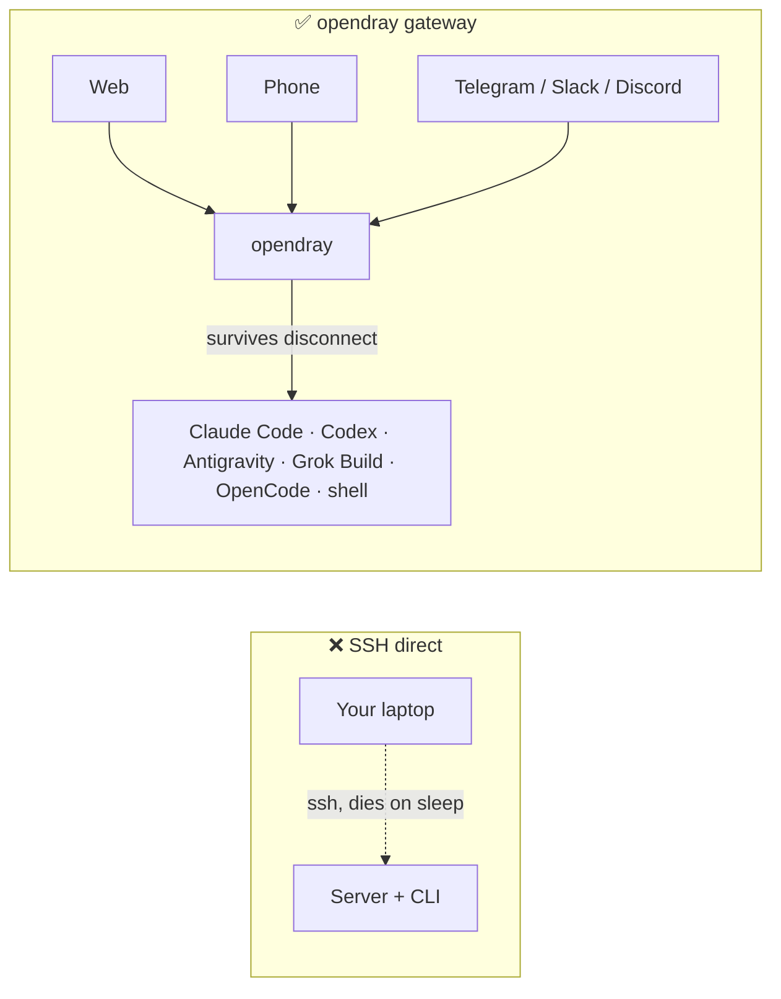
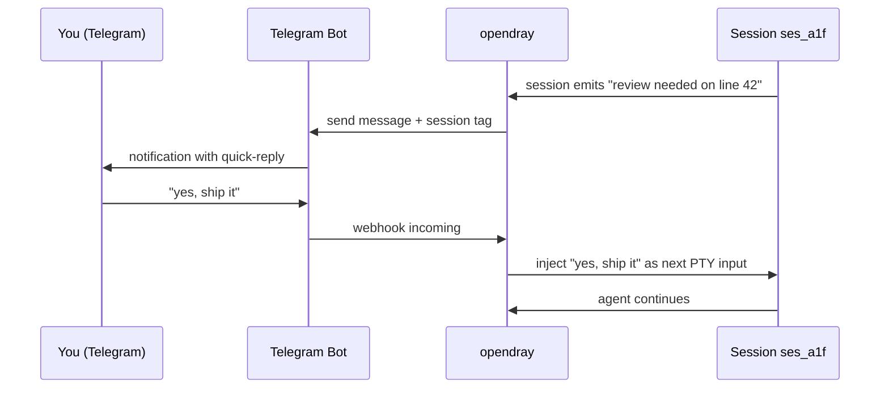
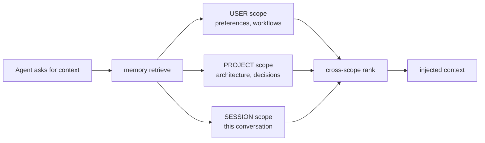
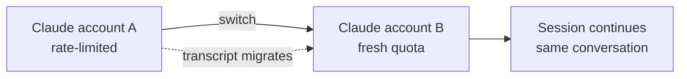
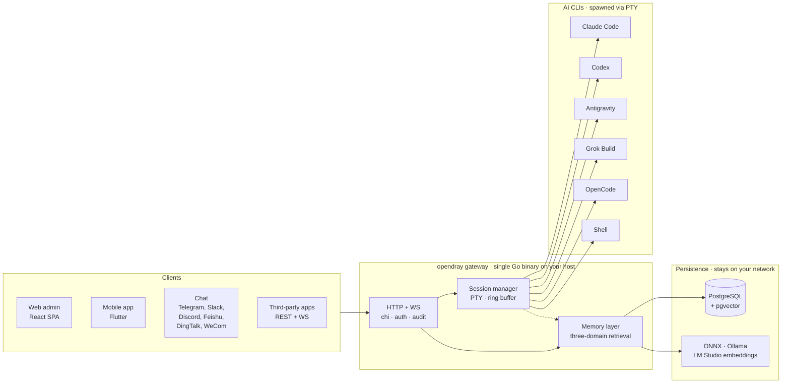

<p align="center">
  <a href="https://opendray.dev"></a>
</p>

<h1 align="center">opendray</h1>

<p align="center">
  <strong>Claude Code、Codex、Antigravity、Grok Build、OpenCode のためのセルフホスト型ゲートウェイ。エージェントのセッションを自前のインフラ上で実行し、web、モバイル、チャットから操作できます。</strong>
</p>

<p align="center">
  <strong><a href="https://opendray.dev">opendray.dev</a></strong>
</p>

<p align="center">
  <a href="https://opendray.dev"></a>
  <a href="https://github.com/Opendray/opendray/releases/latest"></a>
  <a href="LICENSE"></a>
  <a href="https://github.com/Opendray/opendray/actions/workflows/ci.yml"></a>
  <a href="https://github.com/Opendray/opendray/discussions"></a>
  <br/>
  
  
  
  
</p>

<p align="center">
  🌐 <a href="README.md">English</a> · <a href="README.zh.md">简体中文</a> · <a href="README.fa.md">فارسی</a> · <a href="README.es.md">Español</a> · <a href="README.pt-BR.md">Português</a> · <strong>日本語</strong> · <a href="README.ko.md">한국어</a> · <a href="README.fr.md">Français</a> · <a href="README.de.md">Deutsch</a> · <a href="README.ru.md">Русский</a>
</p>

<p align="center">
  <a href="docs/getting-started.md"></a>
  <a href="#how-it-looks"></a>
  <a href="https://opendray.dev"></a>
</p>



SSH 経由で Claude Code や Codex を動かすと、ノート PC を閉じた瞬間にエージェントが死んでしまいます。opendray はスリープしないホスト（机の下の Mac mini、NAS、VPS など）でそれらを実行し、web 管理画面、モバイルアプリ、あるいはチャットメッセージから再接続できるようにします。誰かが接続しているかどうかに関わらず、セッションは実行され続けます。複数のアカウントはティアごとのバランシングとライブでのアカウント切り替えとともにプールされます。ローカルファーストなメモリレイヤーが、すべてのエンベディングを自分のネットワーク内に留めます。

---

## opendray とは？

**opendray** は、あなたが普段使っている AI コーディング CLI（Claude Code、Codex、Antigravity、Grok Build、OpenCode、そして任意の shell）をラップし、どこからでも操作できるものへと変えます。セッションは自宅サーバー、NAS、VPS 上で実行し、アイドル状態になれば Telegram で通知を受け取り、スマートフォンから返信すれば次のプロンプトとしてそのまま流し込めます。すべては、エンドツーエンドで自分が管理するセルフホスト型ゲートウェイ上で完結します。

- 🛰 **1 つのバックエンド、3 つのサーフェス。** 単一の Go バイナリが React 製の web 管理画面と Flutter 製のモバイルアプリを配信し、すべての操作はサードパーティ連携用に REST + WebSocket API としても公開されます。
- 💬 **6 つの双方向チャネル、囲い込みなし。** Telegram、Slack、Discord、Feishu（飞书）、DingTalk（钉钉）、WeCom（企业微信）、さらに任意のカスタム連携用の Bridge アダプターを用意。どのチャネルから返信しても、正しいセッションへルーティングされます。
- 🧠 **ローカルファーストなメモリ。** ONNX / Ollama / LM Studio による埋め込みと、3 スコープ（user、project、session）での検索、スマートランキング、レイヤー横断の競合検出。ベクターデータが自分のネットワークの外に出ることはありません。
- 🔌 **連携向けの API。** スコープ付きの API キー、呼び出しごとの audit log、リバースプロキシマウント。opendray を自社プロダクトの裏側のゲートウェイとして使うことも、単なる個人のコマンドセンターとして使うこともできます。
- 🔑 **Claude、Codex、Antigravity 向けの複数アカウントフリート運用。** ログイン済みの認証情報ディレクトリを複数ホストへ置くだけで、opendray がファイルシステムウォッチャーで自動検出し、新規セッションを有効なアカウント間で負荷分散します。さらに、動作中のセッションを別のアカウントへ **会話を失わずに** 切り替えることも可能です（裏側でトランスクリプトを移行します）。各アカウントの行には、現在のキャパシティ（subscription tier、rate-limit tier、アクティブセッション数、最終使用日時、現在のログインメールアドレス）がライブで表示されます。
- 🔒 **セルフホスト、ライセンスも明快。** Apache 2.0、単一の静的バイナリ、cosign 署名済みリリースと SPDX SBOM 付き。テレメトリ、クラウドアカウント、サブスクリプションは一切ありません。

<a id="how-it-looks"></a>

## 実際の画面

opendray は `/admin/` で web 管理画面を、`/api/v1/*` で REST + WebSocket API を配信する Go バイナリです。実際に目にする形で、その動作を見てみましょう。

### 実行中のセッションを一覧表示

```
$ opendray sessions ls
ID        PROVIDER      PROJECT              STATE     STARTED
ses_a1f   claude-code   app/web              running   2h ago
ses_b2c   codex         internal/session     idle      5m ago
ses_c9d   grok-build    docs/                running   14m ago
ses_d34   shell         misc/deploy-logs     idle      1h ago
```

### インストール済みプロバイダーとバージョンを一覧表示

```
$ opendray providers list
PROVIDER      VERSION     ACCOUNTS   ACTIVE   NOTES
claude-code   1.4.11      3          1        auto-discovered via CLAUDE_CONFIG_DIR
codex         0.29.0      2          1        openai login
antigravity   0.7.2       1          0        agy, HOME-isolated
grok-build    2.5.1       1          1        xai
opencode      0.6.3       -          0        local endpoint required
shell         -           -          1        arbitrary
```

### ブラウザからセッションにアタッチし、ノート PC がスリープしても継続する

web 管理画面には xterm.js が組み込まれています。CLI が書き込んだのと同じ PTY がそのまま表示されます。ブラウザのタブを閉じても、セッションはホスト上で動き続けます。数時間後に再度開けば、トランスクリプトは中断した場所のままです。

```
[claude-code ses_a1f · app/web · 2h 14m]

> refactor the router to lazy-load the mobile view

I'll look at the current router and figure out the cleanest split.

● Read(app/web/src/router.tsx)
  ⎿ 342 lines
● Grep(pattern: "loadable", path: "app/web/src")
  ⎿ found 3 uses
...
```

### Telegram の返信を同じセッションへルーティングする



Slack、Discord、Feishu、DingTalk、WeCom、および任意の Bridge アダプター経由の連携でも、同じ仕組みが使われます。

### メモリクエリを 3 つのスコープへ同時にファンアウトする



各スコープは、自分のプロバイダー（同梱の ONNX、Ollama、あるいは LM Studio）から得たエンベディングを保存します。何もネットワークの外には出ません。

### 会話の途中でトランスクリプトを失わずにアカウントを切り替える



Codex アカウントや Antigravity アカウントでも同様です。`Carry-context` はデフォルトで有効になっており、新しいアカウントでまっさらな状態から始めたい場合はチェックを外してください。

## 機能

|  |  |
| --- | --- |
| **セッション** | web、モバイル、チャットから、実行中の Claude Code、Codex、Antigravity、Grok Build、OpenCode、あるいは shell のセッションにアタッチできます。セッションはクライアントの切断やホストの再起動をまたいで生き続けます。ホイール入力をスキップする TUI 向けのライブトランスクリプトオーバーレイも備えています。 |
| **プロバイダー** | 5 つのファーストクラスな AI コーディング CLI に加え、任意の shell に対応。新しい CLI の追加は `internal/catalog/builtin/` 配下に JSON ディスクリプタを置くだけです。プロバイダーごとに MCP サーバーを注入できます（Vault、メモリ、連携など）。 |
| **メモリ** | 3 スコープでの検索（user、project、session）。ONNX、Ollama、あるいは LM Studio によるローカルファーストなエンベディング。レイヤー横断の競合検出。起動時にグローバルなナレッジページを注入。Compiler flywheel がエピソードを再利用可能な playbook へと蒸留します。 |
| **チャネル** | Telegram、Slack、Discord、Feishu、DingTalk、WeCom。カスタムトランスポート向けの Bridge アダプターも用意。双方向: セッションが通知し、返信がそのまま流し込まれます。 |
| **連携** | スコープ付き API キー、呼び出しごとの audit log、リバースプロキシマウントを備えた REST + WebSocket API。シークレットアクセス用の HashiCorp Vault MCP。公開ドキュメントは [`docs/integration-guide.md`](docs/integration-guide.md)。 |
| **運用** | 単一の Go バイナリ。ワンラインインストーラー（Linux、macOS、WSL2）。自己管理型（`opendray update / start / stop / providers update`）。暗号化された PostgreSQL バックアップとデータエクスポート。cosign 署名済みリリースと SPDX SBOM を備えた Goreleaser パイプライン。 |
| **セキュリティ** | Apache 2.0。テレメトリなし、クラウドアカウントなし。cosign による keyless 署名（Sigstore）。`ProtectSystem=strict` による systemd ハードニング。マルチテナントでも安全なスコープ付きトークン。 |

## アーキテクチャ概観

1 つの Go バイナリがホスト上ですべてを動かします。クライアントは HTTP/WebSocket を通じてセッションを操作し、セッションマネージャーは各 AI CLI を独立した PTY で起動し、メモリレイヤーは共有ステートを Postgres に保存しつつ、ベクトル埋め込みは自前のプロバイダーから取得します。



図に出てくるものはすべて自前のネットワーク内で動作します。クラウド依存もなく、推論もあなたの管理下の外には出ません。

## 比較

### opendray と主要 AI クライアントの比較

|  | opendray | Claude Desktop | Cursor | SSH 経由の CLI | ChatGPT Desktop |
| --- | --- | --- | --- | --- | --- |
| クライアント切断後もセッションが継続する | ✅ | ❌ | ❌ | ⚠️（tmux / screen） | ❌ |
| ライブ切り替え可能なマルチアカウントプール | ✅ | ❌ | ❌ | ❌ | ❌ |
| セッション横断のメモリレイヤー | ✅ | ❌ | 部分的 | ❌ | 部分的 |
| ホストのファイルシステム + ツール利用 | ✅ | 限定的 | ✅ | ✅ | 限定的 |
| 機能的に同等なモバイルクライアント | ✅ | ❌ | ❌ | ⚠️（SSH クライアント） | 部分的 |
| チャットチャネルアダプター | ✅（6） | ❌ | ❌ | ❌ | ❌ |
| セルフホスト | ✅ | ❌ | ❌ | ✅ | ❌ |
| ライセンス | Apache 2.0 | Proprietary | Proprietary | (構成による) | Proprietary |

### opendray とセルフホスト型チャットフロントエンドの比較

|  | opendray | Open WebUI | LibreChat | Dify |
| --- | --- | --- | --- | --- |
| 実際のエージェント CLI を実行する（チャットだけではない） | ✅ | ❌ | ❌ | 部分的 |
| ツール利用 + ホスト上へのファイル書き込み | ✅ | ❌ | ❌ | サンドボックス化 |
| 1 つのゲートウェイで複数の AI コーディング CLI | ✅（5） | ❌ | ❌ | ❌ |
| セッション横断のメモリ | ✅ | 基本的 | 基本的 | ✅ |
| ターミナル再接続可能な PTY セッション | ✅ | ❌ | ❌ | ❌ |
| チャットチャネルアダプター | ✅（6） | 部分的 | 部分的 | ✅ |
| ライセンス | Apache 2.0 | MIT | MIT | Apache 2.0 |

## こんな方におすすめ

**ホームラボを運用しているソロ開発者。** すでに 24 時間 365 日稼働する Mac mini、NAS、あるいは Proxmox ボックスをお持ちで、SSH 経由で Claude Code を動かしているものの、ノート PC がスリープするたびにセッションが死んでしまう。CLI を動かし続けたいし、電車の中でスマートフォンから再接続したい。opendray は、あなたと CLI の間にホストを挟むゲートウェイです。

**共有 AI インフラを立ち上げる小規模チームのリーダー。** チームには、仕事用と個人用のプランにまたがる 3 から 5 個の Anthropic アカウントがある。それらをプールし、アカウントごとの利用状況を見守り、チームの誰もがブラウザからセッションを操作できるようにしたい。opendray は、マルチアカウントプーリング、アカウントごとの可観測性、チームメイトごとのスコープ付き API キー、そして App Store への申請なしにインストールできるモバイルアプリを提供します。

**セッションランナーの上にプロダクトを構築するインテグレーター。** ツール利用を伴う Claude Code、Codex、あるいは Grok Build のセッションを起動する必要があるプロダクトを作っていて、セッションのライフサイクル、PTY 処理、メモリ、チャネルルーティングを自前で再実装したくない。opendray は、スコープ付きキー、呼び出しごとの audit log、リバースプロキシマウントとともに、すべての操作を REST + WebSocket で公開します。エージェントランタイムとして扱ってください。

## インストール

### ワンライナーインストーラー

**Linux / macOS / WSL2**

```sh
curl -fsSL https://raw.githubusercontent.com/Opendray/opendray/main/scripts/install.sh | bash
```

**Windows** はまず WSL2 をセットアップしてから、その中で Linux 用インストーラーを実行します。[詳細 →](scripts/README.md#windows)

```powershell
irm https://raw.githubusercontent.com/Opendray/opendray/main/scripts/install-windows.ps1 | iex
```

Postgres のセットアップ、AI-CLI のインストール、管理者認証情報、サービス登録まで案内し、約 5 から 10 分で動作するゲートウェイが手に入ります。ウィザードの動作内容、作成されるファイルレイアウト、オプション、トラブルシューティングについては [**`scripts/README.md`**](scripts/README.md) を参照してください。

> **手動の手順を確認したい方へ。** [**docs/getting-started.md**](docs/getting-started.md) をお読みください。ウィザードと同じ手順を 15 分で一通りなぞる、エンドツーエンドのガイドです。各ステップを自分の目で確認できます。

### npm / npx (Node ≥ 18)

グローバルインストールして `opendray` を `PATH` に追加します:

```sh
npm install -g opendray
```

またはインストールせずにオンデマンドで実行します:

```sh
npx opendray
```

**バイナリだけを** インストールします。ウィザードなし、サービス登録なし、Postgres セットアップなし。パッケージは対応するプラットフォームバイナリ（`opendray-{linux,darwin}-{x64,arm64}`）を `optionalDependencies` 経由で取り込みます（esbuild / Biome と同じパターンで、`postinstall` なし、インストール時のネットワーク呼び出しもありません）。スクリプト化された環境、エフェメラルランナー、あるいはすでに自前の Postgres とプロセススーパーバイザーを運用している場合に向いています。

データベースは自分で用意し、ゲートウェイも自分で起動します:

```sh
# 1. PostgreSQL 15+ with pgvector. Point a DSN at it, set an admin password.
export OPENDRAY_DATABASE_URL="postgres://opendray:pw@127.0.0.1:5432/opendray?sslmode=disable"
export OPENDRAY_ADMIN_PASSWORD="$(openssl rand -base64 24)"
# 2. Apply the schema, then run (foreground).
opendray migrate
opendray serve        # → http://127.0.0.1:8770/admin/
```

pgvector のセットアップ、`config.toml`、systemd / launchd サービスとしての実行、更新方法など、完全なガイドは [**docs/install-binary.md**](docs/install-binary.md) を参照してください。

### アンインストール（Linux / macOS）

**デフォルト。** ゲートウェイを停止しバイナリを削除しますが、`config.toml`、データディレクトリ（bcrypt キーファイル、セッション、ノート、vault）、ログ、PostgreSQL データベースは **保持** します。再インストール時には中断したところから再開できます:

```sh
curl -fsSL https://raw.githubusercontent.com/Opendray/opendray/main/scripts/uninstall.sh | bash
```

**完全パージ。** さらに PG データベースと role を削除し、config / data / logs を消去、サービスユーザーも削除します。何か残っていれば大きな声で失敗する、削除後の検証ステップも含まれます:

```sh
curl -fsSL https://raw.githubusercontent.com/Opendray/opendray/main/scripts/uninstall.sh | OPENDRAY_PURGE=1 bash
```

### 日常運用コマンド

インストール後は、`opendray` バイナリ自身がライフサイクルを管理するため、`systemctl` / `launchctl` の呪文を覚えておく必要はありません:

```sh
sudo opendray update --restart   # download latest release, verify SHA, atomic replace + restart
```

```sh
sudo opendray providers update   # bump installed AI CLIs (claude / codex / antigravity) to npm-latest
```

```sh
opendray providers list          # see which AI CLIs are installed + their versions
```

```sh
sudo opendray start              # start | stop | restart | status, wraps systemd / launchd
```

サブコマンド一式は `opendray --help` で確認できます。

### デプロイ経路の選び方

サポートされているどの経路でも、セッションの起動、AI-CLI へのアクセス、暗号化バックアップ、連携 API 一式が利用できます。opendray はホスト常駐型のゲートウェイで、AI CLI を PTY 経由で起動し、プロセス状態（`~/.claude`、ssh-agent、プロジェクトファイル）をそれらと共有します。このモデルは本番運用での Docker が課すコンテナ隔離とは相容れないため、v2.x では Docker はサポート対象のデプロイ経路ではありません。

| 経路 | 適した用途 | 詳細 |
|---|---|---|
| 📦 **ビルド済みバイナリ** | 「とにかく動かしたい」。Linux / macOS、任意のスーパーバイザー | [リリースページ](https://github.com/Opendray/opendray/releases) → [本番環境へのデプロイ](#production-deploy) を参照 |
| 🐧 **systemd ユニット** | ベアメタル / VM / LXC の Linux マシン | [本番環境へのデプロイ §A](#option-a-systemd-bare-metal--vm--lxc) |
| 🍎 **macOS LaunchDaemon** | 自宅サーバーとして使う Mac mini / Mac Studio | [本番環境へのデプロイ §C](#option-c-macos-launchd-mac-mini--studio-as-home-server) |
| 🛠 **ソースからビルド** | 開発 / コントリビューション / カスタムビルド | 下記の [Quickstart](#quickstart-5-minute-dev-path) |

<a id="quickstart-5-minute-dev-path"></a>

## Quickstart（5 分で動かす開発用経路）

前提条件やトラブルシューティングを含む完全な手順は [`docs/quickstart.md`](docs/quickstart.md) を参照してください。凝縮した開発用経路は以下のとおりです:

```bash
# 1. Have a Postgres 15+ running on 127.0.0.1:5432 with pgvector enabled
#    (apt install postgresql-16 postgresql-16-pgvector / brew install postgresql@16 pgvector).
#    Point [database].url at any other DSN if you'd rather use a remote PG.

# 2. Local config, already gitignored.
cp config.example.toml config.toml
$EDITOR config.toml          # set [database].url, [admin].password

# 3. Build the web bundle into the embed tree.
cd app/web && pnpm install && pnpm build && cd ../..

# 4. Apply schema.
go run ./cmd/opendray migrate -config config.toml

# 5. Run.
go run ./cmd/opendray serve -config config.toml
# → REST + WS:  http://127.0.0.1:8770/api/v1/...
# → Web admin:  http://127.0.0.1:8770/admin/
```

これは OpenDray をフォアグラウンドで実行します。Ctrl-C で停止します。長時間稼働させるデーモンとして動かしたい場合は、下記の **本番環境へのデプロイ** を参照してください。

<a id="production-deploy"></a>

## 本番環境へのデプロイ

サポートされているデプロイ経路は 4 つあります。自分の環境に合うものを選んでください。
いずれの経路でも、クラッシュ時の自動再起動、永続的な状態管理、
シークレットと設定の分離が得られます。

<a id="option-a-systemd-bare-metal--vm--lxc"></a>

### Option A: systemd（ベアメタル / VM / LXC）

Linux で推奨されるデプロイ経路です。
[`deploy/systemd/opendray.service`](deploy/systemd/opendray.service)
にハードニング済みのユニットを同梱しており、サンドボックス化（`ProtectSystem=strict`、`NoNewPrivileges`、
`MemoryDenyWriteExecute`、capability の剥奪）、`migrate` のあとに `serve` を起動する流れ、
20 秒のグレースフルストップウィンドウを備えています。

**まずはバイナリを入手してください。**
[リリースページ](https://github.com/Opendray/opendray/releases)
からビルド済みのアーカイブを取得する
（`opendray_*_linux_<arch>.tar.gz`。展開すると単一の `opendray` バイナリになります）か、
上記の [Quickstart](#quickstart-5-minute-dev-path)
の手順でソースからビルドします（`go build ./cmd/opendray`）。

```bash
# 1. Install the binary you just grabbed (or built).
sudo install -m 0755 /path/to/opendray /usr/local/bin/opendray

# 2. Create the service user + state dir.
sudo useradd -r -s /usr/sbin/nologin -d /var/lib/opendray opendray
sudo install -d -o opendray -g opendray -m 0700 /var/lib/opendray

# 3. Drop config + secrets (root-owned; mode 0640).
sudo install -D -m 0640 config.example.toml /etc/opendray/config.toml
sudo $EDITOR /etc/opendray/config.toml             # set [database].url etc.
sudo install -D -m 0640 -o root -g opendray /dev/null /etc/opendray/env.d/secrets
sudo $EDITOR /etc/opendray/env.d/secrets           # OPENDRAY_ADMIN_PASSWORD=…

# 4. Install + enable the unit.
sudo cp deploy/systemd/opendray.service /etc/systemd/system/
sudo systemctl daemon-reload
sudo systemctl enable --now opendray

# 5. Verify.
sudo systemctl status opendray
sudo journalctl -u opendray -f --no-pager
```

ユニットは `ExecStartPre` として `opendray migrate` を実行するため、初回起動時に
`serve` が始まる前にすべてのマイグレーションが適用されます。再起動ポリシーは
`on-failure`、5 秒のバックオフ、1 分あたり 5 回までのバースト制限です。

### Option B: 直接バイナリ + 任意のプロセススーパーバイザー

systemd のない LXC、FreeBSD `rc.d`、OpenRC、その他何でも構いません。
ビルドは一度だけ、起動は普段使いのスーパーバイザーで行えます:

```bash
# Cross-compile a release archive locally:
goreleaser release --clean --snapshot
ls dist/                  # opendray_*_linux_amd64.tar.gz etc.

# Or grab a published release artefact:
# https://github.com/Opendray/opendray/releases
```

そして、お好みのスーパーバイザー（s6、runit、supervisord、runwhen）に以下を指し示します:

```
/usr/local/bin/opendray serve -config /etc/opendray/config.toml
```

事前準備として、初回の `serve` の前に一度だけ
`opendray migrate -config /etc/opendray/config.toml` を実行するか、
お使いのスーパーバイザーの pre-start フックとして組み込んでください。

<a id="option-c-macos-launchd-mac-mini--studio-as-home-server"></a>

### Option C: macOS launchd（自宅サーバーとしての Mac mini / Studio）

24 時間 365 日稼働させる Apple Silicon の Mac mini / Mac Studio 向けです。
[`deploy/launchd/com.opendray.opendray.plist`](deploy/launchd/com.opendray.opendray.plist)
に LaunchDaemon を同梱しており、ユーザーログインの前のブート時に起動し、
クラッシュ時は 5 秒のスロットルで再起動、ログは `/usr/local/var/log/opendray/` に出力されます。

```bash
# 1. Install the darwin binary + config + state dirs.
sudo install -m 0755 ./opendray /usr/local/bin/opendray
sudo install -d -m 0755 \
  /usr/local/etc/opendray \
  /usr/local/var/lib/opendray \
  /usr/local/var/log/opendray
sudo install -m 0640 config.example.toml /usr/local/etc/opendray/config.toml
sudo $EDITOR /usr/local/etc/opendray/config.toml    # set [database].url etc.

# 2. Apply migrations once.
sudo /usr/local/bin/opendray migrate \
  -config /usr/local/etc/opendray/config.toml

# 3. Install + load the LaunchDaemon.
sudo cp deploy/launchd/com.opendray.opendray.plist /Library/LaunchDaemons/
sudo chown root:wheel /Library/LaunchDaemons/com.opendray.opendray.plist
sudo chmod 0644 /Library/LaunchDaemons/com.opendray.opendray.plist
sudo launchctl bootstrap system /Library/LaunchDaemons/com.opendray.opendray.plist

# 4. Verify.
sudo launchctl print system/com.opendray.opendray
tail -f /usr/local/var/log/opendray/opendray.log
```

再起動は `sudo launchctl kickstart -k system/com.opendray.opendray`、
完全にアンロードするには `sudo launchctl bootout system/com.opendray.opendray` を実行します。

macOS での Postgres。Homebrew でインストールし（`brew install postgresql@17 && brew services start postgresql@17`）、`[database].url` を
`postgres://$USER@127.0.0.1:5432/opendray` に向けます。`pgvector` は
`brew install pgvector` で導入し、opendray データベース内で
`CREATE EXTENSION vector` を実行してください。

---

Proxmox 固有の LXC に関するメモ（非特権コンテナでの PTY、ネットワーク、
cgroup の調整）については、[`deploy/lxc/proxmox-pty-notes.md`](deploy/lxc/proxmox-pty-notes.md) を参照してください。

リバースプロキシ / TLS 終端（nginx、Caddy、Traefik、Cloudflare
Tunnel）については、[`docs/operator-guide.md`](docs/operator-guide.md) の §Topology を参照してください。

### オプション: 暗号化 DB バックアップとデータエクスポートを有効にする

```bash
# Master passphrase (env-only, never write into config.toml).
export OPENDRAY_BACKUP_KEY="$(openssl rand -base64 32)"
export OPENDRAY_BACKUP_ENABLED=1

# pg_dump / pg_restore must match the server's major version. On
# Apple Silicon dev machines pointing at a PG17 server:
export OPENDRAY_BACKUP_PG_DUMP_PATH=/opt/homebrew/opt/postgresql@17/bin/pg_dump
export OPENDRAY_BACKUP_PG_RESTORE_PATH=/opt/homebrew/opt/postgresql@17/bin/pg_restore
```

opendray を再起動すると、サイドバーに Backups ページ（`/backups`）が現れ、
暗号化された PostgreSQL ダンプとリストアを行えます。`/export` では
zip バンドルでのデータエクスポート / インポートが可能です。ライフサイクル全体については [`docs/operator-guide.md`](docs/operator-guide.md) の §Backup を参照してください。

単一の Go バイナリが web バンドルを丸ごと内包しているため、ランタイムに Node は
不要で、静的ファイル用の別サーバーも、Caddy / nginx も必要ありません。
TLS 終端は `:8770` の手前で Cloudflare Tunnel に任せられます。

## レイアウト

```
cmd/opendray/   binary entry point
internal/       Go backend (gateway, sessions, memory, channels,
                integrations, git, search, one package per domain)
app/web/        React + Vite admin SPA (embedded in the binary)
app/mobile/     Flutter app (iOS + Android)
app/shared*/    cross-surface shared UI + i18n strings
docs/           guides: install, getting-started, integration, ops
deploy/         systemd / launchd / LXC units + install scripts
```

## Web フロントエンド

`app/web/` は単一の SPA を `internal/web/dist/` にビルドし、Go バイナリが
それを埋め込んで `/admin/*` で配信します。Vite の開発サーバー（`:5173`）は
`/api` を `:8770` にプロキシし、HMR を効かせた開発が行えます。

```bash
# dev (hot reload on the React side, separate Go server for the API)
cd app/web && pnpm dev               # http://localhost:5173
go run ./cmd/opendray serve -config ../../config.toml   # other terminal

# prod (one binary delivers everything)
cd app/web && pnpm build              # writes ../../internal/web/dist
cd ../..
go build ./cmd/opendray               # bakes dist into the binary
./opendray serve -config config.toml
```

フロントエンドのスタック（React + Vite + Tailwind v4 + shadcn/ui + TanStack Router/Query +
Zustand + xterm.js）や、W マイルストーンごとのノートについては
[`app/web/README.md`](app/web/README.md) を参照してください。

## モバイルアプリ

`app/mobile/` は **iOS と Android** 向けの Flutter アプリで、web 管理画面と同等の機能を備えています。HTTPS 経由で稼働中のゲートウェイに接続し、初回起動時に **Gateway URL** と管理者ログインを入力すると、同じ Sessions / Channels / Integrations / Memory / Git のサーフェスがそのまま使えます。App Store / Play Store 向けのビルドは設計上あえて用意していません（セルフホスト、シングルテナント）。自分でビルドし、自分の identity で署名してください。

**[→ ビルドとインストールのガイド](docs/mobile-app.md)。** ゲートウェイをスマートフォンから到達可能にしてから、Android APK をサイドロードするか、Xcode で iPhone にインストールしてください。（[全 10 言語対応](docs/mobile-app.md)。ガイド冒頭で切り替え可能です。）

## FAQ

### opendray とは何ですか？

opendray は、あなたが普段使っている AI コーディング CLI（Claude Code、Codex、Antigravity、Grok Build、OpenCode、そして shell）をラップするセルフホスト型ゲートウェイで、web 管理画面、Flutter 製モバイルアプリ、あるいは 6 つのチャットチャネル（Telegram、Slack、Discord、Feishu、DingTalk、WeCom）から操作できるセッションへと変えます。単一の Go バイナリ。Apache 2.0。自分のインフラ、自分のデータ、自分のトークンです。

### opendray はどの AI CLI に対応していますか？

v2.10.x 時点で、5 つのファーストクラスなプロバイダーに対応しています。**Claude Code**（Anthropic）、**Codex**（OpenAI）、**Antigravity**（Google の `agy`）、**Grok Build**（xAI）、そして **OpenCode** です。それ以外は任意の shell で対応できます。新しい CLI の追加は `internal/catalog/builtin/` 配下の JSON ディスクリプタで済み、一般的なケースであればアダプターコードは不要です。

### opendray は Claude Desktop や ChatGPT Desktop とどう違いますか？

Claude Desktop や ChatGPT Desktop は、ノート PC 上で動くチャットクライアントで、ノート PC を閉じると終了してしまいます。opendray は、スリープしないホスト上で実際のエージェント CLI を実行し、どこからでも再接続できるようにします。セッションはクライアントの切断、ノート PC のスリープ、ネットワークの切断をまたいで生き続けます。複数のアカウントはプールされ、ライブで切り替えられます。

### opendray は SSH 経由で Claude Code を動かす場合とどう違いますか？

SSH では得られない 4 つのことがあります。(1) 切断してもセッションが継続する（`tmux` を駆使する必要はありません。中で使うこと自体は可能です）、(2) ターミナルだけでなく、スマートフォンやチャットチャネルからもアタッチできる、(3) ホスト上のすべてのセッションで共有されるメモリレイヤー、(4) ティアごとのバランシングと、会話の途中でのライブアカウント切り替えに対応したマルチアカウントプール。

### opendray は Open WebUI、LibreChat、Dify とどう違いますか？

それらはモデル API に対するチャットフロントエンドです。プロンプトを `api.openai.com`（あるいは同様の API）へ送り、レスポンスを表示するだけです。opendray は、ツール利用、ファイル書き込み、メモリ、MCP サーバーを備えた実際のエージェント CLI プロセスをホスト上で実行します。タスクがホストのファイルシステムに対する `Read` / `Edit` / `Bash` を必要とする場合、opendray はそれを実行できますが、チャットフロントエンドにはできません。

### 複数の Claude、Codex、あるいは Antigravity のアカウントを使えますか？

はい。ログイン済みの認証情報ディレクトリをホストに置くだけです（Claude は `CLAUDE_CONFIG_DIR`、Antigravity は `$HOME` の分離を使います）。opendray はファイルシステムウォッチャーでそれらを自動検出します。新規セッションは、ティアとキャパシティに応じて有効なアカウント間でバランスされます。動作中のセッションを、会話を失うことなく別のアカウントへ切り替えることもできます（裏側でトランスクリプトを移行します）。レート制限時の自動フェイルオーバーは、デフォルトでコンテキストを引き継ぎます。

### データはどこに保存されますか？

自分のホスト上の PostgreSQL に保存されます（既存のインスタンスを使うことも、インストーラーがブートストラップするものを使うこともできます）。エンベディングは自分のプロバイダー（同梱の ONNX、Ollama、あるいは LM Studio）から得られます。ベクターデータ、トランスクリプト、メモリエントリのいずれも、ネットワークの外に出ることはありません。テレメトリなし。クラウドアカウントなし。`opendray` が外部へ通信することは一切ありません。

### Docker で実行できますか？

現時点（v2.x）ではできません。opendray は AI CLI を PTY 経由で起動し、ホストのプロセス状態（認証情報ディレクトリ、ssh-agent、プロジェクトファイル）をそれらと共有します。これは、本番運用での Docker が課すコンテナ隔離とは相容れません。ビルド済みバイナリと systemd または launchd を使ってください（Linux、macOS ともにワンラインインストーラーがあります）。[本番環境へのデプロイ](#production-deploy) を参照してください。

### opendray は NAS、Mac mini、Raspberry Pi で動きますか？

NAS: Synology、QNAP、TrueNAS-Scale（Linux と Postgres が動くもの全般）で動作します。Mac mini: よくあるデプロイ先です（LaunchDaemon を同梱）。Raspberry Pi: Pi 4 / Pi 5 で動作しますが、並行セッションに対しては非力です。1 人用の趣味利用に留めてください。

### opendray は無料ですか？ライセンスは何ですか？

Apache 2.0 です。永久に無料です。有料ティアなし、テレメトリなし、外部通信なし。スポンサーも歓迎しています（[`.github/FUNDING.yml`](.github/FUNDING.yml) を参照）。

### どうすればコントリビュートできますか？

[`CONTRIBUTING.md`](CONTRIBUTING.md) と [`CODE_OF_CONDUCT.md`](CODE_OF_CONDUCT.md) をお読みください。具体的な貢献の方法としては、(1) すでに提供している言語へ README やドキュメントページを翻訳する、(2) `internal/catalog/builtin/` 配下に新しい AI コーディング CLI 向けのプロバイダーディスクリプタを追加する、(3) まだ対応していないチャットプラットフォーム向けのチャネルアダプターを書く、(4) ドキュメント用のスクリーンショットを提供する、(5) バグ報告や機能要望を投稿する、などがあります。PR は CI が green である必要があります。翻訳はあくまで参考情報として扱われます。CLA は不要です。

## ドキュメント

- [`docs/getting-started.md`](docs/getting-started.md): 初めての方は **まずここから**。ラップ対象の CLI のインストールや Postgres のブートストラップも含めて、ゼロから最初のセッションまでを 15 分で。
- [`docs/install-binary.md`](docs/install-binary.md): npm パッケージまたはリリースバイナリからインストールし（Postgres は自分で用意）、systemd / launchd サービスとして実行する。
- [`docs/quickstart.md`](docs/quickstart.md): 5 分で動かす開発環境（構成要素は既に把握している前提）。
- [`docs/mobile-app.md`](docs/mobile-app.md): Flutter モバイルアプリのビルドとインストール。Android APK をサイドロードするか Xcode で iPhone に入れ、ゲートウェイに向ける。
- [`docs/operator-guide.md`](docs/operator-guide.md): 本番寄りの構成向けのデプロイ + 運用リファレンス。
- [`docs/integration-guide.md`](docs/integration-guide.md): 任意の言語で外部連携を書くためのガイド。
- [`VERSIONING.md`](VERSIONING.md): バージョニング戦略（major-as-generation）。
- [`CHANGELOG.md`](CHANGELOG.md): リリース履歴。

## ステータス

現行世代: **v2.10.x**。リリース履歴については [`CHANGELOG.md`](CHANGELOG.md) を、major-as-generation 方針（major = 製品世代であり、厳密な SemVer の意味での「破壊的変更」ではない）については [`VERSIONING.md`](VERSIONING.md) を参照してください。

この世代で提供される主な内容:

- **ワンラインのインストーラー / アンインストーラーウィザード**（Linux + macOS、Windows は WSL2 経由）。Postgres のブートストラップ、AI-CLI のインストール、管理者認証情報、待ち受けアドレス、バイナリのインストール、スキーママイグレーション、サービス登録まで、オペレーターを順を追って案内します。
- **自己管理型バイナリ。** `opendray update / start / stop / restart / status / providers list / providers update` により、日常運用で `systemctl` / `launchctl` に触れる必要はありません。
- **Goreleaser によるリリースパイプライン。** クロスコンパイル済みバイナリ（linux/darwin × amd64/arm64）、cosign による keyless 署名（Sigstore）、SPDX SBOM、アトミックに検証されるセルフアップデート。

## テスト

```bash
go test -race ./...        # backend
cd app/web && pnpm build   # web (TS strict + vite production build)
```

エンドツーエンドのスモークフローは、マイルストーンごとのコミットメッセージで管理しています。
Playwright によるハーネスは今後の対応として予定されています。

## v1 との関係

v1（`Opendray/opendray`）は既にアーカイブされたレガシーコードベースです。v2 は
現行かつアクティブな世代で、feature-complete であり、開発が継続しているのは
このブランチだけです。v1 の 16 個のビルトインのうち、4 つが v2 のバックエンドへ
移行し、残りはクライアント側の機能、チャネルアダプター、あるいは連携 API の
利用側へと姿を変えています。

## ライセンス

Apache 2.0。詳細は [`LICENSE`](LICENSE) を参照してください。（v1 は MIT でしたが、
v2 は独立してライセンスされています。）
