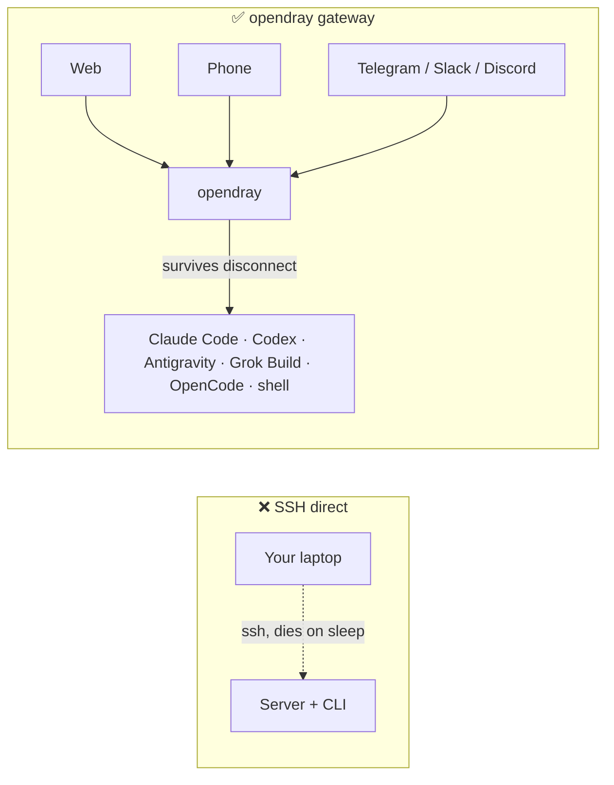
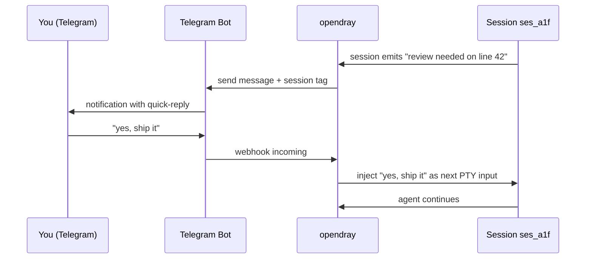
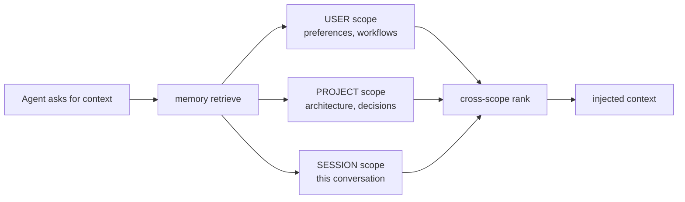
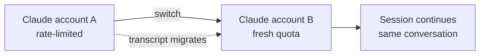
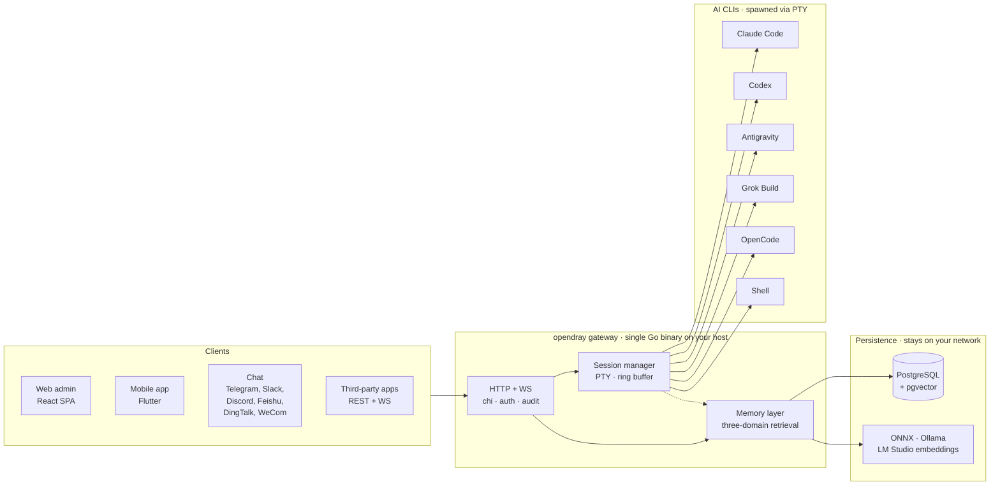

<p align="center">
  <a href="https://opendray.dev"></a>
</p>

<h1 align="center">opendray</h1>

<p align="center">
  <strong>Claude Code, Codex, Antigravity, Grok Build, OpenCode를 위한 self-hosted 게이트웨이입니다. 에이전트 세션을 본인 인프라에서 실행하세요. 웹, 모바일, 채팅 어디서든 제어하세요.</strong>
</p>

<p align="center">
  <strong><a href="https://opendray.dev">opendray.dev</a></strong>
</p>

<p align="center">
  <a href="https://opendray.dev"></a>
  <a href="https://github.com/Opendray/opendray/releases/latest"></a>
  <a href="LICENSE"></a>
  <a href="https://github.com/Opendray/opendray/actions/workflows/ci.yml"></a>
  <a href="https://github.com/Opendray/opendray/discussions"></a>
  <br/>
  
  
  
  
</p>

<p align="center">
  🌐 <a href="README.md">English</a> · <a href="README.zh.md">简体中文</a> · <a href="README.fa.md">فارسی</a> · <a href="README.es.md">Español</a> · <a href="README.pt-BR.md">Português</a> · <a href="README.ja.md">日本語</a> · <strong>한국어</strong> · <a href="README.fr.md">Français</a> · <a href="README.de.md">Deutsch</a> · <a href="README.ru.md">Русский</a>
</p>

<p align="center">
  <a href="docs/getting-started.md"></a>
  <a href="#how-it-looks"></a>
  <a href="https://opendray.dev"></a>
</p>



SSH로 Claude Code나 Codex를 실행하면, 노트북을 닫는 순간 에이전트가 죽어버립니다. opendray는 잠들지 않는 호스트(책상 아래 Mac mini, NAS, VPS)에서 에이전트를 실행하고, 웹 admin, 모바일 앱, 또는 채팅 메시지로 다시 접속할 수 있게 해줍니다. 누가 연결되어 있든 없든 세션은 계속 실행됩니다. 여러 계정은 티어별 밸런싱과 실시간 계정 전환을 갖춘 풀로 묶입니다. Local-first 메모리 레이어는 모든 임베딩을 본인의 네트워크 안에 붙잡아 둡니다.

---

## opendray란?

**opendray**는 이미 사용 중인 AI 코딩 CLI들(Claude Code, Codex, Antigravity, Grok Build, OpenCode, 그리고 임의의 shell)을 감싸서, 어디서든 제어할 수 있는 형태로 바꿔 줍니다. 홈 서버, NAS, VPS에서 세션을 실행하세요. 세션이 idle 상태가 되면 Telegram으로 알림을 받으세요. 휴대폰에서 답장을 보내 다음 prompt를 그대로 흘려 넣으세요. 이 모든 과정은 처음부터 끝까지 본인이 통제하는 self-hosted 게이트웨이 위에서 이뤄집니다.

- 🛰 **하나의 backend, 세 가지 표면.** 단일 Go 바이너리가 React 웹 admin과 Flutter 모바일 앱을 함께 서빙하며, 모든 동작은 서드파티 통합을 위해 REST + WebSocket API로도 노출됩니다.
- 💬 **6개의 양방향 채널, 닫힌 정원 없음.** Telegram, Slack, Discord, Feishu (飞书), DingTalk (钉钉), WeCom (企业微信), 그리고 커스텀 용도를 위한 Bridge 어댑터. 어느 채널에서 답장을 보내든 알맞은 세션으로 다시 라우팅됩니다.
- 🧠 **Local-first 메모리.** ONNX / Ollama / LM Studio 임베딩 기반에 3개 스코프 검색(사용자, 프로젝트, 세션), 스마트 랭킹, 레이어 간 충돌 감지까지 갖췄습니다. 벡터 데이터는 네트워크 밖으로 나가지 않습니다.
- 🔌 **통합 등급 API.** 스코프가 지정된 API 키, 호출 단위 audit log, reverse-proxy 마운트를 지원합니다. opendray를 자체 제품의 뒤를 받치는 게이트웨이로 쓰든, 개인용 command centre로 쓰든 자유입니다.
- 🔑 **Claude, Codex, Antigravity를 위한 Multi-account 플릿.** 로그인된 자격증명 디렉터리를 호스트에 여러 개 넣어두면, opendray가 파일시스템 워처로 자동 감지하고 활성화된 계정들 사이에서 새 세션을 균형 있게 분배합니다. 실행 중인 세션을 **대화 흐름을 잃지 않고** 다른 계정으로 전환할 수도 있습니다(transcript가 내부적으로 마이그레이션됩니다). 각 계정 행에는 현재 capacity(subscription tier, rate-limit tier, 활성 세션 수, 마지막 사용 시각, 현재 로그인 이메일)가 실시간으로 표시됩니다.
- 🔒 **Self-hosted, 명확한 라이선스.** Apache 2.0, 단일 정적 바이너리, cosign 서명된 release와 SPDX SBOM을 제공합니다. 텔레메트리 없음, 클라우드 계정 없음, 구독 없음.

<a id="how-it-looks"></a>

## 실제 모습

opendray는 `/admin/`에서 웹 admin을, `/api/v1/*`에서 REST + WebSocket API를 서빙하는 Go 바이너리입니다. 실제로 마주치게 될 모습으로 무엇을 하는지 보여드립니다.

### 실행 중인 세션 목록 보기

```
$ opendray sessions ls
ID        PROVIDER      PROJECT              STATE     STARTED
ses_a1f   claude-code   app/web              running   2h ago
ses_b2c   codex         internal/session     idle      5m ago
ses_c9d   grok-build    docs/                running   14m ago
ses_d34   shell         misc/deploy-logs     idle      1h ago
```

### 설치된 프로바이더와 버전 목록 보기

```
$ opendray providers list
PROVIDER      VERSION     ACCOUNTS   ACTIVE   NOTES
claude-code   1.4.11      3          1        auto-discovered via CLAUDE_CONFIG_DIR
codex         0.29.0      2          1        openai login
antigravity   0.7.2       1          0        agy, HOME-isolated
grok-build    2.5.1       1          1        xai
opencode      0.6.3       -          0        local endpoint required
shell         -           -          1        arbitrary
```

### 브라우저에서 세션에 연결하고, 노트북이 잠들어도 계속 이어가기

웹 admin에는 xterm.js가 내장되어 있습니다. CLI가 기록한 것과 동일한 PTY 화면을 그대로 보게 됩니다. 브라우저 탭을 닫아도 세션은 호스트에서 계속 실행됩니다. 몇 시간 뒤에 다시 열어도 트랜스크립트는 멈췄던 그 지점에 그대로 있습니다.

```
[claude-code ses_a1f · app/web · 2h 14m]

> refactor the router to lazy-load the mobile view

I'll look at the current router and figure out the cleanest split.

● Read(app/web/src/router.tsx)
  ⎿ 342 lines
● Grep(pattern: "loadable", path: "app/web/src")
  ⎿ found 3 uses
...
```

### Telegram 답장을 같은 세션으로 라우팅하기



Slack, Discord, Feishu, DingTalk, WeCom, 그리고 Bridge 어댑터를 통한 모든 전송 방식에서도 동일한 흐름입니다.

### 하나의 메모리 쿼리를 세 스코프로 동시에 팬아웃하기



각 스코프는 사용자가 선택한 프로바이더(ONNX 번들, Ollama, 또는 LM Studio)에서 나온 임베딩을 저장합니다. 어떤 것도 네트워크 밖으로 나가지 않습니다.

### 대화 도중 트랜스크립트 손실 없이 계정 전환하기



Codex 계정과 Antigravity 계정도 동일합니다. `Carry-context`는 기본적으로 켜져 있으며, 체크를 해제하면 새 계정에서 깨끗한 상태로 시작합니다.

## 기능

|  |  |
| --- | --- |
| **세션** | 웹, 모바일, 채팅 어디서든 실행 중인 Claude Code, Codex, Antigravity, Grok Build, OpenCode, 또는 shell 세션에 연결하세요. 세션은 클라이언트 연결 해제와 호스트 재부팅에도 살아남습니다. 휠 입력을 건너뛰는 TUI를 위한 실시간 트랜스크립트 오버레이를 제공합니다. |
| **프로바이더** | 5개의 first-class AI 코딩 CLI에 임의의 shell까지 더했습니다. 새 CLI 추가는 `internal/catalog/builtin/` 아래에 JSON descriptor 하나를 넣으면 끝입니다. 프로바이더별 MCP 서버 주입(Vault, memory, 통합)을 지원합니다. |
| **메모리** | 3개 스코프 검색(사용자, 프로젝트, 세션). ONNX, Ollama, LM Studio를 통한 local-first 임베딩. 레이어 간 충돌 감지. spawn 시점에 주입되는 글로벌 지식 페이지. Compiler flywheel이 에피소드를 재사용 가능한 playbook으로 압축합니다. |
| **채널** | Telegram, Slack, Discord, Feishu, DingTalk, WeCom. 커스텀 전송을 위한 Bridge 어댑터. 양방향: 세션이 알리고, 답장이 다시 흘러 들어갑니다. |
| **통합** | 스코프가 지정된 API 키, 호출 단위 audit log, reverse-proxy 마운트를 갖춘 REST + WebSocket API. 시크릿 접근을 위한 HashiCorp Vault MCP. 공개 문서 [`docs/integration-guide.md`](docs/integration-guide.md). |
| **운영** | 단일 Go 바이너리. 원라인 설치 스크립트(Linux, macOS, WSL2). 자기 관리형(`opendray update / start / stop / providers update`). 암호화된 PostgreSQL 백업 + 데이터 export. cosign 서명 release와 SPDX SBOM을 갖춘 Goreleaser 파이프라인. |
| **보안** | Apache 2.0. 텔레메트리 없음, 클라우드 계정 없음. Cosign keyless(Sigstore) 서명. `ProtectSystem=strict` systemd hardening. 멀티테넌트에 안전한 scoped 토큰. |

## 한눈에 보는 아키텍처

하나의 Go 바이너리가 호스트에서 모든 것을 처리합니다. 클라이언트는 HTTP/WebSocket을 통해 세션을 제어하고, 세션 매니저는 각 AI CLI를 독립된 PTY에서 실행하며, 메모리 레이어는 공유 상태를 Postgres에 저장하고 벡터 임베딩은 사용자가 선택한 프로바이더에서 가져옵니다.



다이어그램의 모든 요소는 사용자 네트워크 안에서 동작합니다. 클라우드 의존성 없음, 네트워크 밖 추론 없음.

## 비교

### opendray vs 잘 알려진 AI 클라이언트

|  | opendray | Claude Desktop | Cursor | CLI over SSH | ChatGPT Desktop |
| --- | --- | --- | --- | --- | --- |
| 세션이 클라이언트 연결 해제에도 살아남음 | ✅ | ❌ | ❌ | ⚠️ (tmux / screen) | ❌ |
| 실시간 전환이 가능한 멀티계정 풀 | ✅ | ❌ | ❌ | ❌ | ❌ |
| 세션 간 메모리 레이어 | ✅ | ❌ | 부분 지원 | ❌ | 부분 지원 |
| 호스트 파일시스템 + 도구 사용 | ✅ | 제한적 | ✅ | ✅ | 제한적 |
| 기능이 동일한 모바일 클라이언트 | ✅ | ❌ | ❌ | ⚠️ (SSH client) | 부분 지원 |
| 채팅 채널 어댑터 | ✅ (6) | ❌ | ❌ | ❌ | ❌ |
| Self-hosted | ✅ | ❌ | ❌ | ✅ | ❌ |
| 라이선스 | Apache 2.0 | Proprietary | Proprietary | (다양함) | Proprietary |

### opendray vs self-hosted 채팅 프론트엔드

|  | opendray | Open WebUI | LibreChat | Dify |
| --- | --- | --- | --- | --- |
| 실제 에이전트 CLI 실행(단순 채팅이 아님) | ✅ | ❌ | ❌ | 부분 지원 |
| 호스트에서의 도구 사용 + 파일 쓰기 | ✅ | ❌ | ❌ | 샌드박스 |
| 하나의 게이트웨이에서 여러 AI 코딩 CLI 지원 | ✅ (5) | ❌ | ❌ | ❌ |
| 세션 간 메모리 | ✅ | 기본 수준 | 기본 수준 | ✅ |
| 터미널 재연결이 가능한 PTY 세션 | ✅ | ❌ | ❌ | ❌ |
| 채팅 채널 어댑터 | ✅ (6) | 부분 지원 | 부분 지원 | ✅ |
| 라이선스 | Apache 2.0 | MIT | MIT | Apache 2.0 |

## 누구를 위한 도구인가요?

**홈랩을 운영하는 1인 개발자.** 이미 24시간 돌아가는 Mac mini, NAS, 또는 Proxmox 박스를 가지고 계실 겁니다. SSH로 Claude Code를 돌려왔지만 노트북이 잠들 때마다 세션이 죽어버립니다. CLI가 계속 돌아가길 바라고, 지하철에서 휴대폰으로 다시 접속하고 싶으실 겁니다. opendray는 본인과 CLI 사이에 자신의 호스트를 끼워 넣는 게이트웨이입니다.

**공용 AI 인프라를 구축하는 소규모 팀 리드.** 팀에 업무용과 개인용 플랜에 흩어진 3~5개의 Anthropic 계정이 있다면, 이들을 하나로 모으고 계정별 사용량을 지켜보면서 팀 누구나 브라우저에서 세션을 다룰 수 있게 하고 싶으실 겁니다. opendray는 멀티계정 풀링, 계정별 observability, 팀원마다 부여되는 scoped API 키, 그리고 App Store 심사 없이 설치할 수 있는 모바일 앱을 제공합니다.

**세션 러너 위에 제품을 쌓는 통합 개발자.** 도구 사용이 가능한 Claude Code, Codex, Grok Build 세션을 spawn해야 하는 제품을 만들고 있지만, 세션 라이프사이클, PTY 처리, 메모리, 채널 라우팅을 직접 구현하고 싶지는 않으실 겁니다. opendray는 모든 동작을 scoped 키, 호출 단위 audit log, reverse-proxy 마운트와 함께 REST + WebSocket으로 노출합니다. opendray를 본인의 에이전트 런타임으로 다루시면 됩니다.

## 설치

### 원라인 설치 스크립트

**Linux / macOS / WSL2**

```sh
curl -fsSL https://raw.githubusercontent.com/Opendray/opendray/main/scripts/install.sh | bash
```

**Windows.** 먼저 WSL2를 세팅한 다음 그 안에서 Linux용 설치 스크립트를 실행합니다. [상세 →](scripts/README.md#windows)

```powershell
irm https://raw.githubusercontent.com/Opendray/opendray/main/scripts/install-windows.ps1 | iex
```

Postgres 설정, AI-CLI 설치, 어드민 자격증명, 서비스 등록까지 차례로 진행하며, 약 5~10분이면 게이트웨이가 떠 있는 상태가 됩니다. 마법사가 무엇을 하는지, 어떤 파일 레이아웃을 만드는지, 옵션과 트러블슈팅은 [**`scripts/README.md`**](scripts/README.md)를 참고하세요.

> **수동 절차로 진행하고 싶다면?** [**docs/getting-started.md**](docs/getting-started.md)를 읽어보세요. 마법사가 하는 일을 그대로 풀어 놓은 15분짜리 엔드투엔드 가이드라서 각 단계를 직접 검증할 수 있습니다.

### npm / npx (Node ≥ 18)

전역으로 설치하고 `opendray`를 `PATH`에 추가:

```sh
npm install -g opendray
```

또는 설치 없이 필요할 때 실행:

```sh
npx opendray
```

**바이너리만** 설치됩니다. 마법사 없음, 서비스 등록 없음, Postgres 설정 없음. 패키지는 `optionalDependencies`를 통해 해당 플랫폼 바이너리(`opendray-{linux,darwin}-{x64,arm64}`)를 가져옵니다(esbuild / Biome와 동일한 패턴이며, `postinstall` 없음, 설치 시 네트워크 호출 없음). 스크립트 환경, 일회성 러너, 또는 이미 자체 Postgres와 프로세스 supervisor를 운영 중인 경우에 유용합니다.

데이터베이스와 게이트웨이 시작은 직접 해야 합니다:

```sh
# 1. PostgreSQL 15+ with pgvector. Point a DSN at it, set an admin password.
export OPENDRAY_DATABASE_URL="postgres://opendray:pw@127.0.0.1:5432/opendray?sslmode=disable"
export OPENDRAY_ADMIN_PASSWORD="$(openssl rand -base64 24)"
# 2. Apply the schema, then run (foreground).
opendray migrate
opendray serve        # → http://127.0.0.1:8770/admin/
```

전체 안내(pgvector 설정, `config.toml`, systemd / launchd 서비스로 실행, 업데이트 방법)는 [**docs/install-binary.ko.md**](docs/install-binary.ko.md)에서 확인할 수 있습니다.

### 제거 (Linux / macOS)

**기본.** 게이트웨이를 중지하고 바이너리를 제거하지만, `config.toml`, 데이터 디렉터리(bcrypt 키파일, 세션, 노트, vault), 로그, PostgreSQL 데이터베이스는 **그대로 유지**합니다. 다시 설치하면 멈췄던 지점에서 이어집니다:

```sh
curl -fsSL https://raw.githubusercontent.com/Opendray/opendray/main/scripts/uninstall.sh | bash
```

**완전 삭제.** PG 데이터베이스와 role까지 drop하고, config / data / logs를 지우며, 서비스 사용자도 제거합니다. 삭제 후에 무엇이라도 살아 있으면 시끄럽게 실패하는 검증 단계가 포함되어 있습니다:

```sh
curl -fsSL https://raw.githubusercontent.com/Opendray/opendray/main/scripts/uninstall.sh | OPENDRAY_PURGE=1 bash
```

### 일상 운영 명령어

설치 후에는 `opendray` 바이너리가 자기 라이프사이클을 직접 다룹니다. `systemctl` / `launchctl` 주문을 외울 필요가 없습니다:

```sh
sudo opendray update --restart   # download latest release, verify SHA, atomic replace + restart
```

```sh
sudo opendray providers update   # bump installed AI CLIs (claude / codex / antigravity) to npm-latest
```

```sh
opendray providers list          # see which AI CLIs are installed + their versions
```

```sh
sudo opendray start              # start | stop | restart | status, wraps systemd / launchd
```

`opendray --help`로 전체 서브커맨드 목록을 볼 수 있습니다.

### Deploy 경로 선택기

지원되는 모든 경로는 세션 spawn, AI-CLI 접근, 암호화 백업, 통합 API 전체를 포함합니다. opendray는 호스트에 상주하는 게이트웨이로, PTY를 통해 AI CLI를 spawn하고, 그들과 프로세스 상태(`~/.claude`, ssh-agent, 프로젝트 파일)를 공유합니다. 이 모델은 프로덕션 Docker가 강제하는 컨테이너 격리와 맞지 않기 때문에, v2.x에서는 Docker가 지원되는 deploy 경로가 아닙니다.

| 경로 | 추천 대상 | 이동 |
|---|---|---|
| 📦 **사전 빌드 바이너리** | "그냥 실행"(Linux / macOS, 임의의 supervisor) | [Releases page](https://github.com/Opendray/opendray/releases) → [프로덕션 deploy](#production-deploy) 참고 |
| 🐧 **systemd 유닛** | 베어메탈 / VM / LXC Linux 박스 | [프로덕션 deploy §A](#option-a--systemd-bare-metal--vm--lxc) |
| 🍎 **macOS LaunchDaemon** | 홈 서버용 Mac mini / Mac Studio | [프로덕션 deploy §C](#option-c--macos-launchd-mac-mini--studio-as-home-server) |
| 🛠 **소스에서 빌드** | 개발 / 기여 / 커스텀 빌드 | 아래의 [Quickstart](#quickstart-5-minute-dev-path) |

<a id="quickstart-5-minute-dev-path"></a>

## Quickstart (5분 개발 경로)

사전 준비물과 트러블슈팅이 포함된 전체 가이드는 [`docs/quickstart.md`](docs/quickstart.md)를 참고하세요. 압축된 개발 경로는 다음과 같습니다:

```bash
# 1. Have a Postgres 15+ running on 127.0.0.1:5432 with pgvector enabled
#    (apt install postgresql-16 postgresql-16-pgvector / brew install postgresql@16 pgvector).
#    Point [database].url at any other DSN if you'd rather use a remote PG.

# 2. Local config, already gitignored.
cp config.example.toml config.toml
$EDITOR config.toml          # set [database].url, [admin].password

# 3. Build the web bundle into the embed tree.
cd app/web && pnpm install && pnpm build && cd ../..

# 4. Apply schema.
go run ./cmd/opendray migrate -config config.toml

# 5. Run.
go run ./cmd/opendray serve -config config.toml
# → REST + WS:  http://127.0.0.1:8770/api/v1/...
# → Web admin:  http://127.0.0.1:8770/admin/
```

이 방식은 OpenDray를 포그라운드에서 실행합니다. Ctrl-C로 종료됩니다. 장기 실행 데몬으로 띄우려면 아래의 **프로덕션 deploy**를 참고하세요.

<a id="production-deploy"></a>

## 프로덕션 deploy

지원되는 deploy 경로는 네 가지이며, 각자의 환경에 맞는 것을 고르면 됩니다.
어느 쪽이든 crash 시 auto-restart, 영구 상태 유지, 시크릿과 config의
분리를 보장합니다.

<a id="option-a--systemd-bare-metal--vm--lxc"></a>

### Option A. systemd (베어메탈 / VM / LXC)

권장 Linux deploy 경로입니다. [`deploy/systemd/opendray.service`](deploy/systemd/opendray.service)에
샌드박싱(`ProtectSystem=strict`, `NoNewPrivileges`,
`MemoryDenyWriteExecute`, capability scrub), `migrate` 이후 `serve`로 이어지는
부팅 순서, 20초의 graceful-stop 윈도우가 적용된 hardened 유닛이 들어 있습니다.

**먼저 바이너리부터 확보하세요.** [Releases 페이지](https://github.com/Opendray/opendray/releases)에서
사전 빌드 아카이브(`opendray_*_linux_<arch>.tar.gz`. 압축 해제 시 단일 `opendray`
바이너리 한 개로 풀립니다)를 받거나, 위의 [Quickstart](#quickstart-5-minute-dev-path)를
참고해 소스에서 빌드(`go build ./cmd/opendray`)하면 됩니다.

```bash
# 1. Install the binary you just grabbed (or built).
sudo install -m 0755 /path/to/opendray /usr/local/bin/opendray

# 2. Create the service user + state dir.
sudo useradd -r -s /usr/sbin/nologin -d /var/lib/opendray opendray
sudo install -d -o opendray -g opendray -m 0700 /var/lib/opendray

# 3. Drop config + secrets (root-owned; mode 0640).
sudo install -D -m 0640 config.example.toml /etc/opendray/config.toml
sudo $EDITOR /etc/opendray/config.toml             # set [database].url etc.
sudo install -D -m 0640 -o root -g opendray /dev/null /etc/opendray/env.d/secrets
sudo $EDITOR /etc/opendray/env.d/secrets           # OPENDRAY_ADMIN_PASSWORD=…

# 4. Install + enable the unit.
sudo cp deploy/systemd/opendray.service /etc/systemd/system/
sudo systemctl daemon-reload
sudo systemctl enable --now opendray

# 5. Verify.
sudo systemctl status opendray
sudo journalctl -u opendray -f --no-pager
```

이 유닛은 `opendray migrate`를 `ExecStartPre`로 실행하기 때문에, 최초 부팅에서
`serve`가 시작되기 전에 모든 마이그레이션이 적용됩니다. 재시작 정책은
`on-failure`이며 5초 back-off에 분당 5회 burst 제한이 걸려 있습니다.

### Option B. 바이너리 직접 실행 + 자체 프로세스 supervisor

systemd가 없는 LXC, FreeBSD `rc.d`, OpenRC 등 다른 환경을 위한 경로입니다.
한 번 빌드해두고, 이미 쓰고 있는 supervisor로 띄우면 됩니다:

```bash
# Cross-compile a release archive locally:
goreleaser release --clean --snapshot
ls dist/                  # opendray_*_linux_amd64.tar.gz etc.

# Or grab a published release artefact:
# https://github.com/Opendray/opendray/releases
```

그런 다음 supervisor(s6, runit, supervisord, runwhen 등)가 다음을 실행하도록
설정합니다:

```
/usr/local/bin/opendray serve -config /etc/opendray/config.toml
```

Pre-flight: 최초 `serve` 이전에 `opendray migrate -config /etc/opendray/config.toml`을
한 번 실행하거나, 사용 중인 supervisor의 pre-start 훅으로 걸어두세요.

<a id="option-c--macos-launchd-mac-mini--studio-as-home-server"></a>

### Option C. macOS launchd (홈 서버용 Mac mini / Studio)

24/7 가동되는 Apple Silicon Mac mini / Mac Studio를 위한 경로입니다.
[`deploy/launchd/com.opendray.opendray.plist`](deploy/launchd/com.opendray.opendray.plist)에
사용자 로그인 이전 부팅 시점에 시작하고, crash 시 5초 throttle로 재시작하며,
`/usr/local/var/log/opendray/`에 로그를 남기는 LaunchDaemon이 들어 있습니다.

```bash
# 1. Install the darwin binary + config + state dirs.
sudo install -m 0755 ./opendray /usr/local/bin/opendray
sudo install -d -m 0755 \
  /usr/local/etc/opendray \
  /usr/local/var/lib/opendray \
  /usr/local/var/log/opendray
sudo install -m 0640 config.example.toml /usr/local/etc/opendray/config.toml
sudo $EDITOR /usr/local/etc/opendray/config.toml    # set [database].url etc.

# 2. Apply migrations once.
sudo /usr/local/bin/opendray migrate \
  -config /usr/local/etc/opendray/config.toml

# 3. Install + load the LaunchDaemon.
sudo cp deploy/launchd/com.opendray.opendray.plist /Library/LaunchDaemons/
sudo chown root:wheel /Library/LaunchDaemons/com.opendray.opendray.plist
sudo chmod 0644 /Library/LaunchDaemons/com.opendray.opendray.plist
sudo launchctl bootstrap system /Library/LaunchDaemons/com.opendray.opendray.plist

# 4. Verify.
sudo launchctl print system/com.opendray.opendray
tail -f /usr/local/var/log/opendray/opendray.log
```

재시작은 `sudo launchctl kickstart -k system/com.opendray.opendray`로,
완전 언로드는 `sudo launchctl bootout system/com.opendray.opendray`로 수행합니다.

macOS의 Postgres. Homebrew로 설치(`brew install postgresql@17 && brew services start postgresql@17`)하고 `[database].url`을
`postgres://$USER@127.0.0.1:5432/opendray`로 지정하세요. `pgvector`는
`brew install pgvector`로 추가한 뒤 opendray 데이터베이스 안에서
`CREATE EXTENSION vector`를 실행하면 됩니다.

---

Proxmox에서의 LXC 관련 노트(unprivileged 컨테이너에서의 PTY,
네트워킹, cgroup 조정)는 [`deploy/lxc/proxmox-pty-notes.md`](deploy/lxc/proxmox-pty-notes.md)를 참고하세요.

reverse-proxy / TLS 종단(nginx, Caddy, Traefik, Cloudflare
Tunnel) 관련 내용은 [`docs/operator-guide.md`](docs/operator-guide.md) §Topology에 있습니다.

### 선택: 암호화 DB 백업 + 데이터 export 활성화

```bash
# Master passphrase (env-only, never write into config.toml).
export OPENDRAY_BACKUP_KEY="$(openssl rand -base64 32)"
export OPENDRAY_BACKUP_ENABLED=1

# pg_dump / pg_restore must match the server's major version. On
# Apple Silicon dev machines pointing at a PG17 server:
export OPENDRAY_BACKUP_PG_DUMP_PATH=/opt/homebrew/opt/postgresql@17/bin/pg_dump
export OPENDRAY_BACKUP_PG_RESTORE_PATH=/opt/homebrew/opt/postgresql@17/bin/pg_restore
```

opendray를 재시작하면 사이드바에 암호화된 PostgreSQL dump + restore를 위한
Backups 페이지(`/backups`)와, zip 번들 데이터 export + import를 위한
`/export`가 생깁니다. 전체 라이프사이클은 [`docs/operator-guide.md`](docs/operator-guide.md) §Backup을 참고하세요.

웹 번들 전체를 단일 Go 바이너리가 들고 다닙니다. 런타임에 Node 런타임이
필요 없고, 별도의 정적 파일 서버도, Caddy/nginx도 필요 없습니다.
Cloudflare Tunnel이 `:8770` 앞에서 TLS를 종단합니다.

## 레이아웃

```
cmd/opendray/   binary entry point
internal/       Go backend (gateway, sessions, memory, channels,
                integrations, git, search, one package per domain)
app/web/        React + Vite admin SPA (embedded in the binary)
app/mobile/     Flutter app (iOS + Android)
app/shared*/    cross-surface shared UI + i18n strings
docs/           guides: install, getting-started, integration, ops
deploy/         systemd / launchd / LXC units + install scripts
```

## 웹 frontend

`app/web/`는 단일 SPA를 `internal/web/dist/`로 빌드하고, Go 바이너리가 이를
embed해 `/admin/*`에서 서빙합니다. `:5173`의 Vite 개발 서버는 HMR 기반
개발을 위해 `/api`를 `:8770`으로 프록시합니다.

```bash
# dev (hot reload on the React side, separate Go server for the API)
cd app/web && pnpm dev               # http://localhost:5173
go run ./cmd/opendray serve -config ../../config.toml   # other terminal

# prod (one binary delivers everything)
cd app/web && pnpm build              # writes ../../internal/web/dist
cd ../..
go build ./cmd/opendray               # bakes dist into the binary
./opendray serve -config config.toml
```

프론트엔드 스택(React + Vite + Tailwind v4 + shadcn/ui + TanStack Router/Query +
Zustand + xterm.js) 및 W 마일스톤별 노트는 [`app/web/README.md`](app/web/README.md)에서
확인할 수 있습니다.

## 모바일 앱

`app/mobile/`은 **iOS와 Android**를 위한 Flutter 앱으로, 웹 admin과 동일한 기능을 제공합니다. 실행 중인 게이트웨이에 HTTPS로 접속합니다. 최초 실행 시 **Gateway URL** + 어드민 로그인을 입력하면, 동일한 Sessions / Channels / Integrations / Memory / Git 표면을 그대로 사용할 수 있습니다. 설계상 App Store / Play Store 빌드는 제공하지 않습니다(self-hosted, single-tenant). 직접 빌드하고 본인의 인증서로 서명합니다.

**[→ 빌드 및 설치 가이드](docs/mobile-app.ko.md).** 휴대폰에서 게이트웨이에 접근할 수 있게 한 뒤, Android APK를 사이드로드하거나 Xcode로 iPhone에 설치하세요.

## FAQ

### opendray란 무엇인가요?

opendray는 이미 사용 중인 AI 코딩 CLI들(Claude Code, Codex, Antigravity, Grok Build, OpenCode, 그리고 shell)을 감싸서, 웹 admin, Flutter 모바일 앱, 또는 6개의 채팅 채널(Telegram, Slack, Discord, Feishu, DingTalk, WeCom)에서 다룰 수 있는 세션으로 바꿔주는 self-hosted 게이트웨이입니다. 하나의 Go 바이너리입니다. Apache 2.0입니다. 본인의 인프라, 본인의 데이터, 본인의 토큰입니다.

### opendray는 어떤 AI CLI를 지원하나요?

v2.10.x 기준으로 5개의 first-class 프로바이더를 지원합니다: **Claude Code**(Anthropic), **Codex**(OpenAI), **Antigravity**(Google `agy`), **Grok Build**(xAI), **OpenCode**입니다. 그 외에는 임의의 shell로 대응할 수 있습니다. 새 CLI를 추가하는 작업은 `internal/catalog/builtin/` 아래의 JSON descriptor 하나로 끝나며, 일반적인 경우에는 어댑터 코드가 필요 없습니다.

### opendray는 Claude Desktop이나 ChatGPT Desktop과 어떻게 다른가요?

Claude Desktop과 ChatGPT Desktop은 노트북에서 실행되다가 노트북이 닫히면 죽어버리는 채팅 클라이언트입니다. opendray는 잠들지 않는 호스트에서 실제 에이전트 CLI를 실행하고, 어디서든 다시 접속할 수 있게 해줍니다. 세션은 클라이언트 연결 해제, 노트북 슬립, 네트워크 끊김에도 살아남습니다. 여러 계정을 하나의 풀로 묶어 실시간으로 전환할 수도 있습니다.

### opendray는 SSH로 Claude Code를 실행하는 것과 어떻게 다른가요?

SSH가 주지 못하는 네 가지가 있습니다. (1) 연결이 끊겨도 세션이 살아남습니다(내부에서 tmux를 계속 쓸 수는 있지만, 별도의 tmux 곡예가 필요 없습니다). (2) 터미널뿐 아니라 휴대폰이나 채팅 채널에서도 접속할 수 있습니다. (3) 호스트의 모든 세션이 메모리 레이어를 공유합니다. (4) 티어별 밸런싱과 대화 도중 실시간 계정 전환이 가능한 멀티계정 풀을 제공합니다.

### opendray는 Open WebUI, LibreChat, Dify와 어떻게 다른가요?

이들은 모델 API를 앞에 둔 채팅 프론트엔드입니다. `api.openai.com`(또는 유사한 API)에 prompt를 보내고 응답을 렌더링할 뿐입니다. opendray는 실제 에이전트 CLI 프로세스를 호스트에서 실행하며, 도구 사용, 파일 쓰기, 메모리, MCP 서버까지 온전히 갖추고 있습니다. 어떤 작업이 호스트 파일시스템에서 `Read` / `Edit` / `Bash`를 필요로 한다면, opendray는 그것을 실제로 수행합니다. 채팅 프론트엔드는 하지 못합니다.

### Claude, Codex, Antigravity 계정을 여러 개 사용할 수 있나요?

네. 로그인된 자격증명 디렉터리를 호스트에 넣어두면 됩니다(Claude는 `CLAUDE_CONFIG_DIR`, Antigravity는 `$HOME` 격리를 사용합니다). opendray가 파일시스템 워처로 자동 감지합니다. 새 세션은 티어와 capacity에 따라 활성화된 계정 사이에서 균형 있게 분배됩니다. 실행 중인 세션을 대화 내용을 잃지 않고 다른 계정으로 전환할 수도 있습니다(transcript가 내부적으로 마이그레이션됩니다). 레이트 리밋 자동 failover는 기본적으로 컨텍스트를 그대로 가져갑니다.

### 데이터는 어디에 저장되나요?

호스트의 PostgreSQL에 저장됩니다(직접 준비한 인스턴스를 쓰거나, 설치 마법사가 부트스트랩한 인스턴스를 쓸 수 있습니다). 임베딩은 사용자가 선택한 프로바이더(ONNX 번들, Ollama, LM Studio)에서 나옵니다. 벡터 데이터, 트랜스크립트, 메모리 항목 중 어느 것도 네트워크 밖으로 나가지 않습니다. 텔레메트리도, 클라우드 계정도 없습니다. `opendray`는 절대로 외부에 몰래 정보를 보내지 않습니다.

### Docker에서 실행할 수 있나요?

현재는(v2.x) 불가능합니다. opendray는 PTY를 통해 AI CLI를 spawn하고 호스트 프로세스 상태(자격증명 디렉터리, ssh-agent, 프로젝트 파일)를 그들과 공유합니다. 이는 프로덕션 Docker가 강제하는 컨테이너 격리와 맞지 않습니다. 사전 빌드된 바이너리와 systemd 또는 launchd를 사용하세요(Linux와 macOS 모두 원라인 설치 스크립트를 제공합니다). [프로덕션 deploy](#production-deploy)를 참고하세요.

### NAS, Mac mini, Raspberry Pi에서도 동작하나요?

NAS: Synology / QNAP / TrueNAS-Scale 등 Linux + Postgres를 갖춘 환경이라면 가능합니다. Mac mini: 네, 흔히 쓰이는 배포 방식입니다(LaunchDaemon을 제공합니다). Raspberry Pi: Pi 4 / Pi 5에서는 동작하지만 동시 세션을 처리하기엔 성능이 부족합니다. 1인 취미용 정도로만 권장합니다.

### opendray는 무료인가요? 라이선스는 무엇인가요?

Apache 2.0입니다. 영원히 무료입니다. 유료 티어도, 텔레메트리도, 외부로의 접속도 없습니다. 후원은 환영합니다([`.github/FUNDING.yml`](.github/FUNDING.yml) 참고).

### 기여는 어떻게 하나요?

[`CONTRIBUTING.md`](CONTRIBUTING.md)와 [`CODE_OF_CONDUCT.md`](CODE_OF_CONDUCT.md)를 읽어보세요. 구체적으로 참여할 수 있는 방법은 다음과 같습니다: (1) 이미 제공 중인 언어로 README나 문서 페이지를 번역합니다, (2) `internal/catalog/builtin/` 아래에 새로운 AI 코딩 CLI를 위한 프로바이더 descriptor를 추가합니다, (3) 아직 다루지 않는 채팅 플랫폼을 위한 채널 어댑터를 작성합니다, (4) 문서용 스크린샷을 기여합니다, (5) 버그나 기능 요청을 등록합니다. PR은 CI가 green이어야 하며, 번역은 참고용으로만 검토되고, CLA는 필요 없습니다.

## 문서

- [`docs/getting-started.md`](docs/getting-started.md): 처음이라면 **여기서 시작**. 감싸는 CLI 설치와 Postgres 부트스트랩을 포함해 15분 만에 첫 세션까지
- [`docs/install-binary.ko.md`](docs/install-binary.ko.md): npm 패키지 또는 릴리즈 바이너리로 설치하고(Postgres는 직접 제공) systemd / launchd 서비스로 실행
- [`docs/quickstart.md`](docs/quickstart.md): 5분 개발 환경 (구성 요소를 이미 안다고 가정)
- [`docs/mobile-app.ko.md`](docs/mobile-app.ko.md): Flutter 모바일 앱 빌드 및 설치. Android APK를 사이드로드하거나 Xcode로 iPhone에 설치한 뒤 게이트웨이로 연결
- [`docs/operator-guide.md`](docs/operator-guide.md): 프로덕션급 셋업을 위한 deploy + 운영 레퍼런스
- [`docs/integration-guide.md`](docs/integration-guide.md): 어떤 언어로든 외부 통합을 작성하는 방법
- [`VERSIONING.md`](VERSIONING.md): 버저닝 전략 (major-as-generation)
- [`CHANGELOG.md`](CHANGELOG.md): release 이력

## 현황

현재 세대: **v2.10.x**. release 이력은 [`CHANGELOG.md`](CHANGELOG.md)에서, major-as-generation 정책(major = 제품 세대, 엄격한 SemVer "breaking change"가 아님)은 [`VERSIONING.md`](VERSIONING.md)에서 확인하세요.

이 세대에서 제공되는 것:

- **원라인 설치 / 제거 마법사** (Linux + macOS;
  Windows는 WSL2를 거쳐 진행). 운영자에게 Postgres 부트스트랩,
  AI-CLI 설치, 어드민 자격증명, 리스닝 주소,
  바이너리 설치, 스키마 마이그레이션, 서비스 등록까지 단계별로 안내합니다.
- **자기 관리형 바이너리.** `opendray update / start / stop /
  restart / status / providers list / providers update`를 통해
  일상 운영 작업에서 `systemctl` / `launchctl`에 손댈 일을 없앴습니다.
- **Goreleaser release 파이프라인.** 크로스 컴파일된 바이너리
  (linux/darwin × amd64/arm64), cosign keyless 서명(Sigstore),
  SPDX SBOM, 원자적으로 검증되는 self-update를 제공합니다.

## 테스트

```bash
go test -race ./...        # backend
cd app/web && pnpm build   # web (TS strict + vite production build)
```

엔드투엔드 smoke flow는 마일스톤별 커밋 메시지에서 추적됩니다.
Playwright harness는 후속 작업으로 계획되어 있습니다.

## v1과의 관계

v1 (`Opendray/opendray`)은 legacy 코드베이스이며, 현재는 아카이브된 상태입니다.
v2가 현재이자 활성 세대로, feature-complete이고 개발이 진행되는 유일한 브랜치입니다.
v1의 16개 builtin 중 4개가 v2 backend로 이주했으며, 나머지는 클라이언트 측
기능, 채널 어댑터, 통합 API 소비자로 옮겨갔습니다.

## 라이선스

Apache 2.0. [`LICENSE`](LICENSE) 참고. (v1은 MIT였으며, v2는 별도로
라이선스됩니다.)
