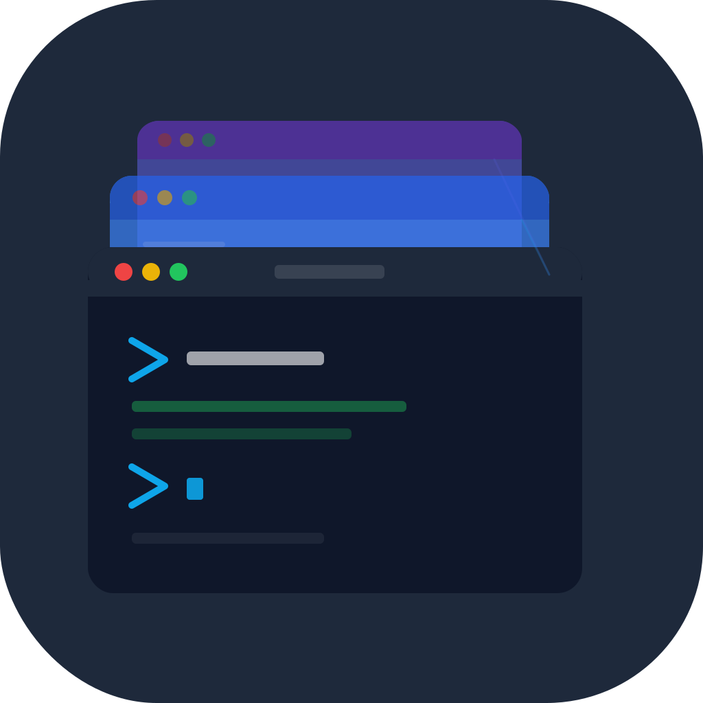
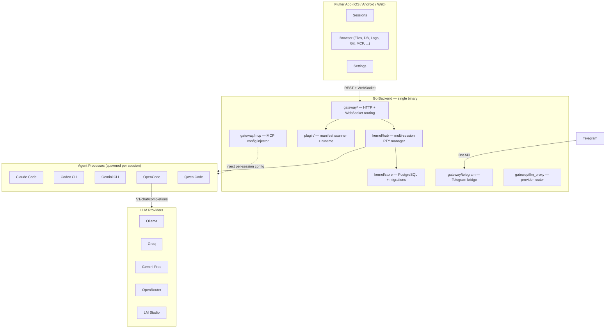

<div align="center">



<h1>OpenDray</h1>

<p><strong>Pilot AI coding agents from your phone. Self-hosted. Multi-agent. Plugin-driven.</strong></p>

<p>
<a href="https://github.com/opendray/opendray/actions/workflows/ci.yml"></a>
<a href="https://github.com/opendray/opendray/releases"></a>
<a href="LICENSE"></a>
<a href="https://github.com/opendray/opendray/stargazers"></a>
</p>

<p>
<a href="#quick-start"><b>Quick Start</b></a> &middot;
<a href="#features"><b>Features</b></a> &middot;
<a href="#architecture"><b>Architecture</b></a> &middot;
<a href="#plugins"><b>Plugins</b></a> &middot;
<a href="https://github.com/opendray/opendray/discussions"><b>Discussions</b></a>
</p>

<!-- TODO: Replace with actual screenshot/screencast -->
<!--  -->

</div>

---

Start a Claude Code, Codex, or Gemini session on your server from the train. Close the app. Come back an hour later. The session kept running. Review the diff. Approve it from Telegram.

No other tool does this.

## Features

**Mobile-first remote control** &mdash; Launch any AI coding agent from your phone, tablet, or browser. The PTY session runs on your server. Close the app, come back later &mdash; it is still there.

**Multi-agent, side-by-side** &mdash; Run Claude Code, Codex, Gemini CLI, OpenCode, and Qwen in parallel sessions. Each gets its own terminal with independent lifecycle, idle detection, and output buffering.

**Plugin architecture** &mdash; Every agent and panel is a `manifest.json`. Add support for any new AI CLI by dropping one into `plugins/`. No code changes. No rebuilds. Restart and it appears in the launcher.

**Telegram bridge** &mdash; Full bidirectional session control over Telegram. List sessions, tail output, link a chat for two-way relay, answer structured prompts via inline keyboards, send control keys &mdash; all without opening the app.

**LLM provider routing** &mdash; Register Ollama, Groq, Gemini free tier, LM Studio, or any OpenAI-compatible endpoint. Route per-session: same OpenCode binary, different model, different cost.

**MCP injection** &mdash; Register MCP servers once. OpenDray generates per-session config files and injects them via CLI args and env vars. No global config files touched.

**Claude multi-account** &mdash; Register multiple Claude OAuth tokens. Pick which account per session. Hot-swap accounts on a running session without losing context (session resumes under the new account).

**Self-hosted, single binary** &mdash; Go backend with the Flutter web build embedded via `go:embed`. One binary + PostgreSQL. No SaaS dependency. Your code stays on your hardware.

## Quick Start

Grab a pre-built binary from [Releases](https://github.com/Opendray/opendray/releases) or build locally:

```bash
git clone https://github.com/opendray/opendray.git
cd opendray
make release-all         # darwin/linux × amd64/arm64 binaries in bin/
./bin/opendray-darwin-arm64
```

The binary drops into **setup mode** on first run, prints a URL to stderr with a bootstrap token, and serves a browser wizard at that URL. The wizard walks you through:

1. **Database** — embedded PostgreSQL (managed by OpenDray, ~50 MB one-time download) or connect to an existing PG with a Test Connection button
2. **Admin account** — pick a username + password
3. **Agent CLIs** — optionally install `claude` / `codex` / `gemini` via `npm install -g` with live streaming output

Everything persists to `~/.opendray/config.toml` (or `$XDG_CONFIG_HOME/opendray/config.toml`). On subsequent launches it boots straight into normal mode.

<details>
<summary><b>Dev mode (hot-reload)</b></summary>

```bash
cp .env.example .env     # point at your own PostgreSQL
make dev                  # Go backend + Flutter web client
```

With `.env` set the wizard is skipped — env vars win over the config file, which preserves existing LXC/Docker deployments.

</details>

<details>
<summary><b>Bring your own PostgreSQL</b></summary>

```sql
CREATE DATABASE opendray;
CREATE USER opendray WITH PASSWORD 'changeme';
GRANT ALL PRIVILEGES ON DATABASE opendray TO opendray;
```

Enter those credentials in the wizard's "External PostgreSQL" option, or set `DB_HOST` / `DB_USER` / `DB_PASSWORD` / `DB_NAME` env vars to skip the wizard entirely.

</details>

<details>
<summary><b>Production binary</b></summary>

```bash
make release-linux                    # cross-compile linux/amd64 with embedded web
./bin/opendray-linux-amd64            # single binary, migrations run on startup
```

`JWT_SECRET` is required when binding to a non-loopback address. The wizard auto-generates one; for env-var deploys, set it yourself.

</details>

## Architecture



### Source Layout

```
cmd/opendray/       Entry point — loads env, boots kernel, starts HTTP server
kernel/
  terminal/         PTY engine: spawn, 4 MB ring buffer, idle detection
  hub/              Multi-session lifecycle: create, attach, resume, stop (max 20)
  store/            PostgreSQL: connection pool, 8 migrations, queries
  auth/             JWT issuing and middleware (HS256, 7-day TTL)
gateway/            HTTP + WebSocket handlers
  telegram/         Telegram bot: 15 commands, links, notifications, multi-select keyboards
  mcp/              MCP server registry, per-session config renderer + cleanup
  llm_proxy/        Anthropic-to-OpenAI request/response translation
  files/            Sandboxed file browser (allowed-roots, symlink resolution)
  database/         Read-only PostgreSQL browser (DDL/DML blocked, row/time caps)
  git/              Per-repo status, per-session baseline diffs, branch listing
  logs/             Tail-follow with rotation detection, regex grep, extension filter
  tasks/            Makefile / npm / shell discovery, concurrent runner with timeouts
  docs/             Git-forge markdown reader (Gitea, GitHub, GitLab)
plugin/             Manifest scanner, runtime, hook bus
plugins/
  agents/           6 agents: claude, codex, gemini, opencode, qwen, terminal
  panels/           11 panels: files, database, logs, tasks, git, telegram, mcp, ...
app/                Flutter client (iOS, Android, Web) — 16 screens
```

## Plugins

Every agent and panel is a plugin. OpenDray ships with 17.

### Agents

| Agent | Icon | Models | Key Capabilities |
|---|---|---|---|
| **Claude Code** | 🟣 | Sonnet, Opus, Haiku | Session resume (`--resume`), MCP injection, image input, multi-account OAuth, bypass-permissions mode |
| **Codex CLI** | 🤖 | o4-mini, o3, GPT-4.1, GPT-4.1-mini | Approval modes (suggest / auto-edit / full-auto), MCP injection |
| **Gemini CLI** | ✨ | Gemini 2.5 Pro, Gemini 2.5 Flash | Sandbox mode, yolo mode, multimodal input |
| **OpenCode** | 🤖 | Dynamic (via LLM Providers) | Provider-agnostic routing to any OpenAI-compatible endpoint, session resume, MCP injection |
| **Qwen Code** | 🐉 | Qwen3-Coder Plus/Flash/480B | DashScope, ModelScope, OpenRouter, dynamic model detection, MCP injection |
| **Terminal** | ⬛ | &mdash; | System login shell (zsh/bash/sh), no AI |

### Panels

| Panel | Category | What it does |
|---|---|---|
| **File Browser** | files | Sandboxed directory listing + file viewing with syntax highlighting, binary detection, size caps |
| **PostgreSQL Browser** | database | Read-only schema introspection (databases, schemas, tables, columns) + filtered SELECT execution, query history, 8 SSL modes |
| **Log Viewer** | logs | Tail-follow with backlog, rotation detection, regex grep, extension filtering |
| **Task Runner** | tools | Discover Makefile targets, package.json scripts, shell scripts; concurrent execution with timeouts and live output |
| **Git** | tools | Per-repo status, per-session baseline (shows only changes made during the session), unified diff, commit log, branch listing |
| **Telegram Bridge** | messaging | Bot token setup, link status, test messages, command reference |
| **MCP Servers** | mcp | CRUD for stdio / SSE / HTTP MCP servers, per-agent filtering, enable/disable toggle |
| **LLM Providers** | endpoints | Address book of OpenAI-compatible endpoints, model detection via `/v1/models`, API key stored as env-var name only |
| **Obsidian Reader** | docs | Browse Obsidian vaults from Git repos (Gitea, GitHub, GitLab), branch selection, path filtering |
| **Web Preview** | preview | In-app browser with URL or port input, HTML frame rendering |
| **Simulator Preview** | simulator | Real-time WebSocket stream of iOS Simulator or Android Emulator, adaptive FPS (8 active / 1 idle), touch/swipe/key input forwarding |

### Writing a Plugin

Add a new agent in under 5 minutes:

```
plugins/agents/my-agent/manifest.json
```

```json
{
  "name": "my-agent",
  "kind": "agent",
  "icon": "🤖",
  "cliSpec": {
    "command": "my-agent-cli",
    "defaultArgs": ["--no-color"],
    "installDetect": "which my-agent-cli"
  },
  "capabilities": {
    "supportsResume": false,
    "supportsStream": true,
    "supportsMcp": true
  }
}
```

Restart OpenDray. The agent appears in the session launcher. See [CONTRIBUTING.md](CONTRIBUTING.md) for the full manifest reference.

## Telegram Bridge

Full bidirectional control over Telegram &mdash; no app required:

| Command | Description |
|---|---|
| `/status` | List running sessions with IDs |
| `/tail <id> [n]` | Last N lines of output (JSONL-aware for Claude, raw buffer for others) |
| `/screen <id>` | Current screen snapshot (rich HTML for Claude, `<pre>` for others) |
| `/link <id>` | Bind this chat to a session (two-way relay, replaces prior binding) |
| `/unlink` | Remove the binding |
| `/links` | List all active chat-session bindings |
| `/send <id> <text>` | One-shot send without linking |
| `/stop <id>` | Terminate a session |
| `/whoami` | Show your Telegram chat ID |
| `/cc` `/cd` `/tab` `/enter` | Send control keys to linked session |
| `/yes` `/no` | Quick-answer routing for prompts |

**Linked chat behavior:** Plain text goes to the agent as terminal input. Agent output streams back in 2-second batches. Reply to any idle/exit notification to route directly to that session.

**Multi-select prompts** (e.g., Claude Code permission dialogs, tool approval lists) render as inline Telegram keyboards with checkboxes and a submit button.

## LLM Provider Routing

Register any OpenAI-compatible endpoint in the LLM Providers panel:

- **Local**: Ollama, LM Studio, llama.cpp, vLLM
- **Cloud**: Groq, Gemini free tier, OpenRouter, Together AI, Fireworks
- **Custom**: Any server implementing `/v1/chat/completions`

When creating a session with OpenCode, pick a provider and model. OpenDray generates a per-session config, sets `XDG_CONFIG_HOME`, and rewrites the `--model` arg. The same CLI binary, different brain, different cost.

Other agents receive `OPENAI_BASE_URL` / `OPENAI_API_KEY` / `OPENAI_MODEL` env vars for future OpenAI-native CLI support.

## MCP Server Management

Register MCP servers once in OpenDray. When an agent session starts, OpenDray generates a temporary per-session config file and injects it via CLI args and env vars &mdash; no editing `~/.claude.json` or `~/.codex/config.toml`. Temp files are cleaned up when the session exits.

Supports `stdio`, `sse`, and `http` transports. Scope servers to specific agents or apply globally.

## Session Lifecycle

| Phase | What happens |
|---|---|
| **Create** | REST API accepts agent type, working directory, model, extra args, env overrides, Claude account, LLM provider |
| **Start** | Hub resolves CLI command from plugin registry, builds args + env, injects MCP config, spawns PTY |
| **Running** | WebSocket streams terminal I/O, 4 MB ring buffer captures output, idle detector fires after threshold |
| **Resume** | Claude and OpenCode support `--resume` with stored session IDs; other agents spawn fresh |
| **Account swap** | Claude sessions can hot-swap OAuth accounts without losing context (stop &rarr; rebind &rarr; resume) |
| **Stop** | Graceful shutdown: SIGHUP &rarr; SIGTERM &rarr; SIGKILL (2s escalation), temp files cleaned |
| **Recovery** | `AUTO_RESUME=true`: re-attach orphaned PTYs after an OpenDray crash if the process and DB row still exist |

Max 20 concurrent sessions. Each session has independent idle detection, exit hooks, and Telegram notification routing.

## Security

| Control | Default |
|---|---|
| Bind address | `127.0.0.1:8640` (loopback only) |
| Authentication | JWT required on non-loopback. Server refuses to start without `JWT_SECRET`. |
| Rate limiting | Token-bucket per-IP on session mutations (10/min), reads (60/min) |
| Body size | 1 MB cap on POST/PUT/PATCH |
| File browser | Sandboxed to configured allow-list, symlinks resolved before prefix check |
| Database browser | Read-only transactions, DDL/DML regex gate, keyword blacklist, row caps (500), query timeout (30s) |
| LLM API keys | Stored as env-var names, never as values in the database |
| MCP configs | Per-session temp files, cleaned on exit, never written to global config |

The PTY API is root-equivalent on the host. Always run behind a reverse proxy with TLS in production.

See [SECURITY.md](SECURITY.md) for the full threat model and deployment checklist.

## Configuration

All configuration via environment variables. See [`.env.example`](.env.example) for the complete reference.

<details>
<summary><b>Key variables</b></summary>

| Variable | Default | Description |
|---|---|---|
| `LISTEN_ADDR` | `127.0.0.1:8640` | Bind address |
| `DB_HOST` | *(required)* | PostgreSQL host |
| `DB_PASSWORD` | *(required)* | PostgreSQL password |
| `DB_NAME` | `opendray` | Database name |
| `JWT_SECRET` | *(empty = dev)* | Required for non-loopback bind |
| `PLUGIN_DIR` | `./plugins` | Plugin manifest directory |
| `OPENDRAY_TELEGRAM_BOT_TOKEN` | *(empty)* | Telegram bot token from @BotFather |
| `AUTO_RESUME` | `false` | Re-attach orphaned PTYs on startup |
| `IDLE_THRESHOLD_SECONDS` | `8` | Seconds of silence before idle event |

</details>

## Tech Stack

| Layer | Technology |
|---|---|
| Backend | Go 1.25+, chi, gorilla/websocket, creack/pty, pgx/v5 |
| Frontend | Flutter 3.41+ (Dart 3), xterm.js via WebView, go_router, provider |
| Database | PostgreSQL 14+ (8 auto-applied migrations, max 20 connections) |
| Auth | JWT (HS256, 7-day TTL) + optional Cloudflare Access service-token support |
| Packaging | Single binary with Flutter web build embedded via `go:embed` |
| CI | GitHub Actions (Go vet + test + build, Flutter analyze + build) |

## Contributing

See [CONTRIBUTING.md](CONTRIBUTING.md) for development setup, plugin authoring, and PR process.

The fastest way to contribute: write a `manifest.json` for your favorite AI coding CLI and submit a PR.

## License

MIT &mdash; see [LICENSE](LICENSE).
