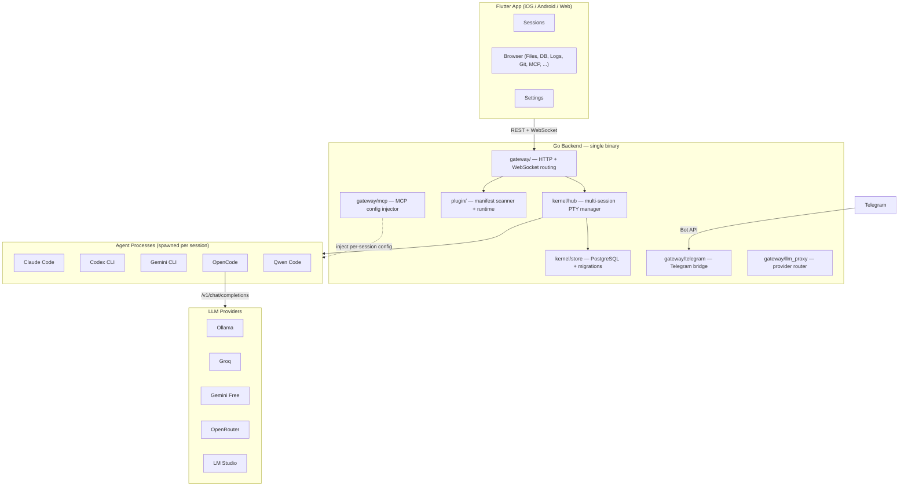

<div align="center">


<h1>OpenDray</h1>

<p><strong>Pilot AI coding agents from your phone. Self-hosted. Multi-agent. Plugin-driven.</strong></p>

<p>
<a href="https://github.com/opendray/opendray/actions/workflows/ci.yml"></a>
<a href="https://github.com/opendray/opendray/releases"></a>
<a href="https://github.com/Opendray/opendray/pkgs/container/opendray"></a>
<a href="LICENSE"></a>
<a href="https://github.com/opendray/opendray/stargazers"></a>
</p>

<p>
<a href="#quick-start"><b>Quick Start</b></a> &middot;
<a href="#features"><b>Features</b></a> &middot;
<a href="#architecture"><b>Architecture</b></a> &middot;
<a href="#plugins"><b>Plugins</b></a> &middot;
<a href="https://github.com/opendray/opendray/discussions"><b>Discussions</b></a>
</p>

<p>
<b>English</b> &middot;
<a href="README.zh-CN.md"><b>简体中文</b></a>
</p>

<!-- TODO: Replace with actual screenshot/screencast -->
<!--  -->

</div>

---

Start a Claude Code, Codex, or Gemini session on your server from the train. Close the app. Come back an hour later. The session kept running. Review the diff. Approve it from Telegram.

No other tool does this.

## Features

**Mobile-first remote control** &mdash; Launch any AI coding agent from your phone, tablet, or browser. The PTY session runs on your server. Close the app, come back later &mdash; it is still there.

**Multi-agent, side-by-side** &mdash; Run Claude Code, Codex, Gemini CLI, OpenCode, and Qwen in parallel sessions. Each gets its own terminal with independent lifecycle, idle detection, and output buffering.

**Plugin architecture** &mdash; Every agent and panel is a `manifest.json`. Add support for any new AI CLI by dropping one into `plugins/`. No code changes. No rebuilds. Restart and it appears in the launcher.

**Telegram bridge** &mdash; Full bidirectional session control over Telegram. List sessions, tail output, link a chat for two-way relay, answer structured prompts via inline keyboards, send control keys &mdash; all without opening the app.

**LLM provider routing** &mdash; Register Ollama, Groq, Gemini free tier, LM Studio, or any OpenAI-compatible endpoint. Route per-session: same OpenCode binary, different model, different cost.

**MCP injection** &mdash; Register MCP servers once. OpenDray generates per-session config files and injects them via CLI args and env vars. No global config files touched.

**Claude multi-account** &mdash; Register multiple Claude OAuth tokens. Pick which account per session. Hot-swap accounts on a running session without losing context (session resumes under the new account).

**Self-hosted, single binary** &mdash; Go backend with the Flutter web build embedded via `go:embed`. One binary + PostgreSQL. No SaaS dependency. Your code stays on your hardware.

## Quick Start

Pick your path. **Docker** is the shortest route — one image with every
agent CLI bundled. **Native binary** is the right pick when you want
OpenDray on bare metal without Docker in the stack.

### Docker (recommended — all agent CLIs bundled)

```bash
git clone https://github.com/Opendray/opendray.git
cd opendray
cp .env.docker.example .env && $EDITOR .env   # set DB_PASSWORD at minimum
./scripts/opendray-docker up                  # starts opendray + postgres
./scripts/opendray-docker login claude        # one-time OAuth per agent
# open http://localhost:8640
```

The `*-full` image ships Claude Code, Codex, Gemini CLI, and OpenCode
on PATH, so every builtin plugin works with zero host setup. Published
as a multi-arch manifest (`linux/amd64` + `linux/arm64`) — same tag on
x86 servers, Apple Silicon, Raspberry Pi 4+, and AWS Graviton.

Already have Docker running? Skip the clone and pull directly:

```bash
docker pull ghcr.io/Opendray/opendray:latest-full
```

The `opendray-docker` wrapper exposes `up / down / logs / doctor / login
/ update / backup` verbs over the compose stack. Full reference:
[docs/DOCKER.md](docs/DOCKER.md).

### Native binary (macOS / Linux)

OpenDray also ships as a single self-contained binary. Install, run the
terminal wizard, start the server. **Setup is terminal-only** — there
is no web-based first-run wizard, so the install flow works identically
over SSH, in a VPS, or on your laptop.

```bash
curl -fsSL https://raw.githubusercontent.com/Opendray/opendray/main/install.sh | sh
```

The installer:
1. detects your OS (`darwin` / `linux`) and architecture (`amd64` / `arm64`)
2. downloads the matching binary from [Releases](https://github.com/Opendray/opendray/releases)
3. verifies its SHA256 against the signed `SHA256SUMS` file
4. installs it to `~/.local/bin/opendray`
5. hands control to `opendray setup` — an interactive wizard in the same terminal

Override with env vars: `OPENDRAY_VERSION=v0.5.0`, `OPENDRAY_INSTALL_DIR=/usr/local/bin`, `OPENDRAY_NO_SETUP=1` (skip auto-wizard).

> **Windows:** not yet supported. The core feature (spawning agent CLIs
> in a pseudo-terminal) requires UNIX PTY via `creack/pty`; the Windows
> ConPTY equivalent is on the roadmap.

### What the wizard asks

```
1 / 4   DATABASE        bundled PostgreSQL (managed by OpenDray)
                        or external (bring your own PG 14+)
2 / 4   LISTEN ADDRESS  loopback (127.0.0.1:8640, local only)
                        or all interfaces (0.0.0.0:8640, LAN-exposed)
                        or custom host:port
3 / 4   ADMIN ACCOUNT   username + password (min 8 chars)
4 / 4   JWT SECRET      auto-generate or paste your own
```

Config persists to `~/.opendray/config.toml`. Re-running `opendray setup`
resumes with existing values as defaults, so you can rotate any single field
without re-entering the rest.

### Scripted install (CI / cloud-init)

```bash
opendray setup --yes \
    --db=bundled \
    --listen=loopback \
    --admin-user=admin \
    --admin-password-file=/run/secrets/admin_pw
```

All prompts have matching flags: `--db-host`, `--db-port`, `--db-user`,
`--db-name`, `--db-password-file`, `--db-sslmode`, `--jwt-secret-file`.
See `opendray setup --help`.

### Manual download

Grab a binary from the [Releases page](https://github.com/Opendray/opendray/releases):
- `opendray-darwin-arm64` — Apple Silicon Mac
- `opendray-darwin-amd64` — Intel Mac
- `opendray-linux-amd64` / `opendray-linux-arm64`

```bash
chmod +x opendray-darwin-arm64
./opendray-darwin-arm64 setup
./opendray-darwin-arm64
```

### Build from source

Prerequisites: Go 1.25+ and Flutter (stable channel). No `make`
required — the two direct commands are all you need.

```bash
git clone https://github.com/Opendray/opendray.git
cd opendray

# 1. Build the Flutter web bundle (gets embedded into the Go binary)
cd app && flutter pub get && flutter build web --release && cd ..

# 2. Build the Go binary
go build -o bin/opendray ./cmd/opendray

./bin/opendray setup
./bin/opendray
```

If you already have GNU `make` installed, `make build` is a one-liner
shortcut for the two commands above.

<details>
<summary><b>Dev mode (hot-reload)</b></summary>

```bash
cp .env.example .env     # point at your own PostgreSQL
make dev                 # Go backend + Flutter web client
```

With `.env` set the wizard is skipped — env vars win over the config file,
which preserves existing LXC/Docker deployments.

</details>

<details>
<summary><b>Bring your own PostgreSQL</b></summary>

```sql
CREATE DATABASE opendray;
CREATE USER opendray WITH PASSWORD 'changeme';
GRANT ALL PRIVILEGES ON DATABASE opendray TO opendray;
```

Pick `external` in the wizard, or set `DB_HOST` / `DB_USER` / `DB_PASSWORD` /
`DB_NAME` env vars — either path triggers automatic migration (schema is
created in your database on first connection).

</details>

<details>
<summary><b>Bundled PostgreSQL and root</b></summary>

The `bundled` database mode refuses to run as `root` — upstream PostgreSQL's
`initdb` hard-fails on `uid == 0`. Create an unprivileged user first:

```bash
useradd -r -m -s /bin/bash -d /home/opendray opendray
su - opendray
opendray setup
```

Or pick `external` and connect to an existing PG instance.

</details>

<details>
<summary><b>Production binary</b></summary>

```bash
make release-linux                    # cross-compile linux/amd64 with embedded web
./bin/opendray-linux-amd64            # single binary, migrations run on startup
```

`JWT_SECRET` is required when binding to a non-loopback address. The wizard auto-generates one; for env-var deploys, set it yourself.

</details>

## Run as a background service

The default `opendray` invocation runs in the foreground — great for
testing, not so great for "always-on server tied to a specific user
session". Install the service wrapper so it:

- starts on boot
- restarts on crash
- logs to a sensible place (journald on Linux, `/var/log/opendray/` on macOS)
- runs as your non-root setup user (bundled PG won't start as uid 0)

```bash
sudo opendray service install
```

Auto-detects the target user from `$SUDO_USER` (the account you ran
`sudo` from). Override with `--user` if that's wrong:

```bash
sudo opendray service install --user opendray
```

Other lifecycle commands:

```bash
opendray service status      # current state
opendray service logs        # tail (journalctl -fu on Linux, tail -f on mac)
sudo opendray service start  # / stop / restart
sudo opendray service uninstall
opendray service help        # full reference
```

### What it writes

| Platform | File | What it does |
|---|---|---|
| Linux | `/etc/systemd/system/opendray.service` | systemd unit, `Restart=on-failure`, journald output, `ProtectSystem=full` |
| macOS | `/Library/LaunchDaemons/com.opendray.opendray.plist` | launchd daemon, `KeepAlive=SuccessfulExit:false`, logs to `/var/log/opendray/` |

Both run the binary as the `--user` account (never root) and inherit
`HOME=$user` so the existing config under `~/.opendray/` is loaded as-is.

### Preview without writing

```bash
opendray service install --user linivek --dry-run
```

prints the unit / plist that would be written. No system changes. Good
for reviewing before committing.

## Uninstall

Mirrors the install flow. Two paths depending on whether your `opendray`
binary can still run.

### Built-in command (preferred)

```bash
opendray uninstall               # interactive: show plan, confirm, remove
opendray uninstall --yes         # no prompt
opendray uninstall --dry-run     # preview only
opendray uninstall --keep-data   # binary + config gone, ~/.opendray/ stays
```

Output:
1. stops any running OpenDray server + bundled PostgreSQL
2. removes `~/.opendray/` (PG cluster, plugins, cache, marketplace)
3. removes `~/.config/opendray/config.toml` if present
4. removes the binary itself (self-delete)

### One-line nuclear option (binary can't run)

When the binary is corrupt or the config is so broken the wizard won't
start, use the shell script instead. It knows nothing about config; it
just `rm -rf`s the well-known paths.

```bash
curl -fsSL https://raw.githubusercontent.com/Opendray/opendray/main/uninstall.sh | sh
```

Environment overrides:
- `OPENDRAY_YES=1` — skip confirmation
- `OPENDRAY_DRY_RUN=1` — preview only
- `OPENDRAY_INSTALL_DIR` — non-default binary location

### External PostgreSQL

OpenDray **never drops tables from an external database you provided** —
table names (`sessions`, `plugins`, `admin_auth`, …) are generic enough
to collide with other applications sharing the DB, and automated drops
are unrecoverable.

Instead, `opendray uninstall` writes a `drop_opendray_schema.sql` file
to your current directory with wrapped `DROP TABLE IF EXISTS … CASCADE`
statements. Review it, then apply manually:

```bash
psql -h <host> -U <user> -d <db> -f drop_opendray_schema.sql
```

The nuclear scripts skip this helper; if you went nuclear, you're
expected to know which tables to drop.

### Manual removal (last resort)

If both paths above fail, these are the locations to nuke by hand:

| Platform | Path |
|---|---|
| macOS / Linux | `~/.local/bin/opendray` |
| macOS / Linux | `~/.opendray/` |
| macOS / Linux | `~/.config/opendray/` (XDG fallback) |

## Architecture



### Source Layout

```
cmd/opendray/       Entry point — setup, service, uninstall, plugin, version subcommands
kernel/
  terminal/         PTY engine: spawn, 4 MB ring buffer, idle detection
  hub/              Multi-session lifecycle: create, attach, resume, stop (max 20)
  store/            PostgreSQL: connection pool, 18 migrations, queries
  auth/             JWT issuing and middleware (HS256, 7-day TTL)
  pg/               Bundled PostgreSQL launcher (embedded PG 15.4 child process)
  config/           config.toml parser + env overlay
gateway/            HTTP + WebSocket handlers
  telegram/         Telegram bot: commands, links, notifications, inline keyboards
  mcp/              MCP server registry, per-session config renderer + cleanup
  llm_proxy/        Anthropic-to-OpenAI request/response translation
  files/            Sandboxed file browser (allowed-roots, symlink resolution)
  pg/               Read-only PostgreSQL browser (DDL/DML blocked, row/time caps)
  forge/            Git-forge clients (Gitea, GitHub, GitLab) for Obsidian reader
  git/              Per-repo status, per-session baseline diffs, branch listing
  logs/             Tail-follow with rotation detection, regex grep, extension filter
  tasks/            Makefile / npm / shell discovery, concurrent runner with timeouts
  docs/             Markdown reader (used by the Obsidian plugin)
plugin/             Manifest scanner, runtime, hook bus, marketplace, consents
plugins/
  builtin/          17 built-in plugins (6 agents + 11 panels, embedded in binary)
  examples/         Reference external plugins (time-ninja, kanban, fs-readme)
app/                Flutter client (iOS, Android, Web) — 19 feature modules
```

## Plugins

Every agent and panel is a plugin. OpenDray ships with 17.

### Agents

| Agent | Icon | Models | Key Capabilities |
|---|---|---|---|
| **Claude Code** | 🟣 | Sonnet, Opus, Haiku | Session resume (`--resume`), MCP injection, image input, multi-account OAuth, bypass-permissions mode |
| **Codex CLI** | 🤖 | o4-mini, o3, GPT-4.1, GPT-4.1-mini | Approval modes (suggest / auto-edit / full-auto), MCP injection |
| **Gemini CLI** | ✨ | Gemini 2.5 Pro, Gemini 2.5 Flash | Sandbox mode, yolo mode, multimodal input |
| **OpenCode** | 🤖 | Dynamic (via LLM Endpoints) | Provider-agnostic routing to any OpenAI-compatible endpoint, session resume, MCP injection |
| **Qwen Code** | 🐉 | Qwen3-Coder Plus/Flash/480B | DashScope, ModelScope, OpenRouter, dynamic model detection, MCP injection |
| **Terminal** | ⬛ | &mdash; | System login shell (zsh/bash/sh), no AI |

### Panels

| Panel | Category | What it does |
|---|---|---|
| **File Browser** | files | Sandboxed directory listing + file viewing with syntax highlighting, binary detection, size caps |
| **PostgreSQL Browser** | database | Read-only schema introspection (databases, schemas, tables, columns) + filtered SELECT execution, query history, 8 SSL modes |
| **Log Viewer** | logs | Tail-follow with backlog, rotation detection, regex grep, extension filtering |
| **Task Runner** | tools | Discover Makefile targets, package.json scripts, shell scripts; concurrent execution with timeouts and live output |
| **Git Viewer** | tools | Per-repo status, per-session baseline (shows only changes made during the session), unified diff, commit log, branch listing |
| **Git Forge** | tools | Gitea / GitHub / GitLab integration — browse repos, clone, inspect PRs/issues |
| **Telegram Bridge** | messaging | Bot token setup, link status, test messages, command reference |
| **MCP Servers** | mcp | CRUD for stdio / SSE / HTTP MCP servers, per-agent filtering, enable/disable toggle |
| **Obsidian Reader** | docs | Browse Obsidian vaults from Git repos (Gitea, GitHub, GitLab), branch selection, path filtering |
| **Web Browser** | preview | Full in-app browser with multi-tab URLs, forward/back navigation, and port-on-host shortcuts |
| **Simulator Preview** | simulator | Real-time WebSocket stream of iOS Simulator or Android Emulator, adaptive FPS (8 active / 1 idle), touch/swipe/key input forwarding |

### Writing a Plugin

Add a new agent in under 5 minutes:

```
plugins/agents/my-agent/manifest.json
```

```json
{
  "name": "my-agent",
  "kind": "agent",
  "icon": "🤖",
  "cliSpec": {
    "command": "my-agent-cli",
    "defaultArgs": ["--no-color"],
    "installDetect": "which my-agent-cli"
  },
  "capabilities": {
    "supportsResume": false,
    "supportsStream": true,
    "supportsMcp": true
  }
}
```

Restart OpenDray. The agent appears in the session launcher. See [CONTRIBUTING.md](CONTRIBUTING.md) for the full manifest reference.

## Telegram Bridge

Full bidirectional control over Telegram &mdash; no app required:

| Command | Description |
|---|---|
| `/status` | List running sessions with IDs |
| `/tail <id> [n]` | Last N lines of output (JSONL-aware for Claude, raw buffer for others) |
| `/screen <id>` | Current screen snapshot (rich HTML for Claude, `<pre>` for others) |
| `/link <id>` | Bind this chat to a session (two-way relay, replaces prior binding) |
| `/unlink` | Remove the binding |
| `/links` | List all active chat-session bindings |
| `/send <id> <text>` | One-shot send without linking |
| `/stop <id>` | Terminate a session |
| `/whoami` | Show your Telegram chat ID |
| `/cc` `/cd` `/tab` `/enter` | Send control keys to linked session |
| `/yes` `/no` | Quick-answer routing for prompts |

**Linked chat behavior:** Plain text goes to the agent as terminal input. Agent output streams back in 2-second batches. Reply to any idle/exit notification to route directly to that session.

**Multi-select prompts** (e.g., Claude Code permission dialogs, tool approval lists) render as inline Telegram keyboards with checkboxes and a submit button.

## LLM Endpoint Routing

Register any OpenAI-compatible endpoint under **Settings → LLM Endpoints**
(previously the `llm-providers` panel plugin — now a platform capability
shared by every agent, not owned by a single plugin):

- **Local**: Ollama, LM Studio, llama.cpp, vLLM
- **Cloud**: Groq, Gemini free tier, OpenRouter, Together AI, Fireworks
- **Custom**: Any server implementing `/v1/chat/completions`

When creating a session with OpenCode, pick a provider and model. OpenDray generates a per-session config, sets `XDG_CONFIG_HOME`, and rewrites the `--model` arg. The same CLI binary, different brain, different cost.

Other agents receive `OPENAI_BASE_URL` / `OPENAI_API_KEY` / `OPENAI_MODEL` env vars for future OpenAI-native CLI support.

## MCP Server Management

Register MCP servers once in OpenDray. When an agent session starts, OpenDray generates a temporary per-session config file and injects it via CLI args and env vars &mdash; no editing `~/.claude.json` or `~/.codex/config.toml`. Temp files are cleaned up when the session exits.

Supports `stdio`, `sse`, and `http` transports. Scope servers to specific agents or apply globally.

## Session Lifecycle

| Phase | What happens |
|---|---|
| **Create** | REST API accepts agent type, working directory, model, extra args, env overrides, Claude account, LLM provider |
| **Start** | Hub resolves CLI command from plugin registry, builds args + env, injects MCP config, spawns PTY |
| **Running** | WebSocket streams terminal I/O, 4 MB ring buffer captures output, idle detector fires after threshold |
| **Resume** | Claude and OpenCode support `--resume` with stored session IDs; other agents spawn fresh |
| **Account swap** | Claude sessions can hot-swap OAuth accounts without losing context (stop &rarr; rebind &rarr; resume) |
| **Stop** | Graceful shutdown: SIGHUP &rarr; SIGTERM &rarr; SIGKILL (2s escalation), temp files cleaned |
| **Recovery** | `AUTO_RESUME=true`: re-attach orphaned PTYs after an OpenDray crash if the process and DB row still exist |

Max 20 concurrent sessions. Each session has independent idle detection, exit hooks, and Telegram notification routing.

## Security

| Control | Default |
|---|---|
| Bind address | `127.0.0.1:8640` (loopback only) |
| Authentication | JWT required on non-loopback. Server refuses to start without `JWT_SECRET`. |
| Rate limiting | Token-bucket per-IP on session mutations (10/min), reads (60/min) |
| Body size | 1 MB cap on POST/PUT/PATCH |
| File browser | Sandboxed to configured allow-list, symlinks resolved before prefix check |
| Database browser | Read-only transactions, DDL/DML regex gate, keyword blacklist, row caps (500), query timeout (30s) |
| LLM API keys | Stored as env-var names, never as values in the database |
| MCP configs | Per-session temp files, cleaned on exit, never written to global config |

The PTY API is root-equivalent on the host. Always run behind a reverse proxy with TLS in production.

See [SECURITY.md](SECURITY.md) for the full threat model and deployment checklist.

## Configuration

All configuration via environment variables. See [`.env.example`](.env.example) for the complete reference.

<details>
<summary><b>Key variables</b></summary>

| Variable | Default | Description |
|---|---|---|
| `LISTEN_ADDR` | `127.0.0.1:8640` | Bind address |
| `DB_HOST` | *(required)* | PostgreSQL host |
| `DB_PASSWORD` | *(required)* | PostgreSQL password |
| `DB_NAME` | `opendray` | Database name |
| `JWT_SECRET` | *(empty = dev)* | Required for non-loopback bind |
| `PLUGIN_DIR` | `./plugins` | Plugin manifest directory |
| `OPENDRAY_TELEGRAM_BOT_TOKEN` | *(empty)* | Telegram bot token from @BotFather |
| `AUTO_RESUME` | `false` | Re-attach orphaned PTYs on startup |
| `IDLE_THRESHOLD_SECONDS` | `8` | Seconds of silence before idle event |

</details>

## Tech Stack

| Layer | Technology |
|---|---|
| Backend | Go 1.25+, chi, gorilla/websocket, creack/pty, pgx/v5 |
| Frontend | Flutter 3.41+ (Dart 3), xterm.js via WebView, go_router, provider |
| Database | PostgreSQL 14+ (18 auto-applied migrations, max 20 connections) |
| Auth | JWT (HS256, 7-day TTL) + optional Cloudflare Access service-token support |
| Packaging | Single binary with Flutter web build embedded via `go:embed` |
| CI | GitHub Actions (Go vet + test + build, Flutter analyze + build) |

## Contributing

See [CONTRIBUTING.md](CONTRIBUTING.md) for development setup, plugin authoring, and PR process.

The fastest way to contribute: write a `manifest.json` for your favorite AI coding CLI and submit a PR.

## License

MIT &mdash; see [LICENSE](LICENSE).
