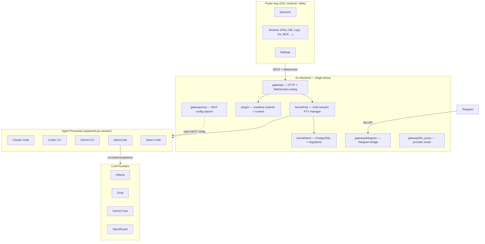

<div align="center">


<h1>OpenDray</h1>

<p><strong>Pilot AI coding agents from your phone. Self-hosted. Multi-agent. Plugin-driven.</strong></p>

<p>
<a href="https://github.com/opendray/opendray/actions/workflows/ci.yml"></a>
<a href="https://github.com/opendray/opendray/releases"></a>
<a href="LICENSE"></a>
<a href="https://github.com/opendray/opendray/stargazers"></a>
</p>

<p>
<a href="#quick-start"><b>Quick Start</b></a> &middot;
<a href="#features"><b>Features</b></a> &middot;
<a href="#architecture"><b>Architecture</b></a> &middot;
<a href="#plugins"><b>Plugins</b></a> &middot;
<a href="https://github.com/opendray/opendray/discussions"><b>Discussions</b></a>
</p>

<!-- TODO: Replace with actual screenshot/screencast -->
<!--  -->

</div>

---

Start a Claude Code session on your server from the train. Close the app. Come back an hour later. The session kept running. Review the diff. Approve it from Telegram.

No other tool does this.

## Features

**Mobile-first remote control** &mdash; Launch a coding agent from your phone, tablet, or browser. The PTY session runs on your server. Close the app, come back later &mdash; it is still there.

**Multi-agent, side-by-side** &mdash; Run Claude Code, Codex, Gemini CLI, OpenCode, and Qwen in parallel sessions. Each gets its own terminal. Shared MCP tools across all of them.

**Plugin architecture** &mdash; Add support for any new AI CLI by dropping a `manifest.json` into `plugins/`. No code changes. No rebuilds. Restart and it appears in the launcher.

**Telegram bridge** &mdash; Full bidirectional session control over Telegram. Start agents, read output, answer prompts, approve diffs &mdash; all without opening the app.

**LLM provider routing** &mdash; Register Ollama, Groq, Gemini free tier, LM Studio, or any OpenAI-compatible endpoint. Route per-session: same OpenCode binary, different model.

**Self-hosted, single binary** &mdash; Go backend with the Flutter web build embedded via `go:embed`. One binary + PostgreSQL. No SaaS dependency. Your code stays on your hardware.

## Quick Start

```bash
git clone https://github.com/opendray/opendray.git
cd opendray
cp .env.example .env     # edit with your PostgreSQL credentials
make dev                  # starts Go backend + Flutter web client
```

<details>
<summary><b>Database setup</b></summary>

```sql
CREATE DATABASE opendray;
CREATE USER opendray WITH PASSWORD 'changeme';
GRANT ALL PRIVILEGES ON DATABASE opendray TO opendray;
```

</details>

<details>
<summary><b>Production binary</b></summary>

```bash
make release-linux                    # cross-compile linux/amd64 with embedded web
./bin/opendray-linux-amd64            # single binary, migrations run on startup
```

Requires `JWT_SECRET` when binding to non-loopback addresses. The server refuses to start without it.

</details>

## Architecture



### Source Layout

```
cmd/opendray/       Entry point — loads env, boots kernel, starts HTTP server
kernel/
  terminal/         PTY engine: spawn, ring buffer, idle detection
  hub/              Multi-session lifecycle: create, attach, resume, stop
  store/            PostgreSQL: connection pool, migrations (8), queries
  auth/             JWT issuing and middleware
gateway/            HTTP + WebSocket handlers
  telegram/         Telegram bot: commands, links, notifications, multi-select
  mcp/              MCP server registry, per-session config renderer
  llm_proxy/        Anthropic-to-OpenAI translation (reserved)
  files/            Sandboxed file browser
  database/         Read-only PostgreSQL browser with SQL execution
  git/              Per-repo status, per-session diffs
  logs/             Tail-follow with regex grep
  tasks/            Makefile / npm / shell task discovery + runner
  docs/             Git-forge markdown reader
plugin/             Manifest scanner, runtime, hook bus
plugins/
  agents/           Agent manifests: claude, codex, gemini, opencode, qwen, terminal
  panels/           Panel manifests: files, database, logs, tasks, git, telegram, mcp, ...
app/                Flutter client (iOS, Android, Web)
```

## Plugins

Every agent and panel is a plugin. OpenDray ships with 16.

### Agents

| Agent | Status | Capabilities |
|---|---|---|
| **Claude Code** | Stable | Session resume, MCP injection, image input, multi-account OAuth, bypass-permissions mode |
| **Codex CLI** | Stable | Approval modes (suggest / auto-edit / full-auto), MCP injection |
| **Gemini CLI** | Stable | Sandbox mode, yolo mode, multimodal input |
| **OpenCode** | Stable | Provider-agnostic &mdash; routes through LLM Providers to any OpenAI-compatible endpoint |
| **Qwen Code** | Beta | Qwen3-Coder via DashScope, ModelScope, or OpenRouter |
| **Terminal** | Stable | System login shell (no AI) |

### Panels

| Panel | What it does |
|---|---|
| **File Browser** | Sandboxed server file browsing with syntax highlighting |
| **PostgreSQL Browser** | Read-only SELECT, schema browser, query history |
| **Log Viewer** | Tail-follow with regex grep and severity highlighting |
| **Task Runner** | Discover Makefile / npm / shell scripts and run with live stream |
| **Git** | Per-repo status, per-session diff, commit history |
| **Telegram Bridge** | Bot management, link status, test messages |
| **MCP Servers** | Registry UI for stdio / SSE / HTTP MCP servers |
| **LLM Providers** | Address book of OpenAI-compatible endpoints with model detection |
| **Obsidian Reader** | Browse Obsidian vaults stored on Gitea / GitHub / GitLab |
| **Web Preview** | In-app browser with device-viewport simulation |

### Writing a Plugin

Add a new agent in under 5 minutes:

```
plugins/agents/my-agent/manifest.json
```

```json
{
  "name": "my-agent",
  "kind": "agent",
  "icon": "🤖",
  "cliSpec": {
    "command": "my-agent-cli",
    "defaultArgs": ["--no-color"],
    "installDetect": "which my-agent-cli"
  },
  "capabilities": {
    "supportsResume": false,
    "supportsStream": true,
    "supportsMcp": true
  }
}
```

Restart OpenDray. The agent appears in the session launcher. See [CONTRIBUTING.md](CONTRIBUTING.md) for the full manifest reference.

## Telegram Bridge

Control sessions from Telegram without the app:

| Command | Description |
|---|---|
| `/status` | List running sessions |
| `/tail <id> [n]` | Last N lines of output |
| `/link <id>` | Bind this chat to a session (two-way) |
| `/unlink` | Remove the binding |
| `/send <id> <text>` | One-shot send without linking |
| `/stop <id>` | Stop a session |

Once linked, plain text in the chat goes to the agent as input. Agent output streams back, batched in 2-second windows. Reply to any idle notification to route directly to that session.

Structured multi-select prompts (e.g., Claude Code's permission dialogs) render as inline Telegram keyboards.

## LLM Provider Routing

Register any OpenAI-compatible endpoint in the LLM Providers panel:

- **Local**: Ollama, LM Studio, llama.cpp, vLLM
- **Cloud**: Groq, Gemini free tier, OpenRouter, Together AI, Fireworks
- **Custom**: Any server implementing `/v1/chat/completions`

When creating a session with OpenCode, pick a provider and model. The same CLI binary, different brain, different cost.

## MCP Server Management

Register MCP servers once in OpenDray. When an agent session starts, the configuration is injected automatically &mdash; no editing `~/.claude.json` or `~/.codex/config.toml`.

Supports `stdio`, `sse`, and `http` transports. Scope servers to specific agents or apply globally.

## Security

| Control | Default |
|---|---|
| Bind address | `127.0.0.1:8640` (loopback only) |
| Authentication | JWT required on non-loopback. Refuses to start without `JWT_SECRET`. |
| Rate limiting | Token-bucket per-IP on session mutations |
| Body size | 1 MB cap on POST/PUT/PATCH |
| File browser | Sandboxed to configured allow-list, symlinks resolved before check |
| Database browser | Read-only transactions, regex gate, keyword blacklist, row/time caps |
| LLM API keys | Stored as env-var names, never as values in the database |

The PTY API is root-equivalent on the host. Always run behind a reverse proxy with TLS in production.

See [SECURITY.md](SECURITY.md) for the full threat model and deployment checklist.

## Configuration

All configuration via environment variables. See [`.env.example`](.env.example) for the complete reference.

<details>
<summary><b>Key variables</b></summary>

| Variable | Default | Description |
|---|---|---|
| `LISTEN_ADDR` | `127.0.0.1:8640` | Bind address |
| `DB_HOST` | *(required)* | PostgreSQL host |
| `DB_PASSWORD` | *(required)* | PostgreSQL password |
| `DB_NAME` | `opendray` | Database name |
| `JWT_SECRET` | *(empty = dev)* | Required for non-loopback bind |
| `PLUGIN_DIR` | `./plugins` | Plugin manifest directory |
| `OPENDRAY_TELEGRAM_BOT_TOKEN` | *(empty)* | Telegram bot token from @BotFather |
| `AUTO_RESUME` | `false` | Re-attach orphaned PTYs on startup |
| `IDLE_THRESHOLD_SECONDS` | `8` | Seconds of silence before idle event |

</details>

## Tech Stack

| Layer | Technology |
|---|---|
| Backend | Go 1.25+, chi, gorilla/websocket, creack/pty, pgx/v5 |
| Frontend | Flutter 3.41+ (Dart 3), xterm.js via WebView, go_router, provider |
| Database | PostgreSQL 14+ (8 auto-applied migrations) |
| Auth | JWT (7-day TTL) + optional Cloudflare Access service-token support |
| Packaging | Single binary with Flutter web build embedded via `go:embed` |
| CI | GitHub Actions (Go vet + test + build, Flutter analyze + build) |

## Contributing

See [CONTRIBUTING.md](CONTRIBUTING.md) for development setup, plugin authoring, and PR process.

The fastest way to contribute: write a `manifest.json` for your favorite AI coding CLI and submit a PR.

## License

MIT &mdash; see [LICENSE](LICENSE).
