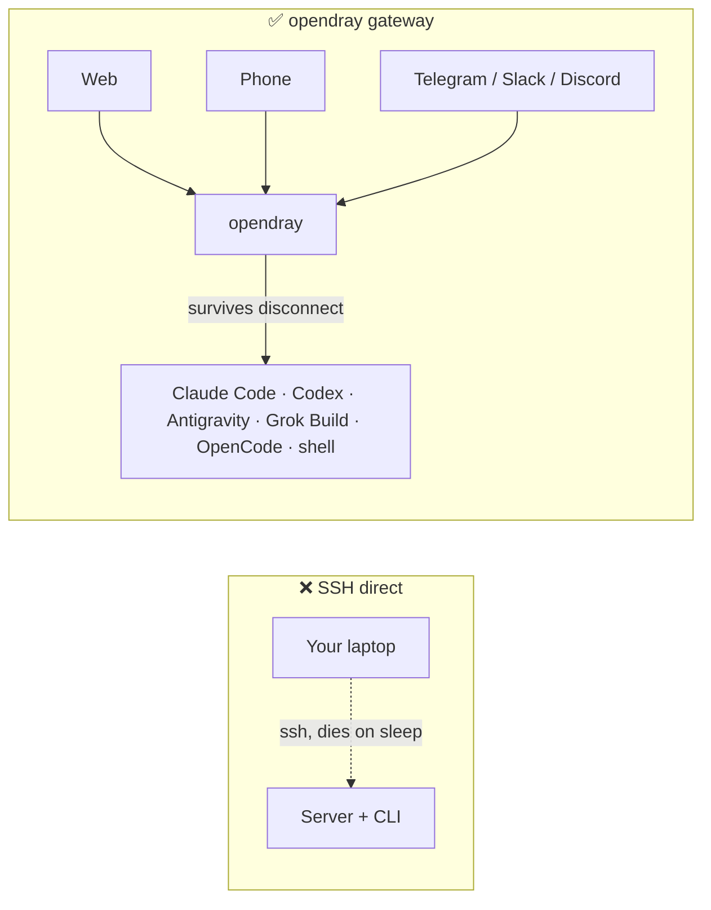
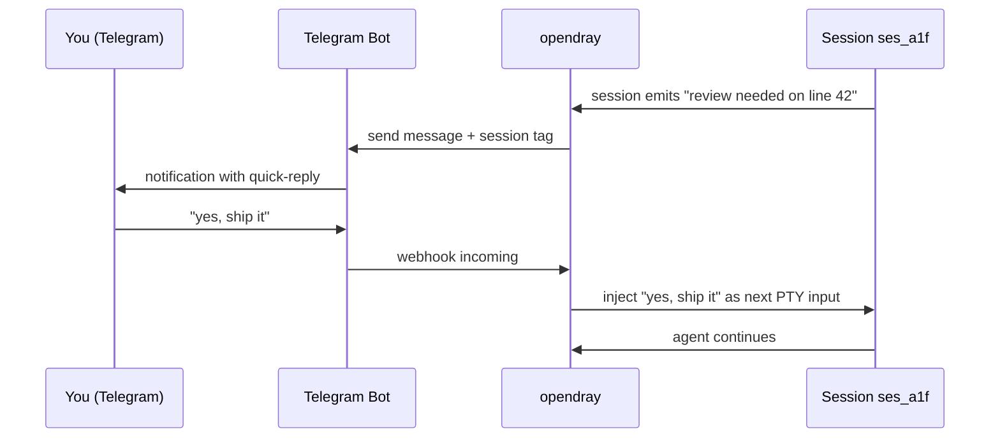
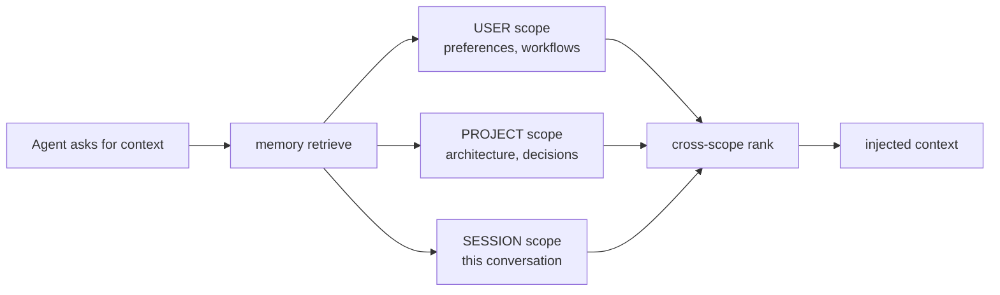
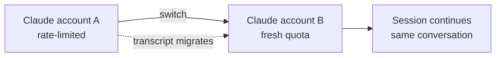
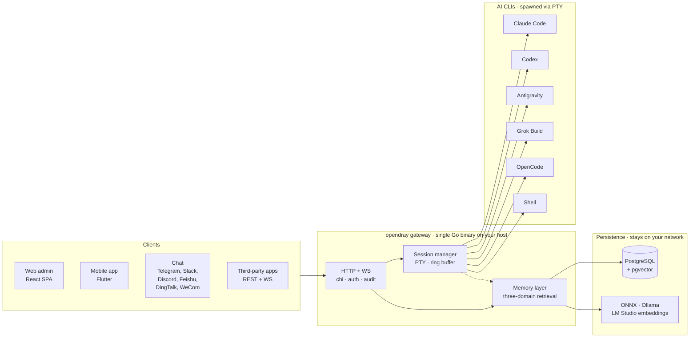

<p align="center">
  <a href="https://opendray.dev"></a>
</p>

<h1 align="center">opendray</h1>

<p align="center">
  <strong>Self-hosted gateway for Claude Code, Codex, Antigravity, Grok Build, and OpenCode. Run agent sessions on your own infrastructure. Drive from web, mobile, or chat.</strong>
</p>

<p align="center">
  <strong><a href="https://opendray.dev">opendray.dev</a></strong>
</p>

<p align="center">
  <a href="https://opendray.dev"></a>
  <a href="https://github.com/Opendray/opendray/releases/latest"></a>
  <a href="LICENSE"></a>
  <a href="https://github.com/Opendray/opendray/actions/workflows/ci.yml"></a>
  <a href="https://github.com/Opendray/opendray/discussions"></a>
  <br/>
  
  
  
  
</p>

<p align="center">
  🌐 <strong>English</strong> · <a href="README.zh.md">简体中文</a> · <a href="README.fa.md">فارسی</a> · <a href="README.es.md">Español</a> · <a href="README.pt-BR.md">Português</a> · <a href="README.ja.md">日本語</a> · <a href="README.ko.md">한국어</a> · <a href="README.fr.md">Français</a> · <a href="README.de.md">Deutsch</a> · <a href="README.ru.md">Русский</a>
</p>

<p align="center">
  <a href="docs/getting-started.md"></a>
  <a href="#how-it-looks"></a>
  <a href="https://opendray.dev"></a>
</p>



Running Claude Code or Codex over SSH means the agent dies the moment your laptop closes. opendray runs it on a host that stays awake (a Mac mini under your desk, a NAS, a VPS) and lets you reattach from a web admin, a mobile app, or a chat message. Sessions keep executing whether or not anyone is connected. Multiple accounts get pooled with per-tier balancing and live account-switch. A local-first memory layer keeps every embedding on your network.

---

## What is opendray?

**opendray** wraps the AI coding CLIs you already use (Claude Code, Codex, Antigravity, Grok Build, OpenCode, plus any shell) and turns them into something you can drive from anywhere. Run sessions on your home server, NAS, or VPS. Get notified on Telegram when a session goes idle. Reply from your phone to feed the next prompt back in. All over a self-hosted gateway you control end to end.

- 🛰 **One backend, three surfaces.** Single Go binary serving a React web admin and a Flutter mobile app, with every action also exposed over a REST + WebSocket API for third-party integrations.
- 🎭 **Round Table — cross-vendor AI group chat (experimental).** Seat Claude, Codex, Antigravity, Grok, and OpenCode plus yourself in one shared thread. `@mention` who should answer (or `@all`); each replies in character after reading the whole conversation, so different foundation-model families react to each other. Summarize on demand, or turn the discussion into a role-assigned execution plan where every step runs as a real session.
- 💬 **Six bidirectional channels, no walled gardens.** Telegram, Slack, Discord, Feishu (飞书), DingTalk (钉钉), WeCom (企业微信), plus a Bridge adapter for anything custom. Replies on any channel route back into the right session.
- 🧠 **Local-first memory.** ONNX / Ollama / LM Studio embeddings with three-scope retrieval (user, project, session), smart ranking, and cross-layer conflict detection. No vector data leaves your network.
- 🔌 **Integration-grade API.** Scoped API keys, per-call audit log, reverse-proxy mounts. Treat opendray as the gateway behind your own product or just as a personal command centre.
- 🔑 **Multi-account fleet for Claude, Codex, Antigravity.** Drop multiple logged-in credential directories onto the host; opendray auto-discovers them via a filesystem watcher, balances new sessions across enabled accounts, and lets you switch a live session between accounts **without losing the conversation** (transcript migrates under the hood). Each account row shows live capacity (subscription tier, rate-limit tier, active sessions, last-used, current login email).
- 🔒 **Self-hosted, licence-clear.** Apache 2.0, one static binary, cosign-signed releases with SPDX SBOM. No telemetry, no cloud account, no subscription.

## How it looks

opendray is a Go binary that serves a web admin at `/admin/` and a REST + WebSocket API at `/api/v1/*`. Here is what it does, in the shapes you would actually see.

### List running sessions

```
$ opendray sessions ls
ID        PROVIDER      PROJECT              STATE     STARTED
ses_a1f   claude-code   app/web              running   2h ago
ses_b2c   codex         internal/session     idle      5m ago
ses_c9d   grok-build    docs/                running   14m ago
ses_d34   shell         misc/deploy-logs     idle      1h ago
```

### List installed providers and their versions

```
$ opendray providers list
PROVIDER      VERSION     ACCOUNTS   ACTIVE   NOTES
claude-code   1.4.11      3          1        auto-discovered via CLAUDE_CONFIG_DIR
codex         0.29.0      2          1        openai login
antigravity   0.7.2       1          0        agy, HOME-isolated
grok-build    2.5.1       1          1        xai
opencode      0.6.3       -          0        local endpoint required
shell         -           -          1        arbitrary
```

### Attach to a session from the browser and keep going after your laptop sleeps

The web admin embeds xterm.js. You see the same PTY the CLI wrote to. Close the browser tab and the session keeps running on the host. Reopen it hours later and the transcript is where you left it.

```
[claude-code ses_a1f · app/web · 2h 14m]

> refactor the router to lazy-load the mobile view

I'll look at the current router and figure out the cleanest split.

● Read(app/web/src/router.tsx)
  ⎿ 342 lines
● Grep(pattern: "loadable", path: "app/web/src")
  ⎿ found 3 uses
...
```

### Route a Telegram reply back into the same session



Same shape for Slack, Discord, Feishu, DingTalk, WeCom, and any Bridge-adapter transport.

### Fan out a memory query across three scopes at once



Every scope stores embeddings from your own provider (ONNX bundled, Ollama, or LM Studio). Nothing leaves your network.

### Swap accounts mid-conversation without losing the transcript



Same for Codex accounts and Antigravity accounts. `Carry-context` is on by default; untick to start clean on the new identity.

## Features

|  |  |
| --- | --- |
| **Sessions** | Attach to a running Claude Code, Codex, Antigravity, Grok Build, OpenCode, or shell session from web, mobile, or chat. Sessions survive client disconnect and host reboot. Staged image attachments, TUI theme-following, and mouse-wheel scrolling in full-screen TUIs. |
| **Round Table** *(experimental)* | Seat several providers (Claude / Codex / Antigravity / Grok / OpenCode) plus yourself in one shared thread. `@mention` who should reply (or `@all`); each answers in character after reading the whole conversation. Summarize the discussion, or convert it into a role-assigned, multi-session execution plan bound to a shared project. Web + mobile, per-agent bubble colours. |
| **Providers** | 5 first-class AI coding CLIs plus arbitrary shell. Adding a new CLI is a JSON descriptor drop-in under `internal/catalog/builtin/`. Per-provider MCP-server injection (Vault, memory, integrations). One-click CLI version checks + updates from the Providers page. |
| **Database** | Inspect and query your project databases from the session inspector — PostgreSQL, MySQL, MariaDB, and SQLite. Cryptographic per-project isolation, exact bigint handling, consistent table metadata. Available in web and mobile. |
| **Memory** | Three-scope retrieval (user, project, session). Local-first embeddings via ONNX, Ollama, or LM Studio. Cross-layer conflict detection. Global knowledge pages injected at spawn. Compiler flywheel distils episodes into reusable playbooks. |
| **Channels** | Telegram, Slack, Discord, Feishu, DingTalk, WeCom. Bridge adapter for custom transports. Bidirectional: sessions notify, replies feed back. |
| **Integrations** | REST + WebSocket API with scoped API keys, per-call audit log, reverse-proxy mounts. HashiCorp Vault MCP for secret access. Public [`docs/integration-guide.md`](docs/integration-guide.md). |
| **Ops** | Single Go binary. One-line installer (Linux, macOS, WSL2). Self-managing (`opendray update / start / stop / providers update`). Encrypted PostgreSQL backups + data exports. Goreleaser pipeline with cosign-signed releases + SPDX SBOM. |
| **Security** | Apache 2.0. No telemetry, no cloud account. Cosign keyless (Sigstore) signing. `ProtectSystem=strict` systemd hardening. Multi-tenant-safe scoped tokens. |

## Architecture at a glance

A single Go binary on your host runs the show. Clients drive sessions through HTTP/WebSocket, the session manager spawns each AI CLI in its own PTY, and the memory layer keeps shared state in Postgres with vector embeddings from your own provider.



Everything in the diagram runs on your network. No cloud dependencies, no inference outside your control.

## Comparison

### opendray vs known AI clients

|  | opendray | Claude Desktop | Cursor | CLI over SSH | ChatGPT Desktop |
| --- | --- | --- | --- | --- | --- |
| Session survives client disconnect | ✅ | ❌ | ❌ | ⚠️ (tmux / screen) | ❌ |
| Multi-account pool with live switch | ✅ | ❌ | ❌ | ❌ | ❌ |
| Cross-session memory layer | ✅ | ❌ | Partial | ❌ | Partial |
| Host filesystem + tool use | ✅ | Limited | ✅ | ✅ | Limited |
| Mobile client with feature parity | ✅ | ❌ | ❌ | ⚠️ (SSH client) | Partial |
| Chat channel adaptors | ✅ (6) | ❌ | ❌ | ❌ | ❌ |
| Self-hosted | ✅ | ❌ | ❌ | ✅ | ❌ |
| Licence | Apache 2.0 | Proprietary | Proprietary | (varies) | Proprietary |

### opendray vs self-hosted chat frontends

|  | opendray | Open WebUI | LibreChat | Dify |
| --- | --- | --- | --- | --- |
| Runs actual agent CLI (not just chat) | ✅ | ❌ | ❌ | Partial |
| Tool use + file writes on host | ✅ | ❌ | ❌ | Sandboxed |
| Multiple AI coding CLIs in one gateway | ✅ (5) | ❌ | ❌ | ❌ |
| Cross-session memory | ✅ | Basic | Basic | ✅ |
| PTY session with terminal reattach | ✅ | ❌ | ❌ | ❌ |
| Chat channel adaptors | ✅ (6) | Partial | Partial | ✅ |
| Licence | Apache 2.0 | MIT | MIT | Apache 2.0 |

## Who is this for?

**Solo dev running a homelab.** You already have a Mac mini, NAS, or Proxmox box running 24/7. You've been running Claude Code over SSH but the session dies every time your laptop sleeps. You want the CLI to keep going, and you want to reattach from your phone on the train. opendray is the gateway that puts your host between you and the CLI.

**Small-team lead standing up shared AI infrastructure.** Your team has 3-5 Anthropic accounts spread across work and personal plans. You want to pool them, watch usage per account, and let anyone on the team drive a session from the browser. opendray gives you multi-account pooling, per-account observability, scoped API keys per teammate, and a mobile app they can install without an App Store submission.

**Integrator building on top of a session-runner.** You are building a product that needs to spawn Claude Code, Codex, or Grok Build sessions with tool use, and you don't want to reimplement session lifecycle, PTY handling, memory, or channel routing. opendray exposes every action over REST + WebSocket with scoped keys, per-call audit logs, and reverse-proxy mounts. Treat it as your agent runtime.

## Install

### One-line installer

**Linux / macOS / WSL2**

```sh
curl -fsSL https://raw.githubusercontent.com/Opendray/opendray/main/scripts/install.sh | bash
```

**Windows** sets up WSL2 first, then runs the Linux installer inside it. [details →](scripts/README.md#windows)

```powershell
irm https://raw.githubusercontent.com/Opendray/opendray/main/scripts/install-windows.ps1 | iex
```

Walks through Postgres setup, AI-CLI install, admin credentials, and service registration, landing a running gateway in ~5 to 10 minutes. See [**`scripts/README.md`**](scripts/README.md) for what the wizard does, the file layout it creates, options, and troubleshooting.

> **Want the manual walkthrough?** Read [**docs/getting-started.md**](docs/getting-started.md), a 15-minute end-to-end guide that mirrors what the wizard does so you can verify each step yourself.

### npm / npx (Node ≥ 18)

Install globally and put `opendray` on `PATH`:

```sh
npm install -g opendray
```

Or run on demand without installing:

```sh
npx opendray
```

This installs **just the binary**, no wizard, no service, no Postgres. The package pulls the matching `opendray-{linux,darwin}-{x64,arm64}` platform binary via `optionalDependencies` (the esbuild / Biome pattern, no `postinstall`, no network call at install time). Good for scripted environments, ephemeral runners, or when you already run your own Postgres and process supervisor.

You still bring a database and start the gateway yourself:

```sh
# 1. PostgreSQL 15+ with pgvector. Point a DSN at it, set an admin password.
export OPENDRAY_DATABASE_URL="postgres://opendray:pw@127.0.0.1:5432/opendray?sslmode=disable"
export OPENDRAY_ADMIN_PASSWORD="$(openssl rand -base64 24)"
# 2. Apply the schema, then run (foreground).
opendray migrate
opendray serve        # → http://127.0.0.1:8770/admin/
```

Full walkthrough (pgvector setup, `config.toml`, running as a systemd / launchd service, and updating) in [**docs/install-binary.md**](docs/install-binary.md).

### Uninstall (Linux / macOS)

**Default.** Stops the gateway and removes the binary, but **keeps** your `config.toml`, data directory (bcrypt keyfile, sessions, notes, vault), logs, and the PostgreSQL database so a re-install resumes where you left off:

```sh
curl -fsSL https://raw.githubusercontent.com/Opendray/opendray/main/scripts/uninstall.sh | bash
```

**Full purge.** Also drops the PG database + role, deletes config / data / logs, removes the service user. Includes a post-delete verification step that bails loudly if anything survived:

```sh
curl -fsSL https://raw.githubusercontent.com/Opendray/opendray/main/scripts/uninstall.sh | OPENDRAY_PURGE=1 bash
```

### Day-to-day commands

After install, the `opendray` binary handles its own lifecycle, with no need to remember `systemctl` / `launchctl` incantations:

```sh
sudo opendray update --restart   # download latest release, verify SHA, atomic replace + restart
```

```sh
sudo opendray providers update   # bump installed AI CLIs (claude / codex / antigravity) to npm-latest
```

```sh
opendray providers list          # see which AI CLIs are installed + their versions
```

```sh
sudo opendray start              # start | stop | restart | status, wraps systemd / launchd
```

`opendray --help` lists the full subcommand set.

### Deploy path picker

Every supported path includes session spawn, AI-CLI access, encrypted backups, and the full integration API. opendray is a host-resident gateway; it spawns AI CLIs via PTYs and shares process state (`~/.claude`, ssh-agent, project files) with them. That model is incompatible with the container isolation that production Docker would impose, so Docker is not a supported deployment path for v2.x.

| Path | Best for | Jump to |
|---|---|---|
| 📦 **Pre-built binary** | "Just run it", Linux / macOS, any supervisor | [Releases page](https://github.com/Opendray/opendray/releases) → see [Production deploy](#production-deploy) |
| 🐧 **systemd unit** | Bare-metal / VM / LXC Linux box | [Production deploy §A](#option-a-systemd-bare-metal--vm--lxc) |
| 🍎 **macOS LaunchDaemon** | Mac mini / Mac Studio as home server | [Production deploy §C](#option-c-macos-launchd-mac-mini--studio-as-home-server) |
| 🛠 **Build from source** | Dev / contributing / custom builds | [Quickstart](#quickstart-5-minute-dev-path) below |

## Quickstart (5-minute dev path)

For a full walkthrough with prereqs and troubleshooting, see [`docs/quickstart.md`](docs/quickstart.md). The condensed dev path:

```bash
# 1. Have a Postgres 15+ running on 127.0.0.1:5432 with pgvector enabled
#    (apt install postgresql-16 postgresql-16-pgvector / brew install postgresql@16 pgvector).
#    Point [database].url at any other DSN if you'd rather use a remote PG.

# 2. Local config, already gitignored.
cp config.example.toml config.toml
$EDITOR config.toml          # set [database].url, [admin].password

# 3. Build the web bundle into the embed tree.
cd app/web && pnpm install && pnpm build && cd ../..

# 4. Apply schema.
go run ./cmd/opendray migrate -config config.toml

# 5. Run.
go run ./cmd/opendray serve -config config.toml
# → REST + WS:  http://127.0.0.1:8770/api/v1/...
# → Web admin:  http://127.0.0.1:8770/admin/
```

This runs OpenDray in the foreground; Ctrl-C kills it. For a long-running
daemon, see **Production deploy** below.

## Production deploy

Four supported deploy paths, pick whichever fits your environment.
Each one gives you auto-restart on crash, persistent state, and
separation of secrets from config.

### Option A: systemd (bare-metal / VM / LXC)

The recommended Linux deploy path. Ships a hardened unit at
[`deploy/systemd/opendray.service`](deploy/systemd/opendray.service)
with sandboxing (`ProtectSystem=strict`, `NoNewPrivileges`,
`MemoryDenyWriteExecute`, capability scrub), `migrate`-then-`serve`
boot, and a 20s graceful-stop window.

**Get a binary first.** Either grab a pre-built archive from the
[Releases page](https://github.com/Opendray/opendray/releases)
(`opendray_*_linux_<arch>.tar.gz`, which unpacks to a single `opendray`
binary), or build from source via the [Quickstart](#quickstart-5-minute-dev-path)
above (`go build ./cmd/opendray`).

```bash
# 1. Install the binary you just grabbed (or built).
sudo install -m 0755 /path/to/opendray /usr/local/bin/opendray

# 2. Create the service user + state dir.
sudo useradd -r -s /usr/sbin/nologin -d /var/lib/opendray opendray
sudo install -d -o opendray -g opendray -m 0700 /var/lib/opendray

# 3. Drop config + secrets (root-owned; mode 0640).
sudo install -D -m 0640 config.example.toml /etc/opendray/config.toml
sudo $EDITOR /etc/opendray/config.toml             # set [database].url etc.
sudo install -D -m 0640 -o root -g opendray /dev/null /etc/opendray/env.d/secrets
sudo $EDITOR /etc/opendray/env.d/secrets           # OPENDRAY_ADMIN_PASSWORD=…

# 4. Install + enable the unit.
sudo cp deploy/systemd/opendray.service /etc/systemd/system/
sudo systemctl daemon-reload
sudo systemctl enable --now opendray

# 5. Verify.
sudo systemctl status opendray
sudo journalctl -u opendray -f --no-pager
```

The unit runs `opendray migrate` as `ExecStartPre`, so the first boot
applies all migrations before `serve` ever starts. Restarts are
`on-failure` with a 5s back-off and a 5-burst limit per minute.

### Option B: Direct binary + your own process supervisor

For LXC without systemd, FreeBSD `rc.d`, OpenRC, or anything else.
Build once, run with whatever supervisor you already use:

```bash
# Cross-compile a release archive locally:
goreleaser release --clean --snapshot
ls dist/                  # opendray_*_linux_amd64.tar.gz etc.

# Or grab a published release artefact:
# https://github.com/Opendray/opendray/releases
```

Then point your supervisor (s6, runit, supervisord, runwhen) at:

```
/usr/local/bin/opendray serve -config /etc/opendray/config.toml
```

Pre-flight: run `opendray migrate -config /etc/opendray/config.toml`
once before the first `serve`, or as a pre-start hook in your
supervisor of choice.

### Option C: macOS launchd (Mac mini / Studio as home server)

For Apple Silicon Mac mini / Mac Studio running 24/7. Ships a
LaunchDaemon at
[`deploy/launchd/com.opendray.opendray.plist`](deploy/launchd/com.opendray.opendray.plist)
that starts at boot before any user login, restarts on crash with
a 5s throttle, and logs to `/usr/local/var/log/opendray/`.

```bash
# 1. Install the darwin binary + config + state dirs.
sudo install -m 0755 ./opendray /usr/local/bin/opendray
sudo install -d -m 0755 \
  /usr/local/etc/opendray \
  /usr/local/var/lib/opendray \
  /usr/local/var/log/opendray
sudo install -m 0640 config.example.toml /usr/local/etc/opendray/config.toml
sudo $EDITOR /usr/local/etc/opendray/config.toml    # set [database].url etc.

# 2. Apply migrations once.
sudo /usr/local/bin/opendray migrate \
  -config /usr/local/etc/opendray/config.toml

# 3. Install + load the LaunchDaemon.
sudo cp deploy/launchd/com.opendray.opendray.plist /Library/LaunchDaemons/
sudo chown root:wheel /Library/LaunchDaemons/com.opendray.opendray.plist
sudo chmod 0644 /Library/LaunchDaemons/com.opendray.opendray.plist
sudo launchctl bootstrap system /Library/LaunchDaemons/com.opendray.opendray.plist

# 4. Verify.
sudo launchctl print system/com.opendray.opendray
tail -f /usr/local/var/log/opendray/opendray.log
```

Restart with `sudo launchctl kickstart -k system/com.opendray.opendray`;
unload entirely with `sudo launchctl bootout system/com.opendray.opendray`.

Postgres on macOS: install via Homebrew (`brew install postgresql@17 && brew services start postgresql@17`) and point `[database].url` at
`postgres://$USER@127.0.0.1:5432/opendray`. Add `pgvector` with
`brew install pgvector` and `CREATE EXTENSION vector` inside the
opendray database.

---

For Proxmox-specific LXC notes (PTY in unprivileged containers,
networking, cgroup tweaks), see [`deploy/lxc/proxmox-pty-notes.md`](deploy/lxc/proxmox-pty-notes.md).

For reverse-proxy / TLS termination (nginx, Caddy, Traefik, Cloudflare
Tunnel), see [`docs/operator-guide.md`](docs/operator-guide.md) §Topology.

### Optional: enable encrypted DB backups + data exports

```bash
# Master passphrase (env-only, never write into config.toml).
export OPENDRAY_BACKUP_KEY="$(openssl rand -base64 32)"
export OPENDRAY_BACKUP_ENABLED=1

# pg_dump / pg_restore must match the server's major version. On
# Apple Silicon dev machines pointing at a PG17 server:
export OPENDRAY_BACKUP_PG_DUMP_PATH=/opt/homebrew/opt/postgresql@17/bin/pg_dump
export OPENDRAY_BACKUP_PG_RESTORE_PATH=/opt/homebrew/opt/postgresql@17/bin/pg_restore
```

Restart opendray; the sidebar grows a Backups page (`/backups`)
for encrypted PostgreSQL dumps + restore, and `/export` for
zip-bundle data exports + import. See [`docs/operator-guide.md`](docs/operator-guide.md) §Backup for the full lifecycle.

A single Go binary carries the whole web bundle, so no Node runtime
is required at runtime, no separate static-file server, no Caddy/nginx
needed. Cloudflare Tunnel terminates TLS in front of `:8770`.

## Layout

```
cmd/opendray/   binary entry point
internal/       Go backend (gateway, sessions, memory, channels,
                integrations, git, search, one package per domain)
app/web/        React + Vite admin SPA (embedded in the binary)
app/mobile/     Flutter app (iOS + Android)
app/shared*/    cross-surface shared UI + i18n strings
docs/           guides: install, getting-started, integration, ops
deploy/         systemd / launchd / LXC units + install scripts
```

## Web frontend

`app/web/` builds a single SPA into `internal/web/dist/`, which the Go
binary embeds and serves at `/admin/*`. The Vite dev server at `:5173`
proxies `/api` to `:8770` for HMR-driven development.

```bash
# dev (hot reload on the React side, separate Go server for the API)
cd app/web && pnpm dev               # http://localhost:5173
go run ./cmd/opendray serve -config ../../config.toml   # other terminal

# prod (one binary delivers everything)
cd app/web && pnpm build              # writes ../../internal/web/dist
cd ../..
go build ./cmd/opendray               # bakes dist into the binary
./opendray serve -config config.toml
```

See [`app/web/README.md`](app/web/README.md) for the frontend stack
(React + Vite + Tailwind v4 + shadcn/ui + TanStack Router/Query +
Zustand + xterm.js) and per-W milestone notes.

## Mobile app

`app/mobile/` is a Flutter app for **iOS and Android** with feature
parity with the web admin. It attaches to a running gateway over HTTPS.
Enter the **Gateway URL** + admin login on first launch and you get the
same Sessions / Channels / Integrations / Memory / Git surfaces. There is
no App Store / Play Store build by design (self-hosted, single-tenant):
you build it yourself and sign it with your own identity.

**[→ Build & install guide](docs/mobile-app.md).** Make the gateway
reachable from the phone, then sideload an Android APK or install on
iPhone via Xcode. ([all 10 languages](docs/mobile-app.md); switch at the
top of the guide.)

## FAQ

### What is opendray?

opendray is a self-hosted gateway that wraps the AI coding CLIs you already use (Claude Code, Codex, Antigravity, Grok Build, OpenCode, and shell) and turns them into sessions you can drive from a web admin, a Flutter mobile app, or six chat channels (Telegram, Slack, Discord, Feishu, DingTalk, WeCom). One Go binary. Apache 2.0. Your infra, your data, your tokens.

### Which AI CLIs does opendray support?

Five first-class providers as of v2.10.x: **Claude Code** (Anthropic), **Codex** (OpenAI), **Antigravity** (Google `agy`), **Grok Build** (xAI), and **OpenCode**. Plus arbitrary shell for anything else. Adding a new CLI is a JSON descriptor under `internal/catalog/builtin/`; no adapter code required for common cases.

### How is opendray different from Claude Desktop or ChatGPT Desktop?

Claude Desktop and ChatGPT Desktop are chat clients that run on your laptop and die when the laptop closes. opendray runs the actual agentic CLI on a host that stays awake and lets you reattach from anywhere. Sessions survive client disconnect, laptop sleep, and network drops. Multiple accounts get pooled with live switch between them.

### How is opendray different from running Claude Code over SSH?

Four things SSH does not give you: (1) session survives when you disconnect (no `tmux` gymnastics required, though you can still use tmux inside), (2) attach from a phone or a chat channel, not just a terminal, (3) shared memory layer across every session on the host, (4) multi-account pool with per-tier balancing and live account-switch mid-conversation.

### How is opendray different from Open WebUI, LibreChat, or Dify?

Those are chat frontends against a model API. They send prompts to `api.openai.com` (or similar) and render the response. opendray runs the actual agent CLI process on your host, complete with tool use, file writes, memory, and MCP servers. If a task needs `Read` / `Edit` / `Bash` on your host filesystem, opendray does it; chat frontends do not.

### Can I use multiple Claude, Codex, or Antigravity accounts?

Yes. Drop the logged-in credential directories on the host (Claude uses `CLAUDE_CONFIG_DIR`, Antigravity uses `$HOME` isolation) and opendray auto-discovers them via a filesystem watcher. New sessions balance across enabled accounts by tier + capacity. You can switch a live session between accounts without losing the conversation (transcript migrates under the hood). Rate-limit auto-failover carries context by default.

### Where is my data stored?

PostgreSQL on your host (bring your own instance, or use the one the installer bootstraps). Embeddings come from your own provider (ONNX bundled, Ollama, or LM Studio). No vector data, transcripts, or memory entries leave your network. No telemetry. No cloud account. `opendray` never phones home.

### Can I run this in Docker?

Not currently (v2.x). opendray spawns AI CLIs via PTYs and shares host process state (credential directories, ssh-agent, project files) with them. That is incompatible with the container isolation production Docker imposes. Use the pre-built binary and systemd or launchd (Linux + macOS both have one-line installers). See [Production deploy](#production-deploy).

### Does opendray work on a NAS, Mac mini, or Raspberry Pi?

NAS: yes on Synology / QNAP / TrueNAS-Scale (anything with Linux + Postgres). Mac mini: yes, this is a common deploy (LaunchDaemon shipped). Raspberry Pi: works on Pi 4 / Pi 5 but underpowered for concurrent sessions; single-user hobby use only.

### Is opendray free? What is the licence?

Apache 2.0. Free forever. No paid tier, no telemetry, no phone-home. Sponsors welcomed (see [`.github/FUNDING.yml`](.github/FUNDING.yml)).

### How do I contribute?

Read [`CONTRIBUTING.md`](CONTRIBUTING.md) and [`CODE_OF_CONDUCT.md`](CODE_OF_CONDUCT.md). Concrete ways in: (1) translate a README or docs page into a language we already ship, (2) add a provider descriptor for a new AI coding CLI under `internal/catalog/builtin/`, (3) write a channel adaptor for a chat platform we do not cover, (4) contribute screenshots for the docs, (5) file a bug or a feature request. PRs need CI green; translations are advisory-only; no CLA.

## Documentation

- [`docs/getting-started.md`](docs/getting-started.md): **start here** if you're new. Zero to first session in 15 minutes, including installing the wrapped CLIs and bootstrapping Postgres.
- [`docs/install-binary.md`](docs/install-binary.md): install from the npm package or a release binary (bring your own Postgres) and run it as a systemd / launchd service.
- [`docs/quickstart.md`](docs/quickstart.md): 5-minute dev environment (assumes you already know the moving parts).
- [`docs/mobile-app.md`](docs/mobile-app.md): build & install the Flutter mobile app; sideload an Android APK or install on iPhone via Xcode, then point it at your gateway.
- [`docs/operator-guide.md`](docs/operator-guide.md): deploy + ops reference for production-ish setups.
- [`docs/integration-guide.md`](docs/integration-guide.md): how to write an external integration in any language.
- [`VERSIONING.md`](VERSIONING.md): versioning strategy (major-as-generation).
- [`CHANGELOG.md`](CHANGELOG.md): release history.

## Status

Current generation: **v2.10.x**. See [`CHANGELOG.md`](CHANGELOG.md) for release history and [`VERSIONING.md`](VERSIONING.md) for the major-as-generation policy (major = product generation, not strict SemVer "breaking change").

This generation ships:

- **One-line installer + uninstaller wizards** (Linux + macOS; Windows funnels through WSL2). Walks the operator through Postgres bootstrap, AI-CLI install, admin credentials, listen address, binary install, schema migration, and service registration.
- **Self-managing binary.** `opendray update / start / stop / restart / status / providers list / providers update` so operators don't touch `systemctl` / `launchctl` for routine ops.
- **Goreleaser release pipeline.** Cross-compiled binaries (linux/darwin × amd64/arm64), cosign keyless signing (Sigstore), SPDX SBOM, atomically verified self-update.

## Tests

```bash
go test -race ./...        # backend
cd app/web && pnpm build   # web (TS strict + vite production build)
```

End-to-end smoke flows are tracked in commit messages per milestone.
A Playwright harness is a planned follow-up.

## Relationship to v1

v1 (`Opendray/opendray`) is the legacy codebase, now archived. v2 is
the current and active generation, feature-complete and the only
branch receiving development. Of the 16 v1 builtins, four migrated
into the v2 backend; the rest became client-side features, channel
adaptors, or integration-API consumers.

## License

Apache 2.0. See [`LICENSE`](LICENSE). (v1 was MIT; v2 is licensed
independently.)
