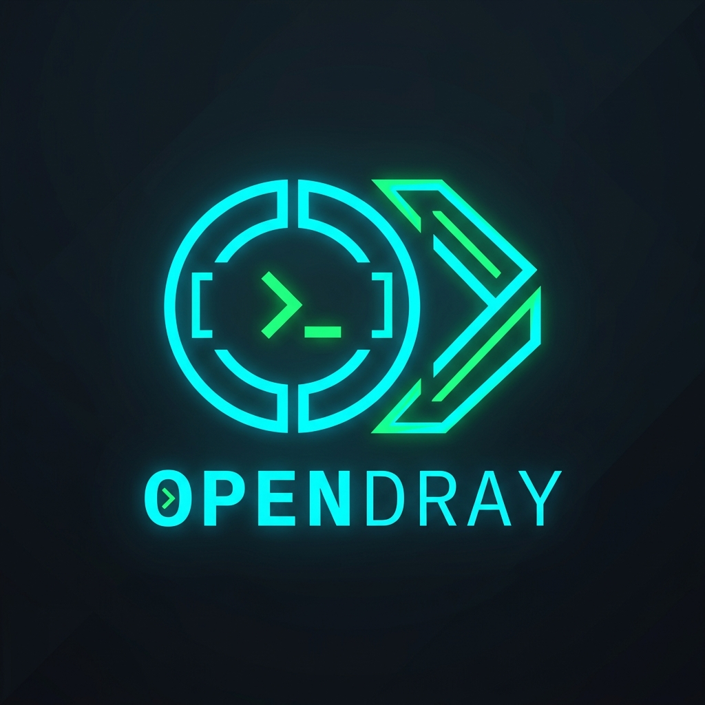

<p align="center">
  <a href="https://opendray.dev"></a>
</p>

<h1 align="center">opendray</h1>

<p align="center">
  <strong>Run Claude Code, Codex, Antigravity, Grok Build & OpenCode on your own server, and drive them from web, mobile, or chat.</strong>
</p>

<p align="center">
  <a href="https://opendray.dev">opendray.dev</a>
</p>

<p align="center">
  <a href="https://github.com/Opendray/opendray/releases/latest"></a>
  <a href="LICENSE"></a>
  <a href="https://github.com/Opendray/opendray/actions/workflows/ci.yml"></a>
  <a href="https://github.com/Opendray/opendray/discussions"></a>
  <br/>
  
  
  
  
</p>

<p align="center">
  🌐 <strong>English</strong> · <a href="README.zh.md">简体中文</a> · <a href="README.fa.md">فارسی</a> · <a href="README.es.md">Español</a> · <a href="README.pt-BR.md">Português</a> · <a href="README.ja.md">日本語</a> · <a href="README.ko.md">한국어</a> · <a href="README.fr.md">Français</a> · <a href="README.de.md">Deutsch</a> · <a href="README.ru.md">Русский</a>
</p>

---

Running an AI coding agent over SSH means it **dies the moment your laptop sleeps**. opendray runs it on a host that stays awake (a Mac mini, a NAS, a VPS) and lets you reattach from a browser, a phone, or a chat message. The session keeps executing whether or not anyone is connected.

One Go binary. Your infrastructure. No cloud account, no telemetry, no subscription.

## Why opendray

- **Sessions that never drop.** The agent runs on your host and survives client disconnect, laptop sleep, and host reboot. Reattach hours later; the transcript is exactly where you left it.
- **Drive from anywhere.** A React web admin, a Flutter mobile app, and six chat channels (Telegram, Slack, Discord, Feishu, DingTalk, WeCom), every one bidirectional. Get pinged when a session goes idle; reply to feed the next prompt back in.
- **Five agents, one gateway.** Claude Code, Codex, Antigravity, Grok Build, OpenCode, plus any shell. Adding a CLI is a JSON descriptor drop-in.
- **Multi-account fleet.** Drop several logged-in accounts on the host; opendray pools them, balances new sessions, and switches a live session between accounts **without losing the conversation**.
- **Local-first memory.** Cross-session recall across user / project / session scopes, embeddings from ONNX, Ollama, or LM Studio. No vector data leaves your network.
- **Built to build on.** REST + WebSocket API with scoped keys, per-call audit log, and reverse-proxy mounts. Use opendray as your own product's agent runtime.
- **Self-hosted & licence-clear.** Apache 2.0, one static binary, cosign-signed releases.

## Quick start

**Linux / macOS / WSL2.** The installer walks through Postgres, CLI install, admin credentials, and service registration (~5–10 min):

```sh
curl -fsSL https://raw.githubusercontent.com/Opendray/opendray/main/scripts/install.sh | bash
```

**Windows** sets up WSL2, then runs the same installer inside it:

```powershell
irm https://raw.githubusercontent.com/Opendray/opendray/main/scripts/install-windows.ps1 | iex
```

**Just the binary** (bring your own Postgres + supervisor):

```sh
npx opendray            # or: npm install -g opendray
```

Then open the web admin at **`http://<host>:8770/admin/`**.

📖 Prefer to do it by hand? The [15-minute getting-started guide](docs/getting-started.md) mirrors each step. Binary-only setup lives in [docs/install-binary.md](docs/install-binary.md); production deploy (systemd / launchd) in [docs/getting-started.md](docs/getting-started.md).

## Features

|  |  |
| --- | --- |
| **Sessions** | Attach to a running Claude Code, Codex, Antigravity, Grok Build, OpenCode, or shell session from web, mobile, or chat. Survive client disconnect and host reboot. Image attachments, TUI theme-following, mouse-wheel scroll in full-screen TUIs. |
| **Round Table** *(experimental)* | Seat several providers plus yourself in one shared thread. `@mention` who replies (or `@all`); each answers in character after reading the whole conversation. Summarize it, or convert it into a role-assigned, multi-session execution plan. |
| **Providers** | 5 first-class AI coding CLIs plus arbitrary shell. New CLI = a JSON descriptor under `internal/catalog/builtin/`. Per-provider MCP-server injection. One-click version checks + updates. |
| **Memory** | Three-scope retrieval (user, project, session). Local-first embeddings via ONNX, Ollama, or LM Studio. Cross-layer conflict detection. Knowledge pages injected at spawn. |
| **Database** | Inspect and query project databases from the session inspector: PostgreSQL, MySQL, MariaDB, SQLite. Per-project isolation. Web and mobile. |
| **Channels** | Telegram, Slack, Discord, Feishu, DingTalk, WeCom, plus a Bridge adapter for custom transports. Bidirectional: sessions notify, replies feed back. |
| **Integrations** | REST + WebSocket API with scoped keys, per-call audit log, reverse-proxy mounts. HashiCorp Vault MCP. See [integration guide](docs/integration-guide.md). |
| **Ops & security** | Single Go binary. One-line installer (Linux, macOS, WSL2). Self-managing (`opendray update / start / stop`). Encrypted Postgres backups. Cosign-signed releases + SPDX SBOM. Apache 2.0, no telemetry. |

## How it compares

|  | opendray | Claude Desktop | Cursor | CLI over SSH | ChatGPT Desktop |
| --- | --- | --- | --- | --- | --- |
| Session survives client disconnect | ✅ | ❌ | ❌ | ⚠️ tmux/screen | ❌ |
| Multi-account pool with live switch | ✅ | ❌ | ❌ | ❌ | ❌ |
| Cross-session memory layer | ✅ | ❌ | Partial | ❌ | Partial |
| Host filesystem + tool use | ✅ | Limited | ✅ | ✅ | Limited |
| Mobile client with feature parity | ✅ | ❌ | ❌ | ⚠️ SSH client | Partial |
| Chat channel adaptors | ✅ (6) | ❌ | ❌ | ❌ | ❌ |
| Self-hosted | ✅ | ❌ | ❌ | ✅ | ❌ |
| Licence | Apache 2.0 | Proprietary | Proprietary | (varies) | Proprietary |

Against self-hosted chat frontends (Open WebUI, LibreChat, Dify): opendray runs the **actual agent CLI** with tool use and file writes on the host, in a reattachable PTY, not just a chat box in front of an API.

## Who it's for

- **Homelab solo dev.** You have a box running 24/7 and you're tired of Claude Code dying when your laptop sleeps. Keep it running; reattach from your phone.
- **Small-team lead.** Pool 3–5 accounts, watch per-account usage, hand teammates scoped keys and a mobile app with no App Store submission.
- **Integrator.** You need to spawn agent sessions with tool use and don't want to reimplement session lifecycle, PTY handling, memory, or channel routing. Treat opendray as your agent runtime.

## How it works

A single Go binary on your host serves the web admin (`/admin/`) and a REST + WebSocket API (`/api/v1/*`). Clients drive sessions over HTTP/WS; the session manager spawns each AI CLI in its own PTY; the memory layer keeps shared state in Postgres with vector embeddings from your own provider. Everything runs on your network, with no inference outside your control.

> **Note:** opendray shares process state (`~/.claude`, ssh-agent, project files) with the CLIs it spawns, which is incompatible with production container isolation, so Docker is not a supported deploy path for v2.x. Run it on a host (bare metal, VM, or LXC).

## Production deploy

The one-line installer sets up a service for you. To wire it up yourself, each path gives you auto-restart on crash, persistent state, and secrets kept out of config.

**systemd (Linux, recommended).** Ships a hardened unit at [`deploy/systemd/opendray.service`](deploy/systemd/opendray.service) (`ProtectSystem=strict`, `NoNewPrivileges`, `migrate`-then-`serve` boot):

```sh
sudo install -m 0755 ./opendray /usr/local/bin/opendray
sudo useradd -r -s /usr/sbin/nologin -d /var/lib/opendray opendray
sudo install -D -m 0640 config.example.toml /etc/opendray/config.toml   # set [database].url
sudo cp deploy/systemd/opendray.service /etc/systemd/system/
sudo systemctl enable --now opendray
```

**macOS (Mac mini / Studio as home server)** uses a LaunchDaemon, and any other supervisor (OpenRC, FreeBSD `rc.d`) works with the plain binary. Full walkthroughs (secrets file, launchd plist, updates) live in [docs/install-binary.md](docs/install-binary.md).

## Docs & community

- 🚀 [Getting started](docs/getting-started.md) · [Quickstart (dev)](docs/quickstart.md) · [Binary install](docs/install-binary.md)
- 🔌 [Integration guide](docs/integration-guide.md)
- 💬 [Discussions](https://github.com/Opendray/opendray/discussions) · [Releases](https://github.com/Opendray/opendray/releases)

## License

[Apache 2.0](LICENSE). No telemetry, no cloud account, no subscription.
