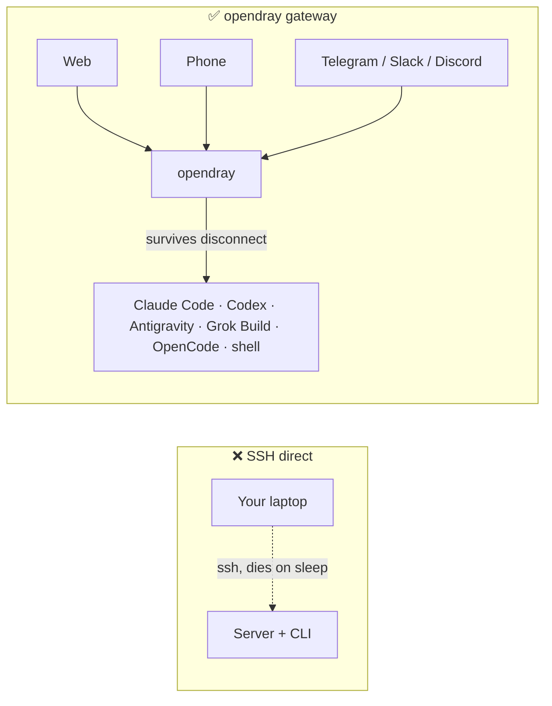
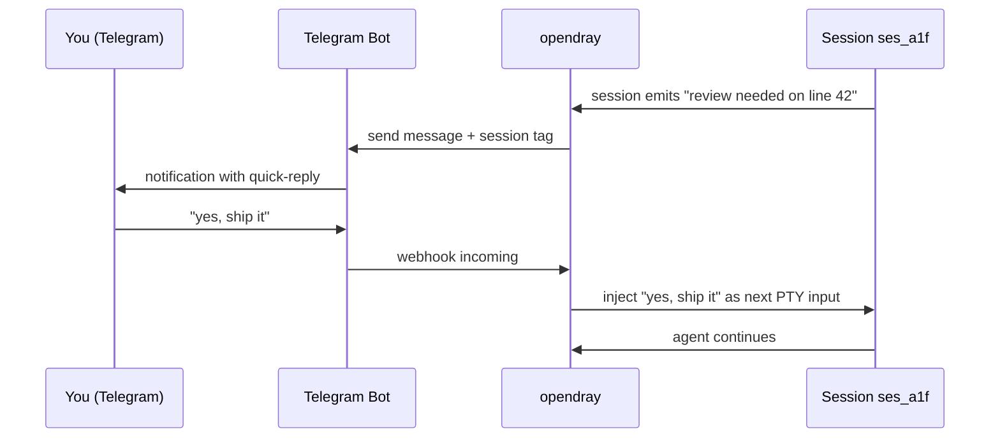
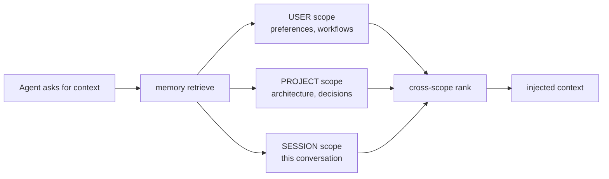
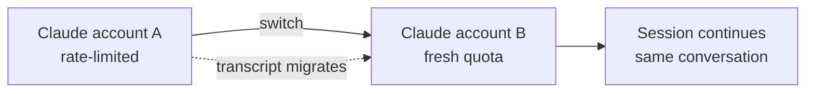
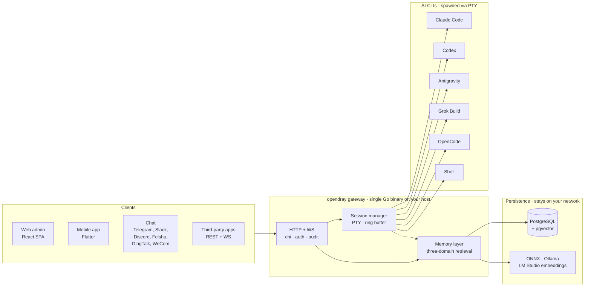

<p align="center">
  <a href="https://opendray.dev"></a>
</p>

<h1 align="center">opendray</h1>

<p align="center">
  <strong>Gateway self-hosted para Claude Code, Codex, Antigravity, Grok Build e OpenCode. Rode sessões de agente na sua própria infra. Controle pelo navegador, celular ou chat.</strong>
</p>

<p align="center">
  <strong><a href="https://opendray.dev">opendray.dev</a></strong>
</p>

<p align="center">
  <a href="https://opendray.dev"></a>
  <a href="https://github.com/Opendray/opendray/releases/latest"></a>
  <a href="LICENSE"></a>
  <a href="https://github.com/Opendray/opendray/actions/workflows/ci.yml"></a>
  <a href="https://github.com/Opendray/opendray/discussions"></a>
  <br/>
  
  
  
  
</p>

<p align="center">
  🌐 <a href="README.md">English</a> · <a href="README.zh.md">简体中文</a> · <a href="README.fa.md">فارسی</a> · <a href="README.es.md">Español</a> · <strong>Português</strong> · <a href="README.ja.md">日本語</a> · <a href="README.ko.md">한국어</a> · <a href="README.fr.md">Français</a> · <a href="README.de.md">Deutsch</a> · <a href="README.ru.md">Русский</a>
</p>

<p align="center">
  <a href="docs/getting-started.md"></a>
  <a href="#como-e-na-pratica"></a>
  <a href="https://opendray.dev"></a>
</p>



Rodar o Claude Code ou o Codex por SSH significa que o agente morre no instante em que seu notebook dorme. O opendray roda o agente num host que fica acordado (um Mac mini debaixo da sua mesa, um NAS, um VPS) e te deixa reconectar pelo admin web, por um app mobile ou por uma mensagem de chat. As sessões seguem executando, esteja alguém conectado ou não. Várias contas ficam num pool com balanceamento por tier e troca de conta ao vivo. Uma camada de memória local-first mantém cada embedding na sua rede.

---

## O que é o opendray?

O **opendray** encapsula as CLIs de coding com IA que você já usa (Claude Code, Codex, Antigravity, Grok Build, OpenCode, mais qualquer shell) e transforma elas em algo que dá pra controlar de qualquer lugar. Rode sessões no seu servidor de casa, NAS ou VPS. Receba uma notificação no Telegram quando uma sessão ficar ociosa. Responda do celular pra alimentar o próximo prompt. Tudo isso por um gateway self-hosted que você controla de ponta a ponta.

- 🛰 **Um backend, três superfícies.** Um único binário Go servindo um admin web em React e um app mobile em Flutter, com cada ação também exposta numa API REST + WebSocket pra integrações de terceiros.
- 💬 **Seis canais bidirecionais, sem jardim murado.** Telegram, Slack, Discord, Feishu (飞书), DingTalk (钉钉), WeCom (企业微信), mais um adaptador Bridge pra qualquer coisa custom. Respostas em qualquer canal são roteadas de volta pra sessão certa.
- 🧠 **Memória local-first.** Embeddings via ONNX / Ollama / LM Studio, retrieval em três escopos (usuário, projeto, sessão), ranking inteligente e detecção de conflito entre camadas. Nenhum dado vetorial sai da sua rede.
- 🔌 **API de nível integração.** API keys com scope, audit log por chamada, mounts de reverse-proxy. Trate o opendray como o gateway por trás do seu próprio produto, ou só como uma central de comando pessoal.
- 🔑 **Frota multi-conta para Claude, Codex e Antigravity.** Coloque vários diretórios de credenciais logadas no host; o opendray descobre eles automaticamente via filesystem watcher, balanceia as novas sessões entre as contas habilitadas, e te deixa trocar uma sessão em execução entre contas **sem perder a conversa** (o transcript é migrado por baixo dos panos). Cada linha de conta mostra a capacidade em tempo real (subscription tier, rate-limit tier, sessões ativas, último uso, email de login atual).
- 🔒 **Self-hosted, licença clara.** Apache 2.0, um único binário estático, releases assinadas com cosign e SBOM SPDX. Sem telemetria, sem conta na nuvem, sem assinatura.

<a id="como-e-na-pratica"></a>

## Como é na prática

O opendray é um binário Go que serve um admin web em `/admin/` e uma API REST + WebSocket em `/api/v1/*`. Aqui está o que ele faz, nas formas que você realmente veria.

### Listar as sessões em execução

```
$ opendray sessions ls
ID        PROVIDER      PROJECT              STATE     STARTED
ses_a1f   claude-code   app/web              running   2h ago
ses_b2c   codex         internal/session     idle      5m ago
ses_c9d   grok-build    docs/                running   14m ago
ses_d34   shell         misc/deploy-logs     idle      1h ago
```

### Listar os providers instalados e suas versões

```
$ opendray providers list
PROVIDER      VERSION     ACCOUNTS   ACTIVE   NOTES
claude-code   1.4.11      3          1        auto-discovered via CLAUDE_CONFIG_DIR
codex         0.29.0      2          1        openai login
antigravity   0.7.2       1          0        agy, HOME-isolated
grok-build    2.5.1       1          1        xai
opencode      0.6.3       -          0        local endpoint required
shell         -           -          1        arbitrary
```

### Conectar-se a uma sessão pelo navegador e seguir depois de o notebook dormir

O admin web embute o xterm.js. Você vê o mesmo PTY em que a CLI escreveu. Fecha a aba do navegador e a sessão segue rodando no host. Reabre horas depois e o transcript está onde você deixou.

```
[claude-code ses_a1f · app/web · 2h 14m]

> refactor the router to lazy-load the mobile view

I'll look at the current router and figure out the cleanest split.

● Read(app/web/src/router.tsx)
  ⎿ 342 lines
● Grep(pattern: "loadable", path: "app/web/src")
  ⎿ found 3 uses
...
```

### Rotear uma resposta do Telegram de volta pra mesma sessão



Mesmo formato pra Slack, Discord, Feishu, DingTalk, WeCom e qualquer transporte via adaptador Bridge.

### Fazer fan-out de uma consulta de memória em três escopos ao mesmo tempo



Cada escopo guarda embeddings do seu próprio provider (ONNX embutido, Ollama ou LM Studio). Nada sai da sua rede.

### Trocar de conta no meio de uma conversa sem perder o transcript



Mesma coisa pra contas Codex e Antigravity. O `Carry-context` vem ligado por padrão; desmarque pra começar do zero na nova identidade.

## Features

|  |  |
| --- | --- |
| **Sessões** | Conecte-se a uma sessão em execução do Claude Code, Codex, Antigravity, Grok Build, OpenCode ou shell pelo web, mobile ou chat. Sessões sobrevivem à desconexão do cliente e a reboots do host. Overlay de transcript ao vivo pra TUIs que descartam entrada de scroll wheel. |
| **Providers** | 5 CLIs de coding com IA de primeira classe, mais shell arbitrário. Adicionar uma nova CLI é um drop-in de descritor JSON em `internal/catalog/builtin/`. Injeção de MCP servers por provider (Vault, memória, integrações). |
| **Memória** | Retrieval em três escopos (usuário, projeto, sessão). Embeddings local-first via ONNX, Ollama ou LM Studio. Detecção de conflito entre camadas. Páginas de conhecimento global injetadas no spawn. Flywheel do compiler destila episódios em playbooks reutilizáveis. |
| **Canais** | Telegram, Slack, Discord, Feishu, DingTalk, WeCom. Adaptador Bridge pra transportes custom. Bidirecional: sessões notificam, respostas voltam. |
| **Integrações** | API REST + WebSocket com API keys por scope, audit log por chamada e mounts de reverse-proxy. MCP do HashiCorp Vault pra acesso a segredos. [`docs/integration-guide.md`](docs/integration-guide.md) público. |
| **Ops** | Um único binário Go. Instalador de uma linha (Linux, macOS, WSL2). Autogerenciável (`opendray update / start / stop / providers update`). Backups criptografados do PostgreSQL + exports de dados. Pipeline Goreleaser com releases assinadas com cosign e SBOM SPDX. |
| **Segurança** | Apache 2.0. Sem telemetria, sem conta na nuvem. Assinatura keyless com cosign (Sigstore). Hardening de systemd com `ProtectSystem=strict`. Tokens com scope seguros pra multi-tenant. |

## Arquitetura em um relance

Um único binário Go no seu host toca a orquestra. Os clients conduzem as sessões via HTTP/WebSocket, o session manager lança cada AI CLI no seu próprio PTY, e a camada de memória guarda o estado compartilhado no Postgres com embeddings vetoriais do seu próprio provider.



Tudo o que está no diagrama roda na sua rede. Sem dependências de cloud, sem inference fora do seu controle.

## Comparação

### opendray vs clientes de IA conhecidos

|  | opendray | Claude Desktop | Cursor | CLI por SSH | ChatGPT Desktop |
| --- | --- | --- | --- | --- | --- |
| Sessão sobrevive à desconexão do cliente | ✅ | ❌ | ❌ | ⚠️ (tmux / screen) | ❌ |
| Pool multi-conta com troca ao vivo | ✅ | ❌ | ❌ | ❌ | ❌ |
| Camada de memória entre sessões | ✅ | ❌ | Parcial | ❌ | Parcial |
| Filesystem do host + uso de ferramentas | ✅ | Limitado | ✅ | ✅ | Limitado |
| Cliente mobile com paridade de features | ✅ | ❌ | ❌ | ⚠️ (cliente SSH) | Parcial |
| Adaptadores de canais de chat | ✅ (6) | ❌ | ❌ | ❌ | ❌ |
| Self-hosted | ✅ | ❌ | ❌ | ✅ | ❌ |
| Licença | Apache 2.0 | Proprietário | Proprietário | (varia) | Proprietário |

### opendray vs frontends de chat self-hosted

|  | opendray | Open WebUI | LibreChat | Dify |
| --- | --- | --- | --- | --- |
| Roda a CLI de agente de verdade (não só chat) | ✅ | ❌ | ❌ | Parcial |
| Uso de ferramentas + escrita de arquivos no host | ✅ | ❌ | ❌ | Sandbox |
| Várias CLIs de coding com IA num mesmo gateway | ✅ (5) | ❌ | ❌ | ❌ |
| Memória entre sessões | ✅ | Básica | Básica | ✅ |
| Sessão PTY com reattach de terminal | ✅ | ❌ | ❌ | ❌ |
| Adaptadores de canais de chat | ✅ (6) | Parcial | Parcial | ✅ |
| Licença | Apache 2.0 | MIT | MIT | Apache 2.0 |

## Pra quem é isso?

**Dev solo com homelab.** Você já tem um Mac mini, NAS ou box Proxmox rodando 24/7. Vinha rodando o Claude Code via SSH, mas a sessão morre toda vez que o notebook dorme. Você quer que a CLI siga em frente e reconectar do celular no metrô. O opendray é o gateway que coloca o seu host entre você e a CLI.

**Líder de time pequeno subindo infra de IA compartilhada.** Seu time tem 3 a 5 contas Anthropic espalhadas entre planos de trabalho e pessoais. Você quer poolar elas, monitorar o consumo por conta e deixar qualquer um do time controlar uma sessão pelo navegador. O opendray te dá pool multi-conta, observabilidade por conta, API keys com scope por colega de time e um app mobile que dá pra instalar sem submissão à App Store.

**Integrador construindo em cima de um session-runner.** Você está construindo um produto que precisa spawnar sessões de Claude Code, Codex ou Grok Build com uso de ferramentas, e não quer reimplementar ciclo de vida de sessão, tratamento de PTY, memória ou roteamento de canais. O opendray expõe cada ação por REST + WebSocket com chaves com scope, audit logs por chamada e mounts de reverse-proxy. Trate como o seu runtime de agente.

## Instalação

### Instalador de uma linha

**Linux / macOS / WSL2**

```sh
curl -fsSL https://raw.githubusercontent.com/Opendray/opendray/main/scripts/install.sh | bash
```

**Windows** configura o WSL2 primeiro e depois roda o instalador do Linux por dentro. [detalhes →](scripts/README.md#windows)

```powershell
irm https://raw.githubusercontent.com/Opendray/opendray/main/scripts/install-windows.ps1 | iex
```

Passa pela configuração do Postgres, instalação das AI-CLIs, credenciais de admin e registro do serviço, deixando o gateway rodando em ~5 a 10 minutos. Veja [**`scripts/README.md`**](scripts/README.md) pra saber o que o wizard faz, o layout de arquivos que ele cria, as opções e troubleshooting.

> **Prefere fazer o passo a passo manual?** Leia [**docs/getting-started.md**](docs/getting-started.md), um guia de 15 minutos de ponta a ponta que espelha o que o wizard faz, pra você conferir cada etapa por conta própria.

### npm / npx (Node ≥ 18)

Instala globalmente e coloca `opendray` no `PATH`:

```sh
npm install -g opendray
```

Ou roda sob demanda sem instalar:

```sh
npx opendray
```

Instala **só o binário**: sem wizard, sem serviço, sem Postgres. O pacote traz o binário de plataforma correspondente (`opendray-{linux,darwin}-{x64,arm64}`) via `optionalDependencies` (o padrão do esbuild / Biome, sem `postinstall`, sem chamada de rede durante a instalação). Bom pra ambientes com scripts, runners efêmeros, ou quando você já roda seu próprio Postgres e supervisor de processos.

Você ainda traz um banco e sobe o gateway por conta própria:

```sh
# 1. PostgreSQL 15+ with pgvector. Point a DSN at it, set an admin password.
export OPENDRAY_DATABASE_URL="postgres://opendray:pw@127.0.0.1:5432/opendray?sslmode=disable"
export OPENDRAY_ADMIN_PASSWORD="$(openssl rand -base64 24)"
# 2. Apply the schema, then run (foreground).
opendray migrate
opendray serve        # → http://127.0.0.1:8770/admin/
```

Passo a passo completo (setup do pgvector, `config.toml`, rodar como serviço systemd / launchd e atualizar) em [**docs/install-binary.md**](docs/install-binary.md).

### Desinstalação (Linux / macOS)

**Padrão.** Para o gateway e remove o binário, mas **mantém** seu `config.toml`, o diretório de dados (keyfile bcrypt, sessões, notas, vault), os logs e o banco PostgreSQL pra que uma reinstalação retome de onde você parou:

```sh
curl -fsSL https://raw.githubusercontent.com/Opendray/opendray/main/scripts/uninstall.sh | bash
```

**Purge completo.** Também dropa o banco PG + a role, apaga config / data / logs e remove o service user. Inclui um passo de verificação pós-remoção que falha barulhento se algo sobreviver:

```sh
curl -fsSL https://raw.githubusercontent.com/Opendray/opendray/main/scripts/uninstall.sh | OPENDRAY_PURGE=1 bash
```

### Comandos do dia a dia

Depois da instalação, o binário `opendray` cuida do próprio ciclo de vida, sem precisar decorar os encantamentos de `systemctl` / `launchctl`:

```sh
sudo opendray update --restart   # download latest release, verify SHA, atomic replace + restart
```

```sh
sudo opendray providers update   # bump installed AI CLIs (claude / codex / antigravity) to npm-latest
```

```sh
opendray providers list          # see which AI CLIs are installed + their versions
```

```sh
sudo opendray start              # start | stop | restart | status, wraps systemd / launchd
```

`opendray --help` lista o conjunto completo de subcomandos.

### Escolha do caminho de deploy

Todo caminho suportado inclui spawn de sessões, acesso às AI-CLIs, backups criptografados e a API de integração completa. O opendray é um gateway host-resident: ele spawna as AI CLIs via PTYs e compartilha estado de processo (`~/.claude`, ssh-agent, arquivos do projeto) com elas. Esse modelo é incompatível com o isolamento de container que o Docker de produção imporia, então o Docker não é um caminho de deploy suportado na v2.x.

| Caminho | Recomendado pra | Ir pra |
|---|---|---|
| 📦 **Binário pré-buildado** | "Só rodar", Linux / macOS, qualquer supervisor | [Página de releases](https://github.com/Opendray/opendray/releases) → veja [Deploy de produção](#deploy-de-producao) |
| 🐧 **Unit systemd** | Linux bare-metal / VM / LXC | [Deploy de produção §A](#opcao-a-systemd-bare-metal--vm--lxc) |
| 🍎 **LaunchDaemon do macOS** | Mac mini / Mac Studio como servidor doméstico | [Deploy de produção §C](#opcao-c-launchd-no-macos-mac-mini--studio-como-servidor-domestico) |
| 🛠 **Build a partir do código-fonte** | Dev / contribuição / builds custom | [Quickstart](#quickstart-caminho-dev-de-5-minutos) abaixo |

<a id="quickstart-caminho-dev-de-5-minutos"></a>

## Quickstart (caminho dev de 5 minutos)

Pra um passo a passo completo com pré-requisitos e troubleshooting, veja [`docs/quickstart.md`](docs/quickstart.md). A versão condensada do caminho de dev:

```bash
# 1. Have a Postgres 15+ running on 127.0.0.1:5432 with pgvector enabled
#    (apt install postgresql-16 postgresql-16-pgvector / brew install postgresql@16 pgvector).
#    Point [database].url at any other DSN if you'd rather use a remote PG.

# 2. Local config, already gitignored.
cp config.example.toml config.toml
$EDITOR config.toml          # set [database].url, [admin].password

# 3. Build the web bundle into the embed tree.
cd app/web && pnpm install && pnpm build && cd ../..

# 4. Apply schema.
go run ./cmd/opendray migrate -config config.toml

# 5. Run.
go run ./cmd/opendray serve -config config.toml
# → REST + WS:  http://127.0.0.1:8770/api/v1/...
# → Web admin:  http://127.0.0.1:8770/admin/
```

Isso roda o OpenDray em foreground (Ctrl-C derruba). Pra um daemon de longa duração, veja **Deploy de produção** abaixo.

<a id="deploy-de-producao"></a>

## Deploy de produção

Quatro caminhos de deploy suportados; escolha o que casar com o seu ambiente.
Cada um te dá auto-restart em caso de crash, estado persistente e
separação dos segredos em relação ao config.

<a id="opcao-a-systemd-bare-metal--vm--lxc"></a>

### Opção A: systemd (bare-metal / VM / LXC)

O caminho de deploy recomendado no Linux. Vem com uma unit endurecida em
[`deploy/systemd/opendray.service`](deploy/systemd/opendray.service)
com sandboxing (`ProtectSystem=strict`, `NoNewPrivileges`,
`MemoryDenyWriteExecute`, capability scrub), boot no esquema
`migrate`-depois-`serve`, e uma janela de graceful-stop de 20s.

**Pegue um binário primeiro.** Ou baixe um arquivo pré-buildado da
[página de releases](https://github.com/Opendray/opendray/releases)
(`opendray_*_linux_<arch>.tar.gz`, que descompacta num único binário `opendray`),
ou builde do código-fonte pelo [Quickstart](#quickstart-caminho-dev-de-5-minutos)
acima (`go build ./cmd/opendray`).

```bash
# 1. Install the binary you just grabbed (or built).
sudo install -m 0755 /path/to/opendray /usr/local/bin/opendray

# 2. Create the service user + state dir.
sudo useradd -r -s /usr/sbin/nologin -d /var/lib/opendray opendray
sudo install -d -o opendray -g opendray -m 0700 /var/lib/opendray

# 3. Drop config + secrets (root-owned; mode 0640).
sudo install -D -m 0640 config.example.toml /etc/opendray/config.toml
sudo $EDITOR /etc/opendray/config.toml             # set [database].url etc.
sudo install -D -m 0640 -o root -g opendray /dev/null /etc/opendray/env.d/secrets
sudo $EDITOR /etc/opendray/env.d/secrets           # OPENDRAY_ADMIN_PASSWORD=…

# 4. Install + enable the unit.
sudo cp deploy/systemd/opendray.service /etc/systemd/system/
sudo systemctl daemon-reload
sudo systemctl enable --now opendray

# 5. Verify.
sudo systemctl status opendray
sudo journalctl -u opendray -f --no-pager
```

A unit roda `opendray migrate` como `ExecStartPre`, então o primeiro boot
aplica todas as migrations antes de o `serve` subir. Os restarts são
`on-failure` com back-off de 5s e limite de 5 rajadas por minuto.

### Opção B: Binário direto + seu próprio supervisor de processos

Pra LXC sem systemd, FreeBSD `rc.d`, OpenRC, ou qualquer outra coisa.
Builde uma vez, rode com o supervisor que você já usa:

```bash
# Cross-compile a release archive locally:
goreleaser release --clean --snapshot
ls dist/                  # opendray_*_linux_amd64.tar.gz etc.

# Or grab a published release artefact:
# https://github.com/Opendray/opendray/releases
```

Depois aponte seu supervisor (s6, runit, supervisord, runwhen) pra:

```
/usr/local/bin/opendray serve -config /etc/opendray/config.toml
```

Pré-flight: rode `opendray migrate -config /etc/opendray/config.toml`
uma vez antes do primeiro `serve`, ou como hook de pre-start no supervisor
que você preferir.

<a id="opcao-c-launchd-no-macos-mac-mini--studio-como-servidor-domestico"></a>

### Opção C: launchd no macOS (Mac mini / Studio como servidor doméstico)

Pra Mac mini / Mac Studio com Apple Silicon rodando 24/7. Vem com um
LaunchDaemon em
[`deploy/launchd/com.opendray.opendray.plist`](deploy/launchd/com.opendray.opendray.plist)
que sobe no boot antes de qualquer login de usuário, reinicia em caso de crash com
throttle de 5s, e loga em `/usr/local/var/log/opendray/`.

```bash
# 1. Install the darwin binary + config + state dirs.
sudo install -m 0755 ./opendray /usr/local/bin/opendray
sudo install -d -m 0755 \
  /usr/local/etc/opendray \
  /usr/local/var/lib/opendray \
  /usr/local/var/log/opendray
sudo install -m 0640 config.example.toml /usr/local/etc/opendray/config.toml
sudo $EDITOR /usr/local/etc/opendray/config.toml    # set [database].url etc.

# 2. Apply migrations once.
sudo /usr/local/bin/opendray migrate \
  -config /usr/local/etc/opendray/config.toml

# 3. Install + load the LaunchDaemon.
sudo cp deploy/launchd/com.opendray.opendray.plist /Library/LaunchDaemons/
sudo chown root:wheel /Library/LaunchDaemons/com.opendray.opendray.plist
sudo chmod 0644 /Library/LaunchDaemons/com.opendray.opendray.plist
sudo launchctl bootstrap system /Library/LaunchDaemons/com.opendray.opendray.plist

# 4. Verify.
sudo launchctl print system/com.opendray.opendray
tail -f /usr/local/var/log/opendray/opendray.log
```

Reinicie com `sudo launchctl kickstart -k system/com.opendray.opendray`;
desmonte por completo com `sudo launchctl bootout system/com.opendray.opendray`.

Postgres no macOS: instale via Homebrew (`brew install postgresql@17 && brew services start postgresql@17`) e aponte `[database].url` pra
`postgres://$USER@127.0.0.1:5432/opendray`. Adicione o `pgvector` com
`brew install pgvector` e rode `CREATE EXTENSION vector` dentro do banco
do opendray.

---

Pra notas específicas de LXC no Proxmox (PTY em containers unprivileged,
networking, ajustes de cgroup), veja [`deploy/lxc/proxmox-pty-notes.md`](deploy/lxc/proxmox-pty-notes.md).

Pra reverse-proxy / terminação TLS (nginx, Caddy, Traefik, Cloudflare
Tunnel), veja [`docs/operator-guide.md`](docs/operator-guide.md) §Topology.

### Opcional: habilitar backups criptografados do DB + exports de dados

```bash
# Master passphrase (env-only, never write into config.toml).
export OPENDRAY_BACKUP_KEY="$(openssl rand -base64 32)"
export OPENDRAY_BACKUP_ENABLED=1

# pg_dump / pg_restore must match the server's major version. On
# Apple Silicon dev machines pointing at a PG17 server:
export OPENDRAY_BACKUP_PG_DUMP_PATH=/opt/homebrew/opt/postgresql@17/bin/pg_dump
export OPENDRAY_BACKUP_PG_RESTORE_PATH=/opt/homebrew/opt/postgresql@17/bin/pg_restore
```

Reinicie o opendray; o sidebar ganha uma página de Backups (`/backups`)
pra dumps criptografados do PostgreSQL + restore, e `/export` pra
exports de dados em bundle zip + import. Veja [`docs/operator-guide.md`](docs/operator-guide.md) §Backup pro ciclo completo.

Um único binário Go carrega o bundle web inteiro, então não precisa de runtime
de Node em runtime, sem servidor de arquivos estáticos separado, sem Caddy/nginx
necessários. O Cloudflare Tunnel termina TLS na frente do `:8770`.

## Layout

```
cmd/opendray/   binary entry point
internal/       Go backend (gateway, sessions, memory, channels,
                integrations, git, search, one package per domain)
app/web/        React + Vite admin SPA (embedded in the binary)
app/mobile/     Flutter app (iOS + Android)
app/shared*/    cross-surface shared UI + i18n strings
docs/           guides: install, getting-started, integration, ops
deploy/         systemd / launchd / LXC units + install scripts
```

## Frontend web

O `app/web/` builda uma SPA única em `internal/web/dist/`, que o binário Go
embeda e serve em `/admin/*`. O dev server do Vite em `:5173` faz proxy de
`/api` pra `:8770` pra desenvolvimento com HMR.

```bash
# dev (hot reload on the React side, separate Go server for the API)
cd app/web && pnpm dev               # http://localhost:5173
go run ./cmd/opendray serve -config ../../config.toml   # other terminal

# prod (one binary delivers everything)
cd app/web && pnpm build              # writes ../../internal/web/dist
cd ../..
go build ./cmd/opendray               # bakes dist into the binary
./opendray serve -config config.toml
```

Veja [`app/web/README.md`](app/web/README.md) pra conhecer o stack do frontend
(React + Vite + Tailwind v4 + shadcn/ui + TanStack Router/Query +
Zustand + xterm.js) e as notas por milestone W.

## App mobile

O `app/mobile/` é um app Flutter para **iOS e Android** com paridade de
funcionalidades em relação ao admin web. Ele se conecta a um gateway em
execução via HTTPS. Informe a **Gateway URL** + o login de admin no primeiro
lançamento e você ganha as mesmas superfícies de Sessões / Canais / Integrações
/ Memória / Git. Não existe build na App Store / Play Store por design
(self-hosted, single-tenant): você mesmo compila e assina com a sua própria
identidade.

**[→ Guia de build e instalação](docs/mobile-app.md).** Torne o gateway
acessível a partir do celular, depois faça sideload de um APK Android ou instale
no iPhone via Xcode. ([todos os 10 idiomas](docs/mobile-app.md); alterne no
topo do guia.)

## FAQ

### O que é o opendray?

O opendray é um gateway self-hosted que encapsula as CLIs de coding com IA que você já usa (Claude Code, Codex, Antigravity, Grok Build, OpenCode e shell) e transforma elas em sessões que você controla por um admin web, um app mobile em Flutter ou seis canais de chat (Telegram, Slack, Discord, Feishu, DingTalk, WeCom). Um único binário Go. Apache 2.0. Sua infra, seus dados, seus tokens.

### Quais CLIs de IA o opendray suporta?

Cinco providers de primeira classe na v2.10.x: **Claude Code** (Anthropic), **Codex** (OpenAI), **Antigravity** (Google `agy`), **Grok Build** (xAI) e **OpenCode**. Mais shell arbitrário pra qualquer outra coisa. Adicionar uma nova CLI é um descritor JSON em `internal/catalog/builtin/`; sem código de adapter na maioria dos casos.

### Qual a diferença entre o opendray e o Claude Desktop ou o ChatGPT Desktop?

Claude Desktop e ChatGPT Desktop são clientes de chat que rodam no seu notebook e morrem quando o notebook fecha. O opendray roda a CLI agente de verdade em um host que fica acordado e te deixa reconectar de qualquer lugar. As sessões sobrevivem à desconexão do cliente, ao notebook dormindo e a quedas de rede. Várias contas ficam num pool com troca ao vivo entre elas.

### Qual a diferença entre o opendray e rodar o Claude Code por SSH?

Quatro coisas que o SSH não te dá: (1) sessão sobrevive quando você desconecta (sem ginástica de `tmux`, embora você ainda possa usar tmux por dentro), (2) reconectar do celular ou de um canal de chat, não só de um terminal, (3) camada de memória compartilhada entre todas as sessões do host, (4) pool multi-conta com balanceamento por tier e troca de conta ao vivo no meio da conversa.

### Qual a diferença entre o opendray e o Open WebUI, LibreChat ou Dify?

Esses são frontends de chat contra uma API de modelo. Eles mandam prompts pra `api.openai.com` (ou similar) e renderizam a resposta. O opendray roda o processo real da CLI agente no seu host, com uso de ferramentas, escrita de arquivos, memória e MCP servers. Se uma tarefa precisa de `Read` / `Edit` / `Bash` no filesystem do seu host, o opendray faz; frontends de chat não fazem.

### Posso usar várias contas do Claude, Codex ou Antigravity?

Sim. Coloque os diretórios de credenciais logadas no host (Claude usa `CLAUDE_CONFIG_DIR`, Antigravity usa isolamento por `$HOME`) e o opendray descobre eles automaticamente via filesystem watcher. Novas sessões são balanceadas entre as contas habilitadas por tier + capacidade. Dá pra trocar uma sessão em execução entre contas sem perder a conversa (o transcript é migrado por baixo dos panos). O failover automático por rate-limit carrega o contexto por padrão.

### Onde meus dados ficam armazenados?

PostgreSQL no seu host (traga sua própria instância, ou use a que o instalador provisiona). Os embeddings vêm do seu próprio provider (ONNX embutido, Ollama ou LM Studio). Nenhum dado vetorial, transcript ou entrada de memória sai da sua rede. Sem telemetria. Sem conta na nuvem. O `opendray` nunca liga pra casa.

### Dá pra rodar isso em Docker?

No momento, não (v2.x). O opendray spawna as AI CLIs via PTYs e compartilha estado de processo do host (diretórios de credenciais, ssh-agent, arquivos do projeto) com elas. Isso é incompatível com o isolamento de container que o Docker de produção impõe. Use o binário pré-buildado e systemd ou launchd (Linux + macOS têm instaladores de uma linha). Veja [Deploy de produção](#deploy-de-producao).

### O opendray funciona em NAS, Mac mini ou Raspberry Pi?

NAS: sim em Synology / QNAP / TrueNAS-Scale (qualquer coisa com Linux + Postgres). Mac mini: sim, é um deploy bem comum (LaunchDaemon incluso). Raspberry Pi: funciona em Pi 4 / Pi 5, mas fica pouco potente pra sessões concorrentes; só pra uso hobby de usuário único.

### O opendray é gratuito? Qual é a licença?

Apache 2.0. Gratuito pra sempre. Sem tier pago, sem telemetria, sem phone-home. Patrocinadores são bem-vindos (veja [`.github/FUNDING.yml`](.github/FUNDING.yml)).

### Como eu contribuo?

Leia [`CONTRIBUTING.md`](CONTRIBUTING.md) e [`CODE_OF_CONDUCT.md`](CODE_OF_CONDUCT.md). Formas concretas de entrar: (1) traduzir um README ou página de docs pra um idioma que a gente já entrega, (2) adicionar um descritor de provider pra uma nova CLI de coding com IA em `internal/catalog/builtin/`, (3) escrever um adaptador de canal pra uma plataforma de chat que não cobrimos, (4) contribuir com screenshots pra docs, (5) abrir um bug ou pedido de feature. Os PRs precisam de CI verde; traduções são apenas informativas; sem CLA.

## Documentação

- [`docs/getting-started.md`](docs/getting-started.md): **comece por aqui** se você é novo. Do zero até a primeira sessão em 15 minutos, incluindo a instalação das CLIs encapsuladas e o bootstrap do Postgres.
- [`docs/install-binary.md`](docs/install-binary.md): instale pelo pacote npm ou por um binário de release (traga seu próprio Postgres) e rode como serviço systemd / launchd.
- [`docs/quickstart.md`](docs/quickstart.md): ambiente de dev em 5 minutos (assume que você já conhece as peças).
- [`docs/mobile-app.md`](docs/mobile-app.md): compile e instale o app mobile Flutter; faça sideload de um APK Android ou instale no iPhone via Xcode, e depois aponte pro seu gateway.
- [`docs/operator-guide.md`](docs/operator-guide.md): referência de deploy + ops pra setups mais próximos de produção.
- [`docs/integration-guide.md`](docs/integration-guide.md): como escrever uma integração externa em qualquer linguagem.
- [`VERSIONING.md`](VERSIONING.md): estratégia de versionamento (major-as-generation).
- [`CHANGELOG.md`](CHANGELOG.md): histórico de releases.

## Status

Geração atual: **v2.10.x**. Veja [`CHANGELOG.md`](CHANGELOG.md) pro histórico de releases e [`VERSIONING.md`](VERSIONING.md) pra política major-como-geração (major = geração de produto, não "breaking change" estrito ao estilo SemVer).

Esta geração entrega:

- **Wizards de instalação e desinstalação em uma linha** (Linux + macOS; Windows passa por WSL2). Guiam o operador pelo bootstrap do Postgres, instalação das AI-CLIs, credenciais de admin, endereço de escuta, instalação do binário, migração do schema e registro do serviço.
- **Binário autogerenciável.** `opendray update / start / stop / restart / status / providers list / providers update`, pra que os operadores não precisem encostar em `systemctl` / `launchctl` no dia a dia.
- **Pipeline de release com Goreleaser.** Binários cross-compilados (linux/darwin × amd64/arm64), assinatura keyless com cosign (Sigstore), SBOM SPDX, self-update verificado atomicamente.

## Tests

```bash
go test -race ./...        # backend
cd app/web && pnpm build   # web (TS strict + vite production build)
```

Os smoke flows end-to-end são acompanhados nos commit messages por milestone.
Um harness Playwright está planejado como follow-up.

## Relação com a v1

A v1 (`Opendray/opendray`) é o codebase legado, agora arquivado. A v2 é
a geração atual e ativa, feature-complete e o único branch recebendo
desenvolvimento. Dos 16 builtins da v1, quatro migraram pro backend da
v2; o resto virou feature client-side, adaptador de canal ou consumidor
da API de integração.

## Licença

Apache 2.0. Veja [`LICENSE`](LICENSE). (A v1 era MIT; a v2 é licenciada
de forma independente.)
