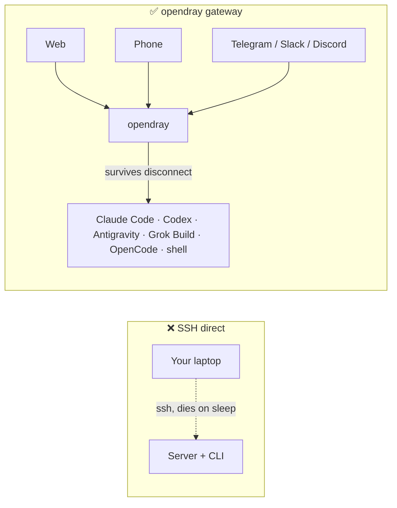
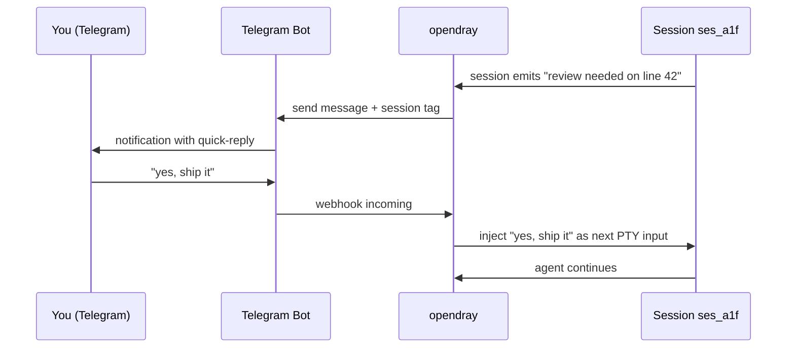
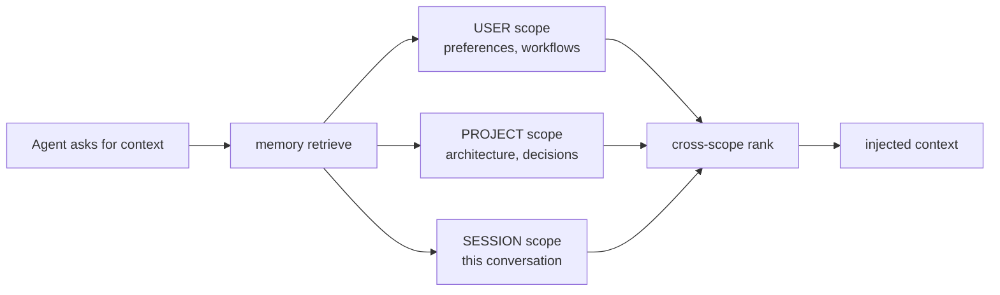
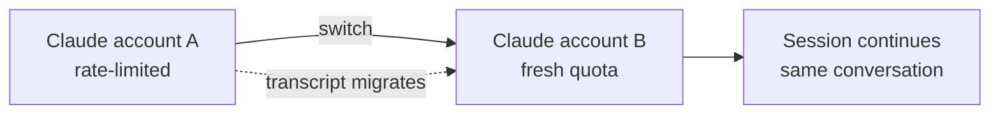
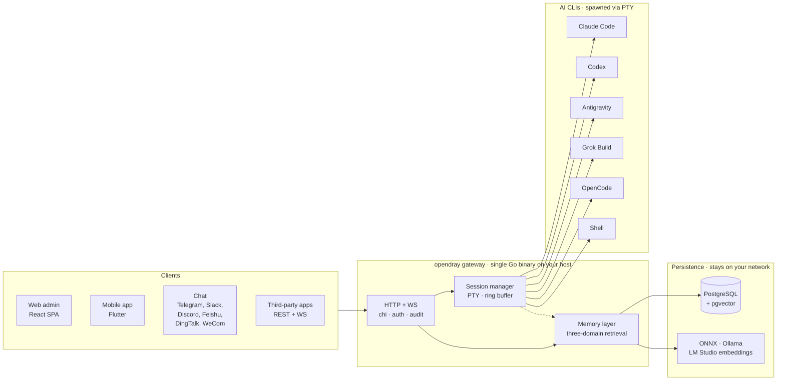

<p align="center">
  <a href="https://opendray.dev"></a>
</p>

<h1 align="center">opendray</h1>

<p align="center">
  <strong>Self-hosted шлюз для Claude Code, Codex, Antigravity, Grok Build и OpenCode. Запускайте сессии агентов на собственной инфраструктуре. Управляйте из веба, с мобильного или из чата.</strong>
</p>

<p align="center">
  <strong><a href="https://opendray.dev">opendray.dev</a></strong>
</p>

<p align="center">
  <a href="https://opendray.dev"></a>
  <a href="https://github.com/Opendray/opendray/releases/latest"></a>
  <a href="LICENSE"></a>
  <a href="https://github.com/Opendray/opendray/actions/workflows/ci.yml"></a>
  <a href="https://github.com/Opendray/opendray/discussions"></a>
  <br/>
  
  
  
  
</p>

<p align="center">
  🌐 <a href="README.md">English</a> · <a href="README.zh.md">简体中文</a> · <a href="README.fa.md">فارسی</a> · <a href="README.es.md">Español</a> · <a href="README.pt-BR.md">Português</a> · <a href="README.ja.md">日本語</a> · <a href="README.ko.md">한국어</a> · <a href="README.fr.md">Français</a> · <a href="README.de.md">Deutsch</a> · <strong>Русский</strong>
</p>

<p align="center">
  <a href="docs/getting-started.md"></a>
  <a href="#how-it-looks"></a>
  <a href="https://opendray.dev"></a>
</p>



Запуск Claude Code или Codex по SSH означает, что агент умирает в тот же момент, когда закрывается ноутбук. opendray запускает его на хосте, который не уходит в сон (Mac mini под столом, NAS, VPS), и даёт переподключаться из веб-админки, мобильного приложения или сообщением в чате. Сессии продолжают выполняться независимо от того, подключён к ним кто-нибудь или нет. Несколько аккаунтов объединяются в пул с балансировкой по тарифам и живой сменой аккаунта. Local-first слой памяти держит каждый embedding в вашей сети.

---

<a id="what-is-opendray"></a>

## Что такое opendray?

**opendray** оборачивает AI coding CLI, которыми вы уже пользуетесь (Claude Code, Codex, Antigravity, Grok Build, OpenCode, плюс любой shell), и превращает их во что-то, чем можно управлять откуда угодно. Запускайте сессии на домашнем сервере, NAS или VPS. Получайте уведомление в Telegram, когда сессия простаивает. Отвечайте с телефона, чтобы скормить следующий промпт обратно внутрь. Всё через self-hosted шлюз, который вы контролируете от и до.

- 🛰 **Один бэкенд, три поверхности.** Единый Go-бинарник раздаёт React-админку и Flutter-приложение, а каждое действие также доступно через REST + WebSocket API для сторонних интеграций.
- 💬 **Шесть двусторонних каналов, без огороженных садов.** Telegram, Slack, Discord, Feishu (飞书), DingTalk (钉钉), WeCom (企业微信), плюс Bridge-адаптер для чего угодно кастомного. Ответы в любом канале маршрутизируются обратно в нужную сессию.
- 🧠 **Local-first память.** Эмбеддинги через ONNX / Ollama / LM Studio, поиск в трёх скоупах (пользователь, проект, сессия), умный ranking и детект конфликтов между слоями. Векторные данные не покидают вашу сеть.
- 🔌 **API уровня интеграции.** Scoped API-ключи, аудит-лог по каждому вызову, mount через reverse-proxy. Используйте opendray как шлюз за вашим собственным продуктом или просто как личный командный центр.
- 🔑 **Флот из нескольких аккаунтов Claude, Codex, Antigravity.** Подкладывайте на хост несколько директорий с готовыми учётными данными; opendray находит их автоматически через filesystem watcher, балансирует новые сессии между активными аккаунтами и позволяет переключить живую сессию между аккаунтами **без потери разговора** (транскрипт мигрирует под капотом). В каждой строке аккаунта видна актуальная загрузка (subscription tier, rate-limit tier, активные сессии, время последнего использования, текущий email логина).
- 🔒 **Self-hosted, лицензия прозрачная.** Apache 2.0, один статический бинарник, релизы подписаны cosign, плюс SPDX SBOM. Без телеметрии, без облачного аккаунта, без подписки.

<a id="how-it-looks"></a>

## Как это выглядит

opendray это Go-бинарник, который раздаёт веб-админку по `/admin/` и REST + WebSocket API по `/api/v1/*`. Вот что он делает, в тех формах, которые вы реально увидите.

### Просмотр запущенных сессий

```
$ opendray sessions ls
ID        PROVIDER      PROJECT              STATE     STARTED
ses_a1f   claude-code   app/web              running   2h ago
ses_b2c   codex         internal/session     idle      5m ago
ses_c9d   grok-build    docs/                running   14m ago
ses_d34   shell         misc/deploy-logs     idle      1h ago
```

### Список установленных провайдеров и их версий

```
$ opendray providers list
PROVIDER      VERSION     ACCOUNTS   ACTIVE   NOTES
claude-code   1.4.11      3          1        auto-discovered via CLAUDE_CONFIG_DIR
codex         0.29.0      2          1        openai login
antigravity   0.7.2       1          0        agy, HOME-isolated
grok-build    2.5.1       1          1        xai
opencode      0.6.3       -          0        local endpoint required
shell         -           -          1        arbitrary
```

### Подключение к сессии из браузера и продолжение работы после сна ноутбука

Веб-админка встраивает xterm.js. Вы видите тот же PTY, в который писал CLI. Закройте вкладку браузера, и сессия продолжает работать на хосте. Откройте её через несколько часов, и транскрипт лежит там, где вы его оставили.

```
[claude-code ses_a1f · app/web · 2h 14m]

> refactor the router to lazy-load the mobile view

I'll look at the current router and figure out the cleanest split.

● Read(app/web/src/router.tsx)
  ⎿ 342 lines
● Grep(pattern: "loadable", path: "app/web/src")
  ⎿ found 3 uses
...
```

### Ответ в Telegram возвращается в ту же сессию



Такая же схема работает для Slack, Discord, Feishu, DingTalk, WeCom и любого транспорта через Bridge-адаптер.

### Fan-out запроса к памяти по трём скоупам сразу



Каждый скоуп хранит эмбеддинги от вашего собственного провайдера (встроенный ONNX, Ollama или LM Studio). Ничего не покидает вашу сеть.

### Смена аккаунта в середине разговора без потери транскрипта



Так же работает для аккаунтов Codex и Antigravity. `Carry-context` включён по умолчанию; снимите галочку, чтобы стартовать с чистого листа на новой идентичности.

## Возможности

|  |  |
| --- | --- |
| **Сессии** | Подключение к работающей сессии Claude Code, Codex, Antigravity, Grok Build, OpenCode или shell из веба, мобильного или чата. Сессии переживают disconnect клиента и перезагрузку хоста. Overlay живого транскрипта для TUI, которые пропускают ввод колёсиком. |
| **Провайдеры** | 5 first-class AI coding CLI плюс произвольный shell. Добавление нового CLI это JSON-дескриптор в `internal/catalog/builtin/`. Инъекция MCP-сервера по каждому провайдеру (Vault, память, интеграции). |
| **Память** | Поиск в трёх скоупах (пользователь, проект, сессия). Local-first эмбеддинги через ONNX, Ollama или LM Studio. Детект конфликтов между слоями. Глобальные страницы знаний, инъекция при спавне. Compiler flywheel дистиллирует эпизоды в переиспользуемые playbook'и. |
| **Каналы** | Telegram, Slack, Discord, Feishu, DingTalk, WeCom. Bridge-адаптер для кастомных транспортов. Двусторонний обмен: сессии шлют уведомления, ответы возвращаются обратно. |
| **Интеграции** | REST + WebSocket API со scoped API-ключами, аудит-лог по каждому вызову, mount через reverse-proxy. HashiCorp Vault MCP для доступа к секретам. Публичный [`docs/integration-guide.md`](docs/integration-guide.md). |
| **Ops** | Единый Go-бинарник. Однострочный установщик (Linux, macOS, WSL2). Самообслуживание (`opendray update / start / stop / providers update`). Шифрованные бэкапы PostgreSQL + экспорт данных. Пайплайн Goreleaser с релизами, подписанными cosign, плюс SPDX SBOM. |
| **Безопасность** | Apache 2.0. Без телеметрии, без облачного аккаунта. Keyless-подпись cosign (Sigstore). Хардненинг systemd `ProtectSystem=strict`. Multi-tenant-безопасные scoped-токены. |

## Архитектура с высоты птичьего полёта

Один Go-бинарник на вашем хосте крутит всё. Клиенты управляют сессиями через HTTP/WebSocket, session manager запускает каждый AI CLI в собственном PTY, а слой памяти хранит общее состояние в Postgres с vector embeddings от вашего собственного провайдера.



Всё, что есть на диаграмме, работает в вашей сети. Никакой облачной зависимости, никакого inference за пределами вашего контроля.

## Сравнение

### opendray против известных AI-клиентов

|  | opendray | Claude Desktop | Cursor | CLI по SSH | ChatGPT Desktop |
| --- | --- | --- | --- | --- | --- |
| Сессия переживает disconnect клиента | ✅ | ❌ | ❌ | ⚠️ (tmux / screen) | ❌ |
| Пул из нескольких аккаунтов с живой сменой | ✅ | ❌ | ❌ | ❌ | ❌ |
| Слой памяти между сессиями | ✅ | ❌ | Частично | ❌ | Частично |
| Файловая система хоста + tool use | ✅ | Ограниченно | ✅ | ✅ | Ограниченно |
| Мобильный клиент с паритетом функций | ✅ | ❌ | ❌ | ⚠️ (SSH-клиент) | Частично |
| Адаптеры чат-каналов | ✅ (6) | ❌ | ❌ | ❌ | ❌ |
| Self-hosted | ✅ | ❌ | ❌ | ✅ | ❌ |
| Лицензия | Apache 2.0 | Proprietary | Proprietary | (варьируется) | Proprietary |

### opendray против self-hosted чат-фронтендов

|  | opendray | Open WebUI | LibreChat | Dify |
| --- | --- | --- | --- | --- |
| Запускает настоящий agent-CLI (не только чат) | ✅ | ❌ | ❌ | Частично |
| Tool use + запись файлов на хосте | ✅ | ❌ | ❌ | В песочнице |
| Несколько AI coding CLI в одном шлюзе | ✅ (5) | ❌ | ❌ | ❌ |
| Память между сессиями | ✅ | Базовая | Базовая | ✅ |
| PTY-сессия с реаттачем в терминал | ✅ | ❌ | ❌ | ❌ |
| Адаптеры чат-каналов | ✅ (6) | Частично | Частично | ✅ |
| Лицензия | Apache 2.0 | MIT | MIT | Apache 2.0 |

## Для кого это?

**Соло-разработчик с домашней лабораторией.** У вас уже есть Mac mini, NAS или коробка с Proxmox, работающие 24/7. Вы гоняли Claude Code по SSH, но сессия умирает каждый раз, когда ноутбук уходит в сон. Вы хотите, чтобы CLI продолжал работать, и хотите переподключаться с телефона в поезде. opendray это тот самый шлюз, который ставит ваш хост между вами и CLI.

**Лид небольшой команды, поднимающий общую AI-инфраструктуру.** У вашей команды 3-5 аккаунтов Anthropic, разбросанных между рабочими и личными планами. Вы хотите объединить их в пул, следить за расходом по каждому аккаунту и позволить любому в команде управлять сессией из браузера. opendray даёт объединение аккаунтов, наблюдаемость по каждому аккаунту, scoped API-ключи под каждого коллегу и мобильное приложение, которое они могут установить без публикации в App Store.

**Интегратор, строящий поверх runner'а сессий.** Вы делаете продукт, которому нужно спавнить сессии Claude Code, Codex или Grok Build с tool use, и не хотите переизобретать жизненный цикл сессий, обработку PTY, память и маршрутизацию каналов. opendray отдаёт каждое действие через REST + WebSocket со scoped-ключами, аудит-логами по каждому вызову и mount через reverse-proxy. Используйте его как ваш agent-runtime.

## Установка

### Однострочный установщик

**Linux / macOS / WSL2**

```sh
curl -fsSL https://raw.githubusercontent.com/Opendray/opendray/main/scripts/install.sh | bash
```

**Windows.** Сначала поднимает WSL2, а затем запускает Linux-инсталлятор внутри него. [подробнее →](scripts/README.md#windows)

```powershell
irm https://raw.githubusercontent.com/Opendray/opendray/main/scripts/install-windows.ps1 | iex
```

Проводит через настройку Postgres, установку AI-CLI, учётные данные админа и регистрацию сервиса, поднимает рабочий шлюз примерно за 5 до 10 минут. См. [**`scripts/README.md`**](scripts/README.md) с подробностями о том, что делает мастер, какую раскладку файлов он создаёт, доступные опции и troubleshooting.

> **Хотите пройти всё руками?** Прочитайте [**docs/getting-started.md**](docs/getting-started.md), 15-минутный сквозной гайд, который повторяет действия мастера, чтобы вы могли проверить каждый шаг самостоятельно.

### npm / npx (Node ≥ 18)

Установить глобально и добавить `opendray` в `PATH`:

```sh
npm install -g opendray
```

Или запустить по требованию без установки:

```sh
npx opendray
```

Устанавливает **только бинарник**: без мастера, без регистрации сервиса, без настройки Postgres. Пакет подтягивает соответствующий платформенный бинарь (`opendray-{linux,darwin}-{x64,arm64}`) через `optionalDependencies` (паттерн esbuild / Biome, никакого `postinstall`, никаких сетевых вызовов на момент установки). Подходит для скриптовых окружений, эфемерных runner'ов или когда у вас уже есть собственный Postgres и супервизор процессов.

Базу данных и запуск шлюза вы берёте на себя:

```sh
# 1. PostgreSQL 15+ with pgvector. Point a DSN at it, set an admin password.
export OPENDRAY_DATABASE_URL="postgres://opendray:pw@127.0.0.1:5432/opendray?sslmode=disable"
export OPENDRAY_ADMIN_PASSWORD="$(openssl rand -base64 24)"
# 2. Apply the schema, then run (foreground).
opendray migrate
opendray serve        # → http://127.0.0.1:8770/admin/
```

Подробный гайд по настройке pgvector, `config.toml`, запуску как systemd / launchd-сервис и обновлению лежит в [**docs/install-binary.ru.md**](docs/install-binary.ru.md).

### Удаление (Linux / macOS)

**По умолчанию.** Останавливает шлюз и удаляет бинарник, но **сохраняет** ваш `config.toml`, директорию с данными (bcrypt keyfile, сессии, заметки, vault), логи и базу PostgreSQL, чтобы переустановка продолжила с того же места:

```sh
curl -fsSL https://raw.githubusercontent.com/Opendray/opendray/main/scripts/uninstall.sh | bash
```

**Полная очистка.** Дополнительно сносит базу PG и роль, удаляет config / data / logs, убирает сервисного пользователя. Включает пост-проверку, которая громко падает, если что-то выжило:

```sh
curl -fsSL https://raw.githubusercontent.com/Opendray/opendray/main/scripts/uninstall.sh | OPENDRAY_PURGE=1 bash
```

### Повседневные команды

После установки бинарник `opendray` сам управляет своим жизненным циклом, и не нужно вспоминать заклинания `systemctl` / `launchctl`:

```sh
sudo opendray update --restart   # download latest release, verify SHA, atomic replace + restart
```

```sh
sudo opendray providers update   # bump installed AI CLIs (claude / codex / antigravity) to npm-latest
```

```sh
opendray providers list          # see which AI CLIs are installed + their versions
```

```sh
sudo opendray start              # start | stop | restart | status, wraps systemd / launchd
```

`opendray --help` показывает полный набор подкоманд.

### Выбор способа развёртывания

Любой поддерживаемый путь включает спавн сессий, доступ к AI-CLI, шифрованные бэкапы и полный API интеграций. opendray это host-resident шлюз: он спавнит AI-CLI через PTY и делит состояние процесса (`~/.claude`, ssh-agent, файлы проекта) с ними. Такая модель несовместима с изоляцией контейнеров, которую навязал бы продакшен Docker, поэтому Docker не является поддерживаемым способом развёртывания в v2.x.

| Путь | Подходит для | Перейти к |
|---|---|---|
| 📦 **Готовый бинарник** | "Просто запусти" на Linux / macOS, любой супервизор | [Страница релизов](https://github.com/Opendray/opendray/releases) → см. [Развёртывание в продакшене](#production-deploy) |
| 🐧 **systemd-юнит** | Bare-metal / VM / LXC-машина на Linux | [Развёртывание в продакшене §A](#option-a-systemd-bare-metal--vm--lxc) |
| 🍎 **LaunchDaemon на macOS** | Mac mini / Mac Studio как домашний сервер | [Развёртывание в продакшене §C](#option-c-macos-launchd-mac-mini--studio-as-home-server) |
| 🛠 **Сборка из исходников** | Разработка / контрибьют / кастомные сборки | [Quickstart](#quickstart-5-minute-dev-path) ниже |

<a id="quickstart-5-minute-dev-path"></a>

## Quickstart (dev-путь за 5 минут)

Полный walkthrough с пререквизитами и troubleshooting находится в [`docs/quickstart.md`](docs/quickstart.md). Сжатый dev-путь:

```bash
# 1. Have a Postgres 15+ running on 127.0.0.1:5432 with pgvector enabled
#    (apt install postgresql-16 postgresql-16-pgvector / brew install postgresql@16 pgvector).
#    Point [database].url at any other DSN if you'd rather use a remote PG.

# 2. Local config, already gitignored.
cp config.example.toml config.toml
$EDITOR config.toml          # set [database].url, [admin].password

# 3. Build the web bundle into the embed tree.
cd app/web && pnpm install && pnpm build && cd ../..

# 4. Apply schema.
go run ./cmd/opendray migrate -config config.toml

# 5. Run.
go run ./cmd/opendray serve -config config.toml
# → REST + WS:  http://127.0.0.1:8770/api/v1/...
# → Web admin:  http://127.0.0.1:8770/admin/
```

Так OpenDray работает на переднем плане, и Ctrl-C его убивает. Для долгоживущего демона смотрите **Развёртывание в продакшене** ниже.

<a id="production-deploy"></a>

## Развёртывание в продакшене

Четыре поддерживаемых способа развёртывания, выбирайте подходящий под ваше окружение.
Каждый даёт авто-рестарт при крэше, персистентное состояние и
разделение секретов и конфига.

<a id="option-a-systemd-bare-metal--vm--lxc"></a>

### Вариант A. systemd (bare-metal / VM / LXC)

Рекомендуемый способ деплоя в Linux. Поставляется захардененный юнит в
[`deploy/systemd/opendray.service`](deploy/systemd/opendray.service)
с sandboxing (`ProtectSystem=strict`, `NoNewPrivileges`,
`MemoryDenyWriteExecute`, очистка capabilities), порядком запуска
`migrate`-затем-`serve` и окном graceful-stop в 20 секунд.

**Сначала добудьте бинарник.** Либо скачайте готовый архив со
[страницы релизов](https://github.com/Opendray/opendray/releases)
(`opendray_*_linux_<arch>.tar.gz`, распаковывается в единственный
бинарник `opendray`), либо соберите из исходников через [Quickstart](#quickstart-5-minute-dev-path)
выше (`go build ./cmd/opendray`).

```bash
# 1. Install the binary you just grabbed (or built).
sudo install -m 0755 /path/to/opendray /usr/local/bin/opendray

# 2. Create the service user + state dir.
sudo useradd -r -s /usr/sbin/nologin -d /var/lib/opendray opendray
sudo install -d -o opendray -g opendray -m 0700 /var/lib/opendray

# 3. Drop config + secrets (root-owned; mode 0640).
sudo install -D -m 0640 config.example.toml /etc/opendray/config.toml
sudo $EDITOR /etc/opendray/config.toml             # set [database].url etc.
sudo install -D -m 0640 -o root -g opendray /dev/null /etc/opendray/env.d/secrets
sudo $EDITOR /etc/opendray/env.d/secrets           # OPENDRAY_ADMIN_PASSWORD=…

# 4. Install + enable the unit.
sudo cp deploy/systemd/opendray.service /etc/systemd/system/
sudo systemctl daemon-reload
sudo systemctl enable --now opendray

# 5. Verify.
sudo systemctl status opendray
sudo journalctl -u opendray -f --no-pager
```

Юнит запускает `opendray migrate` в `ExecStartPre`, так что первый
старт применит все миграции до того, как `serve` вообще начнёт работать.
Рестарты идут как `on-failure` с back-off 5 секунд и лимитом 5 попыток в минуту.

### Вариант B. Прямой бинарник + ваш собственный супервизор процессов

Для LXC без systemd, FreeBSD `rc.d`, OpenRC или чего угодно ещё.
Собрали один раз, запускайте под тем супервизором, которым уже пользуетесь:

```bash
# Cross-compile a release archive locally:
goreleaser release --clean --snapshot
ls dist/                  # opendray_*_linux_amd64.tar.gz etc.

# Or grab a published release artefact:
# https://github.com/Opendray/opendray/releases
```

Затем направьте свой супервизор (s6, runit, supervisord, runwhen) на:

```
/usr/local/bin/opendray serve -config /etc/opendray/config.toml
```

Pre-flight: один раз перед первым `serve` запустите
`opendray migrate -config /etc/opendray/config.toml`, либо повесьте
это в pre-start хук вашего супервизора.

<a id="option-c-macos-launchd-mac-mini--studio-as-home-server"></a>

### Вариант C. macOS launchd (Mac mini / Studio как домашний сервер)

Для Mac mini / Mac Studio на Apple Silicon, работающих 24/7. Поставляется
LaunchDaemon в
[`deploy/launchd/com.opendray.opendray.plist`](deploy/launchd/com.opendray.opendray.plist),
который стартует при загрузке до логина любого пользователя,
рестартит при крэше с throttle 5 секунд и пишет логи в
`/usr/local/var/log/opendray/`.

```bash
# 1. Install the darwin binary + config + state dirs.
sudo install -m 0755 ./opendray /usr/local/bin/opendray
sudo install -d -m 0755 \
  /usr/local/etc/opendray \
  /usr/local/var/lib/opendray \
  /usr/local/var/log/opendray
sudo install -m 0640 config.example.toml /usr/local/etc/opendray/config.toml
sudo $EDITOR /usr/local/etc/opendray/config.toml    # set [database].url etc.

# 2. Apply migrations once.
sudo /usr/local/bin/opendray migrate \
  -config /usr/local/etc/opendray/config.toml

# 3. Install + load the LaunchDaemon.
sudo cp deploy/launchd/com.opendray.opendray.plist /Library/LaunchDaemons/
sudo chown root:wheel /Library/LaunchDaemons/com.opendray.opendray.plist
sudo chmod 0644 /Library/LaunchDaemons/com.opendray.opendray.plist
sudo launchctl bootstrap system /Library/LaunchDaemons/com.opendray.opendray.plist

# 4. Verify.
sudo launchctl print system/com.opendray.opendray
tail -f /usr/local/var/log/opendray/opendray.log
```

Рестарт делается через `sudo launchctl kickstart -k system/com.opendray.opendray`;
полная выгрузка через `sudo launchctl bootout system/com.opendray.opendray`.

Postgres на macOS ставится через Homebrew (`brew install postgresql@17 && brew services start postgresql@17`), а `[database].url` направляется на
`postgres://$USER@127.0.0.1:5432/opendray`. Добавьте `pgvector` командой
`brew install pgvector` и выполните `CREATE EXTENSION vector` внутри
базы opendray.

---

По специфике LXC в Proxmox (PTY в unprivileged-контейнерах,
сеть, тюнинг cgroup) см. [`deploy/lxc/proxmox-pty-notes.md`](deploy/lxc/proxmox-pty-notes.md).

По reverse-proxy / терминации TLS (nginx, Caddy, Traefik, Cloudflare
Tunnel) см. [`docs/operator-guide.md`](docs/operator-guide.md) §Topology.

### Опционально: включить шифрованные бэкапы БД + экспорт данных

```bash
# Master passphrase (env-only, never write into config.toml).
export OPENDRAY_BACKUP_KEY="$(openssl rand -base64 32)"
export OPENDRAY_BACKUP_ENABLED=1

# pg_dump / pg_restore must match the server's major version. On
# Apple Silicon dev machines pointing at a PG17 server:
export OPENDRAY_BACKUP_PG_DUMP_PATH=/opt/homebrew/opt/postgresql@17/bin/pg_dump
export OPENDRAY_BACKUP_PG_RESTORE_PATH=/opt/homebrew/opt/postgresql@17/bin/pg_restore
```

Перезапустите opendray; в сайдбаре появится страница Backups (`/backups`)
для шифрованных дампов PostgreSQL и restore, а также `/export` для
экспорта данных в zip-bundle и импорта. Полный жизненный цикл описан в
[`docs/operator-guide.md`](docs/operator-guide.md) §Backup.

Один Go-бинарник несёт весь веб-бандл, никакого Node-рантайма во время
работы, отдельного сервера статики или Caddy/nginx не требуется.
Cloudflare Tunnel терминирует TLS перед `:8770`.

## Раскладка

```
cmd/opendray/   binary entry point
internal/       Go backend (gateway, sessions, memory, channels,
                integrations, git, search, one package per domain)
app/web/        React + Vite admin SPA (embedded in the binary)
app/mobile/     Flutter app (iOS + Android)
app/shared*/    cross-surface shared UI + i18n strings
docs/           guides: install, getting-started, integration, ops
deploy/         systemd / launchd / LXC units + install scripts
```

## Веб-фронтенд

`app/web/` собирается в единую SPA в `internal/web/dist/`, которую Go-бинарник
встраивает через `go:embed` и раздаёт по `/admin/*`. Dev-сервер Vite на `:5173`
проксирует `/api` на `:8770` для разработки с HMR.

```bash
# dev (hot reload on the React side, separate Go server for the API)
cd app/web && pnpm dev               # http://localhost:5173
go run ./cmd/opendray serve -config ../../config.toml   # other terminal

# prod (one binary delivers everything)
cd app/web && pnpm build              # writes ../../internal/web/dist
cd ../..
go build ./cmd/opendray               # bakes dist into the binary
./opendray serve -config config.toml
```

См. [`app/web/README.md`](app/web/README.md), где описан стек фронтенда
(React + Vite + Tailwind v4 + shadcn/ui + TanStack Router/Query +
Zustand + xterm.js) и заметки по W-майлстоунам.

## Мобильное приложение

`app/mobile/` это Flutter-приложение для **iOS и Android** с паритетом
функций с веб-админкой. Оно подключается к работающему шлюзу по HTTPS.
Укажите **Gateway URL** и логин администратора при первом запуске, и вы
получаете те же поверхности Sessions / Channels / Integrations / Memory / Git.
Сборки в App Store / Play Store нет by design (self-hosted, single-tenant):
вы собираете приложение сами и подписываете его собственной идентичностью.

**[→ Гайд по сборке и установке](docs/mobile-app.ru.md).** Сделайте шлюз
доступным с телефона, затем установите Android-APK через sideload или
поставьте на iPhone через Xcode. ([все 10 языков](docs/mobile-app.md);
переключатель наверху гайда.)

## FAQ

### Что такое opendray?

opendray это self-hosted шлюз, который оборачивает AI coding CLI, которыми вы уже пользуетесь (Claude Code, Codex, Antigravity, Grok Build, OpenCode и shell), и превращает их в сессии, которыми можно управлять из веб-админки, Flutter-приложения на мобильном или шести чат-каналов (Telegram, Slack, Discord, Feishu, DingTalk, WeCom). Один Go-бинарник. Apache 2.0. Ваша инфраструктура, ваши данные, ваши токены.

### Какие AI-CLI поддерживает opendray?

Пять first-class-провайдеров на v2.10.x: **Claude Code** (Anthropic), **Codex** (OpenAI), **Antigravity** (Google `agy`), **Grok Build** (xAI) и **OpenCode**. Плюс произвольный shell для всего остального. Добавление нового CLI это JSON-дескриптор в `internal/catalog/builtin/`; в типовых случаях адаптерный код не нужен.

### Чем opendray отличается от Claude Desktop или ChatGPT Desktop?

Claude Desktop и ChatGPT Desktop это чат-клиенты, которые работают на вашем ноутбуке и умирают, когда ноутбук закрывается. opendray запускает настоящий agentic-CLI на хосте, который не уходит в сон, и даёт переподключаться откуда угодно. Сессии переживают disconnect клиента, сон ноутбука и разрывы сети. Несколько аккаунтов объединяются в пул с живым переключением между ними.

### Чем opendray отличается от запуска Claude Code по SSH?

Четыре вещи, которых SSH вам не даёт: (1) сессия выживает при разрыве соединения (никакой гимнастики с `tmux`, хотя вы можете использовать tmux и внутри), (2) подключение с телефона или из чат-канала, а не только из терминала, (3) общий слой памяти между всеми сессиями на хосте, (4) пул из нескольких аккаунтов с балансировкой по тарифам и живой сменой аккаунта в середине разговора.

### Чем opendray отличается от Open WebUI, LibreChat или Dify?

Это чат-фронтенды поверх API моделей. Они отправляют промпты в `api.openai.com` (или похожие) и отображают ответ. opendray запускает настоящий процесс agent-CLI на вашем хосте, вместе с tool use, записью файлов, памятью и MCP-серверами. Если задаче нужны `Read` / `Edit` / `Bash` на вашей файловой системе, opendray их делает; чат-фронтенды нет.

### Можно ли использовать несколько аккаунтов Claude, Codex или Antigravity?

Да. Подложите на хост директории с логином (Claude использует `CLAUDE_CONFIG_DIR`, Antigravity изолирует `$HOME`), и opendray подхватит их через filesystem watcher. Новые сессии балансируются между активными аккаунтами по tier + capacity. Живую сессию можно переключить между аккаунтами без потери разговора (транскрипт мигрирует под капотом). Auto-failover по rate-limit переносит контекст по умолчанию.

### Где хранятся мои данные?

В PostgreSQL на вашем хосте (принесите свой экземпляр или используйте тот, что поднимает установщик). Эмбеддинги приходят от вашего собственного провайдера (встроенный ONNX, Ollama или LM Studio). Векторные данные, транскрипты и записи памяти не покидают вашу сеть. Никакой телеметрии. Никакого облачного аккаунта. `opendray` никогда не звонит домой.

### Можно ли запустить это в Docker?

Не сейчас (v2.x). opendray спавнит AI-CLI через PTY и делит с ними состояние процесса на хосте (директории с учётными данными, ssh-agent, файлы проекта). Это несовместимо с той изоляцией контейнеров, которую навязал бы продакшен Docker. Используйте готовый бинарник и systemd или launchd (для Linux и macOS есть однострочные установщики). См. [Развёртывание в продакшене](#production-deploy).

### Работает ли opendray на NAS, Mac mini или Raspberry Pi?

NAS: да, на Synology / QNAP / TrueNAS-Scale (везде, где есть Linux + Postgres). Mac mini: да, это распространённый вариант деплоя (LaunchDaemon в комплекте). Raspberry Pi: работает на Pi 4 / Pi 5, но недостаточно мощный для параллельных сессий; только single-user хобби-использование.

### opendray бесплатный? Какая лицензия?

Apache 2.0. Бесплатно навсегда. Никакого платного тарифа, никакой телеметрии, никаких phone-home. Спонсоры приветствуются (см. [`.github/FUNDING.yml`](.github/FUNDING.yml)).

### Как я могу помочь проекту?

Прочитайте [`CONTRIBUTING.md`](CONTRIBUTING.md) и [`CODE_OF_CONDUCT.md`](CODE_OF_CONDUCT.md). Конкретные варианты: (1) перевести README или страницу документации на язык, который у нас уже есть, (2) добавить дескриптор провайдера для нового AI coding CLI в `internal/catalog/builtin/`, (3) написать channel-адаптер для чат-платформы, которую мы ещё не покрыли, (4) добавить скриншоты для документации, (5) завести баг или feature request. PR должен пройти CI зелёным; переводы принимаются с советующим review; CLA не нужен.

## Документация

- [`docs/getting-started.md`](docs/getting-started.md): **начинайте отсюда**, если вы новичок. От нуля до первой сессии за 15 минут, включая установку оборачиваемых CLI и bootstrap Postgres.
- [`docs/install-binary.ru.md`](docs/install-binary.ru.md): установка из npm-пакета или release-бинарника (собственный Postgres) и запуск как systemd / launchd-сервис.
- [`docs/quickstart.md`](docs/quickstart.md): dev-окружение за 5 минут (предполагается, что вы уже знаете, из чего всё состоит).
- [`docs/mobile-app.ru.md`](docs/mobile-app.ru.md): сборка и установка мобильного приложения на Flutter, sideload Android-APK или установка на iPhone через Xcode, затем укажите ему адрес вашего gateway.
- [`docs/operator-guide.md`](docs/operator-guide.md): справочник по деплою и эксплуатации для околопродакшен-сетапов.
- [`docs/integration-guide.md`](docs/integration-guide.md): как написать внешнюю интеграцию на любом языке.
- [`VERSIONING.md`](VERSIONING.md): стратегия версионирования (major-as-generation).
- [`CHANGELOG.md`](CHANGELOG.md): история релизов.

## Статус

Текущее поколение: **v2.10.x**. См. [`CHANGELOG.md`](CHANGELOG.md) для полной истории релизов и [`VERSIONING.md`](VERSIONING.md) для политики major-как-поколение (major = поколение продукта, а не строгий SemVer "breaking change").

В это поколение входит:

- **Однострочные мастера установки и удаления** (Linux + macOS; Windows проходит через WSL2). Проводят оператора через bootstrap Postgres, установку AI-CLI, учётные данные админа, адрес прослушивания, установку бинарника, миграцию схемы и регистрацию сервиса.
- **Самообслуживаемый бинарник.** `opendray update / start / stop / restart / status / providers list / providers update`, чтобы операторы не лезли в `systemctl` / `launchctl` ради рутинных операций.
- **Релизный пайплайн на Goreleaser.** Кросс-компилируемые бинарники (linux/darwin × amd64/arm64), keyless-подпись cosign (Sigstore), SPDX SBOM, атомарно верифицируемый self-update.

## Тесты

```bash
go test -race ./...        # backend
cd app/web && pnpm build   # web (TS strict + vite production build)
```

End-to-end smoke-флоу отслеживаются в commit-сообщениях по майлстоунам.
Playwright-harness запланирован как follow-up.

## Связь с v1

v1 (`Opendray/opendray`) это легаси-кодбейс, теперь архивный. v2 это
текущее и активное поколение, feature-complete и единственная ветка,
в которой ведётся разработка. Из 16 builtin'ов v1 четыре переехали в
бэкенд v2; остальные стали клиентскими фичами, channel-адаптерами или
потребителями API интеграций.

## Лицензия

Apache 2.0. См. [`LICENSE`](LICENSE). (v1 был под MIT; v2 лицензирован
независимо.)
