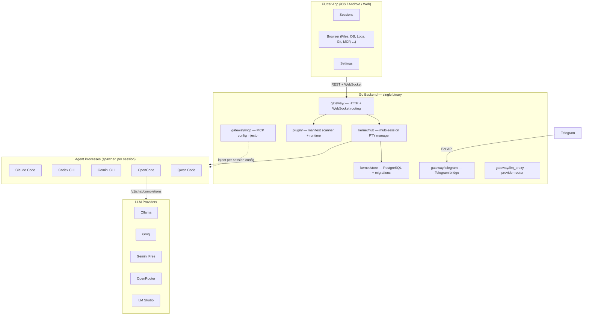

<div align="center">


<h1>OpenDray</h1>

<p><strong>在手机上操控 AI 编码 Agent。自托管。多 Agent 并行。插件驱动。</strong></p>

<p>
<a href="https://github.com/opendray/opendray/actions/workflows/ci.yml"></a>
<a href="https://github.com/opendray/opendray/releases"></a>
<a href="LICENSE"></a>
<a href="https://github.com/opendray/opendray/stargazers"></a>
</p>

<p>
<a href="#快速开始"><b>快速开始</b></a> &middot;
<a href="#功能特性"><b>功能特性</b></a> &middot;
<a href="#架构"><b>架构</b></a> &middot;
<a href="#插件"><b>插件</b></a> &middot;
<a href="https://github.com/opendray/opendray/discussions"><b>Discussions</b></a>
</p>

<p>
<a href="README.md"><b>English</b></a> &middot;
<b>简体中文</b>
</p>

<!-- TODO: Replace with actual screenshot/screencast -->
<!--  -->

</div>

---

在地铁上启动一个 Claude Code、Codex 或 Gemini 会话,关掉 App,一小时后再打开 —— 会话还在跑。打开 diff 审查,用 Telegram 一键批准。

没有其他工具能做到这一点。

## 功能特性

**移动端优先的远程控制** &mdash; 在手机、平板或浏览器里启动任意 AI 编码 agent。PTY 会话跑在你自己的服务器上,关掉 App 再回来,它还在。

**多 Agent 并行** &mdash; Claude Code、Codex、Gemini CLI、OpenCode、Qwen Code 同时运行,各自独立的终端、独立的生命周期、独立的空闲检测和输出缓冲。

**插件架构** &mdash; 每个 agent 和面板都是一个 `manifest.json`。想接入新的 AI CLI?把 manifest 丢进 `plugins/` 目录,不改代码,不重新编译,重启就能在启动器里看到。

**Telegram 双向控制** &mdash; 完整的双向会话控制能力,无需开 App:列出会话、查看输出、绑定会话做双向中继、通过 inline 键盘回答结构化提示、发送控制键 —— 全在 Telegram 里完成。

**LLM 供应商路由** &mdash; 注册 Ollama、Groq、Gemini 免费层、LM Studio,或任何 OpenAI 兼容端点。按会话切换:同一个 OpenCode 二进制、不同模型、不同成本。

**MCP 注入** &mdash; 一次注册 MCP 服务器,OpenDray 自动为每个会话生成独立的配置文件并通过 CLI 参数和环境变量注入,不动全局配置。

**Claude 多账号** &mdash; 注册多个 Claude OAuth token,按会话选择账号。运行中的会话可以热切换账号,上下文不丢(会话在新账号下 resume)。

**自托管,单二进制** &mdash; Go 后端 + 通过 `go:embed` 嵌入的 Flutter web 构建。一个二进制 + 一个 PostgreSQL,没有 SaaS 依赖,代码全在你自己的硬件上。

## 快速开始

OpenDray 是一个自包含的二进制文件。安装、跑终端向导、启动服务,三步搞定。**setup 只有终端版本** —— 没有基于 Web 的首次运行向导,所以 SSH、VPS、本地笔记本的安装流程完全一致。

### macOS / Linux

```bash
curl -fsSL https://raw.githubusercontent.com/Opendray/opendray/main/install.sh | sh
```

安装脚本做的事:
1. 检测操作系统(`darwin` / `linux`)和架构(`amd64` / `arm64`)
2. 从 [Releases](https://github.com/Opendray/opendray/releases) 下载对应的二进制
3. 用签名的 `SHA256SUMS` 校验 SHA256
4. 安装到 `~/.local/bin/opendray`
5. 直接把控制权交给 `opendray setup` —— 在同一个终端里启动交互式向导

通过环境变量覆盖默认行为:`OPENDRAY_VERSION=v0.5.0`、`OPENDRAY_INSTALL_DIR=/usr/local/bin`、`OPENDRAY_NO_SETUP=1`(跳过自动向导)。

> **Windows:** 暂不支持。核心功能(在伪终端里 spawn agent CLI)依赖 UNIX PTY(`creack/pty`),Windows 的 ConPTY 等价实现还在路线图上。

### 向导会问什么

```
1 / 4   DATABASE        内置 PostgreSQL(OpenDray 自己管)
                        或外部数据库(自备 PG 14+)
2 / 4   LISTEN ADDRESS  回环(127.0.0.1:8640,只本机可访问)
                        或全接口(0.0.0.0:8640,局域网暴露)
                        或自定义 host:port
3 / 4   ADMIN ACCOUNT   用户名 + 密码(至少 8 位)
4 / 4   JWT SECRET      自动生成或粘贴你自己的
```

配置持久化到 `~/.opendray/config.toml`。重新跑 `opendray setup` 会用现有值作为默认值,可以只改一项而不用重新填其他。

### 脚本化安装(CI / cloud-init)

```bash
opendray setup --yes \
    --db=bundled \
    --listen=loopback \
    --admin-user=admin \
    --admin-password-file=/run/secrets/admin_pw
```

所有提示都有对应的 flag:`--db-host`、`--db-port`、`--db-user`、`--db-name`、`--db-password-file`、`--db-sslmode`、`--jwt-secret-file`。查看完整列表:`opendray setup --help`。

### 手动下载

从 [Releases 页面](https://github.com/Opendray/opendray/releases) 下载二进制:
- `opendray-darwin-arm64` — Apple Silicon Mac
- `opendray-darwin-amd64` — Intel Mac
- `opendray-linux-amd64` / `opendray-linux-arm64`

```bash
chmod +x opendray-darwin-arm64
./opendray-darwin-arm64 setup
./opendray-darwin-arm64
```

### 从源码构建

```bash
git clone https://github.com/opendray/opendray.git
cd opendray
make build
./bin/opendray setup
./bin/opendray
```

<details>
<summary><b>开发模式(热重载)</b></summary>

```bash
cp .env.example .env     # 指向你自己的 PostgreSQL
make dev                 # 同时起 Go 后端和 Flutter web 客户端
```

设好 `.env` 后向导会自动跳过 —— 环境变量优先于配置文件,这样现有的 LXC / Docker 部署不会被打断。

</details>

<details>
<summary><b>使用自己的 PostgreSQL</b></summary>

```sql
CREATE DATABASE opendray;
CREATE USER opendray WITH PASSWORD 'changeme';
GRANT ALL PRIVILEGES ON DATABASE opendray TO opendray;
```

向导里选 `external`,或者设置 `DB_HOST` / `DB_USER` / `DB_PASSWORD` / `DB_NAME` 环境变量,任一路径都会触发自动迁移(首次连接时在数据库里创建 schema)。

</details>

<details>
<summary><b>内置 PostgreSQL 与 root 的关系</b></summary>

`bundled` 数据库模式拒绝用 root 跑 —— 上游 PostgreSQL 的 `initdb` 在 `uid == 0` 时会硬性失败。先创建一个非特权用户:

```bash
useradd -r -m -s /bin/bash -d /home/opendray opendray
su - opendray
opendray setup
```

或者选 `external` 连接到一个现有的 PG 实例。

</details>

<details>
<summary><b>生产环境二进制</b></summary>

```bash
make release-linux                    # 交叉编译 linux/amd64,web 资源已嵌入
./bin/opendray-linux-amd64            # 单二进制,启动时自动跑 migration
```

绑定到非回环地址时必须设 `JWT_SECRET`。向导会自动生成;如果走环境变量部署,自己设置。

</details>

## 作为后台服务运行

默认的 `opendray` 调用在前台运行 —— 测试不错,但不适合"始终在线"的场景。装上服务封装之后它会:

- 开机启动
- 崩溃自动重启
- 日志写到合理的位置(Linux 上走 journald,macOS 上 `/var/log/opendray/`)
- 以你非 root 的 setup 用户身份运行(内置 PG 不能用 uid 0 启动)

```bash
sudo opendray service install
```

从 `$SUDO_USER`(你执行 `sudo` 时的账号)自动识别目标用户。如果识别错了用 `--user` 覆盖:

```bash
sudo opendray service install --user opendray
```

其他生命周期命令:

```bash
opendray service status      # 当前状态
opendray service logs        # 日志跟踪(Linux: journalctl -fu;macOS: tail -f)
sudo opendray service start  # / stop / restart
sudo opendray service uninstall
opendray service help        # 完整参考
```

### 会写入什么

| 平台 | 文件 | 做什么 |
|---|---|---|
| Linux | `/etc/systemd/system/opendray.service` | systemd unit,`Restart=on-failure`,journald 输出,`ProtectSystem=full` |
| macOS | `/Library/LaunchDaemons/com.opendray.opendray.plist` | launchd daemon,`KeepAlive=SuccessfulExit:false`,日志到 `/var/log/opendray/` |

两个都以 `--user` 指定的账号运行(永不 root),并继承 `HOME=$user`,这样 `~/.opendray/` 下的配置原封不动被读到。

### 不写入,只预览

```bash
opendray service install --user linivek --dry-run
```

打印将要写入的 unit / plist 内容,不动系统。上线前 review 用。

## 卸载

跟安装流程对称。根据你的 `opendray` 二进制能不能跑,有两条路。

### 内置命令(推荐)

```bash
opendray uninstall               # 交互式:显示计划,确认,删除
opendray uninstall --yes         # 不确认
opendray uninstall --dry-run     # 只预览
opendray uninstall --keep-data   # 删二进制 + 配置,保留 ~/.opendray/
```

做的事:
1. 停掉运行中的 OpenDray 服务 + 内置 PostgreSQL
2. 删除 `~/.opendray/`(PG 集群、插件、缓存、marketplace)
3. 删除 `~/.config/opendray/config.toml`(如果存在)
4. 自删二进制

### 一键核弹(二进制已经跑不起来了)

如果二进制损坏,或者配置坏到向导都启动不了,用这个 shell 脚本。它不知道配置的事,只是 `rm -rf` 几个已知路径。

```bash
curl -fsSL https://raw.githubusercontent.com/Opendray/opendray/main/uninstall.sh | sh
```

环境变量:
- `OPENDRAY_YES=1` — 跳过确认
- `OPENDRAY_DRY_RUN=1` — 只预览
- `OPENDRAY_INSTALL_DIR` — 非默认二进制位置

### 外部 PostgreSQL

OpenDray **永远不会主动 drop 你提供的外部数据库里的表** —— 表名(`sessions`、`plugins`、`admin_auth`…)足够通用,可能跟共享这个库的其他应用冲突,自动 drop 一旦发生无法恢复。

替代方案:`opendray uninstall` 会在当前目录写一个 `drop_opendray_schema.sql`,里面是一组 `DROP TABLE IF EXISTS … CASCADE`。你自己审查,自己手动执行:

```bash
psql -h <host> -U <user> -d <db> -f drop_opendray_schema.sql
```

核弹脚本不管这个辅助文件;走核弹路径说明你自己知道该 drop 哪些表。

### 手动清理(最后手段)

上面两条路都失败,这些是需要手动清掉的路径:

| 平台 | 路径 |
|---|---|
| macOS / Linux | `~/.local/bin/opendray` |
| macOS / Linux | `~/.opendray/` |
| macOS / Linux | `~/.config/opendray/`(XDG 回退) |

## 架构



### 源码布局

```
cmd/opendray/       入口 — setup / service / uninstall / plugin / version 子命令
kernel/
  terminal/         PTY 引擎:spawn、4 MB 环形缓冲、空闲检测
  hub/              多会话生命周期:create、attach、resume、stop(最多 20)
  store/            PostgreSQL:连接池、18 个 migration、查询
  auth/             JWT 签发和中间件(HS256,7 天 TTL)
  pg/               内置 PostgreSQL 启动器(嵌入式 PG 15.4 子进程)
  config/           config.toml 解析 + 环境变量覆盖
gateway/            HTTP + WebSocket handler
  telegram/         Telegram bot:命令、绑定、通知、inline 键盘
  mcp/              MCP 服务器注册表,每会话配置生成器 + 清理
  llm_proxy/        Anthropic ↔ OpenAI 请求/响应翻译
  files/            沙箱化文件浏览器(allow-list 根目录、符号链接解析)
  pg/               只读 PostgreSQL 浏览器(DDL/DML 屏蔽,行数/时间上限)
  forge/            Git forge 客户端(Gitea、GitHub、GitLab)
  git/              单仓状态、每会话 baseline diff、分支列表
  logs/             tail-follow、rotation 检测、regex grep、扩展名过滤
  tasks/            Makefile / npm / shell 发现,并发执行 + 超时
  docs/             Markdown reader(Obsidian 插件用)
plugin/             manifest 扫描器、运行时、hook 总线、marketplace、consent
plugins/
  builtin/          17 个内置插件(6 个 agent + 11 个面板,嵌入二进制)
  examples/         示例外部插件(time-ninja、kanban、fs-readme)
app/                Flutter 客户端(iOS、Android、Web)— 19 个 feature 模块
```

## 插件

每个 agent 和面板都是一个插件。OpenDray 内置 17 个。

### Agents

| Agent | 图标 | 支持的模型 | 关键能力 |
|---|---|---|---|
| **Claude Code** | 🟣 | Sonnet、Opus、Haiku | 会话 resume(`--resume`)、MCP 注入、图片输入、多账号 OAuth、bypass-permissions 模式 |
| **Codex CLI** | 🤖 | o4-mini、o3、GPT-4.1、GPT-4.1-mini | 审批模式(suggest / auto-edit / full-auto)、MCP 注入 |
| **Gemini CLI** | ✨ | Gemini 2.5 Pro、Gemini 2.5 Flash | Sandbox 模式、yolo 模式、多模态输入 |
| **OpenCode** | 🤖 | 动态(走 LLM Endpoints) | 供应商无关路由,对接任何 OpenAI 兼容端点、会话 resume、MCP 注入 |
| **Qwen Code** | 🐉 | Qwen3-Coder Plus/Flash/480B | DashScope、ModelScope、OpenRouter、动态模型发现、MCP 注入 |
| **Terminal** | ⬛ | &mdash; | 系统登录 shell(zsh/bash/sh),无 AI |

### 面板

| 面板 | 分类 | 做什么 |
|---|---|---|
| **File Browser** | files | 沙箱化目录列表 + 文件预览,语法高亮、二进制检测、大小上限 |
| **PostgreSQL Browser** | database | 只读 schema 检视(database、schema、table、column)+ 过滤式 SELECT 执行,查询历史,8 种 SSL 模式 |
| **Log Viewer** | logs | tail-follow 含 backlog、rotation 检测、regex grep、扩展名过滤 |
| **Task Runner** | tools | 发现 Makefile 目标、package.json 脚本、shell 脚本;并发执行 + 超时 + 实时输出 |
| **Git Viewer** | tools | 单仓状态、每会话 baseline(只显示本次会话改的部分)、unified diff、commit log、分支列表 |
| **Git Forge** | tools | Gitea / GitHub / GitLab 集成 —— 浏览仓库、clone、看 PR/issue |
| **Telegram Bridge** | messaging | bot token 设置、绑定状态、测试消息、命令参考 |
| **MCP Servers** | mcp | stdio / SSE / HTTP MCP 服务器的 CRUD,按 agent 过滤,启用/禁用开关 |
| **Obsidian Reader** | docs | 从 Git 仓库浏览 Obsidian vault(Gitea、GitHub、GitLab),分支选择、路径过滤 |
| **Web Browser** | preview | 应用内全功能浏览器,多标签 URL、前进/后退、宿主端口快捷方式 |
| **Simulator Preview** | simulator | 实时 WebSocket 流转 iOS Simulator / Android Emulator 画面,自适应 FPS(活跃 8 / 空闲 1),触控/滑动/按键转发 |

### 写一个插件

5 分钟加一个新 agent:

```
plugins/builtin/my-agent/manifest.json
```

```json
{
  "name": "my-agent",
  "kind": "agent",
  "icon": "🤖",
  "cliSpec": {
    "command": "my-agent-cli",
    "defaultArgs": ["--no-color"],
    "installDetect": "which my-agent-cli"
  },
  "capabilities": {
    "supportsResume": false,
    "supportsStream": true,
    "supportsMcp": true
  }
}
```

重启 OpenDray,这个 agent 就出现在会话启动器里。完整 manifest 参考见 [CONTRIBUTING.md](CONTRIBUTING.md)。

## Telegram 桥接

完全的双向控制,不需要 App:

| 命令 | 说明 |
|---|---|
| `/status` | 列出运行中的会话(含 ID) |
| `/tail <id> [n]` | 输出的最近 N 行(Claude 走 JSONL 感知,其他走原始 buffer) |
| `/screen <id>` | 当前屏幕快照(Claude 走富 HTML,其他走 `<pre>`) |
| `/link <id>` | 把当前 chat 绑定到会话(双向中继,替换已有绑定) |
| `/unlink` | 解绑 |
| `/links` | 列出所有活跃的 chat-session 绑定 |
| `/send <id> <text>` | 不绑定,一次性发送 |
| `/stop <id>` | 终止会话 |
| `/whoami` | 查看你的 Telegram chat ID |
| `/cc` `/cd` `/tab` `/enter` | 给已绑定会话发送控制键 |
| `/yes` `/no` | 提示的快捷回答 |

**已绑定 chat 的行为:** 纯文本作为终端输入送给 agent,agent 输出每 2 秒一批流回来。回复任意 idle / exit 通知,就会直接路由到那个会话。

**多选类提示**(比如 Claude Code 的权限对话、工具审批列表)渲染成带复选框的 inline Telegram 键盘 + 提交按钮。

## LLM 端点路由

在 **Settings → LLM Endpoints** 里注册任意 OpenAI 兼容端点(之前是 `llm-providers` 面板插件 —— 现在升格为所有 agent 共享的平台能力,不再归单个插件所有):

- **本地**:Ollama、LM Studio、llama.cpp、vLLM
- **云端**:Groq、Gemini 免费层、OpenRouter、Together AI、Fireworks
- **自定义**:任何实现 `/v1/chat/completions` 的服务器

用 OpenCode 创建会话时选一个 provider + 模型。OpenDray 会生成每会话配置、设置 `XDG_CONFIG_HOME`、重写 `--model` 参数。同一个 CLI 二进制,不同大脑,不同成本。

其他 agent 会拿到 `OPENAI_BASE_URL` / `OPENAI_API_KEY` / `OPENAI_MODEL` 环境变量,给未来的 OpenAI 原生 CLI 使用。

## MCP 服务器管理

在 OpenDray 里注册一次 MCP 服务器。agent 会话启动时 OpenDray 生成一个临时的每会话配置文件,通过 CLI 参数和环境变量注入 —— 不动 `~/.claude.json` 或 `~/.codex/config.toml`。会话退出后临时文件自动清理。

支持 `stdio`、`sse`、`http` 三种传输。可以按 agent 限定 scope,也可以全局生效。

## 会话生命周期

| 阶段 | 发生什么 |
|---|---|
| **Create** | REST API 接受:agent 类型、工作目录、模型、额外参数、环境变量覆盖、Claude 账号、LLM provider |
| **Start** | Hub 从插件注册表解析 CLI 命令,构建 args + env,注入 MCP 配置,spawn PTY |
| **Running** | WebSocket 流转终端 I/O,4 MB 环形缓冲抓输出,空闲检测器到阈值后触发 |
| **Resume** | Claude 和 OpenCode 支持 `--resume` + 存储的 session ID;其他 agent 走新 spawn |
| **Account swap** | Claude 会话可以热切换 OAuth 账号而不丢上下文(stop → rebind → resume) |
| **Stop** | 优雅关闭:SIGHUP → SIGTERM → SIGKILL(2 秒递进),临时文件清理 |
| **Recovery** | `AUTO_RESUME=true`:OpenDray 崩溃后重启时,如果进程和 DB 行都还在,重新 attach 孤儿 PTY |

最多 20 个并发会话。每个会话独立的空闲检测、退出 hook、Telegram 通知路由。

## 安全

| 控制项 | 默认值 |
|---|---|
| 绑定地址 | `127.0.0.1:8640`(仅回环) |
| 认证 | 非回环绑定时强制 JWT。没有 `JWT_SECRET` 服务就不启动。 |
| 限流 | 按 IP 的令牌桶:会话变更 10/min,读 60/min |
| Body 大小 | POST/PUT/PATCH 上限 1 MB |
| 文件浏览器 | 沙箱化到配置的 allow-list,符号链接在前缀校验前解析 |
| 数据库浏览器 | 只读事务,DDL/DML regex 阻断,关键字黑名单,行上限(500),查询超时(30s) |
| LLM API key | 以环境变量名的形式存,绝不把值写进数据库 |
| MCP 配置 | 每会话临时文件,退出时清理,永不写入全局配置 |

PTY API 在主机上等同于 root 权限。生产环境永远放在带 TLS 的反向代理后面。

完整威胁模型和部署清单见 [SECURITY.md](SECURITY.md)。

## 配置

所有配置走环境变量。完整参考见 [`.env.example`](.env.example)。

<details>
<summary><b>关键变量</b></summary>

| 变量 | 默认 | 说明 |
|---|---|---|
| `LISTEN_ADDR` | `127.0.0.1:8640` | 绑定地址 |
| `DB_HOST` | *(必填)* | PostgreSQL 主机 |
| `DB_PASSWORD` | *(必填)* | PostgreSQL 密码 |
| `DB_NAME` | `opendray` | 数据库名 |
| `JWT_SECRET` | *(空 = 开发模式)* | 非回环绑定时必填 |
| `PLUGIN_DIR` | `./plugins` | 插件 manifest 目录 |
| `OPENDRAY_TELEGRAM_BOT_TOKEN` | *(空)* | 从 @BotFather 拿到的 Telegram bot token |
| `AUTO_RESUME` | `false` | 启动时重新 attach 孤儿 PTY |
| `IDLE_THRESHOLD_SECONDS` | `8` | 空闲事件的静默秒数阈值 |

</details>

## 技术栈

| 层 | 技术 |
|---|---|
| 后端 | Go 1.25+、chi、gorilla/websocket、creack/pty、pgx/v5 |
| 前端 | Flutter 3.41+(Dart 3)、基于 WebView 的 xterm.js、go_router、provider |
| 数据库 | PostgreSQL 14+(18 个自动应用的 migration,最多 20 个连接) |
| 认证 | JWT(HS256,7 天 TTL)+ 可选的 Cloudflare Access service-token 支持 |
| 打包 | 单二进制,Flutter web 构建通过 `go:embed` 嵌入 |
| CI | GitHub Actions(Go vet + test + build,Flutter analyze + build) |

## 贡献

开发环境搭建、插件编写、PR 流程见 [CONTRIBUTING.md](CONTRIBUTING.md)。

最快的贡献方式:给你喜欢的 AI 编码 CLI 写一个 `manifest.json`,提 PR 过来。

## 许可证

MIT &mdash; 见 [LICENSE](LICENSE)。
