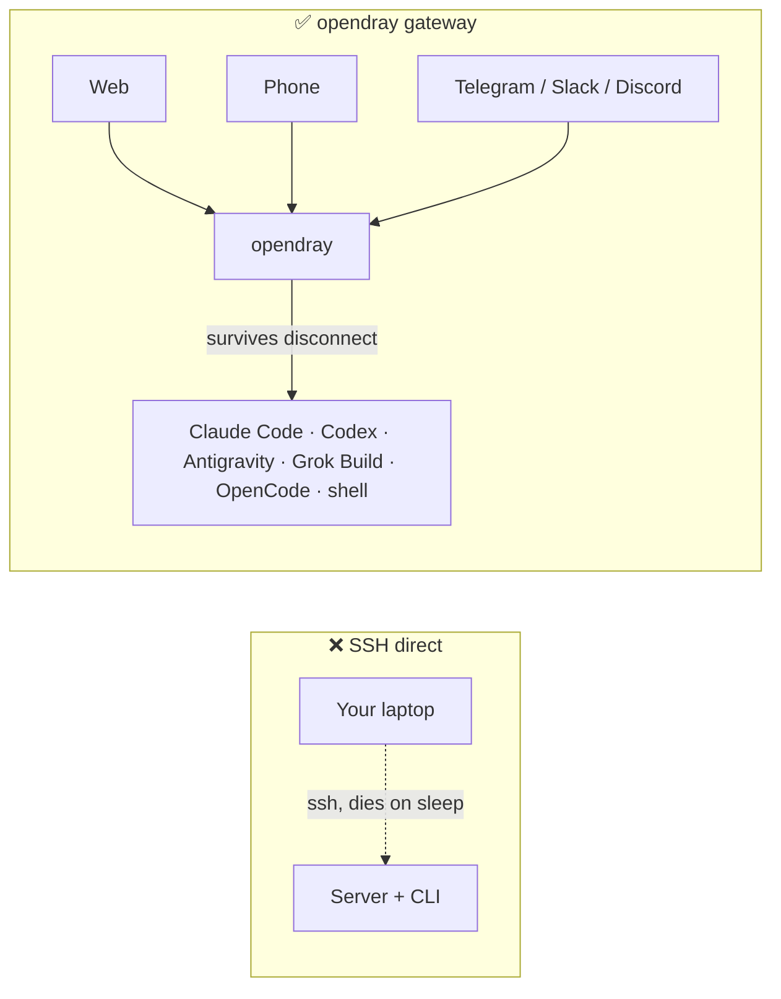
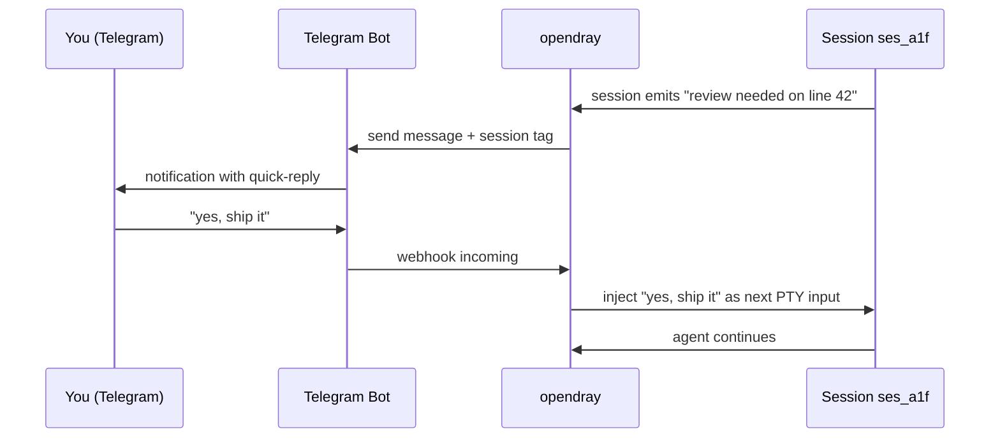
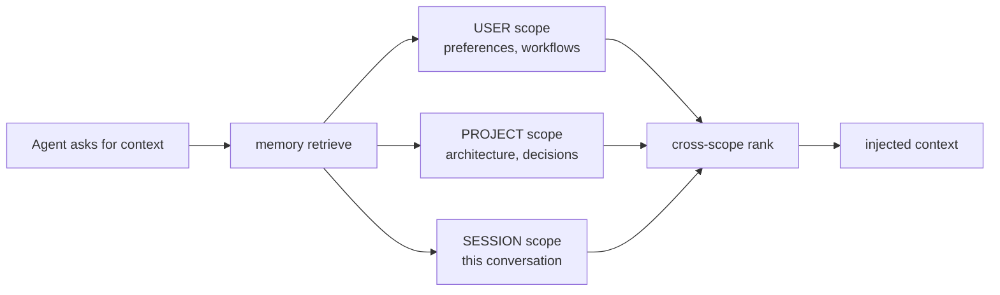
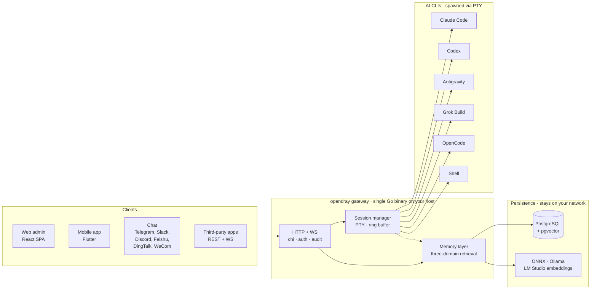

<p align="center">
  <a href="https://opendray.dev"></a>
</p>

<h1 align="center">opendray</h1>

<p align="center">
  <strong>自托管网关，服务于 Claude Code、Codex、Antigravity、Grok Build 和 OpenCode。在自己的基础设施上运行 agent 会话，从 Web、移动端或聊天工具随时驾驭。</strong>
</p>

<p align="center">
  <strong><a href="https://opendray.dev">opendray.dev</a></strong>
</p>

<p align="center">
  <a href="https://opendray.dev"></a>
  <a href="https://github.com/Opendray/opendray/releases/latest"></a>
  <a href="LICENSE"></a>
  <a href="https://github.com/Opendray/opendray/actions/workflows/ci.yml"></a>
  <a href="https://github.com/Opendray/opendray/discussions"></a>
  <br/>
  
  
  
  
</p>

<p align="center">
  🌐 <a href="README.md">English</a> · <strong>简体中文</strong> · <a href="README.fa.md">فارسی</a> · <a href="README.es.md">Español</a> · <a href="README.pt-BR.md">Português</a> · <a href="README.ja.md">日本語</a> · <a href="README.ko.md">한국어</a> · <a href="README.fr.md">Français</a> · <a href="README.de.md">Deutsch</a> · <a href="README.ru.md">Русский</a>
</p>

<p align="center">
  <a href="docs/getting-started.md"></a>
  <a href="#效果展示"></a>
  <a href="https://opendray.dev"></a>
</p>



通过 SSH 运行 Claude Code 或 Codex，意味着笔记本一合上，agent 就会立刻死掉。opendray 把它跑在一台不会休眠的主机上（桌下的 Mac mini、NAS、VPS 都行），让你能从 Web 管理后台、移动端 app 或一条聊天消息重新接入。不管有没有人连着，会话都会继续执行。多个账号会被汇入同一个池子，按档位均衡分配，并支持不中断对话的实时账号切换。本地优先的记忆层，把每一个 embedding 都留在你自己的网络里。

---

## opendray 是什么?

**opendray** 把你已经在用的 AI 编程 CLI(Claude Code、Codex、Antigravity、Grok Build、OpenCode，加上任意 shell)包起来，变成一个你能随处操控的东西。在家用服务器、NAS 或 VPS 上运行会话。会话空闲时在 Telegram 收到通知。在手机上回一句话，就能把下一个 prompt 送回去。整个网关由你自托管，端到端掌控。

- 🛰 **一个后端，三个前台**：单一 Go 二进制同时提供 React Web 管理后台和 Flutter 移动端 app，每个操作也都通过 REST + WebSocket API 对外暴露，供第三方集成。
- 💬 **六大双向频道，不锁定平台**：Telegram、Slack、Discord、Feishu (飞书)、DingTalk (钉钉)、WeCom (企业微信)，外加一个 Bridge 适配器接入任意自定义传输。任意频道的回复都会路由回正确的会话。
- 🧠 **本地优先的记忆系统**：ONNX / Ollama / LM Studio 嵌入，三层作用域检索(用户、项目、会话)，智能排序，跨层冲突检测。向量数据不会离开你的网络。
- 🔌 **集成级 API**：scope 化的 API key、每次调用的审计日志、反向代理挂载。可以把 opendray 当作你自己产品背后的网关，也可以纯粹当个人指挥中心。
- 🔑 **面向 Claude、Codex、Antigravity 的多账号调度**：把多个已登录的凭据目录丢到主机上，opendray 通过文件系统 watcher 自动发现它们，在已启用的账号间均衡分配新会话，并允许你把一个正在进行的会话切换到另一个账号，**且不会丢失对话内容**(transcript 会在后台自动迁移)。每个账号行都会显示实时容量(订阅套餐、限速档位、活跃会话数、最近使用时间、当前登录邮箱)。
- 🔒 **自托管，许可证清晰**：Apache 2.0，单一静态二进制，cosign 签名的 release 自带 SPDX SBOM。零遥测、不依赖云账号、无订阅。

## 效果展示

opendray 是一个 Go 二进制程序，在 `/admin/` 提供 Web 管理后台，在 `/api/v1/*` 提供 REST + WebSocket API。下面是它实际运行起来的样子。

### 列出正在运行的会话

```
$ opendray sessions ls
ID        PROVIDER      PROJECT              STATE     STARTED
ses_a1f   claude-code   app/web              running   2h ago
ses_b2c   codex         internal/session     idle      5m ago
ses_c9d   grok-build    docs/                running   14m ago
ses_d34   shell         misc/deploy-logs     idle      1h ago
```

### 列出已安装的 provider 及其版本

```
$ opendray providers list
PROVIDER      VERSION     ACCOUNTS   ACTIVE   NOTES
claude-code   1.4.11      3          1        auto-discovered via CLAUDE_CONFIG_DIR
codex         0.29.0      2          1        openai login
antigravity   0.7.2       1          0        agy, HOME-isolated
grok-build    2.5.1       1          1        xai
opencode      0.6.3       -          0        local endpoint required
shell         -           -          1        arbitrary
```

### 从浏览器接入会话，笔记本休眠后依旧继续跑着

Web 管理后台内嵌了 xterm.js。你看到的就是 CLI 写入的那个 PTY。关掉浏览器标签页，会话依然在主机上跑着。几个小时后重新打开，记录还停在你离开的地方。

```
[claude-code ses_a1f · app/web · 2h 14m]

> refactor the router to lazy-load the mobile view

I'll look at the current router and figure out the cleanest split.

● Read(app/web/src/router.tsx)
  ⎿ 342 lines
● Grep(pattern: "loadable", path: "app/web/src")
  ⎿ found 3 uses
...
```

### 把 Telegram 回复路由回同一个会话



Slack、Discord、Feishu、DingTalk、WeCom，以及任何 Bridge 适配器传输，都是同样的流程。

### 一次把 memory 查询同时发往三个作用域



每个作用域都用你自己 provider 生成的 embedding 存储(内置 ONNX、Ollama 或 LM Studio 均可)。任何数据都不会离开你的网络。

### 对话中途切换账号，且不丢失记录


Codex 账号和 Antigravity 账号也是一样。`Carry-context` 默认开启，取消勾选即可在新账号下从头开始。

## 功能特性

|  |  |
| --- | --- |
| **会话** | 从 Web、移动端或聊天工具接入正在运行的 Claude Code、Codex、Antigravity、Grok Build、OpenCode 或 shell 会话。会话在客户端断开和主机重启后依然存活。为跳过滚轮输入的 TUI 提供实时记录叠加层。 |
| **Provider** | 5 个一等公民级 AI 编程 CLI，外加任意 shell。新增一个 CLI 只需在 `internal/catalog/builtin/` 下放一个 JSON 描述文件。支持按 provider 注入 MCP server(Vault、memory、集成)。 |
| **记忆** | 三层作用域检索(用户、项目、会话)。通过 ONNX、Ollama 或 LM Studio 实现本地优先的 embedding。跨层冲突检测。会话启动时注入全局知识页面。Compiler flywheel 把过往会话提炼成可复用的 playbook。 |
| **频道** | Telegram、Slack、Discord、Feishu、DingTalk、WeCom。Bridge 适配器支持自定义传输。双向通信：会话主动通知，回复能送回去。 |
| **集成** | REST + WebSocket API，支持 scope 化 API key、每次调用审计日志、反向代理挂载。HashiCorp Vault MCP 用于访问 secret。公开文档见 [`docs/integration-guide.md`](docs/integration-guide.md)。 |
| **运维** | 单一 Go 二进制。一行命令安装器(Linux、macOS、WSL2)。自我管理(`opendray update / start / stop / providers update`)。加密的 PostgreSQL 备份 + 数据导出。Goreleaser 流水线，release 经 cosign 签名并自带 SPDX SBOM。 |
| **安全** | Apache 2.0。无遥测、不依赖云账号。Cosign 无密钥(Sigstore)签名。`ProtectSystem=strict` systemd 加固。多租户安全的 scope 化 token。 |

## 架构一览

一个 Go binary 跑在你的 host 上撑起整个系统。clients 通过 HTTP/WebSocket 驱动 session，session manager 用独立 PTY 拉起每个 AI CLI，memory layer 把共享 state 存进 Postgres，并通过你自己的 provider 计算 vector embeddings。



整张图里的所有组件都跑在你自己的 network 上。没有 cloud 依赖，也没有任何 inference 跑出你的网络。

## 对比

### opendray 对比知名 AI 客户端

|  | opendray | Claude Desktop | Cursor | SSH 直连 CLI | ChatGPT Desktop |
| --- | --- | --- | --- | --- | --- |
| 会话在客户端断开后依然存活 | ✅ | ❌ | ❌ | ⚠️ (tmux / screen) | ❌ |
| 多账号池 + 实时切换 | ✅ | ❌ | ❌ | ❌ | ❌ |
| 跨会话记忆层 | ✅ | ❌ | 部分支持 | ❌ | 部分支持 |
| 主机文件系统 + 工具调用 | ✅ | 有限 | ✅ | ✅ | 有限 |
| 功能对等的移动端 | ✅ | ❌ | ❌ | ⚠️ (SSH 客户端) | 部分支持 |
| 聊天频道适配器 | ✅ (6) | ❌ | ❌ | ❌ | ❌ |
| 自托管 | ✅ | ❌ | ❌ | ✅ | ❌ |
| 许可证 | Apache 2.0 | Proprietary | Proprietary | (视情况而定) | Proprietary |

### opendray 对比自托管聊天前端

|  | opendray | Open WebUI | LibreChat | Dify |
| --- | --- | --- | --- | --- |
| 运行真正的 agent CLI(不只是聊天) | ✅ | ❌ | ❌ | 部分支持 |
| 工具调用 + 主机文件写入 | ✅ | ❌ | ❌ | 沙箱化 |
| 一个网关整合多个 AI 编程 CLI | ✅ (5) | ❌ | ❌ | ❌ |
| 跨会话记忆 | ✅ | 基础 | 基础 | ✅ |
| PTY 会话 + 终端重新接入 | ✅ | ❌ | ❌ | ❌ |
| 聊天频道适配器 | ✅ (6) | 部分支持 | 部分支持 | ✅ |
| 许可证 | Apache 2.0 | MIT | MIT | Apache 2.0 |

## 适合谁使用?

**在家庭实验室里单干的开发者。** 你已经有一台 24/7 跑着的 Mac mini、NAS 或 Proxmox 主机。你一直通过 SSH 跑 Claude Code，但笔记本一休眠会话就断。你想让 CLI 一直跑下去，还想在坐地铁的时候用手机重新接入。opendray 就是那个把你的主机架在你和 CLI 之间的网关。

**为团队搭建共享 AI 基础设施的负责人。** 团队手上有 3 到 5 个 Anthropic 账号，分散在工作和个人套餐里。你想把它们汇成一个池子，按账号观察用量，让团队里任何人都能从浏览器驱动一个会话。opendray 提供多账号池、按账号的可观测性、给每个队友的 scope 化 API key，以及一个不用上架 App Store 就能装的移动端 app。

**在 session-runner 之上做集成的开发者。** 你在构建一个需要拉起带工具调用的 Claude Code、Codex 或 Grok Build 会话的产品，不想自己重新实现 session 生命周期、PTY 处理、记忆或频道路由。opendray 把每个操作都通过 REST + WebSocket 暴露出来，配 scope 化 key、每次调用审计日志和反向代理挂载。把它当成你的 agent runtime 就好。

## 安装

### 一行命令安装

**Linux / macOS / WSL2**

```sh
curl -fsSL https://raw.githubusercontent.com/Opendray/opendray/main/scripts/install.sh | bash
```

**Windows**：先设置 WSL2，然后在 WSL2 里跑 Linux 安装器。[详情 →](scripts/README.md#windows)

```powershell
irm https://raw.githubusercontent.com/Opendray/opendray/main/scripts/install-windows.ps1 | iex
```

引导你完成 Postgres 设置、AI CLI 安装、admin 凭据、服务注册，5 到 10 分钟内拉起一个运行中的网关。详见 [**`scripts/README.md`**](scripts/README.md)：wizard 具体做什么、生成的文件布局、参数选项、排错方法。

> **想要手动走一遍？** 阅读 [**docs/getting-started.md**](docs/getting-started.md)，这是一份 15 分钟的端到端指南，跟 wizard 做的是同一件事，但每一步都由你自己确认。

### npm / npx（Node ≥ 18）

全局安装，把 `opendray` 加进 `PATH`：

```sh
npm install -g opendray
```

或者不装，按需运行：

```sh
npx opendray
```

这只安装**二进制本身**：没有 wizard，没有服务注册，没有 Postgres 设置。这个包会通过 `optionalDependencies` 拉取对应平台的 `opendray-{linux,darwin}-{x64,arm64}` 二进制，用的是 esbuild / Biome 那一套模式(没有 `postinstall`，安装时不会发起网络请求)。适合脚本化环境、临时 runner，或者你已经有自己的 Postgres 和进程管理器的场景。

你还是需要自备数据库，并自己启动网关：

```sh
# 1. PostgreSQL 15+ with pgvector. Point a DSN at it, set an admin password.
export OPENDRAY_DATABASE_URL="postgres://opendray:pw@127.0.0.1:5432/opendray?sslmode=disable"
export OPENDRAY_ADMIN_PASSWORD="$(openssl rand -base64 24)"
# 2. Apply the schema, then run (foreground).
opendray migrate
opendray serve        # → http://127.0.0.1:8770/admin/
```

完整 walkthrough(pgvector 安装、`config.toml`、以 systemd / launchd 服务方式运行、以及更新方式)见 [**docs/install-binary.md**](docs/install-binary.md)。

### 卸载（Linux / macOS）

**默认模式。** 停止网关并删除二进制，但**保留** `config.toml`、数据目录(bcrypt keyfile、sessions、notes、vault)、日志，以及 PostgreSQL 数据库，这样重装后能接着之前的状态继续用：

```sh
curl -fsSL https://raw.githubusercontent.com/Opendray/opendray/main/scripts/uninstall.sh | bash
```

**完整清除。** 还会 drop PG 数据库和 role，删除 config / 数据 / 日志，移除服务用户。删除后有一个校验步骤，如果还有东西残留会大声报错：

```sh
curl -fsSL https://raw.githubusercontent.com/Opendray/opendray/main/scripts/uninstall.sh | OPENDRAY_PURGE=1 bash
```

### 日常运维命令

安装完成后，`opendray` 二进制自己管理自己的生命周期，不用记 `systemctl` / `launchctl` 的各种咒语：

```sh
sudo opendray update --restart   # download latest release, verify SHA, atomic replace + restart
```

```sh
sudo opendray providers update   # bump installed AI CLIs (claude / codex / antigravity) to npm-latest
```

```sh
opendray providers list          # see which AI CLIs are installed + their versions
```

```sh
sudo opendray start              # start | stop | restart | status, wraps systemd / launchd
```

完整子命令列表见 `opendray --help`。

### 选部署路径

所有支持的部署路径都包含 session spawn、AI CLI 访问、加密备份和完整的集成 API。opendray 是一个 host-resident 网关，通过 PTY 拉起 AI CLI，并跟它们共享进程状态(`~/.claude`、ssh-agent、项目文件)。这种模型跟生产级 Docker 会强加的容器隔离不兼容，因此 v2.x 不支持 Docker 作为部署路径。

| 方式 | 适合 | 跳转到 |
|---|---|---|
| 📦 **预构建二进制** | "拿来就跑"，Linux / macOS，搭配任意进程管理器 | [Releases 页](https://github.com/Opendray/opendray/releases) → 见下方 [生产部署](#生产部署) |
| 🐧 **systemd unit** | 裸机 / VM / Linux LXC | [生产部署 §A](#方案-asystemd裸机--vm--lxc) |
| 🍎 **macOS LaunchDaemon** | Mac mini / Mac Studio 当家用 server | [生产部署 §C](#方案-cmacos-launchdmac-mini--studio-当家用-server) |
| 🛠 **从源码构建** | 开发 / 贡献代码 / 定制构建 | [快速开始](#快速开始5-分钟开发版) |

## 快速开始(5 分钟开发版)

完整 walkthrough(含前置依赖和排错)见 [`docs/quickstart.md`](docs/quickstart.md)。下面是精简版：

```bash
# 1. Have a Postgres 15+ running on 127.0.0.1:5432 with pgvector enabled
#    (apt install postgresql-16 postgresql-16-pgvector / brew install postgresql@16 pgvector).
#    Point [database].url at any other DSN if you'd rather use a remote PG.

# 2. Local config, already gitignored.
cp config.example.toml config.toml
$EDITOR config.toml          # set [database].url, [admin].password

# 3. Build the web bundle into the embed tree.
cd app/web && pnpm install && pnpm build && cd ../..

# 4. Apply schema.
go run ./cmd/opendray migrate -config config.toml

# 5. Run.
go run ./cmd/opendray serve -config config.toml
# → REST + WS:  http://127.0.0.1:8770/api/v1/...
# → Web admin:  http://127.0.0.1:8770/admin/
```

这样是在前台运行 OpenDray；Ctrl-C 即可终止。要做成长期运行的守护进程，见下面的 **生产部署**。

## 生产部署

四种受支持的部署路径，按你的环境挑一种。每种都提供：崩溃后自动重启、状态持久化、secrets 与 config 分离。

### 方案 A：systemd(裸机 / VM / LXC)

Linux 推荐部署路径。[`deploy/systemd/opendray.service`](deploy/systemd/opendray.service) 是一个加固过的 unit：沙箱(`ProtectSystem=strict`、`NoNewPrivileges`、`MemoryDenyWriteExecute`、capability 收紧)、先 `migrate` 后 `serve` 的启动顺序、20 秒优雅退出窗口。

**先拿一个二进制。** 要么从 [Releases 页](https://github.com/Opendray/opendray/releases) 下载预构建归档(`opendray_*_linux_<arch>.tar.gz`，解压后就是单一的 `opendray` 二进制)，要么按上面的 [快速开始](#快速开始5-分钟开发版) 从源码构建(`go build ./cmd/opendray`)。

```bash
# 1. Install the binary you just grabbed (or built).
sudo install -m 0755 /path/to/opendray /usr/local/bin/opendray

# 2. Create the service user + state dir.
sudo useradd -r -s /usr/sbin/nologin -d /var/lib/opendray opendray
sudo install -d -o opendray -g opendray -m 0700 /var/lib/opendray

# 3. Drop config + secrets (root-owned; mode 0640).
sudo install -D -m 0640 config.example.toml /etc/opendray/config.toml
sudo $EDITOR /etc/opendray/config.toml             # set [database].url etc.
sudo install -D -m 0640 -o root -g opendray /dev/null /etc/opendray/env.d/secrets
sudo $EDITOR /etc/opendray/env.d/secrets           # OPENDRAY_ADMIN_PASSWORD=…

# 4. Install + enable the unit.
sudo cp deploy/systemd/opendray.service /etc/systemd/system/
sudo systemctl daemon-reload
sudo systemctl enable --now opendray

# 5. Verify.
sudo systemctl status opendray
sudo journalctl -u opendray -f --no-pager
```

这个 unit 在 `ExecStartPre` 阶段跑 `opendray migrate`，所以第一次启动会在 `serve` 启动之前先应用所有 migration。重启策略是 `on-failure`，5 秒退避，每分钟最多重启 5 次。

### 方案 B：直接跑二进制 + 你自己的进程管理器

适合没有 systemd 的 LXC、FreeBSD 的 `rc.d`、OpenRC，或者其他任何环境。构建一次，用你已经在用的任意进程管理器来跑：

```bash
# Cross-compile a release archive locally:
goreleaser release --clean --snapshot
ls dist/                  # opendray_*_linux_amd64.tar.gz etc.

# Or grab a published release artefact:
# https://github.com/Opendray/opendray/releases
```

然后让你的进程管理器(s6、runit、supervisord、runwhen)指向：

```
/usr/local/bin/opendray serve -config /etc/opendray/config.toml
```

预检步骤：在第一次 `serve` 之前跑一次 `opendray migrate -config /etc/opendray/config.toml`，或者把它做成你所选进程管理器的 pre-start hook。

### 方案 C：macOS launchd(Mac mini / Studio 当家用 server)

适合 24/7 运行的 Apple Silicon Mac mini / Mac Studio。[`deploy/launchd/com.opendray.opendray.plist`](deploy/launchd/com.opendray.opendray.plist) 是一个 LaunchDaemon：开机即启动(不需要任何用户登录)，崩溃后 5 秒节流重启，日志写到 `/usr/local/var/log/opendray/`。

```bash
# 1. Install the darwin binary + config + state dirs.
sudo install -m 0755 ./opendray /usr/local/bin/opendray
sudo install -d -m 0755 \
  /usr/local/etc/opendray \
  /usr/local/var/lib/opendray \
  /usr/local/var/log/opendray
sudo install -m 0640 config.example.toml /usr/local/etc/opendray/config.toml
sudo $EDITOR /usr/local/etc/opendray/config.toml    # set [database].url etc.

# 2. Apply migrations once.
sudo /usr/local/bin/opendray migrate \
  -config /usr/local/etc/opendray/config.toml

# 3. Install + load the LaunchDaemon.
sudo cp deploy/launchd/com.opendray.opendray.plist /Library/LaunchDaemons/
sudo chown root:wheel /Library/LaunchDaemons/com.opendray.opendray.plist
sudo chmod 0644 /Library/LaunchDaemons/com.opendray.opendray.plist
sudo launchctl bootstrap system /Library/LaunchDaemons/com.opendray.opendray.plist

# 4. Verify.
sudo launchctl print system/com.opendray.opendray
tail -f /usr/local/var/log/opendray/opendray.log
```

重启：`sudo launchctl kickstart -k system/com.opendray.opendray`；完全卸载：`sudo launchctl bootout system/com.opendray.opendray`。

macOS 上的 Postgres：用 Homebrew 安装(`brew install postgresql@17 && brew services start postgresql@17`)，把 `[database].url` 指向 `postgres://$USER@127.0.0.1:5432/opendray`。再用 `brew install pgvector` 装上 `pgvector`，并在 opendray 数据库里执行 `CREATE EXTENSION vector`。

---

Proxmox 相关的 LXC 说明(非特权容器里的 PTY、网络、cgroup 调整)见 [`deploy/lxc/proxmox-pty-notes.md`](deploy/lxc/proxmox-pty-notes.md)。

反向代理 / TLS 终止(nginx、Caddy、Traefik、Cloudflare Tunnel)见 [`docs/operator-guide.md`](docs/operator-guide.md) §Topology。

### 可选：启用加密 DB 备份 + 数据导出

```bash
# Master passphrase (env-only, never write into config.toml).
export OPENDRAY_BACKUP_KEY="$(openssl rand -base64 32)"
export OPENDRAY_BACKUP_ENABLED=1

# pg_dump / pg_restore must match the server's major version. On
# Apple Silicon dev machines pointing at a PG17 server:
export OPENDRAY_BACKUP_PG_DUMP_PATH=/opt/homebrew/opt/postgresql@17/bin/pg_dump
export OPENDRAY_BACKUP_PG_RESTORE_PATH=/opt/homebrew/opt/postgresql@17/bin/pg_restore
```

重启 opendray，侧栏会多出一个 Backups 页面(`/backups`)，用于加密的 PostgreSQL dump + 恢复，以及 `/export` 用于 zip 包数据导出 + 导入。完整生命周期见 [`docs/operator-guide.md`](docs/operator-guide.md) §Backup。

一个 Go 二进制装着整个 web bundle，运行时不需要 Node runtime，不需要单独的静态文件服务器，也不需要 Caddy/nginx。Cloudflare Tunnel 在 `:8770` 前面负责 TLS 终止。

## 项目结构

```
cmd/opendray/   binary entry point
internal/       Go backend (gateway, sessions, memory, channels,
                integrations, git, search, one package per domain)
app/web/        React + Vite admin SPA (embedded in the binary)
app/mobile/     Flutter app (iOS + Android)
app/shared*/    cross-surface shared UI + i18n strings
docs/           guides: install, getting-started, integration, ops
deploy/         systemd / launchd / LXC units + install scripts
```

## Web 前端

`app/web/` 把单页 SPA 构建到 `internal/web/dist/`，Go 二进制会把它 embed 进去，并在 `/admin/*` 提供服务。Vite dev server 跑在 `:5173`，把 `/api` 代理到 `:8770`，用于 HMR 驱动的开发。

```bash
# dev (hot reload on the React side, separate Go server for the API)
cd app/web && pnpm dev               # http://localhost:5173
go run ./cmd/opendray serve -config ../../config.toml   # other terminal

# prod (one binary delivers everything)
cd app/web && pnpm build              # writes ../../internal/web/dist
cd ../..
go build ./cmd/opendray               # bakes dist into the binary
./opendray serve -config config.toml
```

前端技术栈(React + Vite + Tailwind v4 + shadcn/ui + TanStack Router/Query + Zustand + xterm.js)和每个 W 里程碑笔记见 [`app/web/README.md`](app/web/README.md)。

## 移动 App

`app/mobile/` 是一个面向 **iOS 和 Android** 的 Flutter app，功能与 Web 管理后台完全对齐。它通过 HTTPS 连接到运行中的网关。首次启动时填入 **Gateway URL** 和 admin 登录信息，就能获得同样的 Sessions / Channels / Integrations / Memory / Git 各个界面。按设计不提供 App Store / Play Store 构建版本(自托管、单租户)：由你自己构建，并用你自己的身份签名。

**[→ 构建与安装指南](docs/mobile-app.md)。** 让手机能访问到网关，然后旁加载 Android APK，或者通过 Xcode 装到 iPhone 上。([全部 10 种语言](docs/mobile-app.md)；在指南顶部切换。)

## 常见问题

### opendray 是什么?

opendray 是一个自托管网关，把你已经在用的 AI 编程 CLI(Claude Code、Codex、Antigravity、Grok Build、OpenCode 和 shell)包装成会话，让你能从 Web 管理后台、Flutter 移动端 app，或六大聊天频道(Telegram、Slack、Discord、Feishu、DingTalk、WeCom)驱动它们。一个 Go 二进制。Apache 2.0。你的基础设施，你的数据，你的 token。

### opendray 支持哪些 AI CLI?

截至 v2.10.x，共有五个一等公民级 provider：**Claude Code**(Anthropic)、**Codex**(OpenAI)、**Antigravity**(Google `agy`)、**Grok Build**(xAI)，以及 **OpenCode**。其余任何场景都可以用任意 shell 兜底。新增一个 CLI 只需在 `internal/catalog/builtin/` 下加一个 JSON 描述文件，常见场景不需要写适配代码。

### opendray 跟 Claude Desktop 或 ChatGPT Desktop 有什么区别?

Claude Desktop 和 ChatGPT Desktop 是运行在你笔记本上的聊天客户端，笔记本一合上就没了。opendray 把真正的 agentic CLI 跑在一台不会休眠的主机上，让你能从任何地方重新接入。会话能挺过客户端断开、笔记本休眠和网络掉线。多个账号会被汇入池子，支持实时切换。

### opendray 跟直接通过 SSH 跑 Claude Code 有什么区别?

SSH 给不了你的四件事：(1) 断开连接后会话依然存活(不需要折腾 `tmux`，虽然你仍然可以在里面用 tmux)；(2) 能从手机或聊天频道接入，不局限于终端；(3) 主机上所有会话共享同一个记忆层；(4) 多账号池，按档位均衡分配，并支持对话中途实时切换账号。

### opendray 跟 Open WebUI、LibreChat 或 Dify 有什么区别?

那些是对接模型 API 的聊天前端：把 prompt 发给 `api.openai.com`(或类似的接口)，再把返回结果渲染出来。opendray 则是在你的主机上跑真正的 agent CLI 进程，带着完整的工具调用、文件写入、记忆和 MCP server。如果一个任务需要在主机文件系统上 `Read` / `Edit` / `Bash`，opendray 能做到；聊天前端做不到。

### 我能用多个 Claude、Codex 或 Antigravity 账号吗?

可以。把已登录的凭据目录丢到主机上(Claude 用 `CLAUDE_CONFIG_DIR`，Antigravity 用 `$HOME` 隔离)，opendray 会通过文件系统 watcher 自动发现它们。新会话会按档位和容量在已启用的账号之间均衡分配。你可以把一个正在进行的会话切换到另一个账号，且不会丢失对话内容(transcript 会在后台自动迁移)。触发限速时的自动故障转移，默认会带上上下文。

### 我的数据存在哪里?

存在你主机上的 PostgreSQL 里(自带实例，或者用安装器帮你 bootstrap 的那个都行)。Embedding 来自你自己的 provider(内置 ONNX、Ollama 或 LM Studio)。向量数据、会话记录、记忆条目都不会离开你的网络。没有遥测，不依赖云账号。`opendray` 从不 phone home。

### 能在 Docker 里跑吗?

目前(v2.x)还不行。opendray 通过 PTY 拉起 AI CLI，并跟它们共享主机进程状态(凭据目录、ssh-agent、项目文件)，这跟生产级 Docker 强加的容器隔离模型不兼容。请用预构建二进制配 systemd 或 launchd(Linux 和 macOS 都有一行命令安装器)。参见 [生产部署](#生产部署)。

### opendray 能在 NAS、Mac mini 或 Raspberry Pi 上跑吗?

NAS：Synology、QNAP、TrueNAS-Scale 都可以(任何跑 Linux + Postgres 的设备都行)。Mac mini：可以，这是常见的部署方式(自带 LaunchDaemon)。Raspberry Pi：Pi 4 / Pi 5 能跑，但并发会话下算力吃紧，只适合单用户的爱好级使用。

### opendray 免费吗? 用的是什么许可证?

Apache 2.0。永久免费。没有付费档位，没有遥测，不 phone-home。欢迎赞助(见 [`.github/FUNDING.yml`](.github/FUNDING.yml))。

### 我该怎么参与贡献?

阅读 [`CONTRIBUTING.md`](CONTRIBUTING.md) 和 [`CODE_OF_CONDUCT.md`](CODE_OF_CONDUCT.md)。几个具体的切入点：(1) 把 README 或文档页翻译成我们已经支持的某种语言；(2) 在 `internal/catalog/builtin/` 下为新的 AI 编程 CLI 添加 provider 描述文件；(3) 为我们还没覆盖的聊天平台写一个 channel 适配器；(4) 为文档贡献截图；(5) 提交一个 bug 或 feature request。PR 需要 CI 通过；翻译仅作参考，不需要 CLA。

## 文档

- [`docs/getting-started.md`](docs/getting-started.md)：**新手从这里开始**。15 分钟内从零跑到第一个会话，包括安装被 wrap 的 CLI 和 bootstrap Postgres。
- [`docs/install-binary.md`](docs/install-binary.md)：从 npm 包或 release 二进制安装(自备 Postgres)，并以 systemd / launchd 服务方式运行。
- [`docs/quickstart.md`](docs/quickstart.md)：5 分钟开发环境(假设你已经了解各个组件)。
- [`docs/mobile-app.md`](docs/mobile-app.md)：构建并安装 Flutter 移动端 app；旁加载 Android APK 或通过 Xcode 装到 iPhone，再指向你的网关。
- [`docs/operator-guide.md`](docs/operator-guide.md)：面向生产化部署的运维参考。
- [`docs/integration-guide.md`](docs/integration-guide.md)：如何用任意语言编写外部集成。
- [`VERSIONING.md`](VERSIONING.md)：版本策略(major-as-generation)。
- [`CHANGELOG.md`](CHANGELOG.md)：发布历史。

## 当前状态

当前代号：**v2.10.x**。发布历史见 [`CHANGELOG.md`](CHANGELOG.md)，major-as-generation 版本策略(major = 产品代号，不是严格的 SemVer "破坏性变更")见 [`VERSIONING.md`](VERSIONING.md)。

这一代产品包含:

- **一行命令安装/卸载 wizard**(Linux + macOS；Windows 经 WSL2)。引导操作者完成 Postgres bootstrap、AI CLI 安装、admin 凭据、监听地址、二进制安装、schema migration、服务注册。
- **可自我管理的二进制。** `opendray update / start / stop / restart / status / providers list / providers update`，日常运维不用碰 `systemctl` / `launchctl`。
- **Goreleaser release 流水线。** 交叉编译二进制(linux/darwin × amd64/arm64)、cosign 无密钥签名(Sigstore)、SPDX SBOM、原子校验的自更新。

## 测试

```bash
go test -race ./...        # backend
cd app/web && pnpm build   # web (TS strict + vite production build)
```

端到端 smoke flow 在每个里程碑的 commit message 里追踪。Playwright harness 是计划中的后续工作。

## 跟 v1 的关系

v1(`Opendray/opendray`)是上一代代码库，现已归档。v2 是当前活跃的代号，功能完整，是唯一接受开发的分支。v1 的 16 个 builtin 里有 4 个迁移到了 v2 后端，其余的变成了客户端功能、channel 适配器，或者集成 API 的消费方。

## 许可证

Apache 2.0，见 [`LICENSE`](LICENSE)。(v1 是 MIT；v2 独立授权。)
